# Capítulo V: Product Implementation, Validation & Deployment
## 5.1. Software Configuration Management

### 5.1.1. Software Development Environment Configuration

**Requirements Management**

1.- Trello: Es una herramienta para gestionar proyectos, especialmente aquellos basados en metodologías ágiles. Facilita la visualización y actualización del progreso de tareas e historias de usuario dentro de un sprint en desarrollo.
 
Ruta de referencia: https://trello.com/es

**User Experience Design (UX/UI)**

1.- Figma: Herramienta para la creación de prototipos y diseño gráfico, principalmente empleada en el ámbito digital. En este proyecto, servirá para desarrollar prototipos de la aplicación y sus versiones para navegadores en escritorio y móviles.
 
Ruta de referencia: https://www.figma.com/login

2.- Lucidchart: Aplicación para la creación de diagramas de flujo. Se utilizará para el diseño de wireflows, user-flows y el diagrama de clases asociado con la aplicación.
 
Ruta de referencia: https://www.lucidchart.com

**Software Testing**

1.- Gherkin: Gherkin es un lenguaje usado para definir los criterios de aceptación de una historia de usuario de forma estructurada. Proporciona una forma estandarizada de escribir escenarios en un formato legible tanto para equipos técnicos como no técnicos. Para más información.
 
Ruta de referencia: https://cucumber.io/docs/gherkin/

**Software Development**

1.- Visual Studio Code: Entorno de desarrollo integrado seleccionado para la creación y compilación del código, debido al dominio del equipo con esta herramienta. Este IDE aporta valor al proyecto por su capacidad para añadir extensiones útiles, soportar edición de texto en varios lenguajes de programación y estar disponible en diferentes sistemas operativos, entre otras ventajas.
 
Ruta de referencia: https://code.visualstudio.com/

2.- HTML5: Lenguaje de marcado para la estructura de páginas web. Se utilizará en el proyecto para organizar y presentar el contenido de la aplicación.
 
Ruta de referencia: https://www.w3schools.com/html/html5_syntax.asp

3.- CSS: Hojas de Estilo en Cascada, un lenguaje que controla el diseño y la apariencia de las páginas web, complementando a HTML.
 
Ruta de referencia: https://google.github.io/styleguide/htmlcssguide.html

4.- Angular: Framework de desarrollo para aplicaciones web de una sola página (SPA) que utiliza TypeScript. Desarrollado por Google, facilita la creación de aplicaciones web dinámicas y eficientes.
 
Ruta de referencia: https://angular.io/

5.- TypeScript: Lenguaje de programación que extiende JavaScript añadiendo tipado estático y otras características avanzadas, mejorando el desarrollo de aplicaciones complejas y a gran escala.
 
Ruta de referencia: https://www.typescriptlang.org/

**Software Deployment**

1.- Git: Sistema de control de versiones que facilita el registro y la gestión de las diversas versiones del código. Servirá para mantener un historial de modificaciones y simplificar la resolución de errores. El equipo accederá a través de la línea de comandos en sus equipos locales.
 
Ruta de referencia: https://git-scm.com/

**Software Documentation and Project Management**

1.- GitHub: Plataforma en la nube que almacenará los repositorios del proyecto, permitiendo la colaboración en tiempo real y la revisión de las aportaciones de cada miembro del equipo. El acceso se realizará a través de los navegadores web. 
 
Ruta de referencia: https://github.com/

### 5.1.2. Source Code Management

El proyecto implementará el modelo **GitFlow** como estándar para el control de versiones, utilizando **GitHub** como plataforma principal. Este enfoque permitirá una gestión estructurada y ordenada de las ramas, facilitando el desarrollo colaborativo. A continuación, se presenta cómo se integrará GitFlow en el flujo de trabajo y los enlaces a los repositorios de GitHub correspondientes:

**GitFlow Workflow:**
- Ramas principales: `main` y `develop` para producción y desarrollo.
- Ramas de características (features) para el desarrollo de nuevas funcionalidades.
- Ramas de corrección (hotfix) para soluciones rápidas en producción.

**Repositorios de GitHub:**
- Enlace a la organización en GitHub: https://github.com/orgs/Open-Source-SW56-Group-2-EcoMovil/repositories
- Enlace al repositorio de la **Landing Page**: https://open-source-sw56-group-2-ecomovil.github.io/Landing-Page-EcoMovil/

**Estructura de Ramas (Branches) en GitFlow:**

1. **Rama Master (Principal):** Es la rama principal del proyecto, donde se mantendrán versiones estables y finales de la aplicación. Solo se permitirán cambios que hayan sido previamente probados y verificados en otras ramas.

2. **Rama Develop (Desarrollo):** Su función es mantener el progreso continuo del proyecto. Es aquí donde el equipo colaborará en las nuevas funcionalidades antes de que sean incorporadas a la rama principal.

3. **Ramas de Funcionalidad (Feature branches):** Cada nueva característica del proyecto se desarrollará en su propia rama. Una vez completada y probada, se fusionará en la rama de desarrollo. Las ramas seguirán un patrón de nombres descriptivo, por ejemplo, `feature/nombre-de-la-funcionalidad`.

4. **Ramas de Lanzamiento (Release branches):** Estas ramas se crearán cuando una versión esté lista para ser lanzada. Se utilizará el **versionamiento semántico** para asignar un número de versión a cada release.

5. **Ramas de Corrección (Hotfix branches):** Estas ramas se usarán para aplicar correcciones urgentes a la rama principal, generalmente errores críticos que afecten a la experiencia del usuario.

**Convenciones de Commits:**
Se adoptará la especificación **Conventional Commits**, basada en las directrices de **Angular Commit Guidelines**.

### 5.1.3. Source Code Style Guide & Conventions

En Ecomovil hemos optado varias convenciones de estilos para el desarrollo de código en diferentes lenguajes.

#### Tecnologías usadas

*HTML y CSS (Google HTLM/CSS Style Guide)*
- Se declara el tipo de documento al principio del archivo con !DOCTYPE html.
- Se incluyen los meta tags pertinentes.
- El elemento title se coloca dentro de las etiquetas head.
- Se utiliza una indentación de dos espacios.
- Se emplean minúsculas para los elementos HTML, atributos, propiedades, valores y selectores CSS.
- Los atributos de los elementos HTML se encierran entre comillas.
- Cada elemento HTML debe tener su etiqueta de cierre.
- Se evitan líneas de código excesivamente largas.
- Se especifica el ancho y alto de las imágenes, junto con un texto alternativo (alt).

*TypeScript*
- Uso de Clases e interfaces
- Uso de Comentarios
- Control de Flujos
- Uso de nombres descriptivos

*Gherkin (Gherkin Conventions for Readable Specifications)
- Se emplean las palabras "Given", "When", "Then" y "And" para describir los pasos del escenario.
- Los pasos que comienzan con "And" se indentan.
- Se añaden líneas en blanco entre pasos.
- Los parámetros se encierran entre comillas simples.
- Se utiliza un comentario separador y dos líneas en blanco entre cada escenario.

*Java*
- Uso de Clases, Métodos y Variables
- Uso de programacion funcional
- Convenciones con clases

*Angular*
- Los nombres deben de seguir la convención PascalCase
- Cada componente, servicio y clase debe estar en su propio archivo
- Utilización de plantillas y hojas de estilo en archivos separados.
- Uso de Decoradores como @Componente, @Injectable e @Input.
- Inyección de Dependencias para gestioanr servicios
- Convenciones de codigo con nombres que describan claramente su propósito.

### 5.1.4. Software Deployment Configuration
En esta sección, abordaremos el despliegue de nuestra Landing Page mediante el servicio automatizado en GitHub Pages. A continuación, se describirán los pasos que se realizaron para lograr este objetivo.

- Primeramente, es indispensable verificar que el repositorio este configurado correctamente.

- Debido a que en este caso se creo un Landing Page con angular se ha optado por hacer uso de la herramienta angular-cli-pages, esta ayudará a actualizar la página y llevarla a github pages.

- Luego de esto debemos de crear una carpeta dist la cual contendrá todos los archivos necesarios para el despliegue.

- Después de, esto hacemos uso de ngh para que se cree una nueva rama que contendrá los archivos para el despliegue, esta rama se llamara gh-pages nombrada asi por la herramienta anteriormente mencionada.

- Finalmente una vez todos los archivos hayan sido publicados en una rama, en el apartado de "Settings" en "Pages" en la sección de Branch colocamos gh-pages y /(root), al guardar y esperar un momento podremos ver la página publicada.

- De esta manera se visualizaría asi la página.
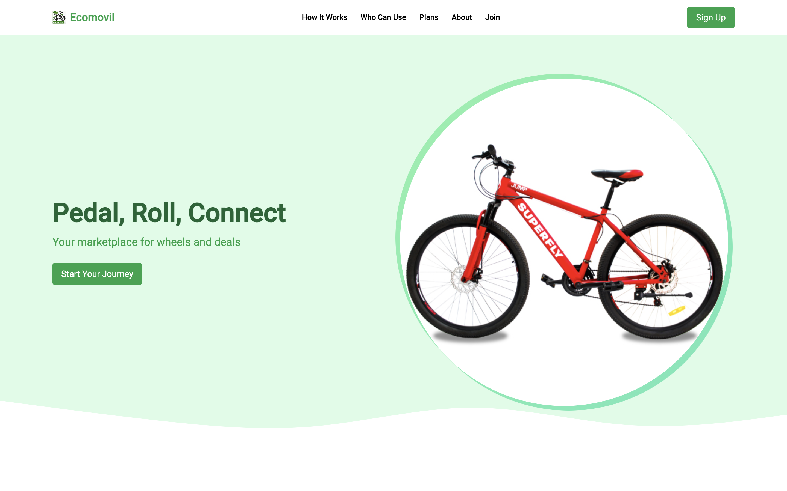

Link: https://open-source-sw56-group-2-ecomovil.github.io/Landing-Page-EcoMovil/

## 5.2. Landing Page, Services & Applications Implementation

### 5.2.1. Sprint 1

### 5.2.1.1. Sprint Planning 1

<table>
     <tr> 
        <th>  Sprint #  </th>
        <th> Sprint 1 </th>
     </tr>
     <tr> 
        <td style="font-weight: bold;" colspan="7"> Sprint Planing Background</td>
     </tr>
     <tr>
       <td style="font-weight: bold;"> Date </td>
       <td>  08/14/2024 </td>
     </tr>
     <tr>
       <td style="font-weight: bold;"> Time </td>
       <td> 17:00 horas (GMT-5) </td>
     </tr>
     <tr>
       <td style="font-weight: bold;"> Location </td>
       <td> Modalidad remota a través de Discord <td>
     </tr>
      <tr>
        <td style="font-weight: bold;"> Prepared By </td>
        <td> Oneglio De Paz, Beth Shantal <td>
     </tr>
        <tr>
        <td style="font-weight: bold;"> Attendees (to planning meeting) </td>
        <td> 
             
             Calisaya Sánchez, Juan Jesús
             
             Gallo Quintana, David Ivanoff
             
            Hidalgo Lopez, Mathias Adriano
             
             Oneglio De Paz, Beth Shantal
             
            Vasquez Goicochea, Erick Alessander
        <td>
     </tr>
     <tr>
        <td style="font-weight: bold;"> Sprint 0 Review Summary </td>
        <td> Como este es nuestro primer sprint de desarrollo, no hay un resumen de revisión del sprint disponible. <td>
     </tr>
     <tr>
        <td style="font-weight: bold;"> Sprint 0 Retrospective Summary </td>
        <td> Como este es nuestro primer sprint de desarrollo, aún no identificamos planes de mejora .<td>
     </tr>
     <tr> 
        <td style="font-weight: bold;" colspan="7"> Sprint Goal & User Stories</td>
     </tr>
       <tr>
          <td style="font-weight: bold;"> Sprint 1 Goal</td>
          <td>  En este sprint se espera implementar la landing page con las secciones de login de inicio, hero y secciones de orientacion para el usuario, como por ejemplo footer y conocemos. En el grupo acordamos usar el framework de Tailwind CSS para mejorar el maquetado y estilos de nuestra landing page, como tambien las librerias de Alpine.js y Swiper.js para facilitar la implementacion de las secciones de navbar y conocenos. Al finalizar este sprint, la landing page debe estar desplegada en Netlifly y cualquier usuario debería poder acceder y visualizar la página a través de un link. <td>
      </tr>
       <tr>
          <td style="font-weight: bold;"> Sprint 1 Velocity </td>
          <td>  26  <td>
      </tr>
      <tr>
          <td style="font-weight: bold;"> Sum of Story Points </td>
          <td> 26 <td>
      </tr>

  </table>

### 5.2.1.2. Sprint Backlog 1
En esta sección se presentan las tareas realizadas durante el 1er sprint, junto con una captura de pantalla de Trello y un enlace al tablero.

Link: https://trello.com/invite/b/662c300dd4ef055a15b83d8c/ATTId06c3da32ac9a78c87fdf497ae1fd07dBECD9493/grupo-2-ecomovil

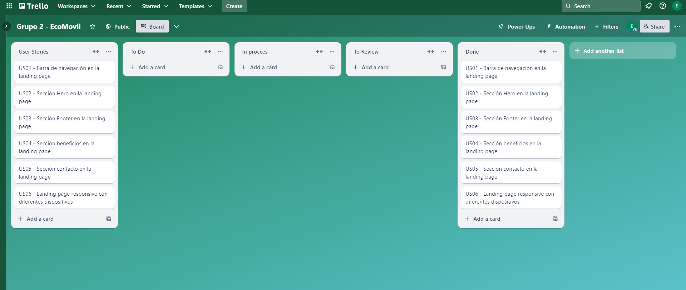

<table style="width:400px; height:100px;"> 
   <tr>
      <th colspan="4"> Sprint # </th>
      <th colspan="7"> Sprint 1 </th>
   </tr>
   <tr >
     <th colspan="4"> User Story </th>
     <th colspan="7"> Work-Item /Task</th>
   </tr>
   <tr>
     <th > Id </th>
     <th colspan="3"> Title </th>
     <th> Id </th>
     <th > Title </th>
     <th> Description </th>
     <th> Estimation (Hours) </th>
     <th> Assigned To </th> 
     <th> Status (To-do / In-Process / To- Review / Done) </th>
   </tr>
   <tr>
      <th> US01 </th>
     <th colspan="3"> Barra de navegación en la landing page </th>
      <th> W01  </th>
     <th> Navbar Section</th>
     <th> Desarrollar el navbar de la landing page de EcoMovil con distintas opciones que nos redirige a otros apartados  </th>
     <th> 1  </th>
     <th> Erick Vasquez </th> 
     <th> Done </th>
   </tr>
    <tr>
      <th> US02 </th>
     <th colspan="3"> Sección Hero en la landing page </th>
      <th> W03  </th>
     <th> Hero Section </th>
     <th> Agregar un apartado con una imagen y un título llamativo al ingresar al landing page de EcoMovil   </th>
     <th> 0.8  </th>
     <th> David Gallo </th> 
     <th> Done </th>
   </tr>
   <tr>
      <th> US02 </th>
     <th colspan="3"> Sección Hero en la landing page </th>
      <th> W04  </th>
     <th> Hero Join Section</th>
     <th> Implementar seccion donde se agrega el email del usuario </th>
     <th> 0.7  </th>
     <th> David Gallo </th> 
     <th> Done </th>
   </tr>
   <tr>
      <th> US03 </th>
     <th colspan="3"> Sección Footer en la Landing Page </th>
      <th> W05  </th>
     <th> Footer Section </th>
     <th> Implementar la sección del footer con las direcciones a al información del equipo y los términos de nuestra página web  </th>
     <th> 1.2  </th>
     <th> Beth Oneglio </th> 
     <th> Done </th>
   </tr>
   <tr>
      <th> US03</th>
     <th colspan="3"> Sección Footer en la Landing Page </th>
      <th> W06  </th>
     <th> About us Section </th>
     <th> Implementar la sección About us donde se muestra la información sobre nuestros equipo </th>
     <th> 0.8  </th>
     <th> Beth Oneglio </th> 
     <th> Done </th>
   </tr>
    </tr>
   <tr>
      <th> US04</th>
     <th colspan="3"> Sección de Beneficios en la Landing Page</th>
      <th> W07  </th>
     <th> Beneficios Section </th>
     <th> Implementar la sección Beneficios donde se muestran las caracteristicas principales de nuestra startup.   </th>
     <th> 0.7  </th>
     <th> Mathias Hidalgo </th> 
     <th> Done </th>
   </tr>
   <tr>
      <th> US04</th>
     <th colspan="3"> Sección de Beneficios en la Landing Page </th>
      <th> W08  </th>
     <th> PLan Section </th>
     <th> Implementar la sección Planes donde se muestran los planes que ofrecemos con sus respectivas funciones añadidas.   </th>
     <th> 0.8  </th>
     <th> Juan Calisaya </th> 
     <th> Done </th>
   </tr>
    <tr>
      <th> US05 </th>
     <th colspan="3"> Sección de Contacto en la Landing Page </th>
      <th> W09  </th>
     <th> Contact Section </th>
     <th> Agregar información del equipo para que los usuarios puedan contactarnos.   </th>
     <th> 0.5 </th>
     <th> Mathias Hidalgo </th> 
     <th> Done </th>
   </tr>
    <tr>
        <th> US06 </th>
         <th colspan="3"> Landing Page Responsive con diferentes dispositivos </th>
          <th> W10  </th>
         <th> Landing page responsive Section </th>
         <th> Agregar la funcionalidad de responsividad a toda la página web.   </th>
         <th> 0.6 </th>
         <th> Juan Calisaya </th> 
         <th> Done </th>
    </tr>

</table>

### 5.2.1.3. Development Evidence for Sprint Review

### 5.2.1.4. Testing Suite Evidence for Sprint Review

Para la entrega del Sprint 1, nos enfocamos en lograr el desarrollo completo, la implementación y el despliegue del Landing Page. Por lo tanto, la sección de "Testing" se enfocó en la implementación de las necesidades de los usuarios, priorizando secciones fáciles de entender e intuitivas.

| Repository                                                  | Branch         | Commit ID | Commit Message                  | Commited on (Date) |
|-------------------------------------------------------------|----------------|-----------|----------------------------------|--------------------|
| [https://github.com/Open-Source-SW56-Group-2-EcoMovil/Landing-Page-EcoMovil.git](https://github.com/Open-Source-SW56-Group-2-EcoMovil/Landing-Page-EcoMovil.git) | LandingPage | adebcba  | feat: added project langing page  | 29/08/24           |

### 5.2.1.5. Execution Evidence for Sprint Review

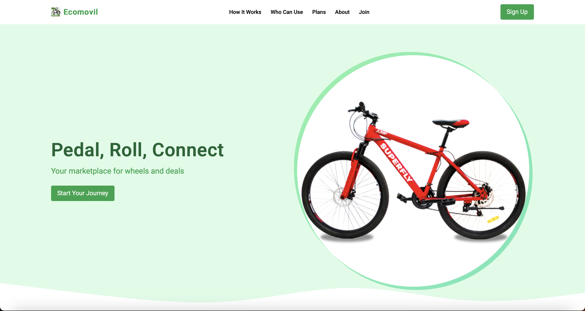

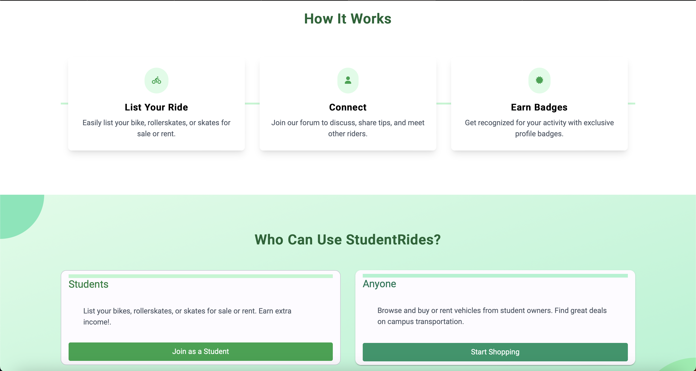

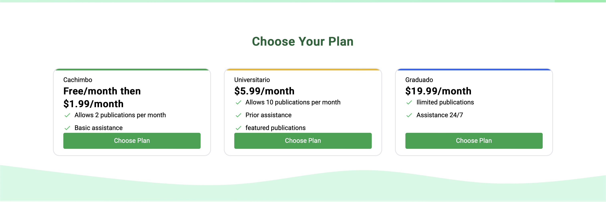

### 5.2.1.6. Services Documentation Evidence for Sprint Review

En este Sprint 1, el enfoque principal ha sido la creación del Landing Page de la aplicación EcoMovil, por lo que no se ha avanzado en la documentación de los servicios. No obstante, está previsto que la documentación de los servicios se desarrolle en los próximos sprints.

### 5.2.1.7. Software Deployment Evidence for Sprint Review

En la entrega del segundo sprint, se desplegó un Landing Page completamente funcional, cumpliendo con las user stories asignadas para este entregable. Durante el Sprint 1, se lanzó la primera versión del Landing Page, que fue alojada en GitHub Pages. A continuación, se presentan las evidencias del despliegue del Landing Page.

- Instrucciones para acceder al Landing Page:

Finalizando la implementación de los cambios y fusionándolos en la rama principal (`main`).

Nos dirigimos a la sección de "Settings" del repositorio y seleccionamos el apartado de "Pages".

Seleccionamos la rama `gh-pages` como fuente de despliegue, luego hacemos clic en "Save" para ejecutar el deploy.

Accedemos al dominio del Landing Page, verificamos que todo esté correctamente configurado y hacemos clic en "Guardar" para finalizar el proceso.

- Imágenes de la pantalla del Landing Page:

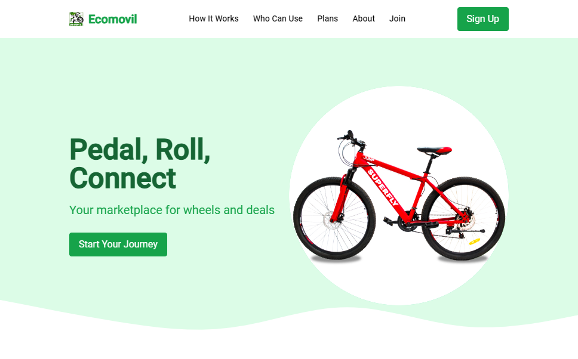  

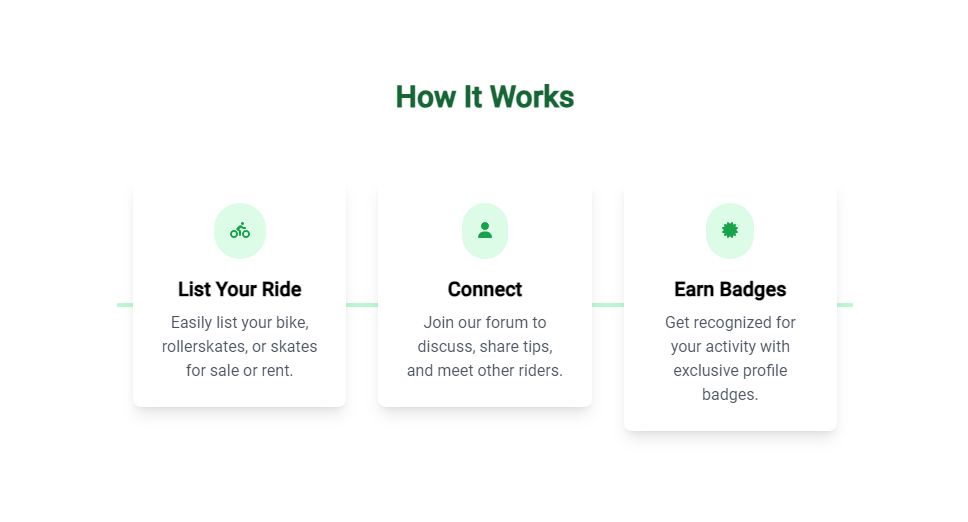 

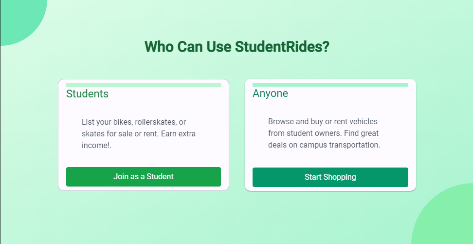 

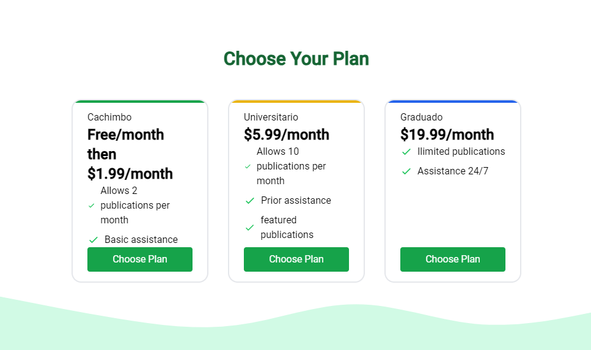 

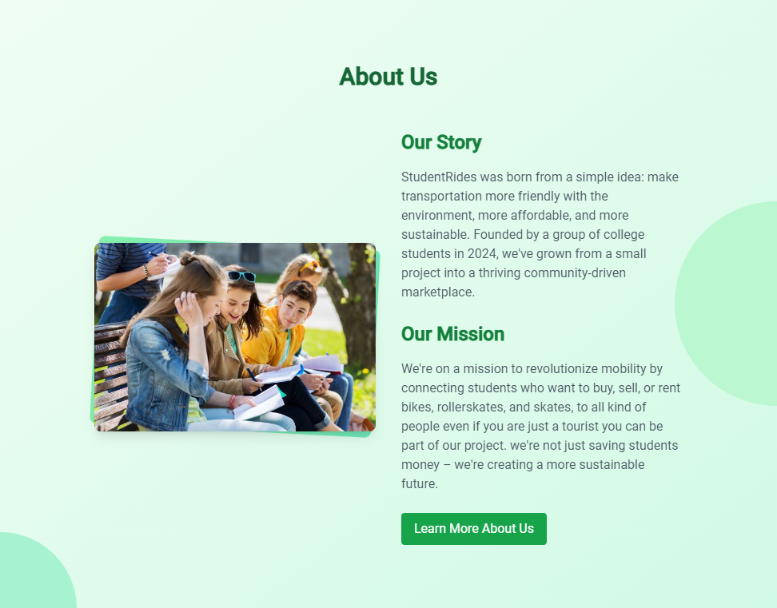 

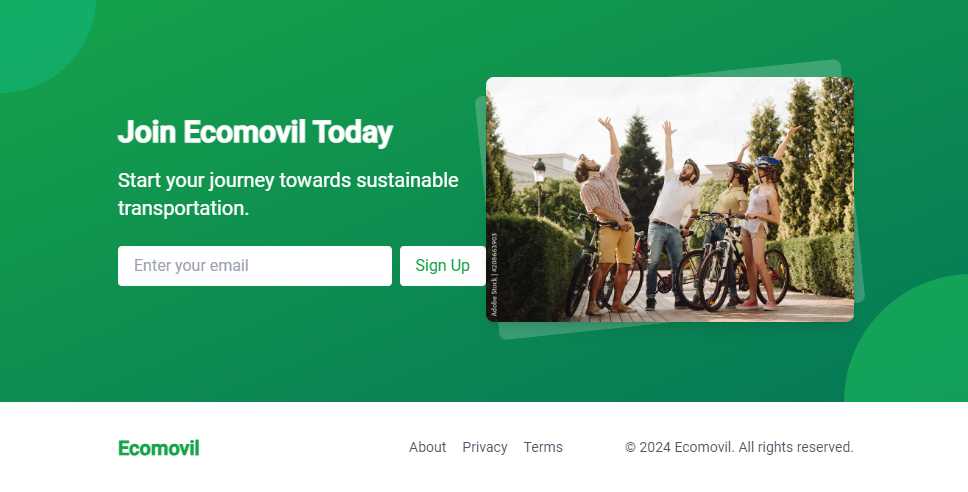 

### 5.2.1.8. Team Collaboration Insights during Sprint

En esta sección, presentaremos los hallazgos de nuestro equipo para evaluar los resultados del trabajo realizado y la actividad generada.

| Alumno | Actividad | 
|-----------|-----------|
| Calisaya Sánchez, Juan Jesús | Elaboración de las secciones de "Planes" ("plans"). | 
| Gallo Quintana, David Ivanoff | Diseño de la sección "Únete" ("join") y la sección principal ("main"). | 
| Hidalgo Lopez, Mathias Adriano | Desarrollo de la sección "Quién Puede Usar" ("who-can-use"). | 
| Oneglio De Paz, Beth Shantal | Desarrollo de la sección "Acerca de" y el pie de página ("footer") de la página de inicio. | 
| Vasquez Goicochea, Erick Alessander | Creación del encabezado ("header") y la sección "Cómo Funciona" ("how-it-works"). | 

Repositorio Landing-Page-EcoMovil:

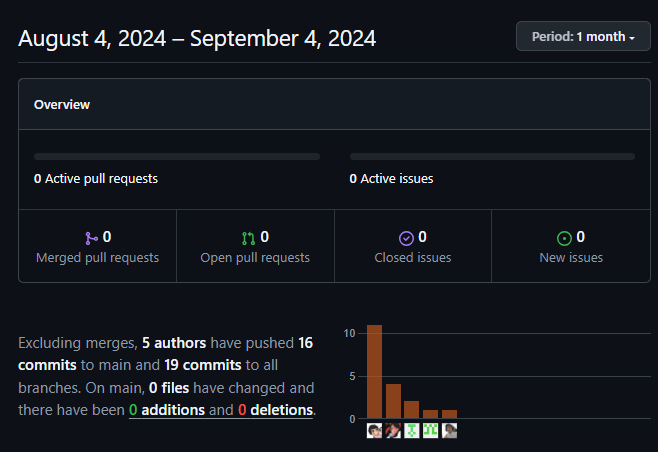 
