# Capítulo V: Product Implementation, Validation & Deployment
## 5.1. Software Configuration Management

### 5.1.1. Software Development Environment Configuration

**Requirements Management**

1. Trello: Es una herramienta para gestionar proyectos, especialmente aquellos basados en metodologías ágiles. Facilita la visualización y actualización del progreso de tareas e historias de usuario dentro de un sprint en desarrollo.

Ruta de referencia: https://trello.com/es

**User Experience Design (UX/UI)**

1. Figma: Herramienta para la creación de prototipos y diseño gráfico, principalmente empleada en el ámbito digital. En este proyecto, servirá para desarrollar prototipos de la aplicación y sus versiones para navegadores en escritorio y móviles.

Ruta de referencia: https://www.figma.com/login

2. Lucidchart: Aplicación para la creación de diagramas de flujo. Se utilizará para el diseño de wireflows, user-flows y el diagrama de clases asociado con la aplicación.

Ruta de referencia: https://www.lucidchart.com

**Software Testing**

1. Gherkin: Gherkin es un lenguaje usado para definir los criterios de aceptación de una historia de usuario de forma estructurada. Proporciona una forma estandarizada de escribir escenarios en un formato legible tanto para equipos técnicos como no técnicos. Para más información.

Ruta de referencia: https://cucumber.io/docs/gherkin/

**Software Development**

1. Visual Studio Code: Entorno de desarrollo integrado seleccionado para la creación y compilación del código, debido al dominio del equipo con esta herramienta. Este IDE aporta valor al proyecto por su capacidad para añadir extensiones útiles, soportar edición de texto en varios lenguajes de programación y estar disponible en diferentes sistemas operativos, entre otras ventajas.

Ruta de referencia: https://code.visualstudio.com/

2. HTML5: Lenguaje de marcado para la estructura de páginas web. Se utilizará en el proyecto para organizar y presentar el contenido de la aplicación.
   
Ruta de referencia: https://www.w3schools.com/html/html5_syntax.asp

4. CSS: Hojas de Estilo en Cascada, un lenguaje que controla el diseño y la apariencia de las páginas web, complementando a HTML.

Ruta de referencia: https://google.github.io/styleguide/htmlcssguide.html

4. Angular: Framework de desarrollo para aplicaciones web de una sola página (SPA) que utiliza TypeScript. Desarrollado por Google, facilita la creación de aplicaciones web dinámicas y eficientes.

Ruta de referencia: https://angular.io/

5. TypeScript: Lenguaje de programación que extiende JavaScript añadiendo tipado estático y otras características avanzadas, mejorando el desarrollo de aplicaciones complejas y a gran escala.

Ruta de referencia: https://www.typescriptlang.org/

**Software Deployment**

1. Git: Sistema de control de versiones que facilita el registro y la gestión de las diversas versiones del código. Servirá para mantener un historial de modificaciones y simplificar la resolución de errores. El equipo accederá a través de la línea de comandos en sus equipos locales.

Ruta de referencia: https://git-scm.com/

**Software Documentation and Project Management**

1. GitHub: Plataforma en la nube que almacenará los repositorios del proyecto, permitiendo la colaboración en tiempo real y la revisión de las aportaciones de cada miembro del equipo. El acceso se realizará a través de los navegadores web.

Ruta de referencia: https://github.com/

### 5.1.2. Source Code Management

El proyecto implementará el modelo **GitFlow** como estándar para el control de versiones, utilizando **GitHub** como plataforma principal. Este enfoque permitirá una gestión estructurada y ordenada de las ramas, facilitando el desarrollo colaborativo. A continuación, se presenta cómo se integrará GitFlow en el flujo de trabajo y los enlaces a los repositorios de GitHub correspondientes:

**GitFlow Workflow:**
- Ramas principales: `main` y `develop` para producción y desarrollo.
- Ramas de características (features) para el desarrollo de nuevas funcionalidades.
- Ramas de corrección (hotfix) para soluciones rápidas en producción.

**Repositorios de GitHub:**
- Enlace a la organización en GitHub: https://github.com/orgs/Open-Source-SW56-Group-2-EcoMovil/repositories
- Enlace al repositorio de la **Landing Page**: https://open-source-sw56-group-2-ecomovil.github.io/Landing-Page-EcoMovil/
 

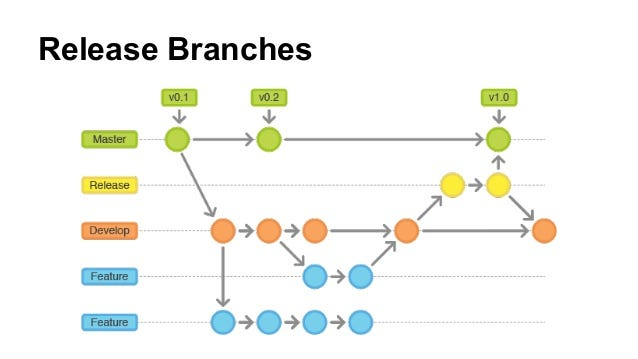

**Estructura de Ramas (Branches) en GitFlow:**

1. **Rama Master (Principal):** Es la rama principal del proyecto, donde se mantendrán versiones estables y finales de la aplicación. Solo se permitirán cambios que hayan sido previamente probados y verificados en otras ramas.

2. **Rama Develop (Desarrollo):** Su función es mantener el progreso continuo del proyecto. Es aquí donde el equipo colaborará en las nuevas funcionalidades antes de que sean incorporadas a la rama principal.

3. **Ramas de Funcionalidad (Feature branches):** Cada nueva característica del proyecto se desarrollará en su propia rama. Una vez completada y probada, se fusionará en la rama de desarrollo. Las ramas seguirán un patrón de nombres descriptivo, por ejemplo, `feature/nombre-de-la-funcionalidad`.

4. **Ramas de Lanzamiento (Release branches):** Estas ramas se crearán cuando una versión esté lista para ser lanzada. Se utilizará el **versionamiento semántico** para asignar un número de versión a cada release.

5. **Ramas de Corrección (Hotfix branches):** Estas ramas se usarán para aplicar correcciones urgentes a la rama principal, generalmente errores críticos que afecten a la experiencia del usuario.

**Convenciones de Commits:**
Se adoptará la especificación **Conventional Commits**, basada en las directrices de **Angular Commit Guidelines**.

### 5.1.3. Source Code Style Guide & Conventions

En EcoMovil se han implementado diversas convenciones de estilo para el desarrollo en varios lenguajes.

#### Tecnologías utilizadas:

**HTML y CSS (Guía de Estilo de Google HTML/CSS):**
- El documento comienza con `!DOCTYPE html`.
- Se incluyen meta etiquetas necesarias y el elemento `title` dentro de `head`.
- Se usa una indentación de dos espacios y minúsculas para elementos, atributos y selectores.
- Los atributos se escriben entre comillas y todos los elementos tienen su etiqueta de cierre.
- Se evita el uso de líneas demasiado largas y las imágenes incluyen especificaciones de tamaño y texto alternativo (`alt`).
- Los atributos de las imágenes incluyen dimensiones `width` y `height` para mejorar la accesibilidad (ej: ``).

**TypeScript:**
- Se emplean clases e interfaces, se agregan comentarios y se controlan flujos lógicos.
- Se usan nombres descriptivos para las variables y funciones.

**Gherkin (Convenciones de Gherkin para especificaciones legibles):**
- Se utilizan las palabras clave "Given", "When", "Then" y "And" para describir los pasos de los escenarios.
- Se indentan los pasos con "And", añadiendo líneas en blanco entre pasos y escenarios.
- Los parámetros se rodean con comillas simples.

**Java:**
- Se usan clases, métodos y variables, siguiendo convenciones funcionales.

**Angular:**
- Los nombres siguen la convención PascalCase.
- Los componentes, servicios y clases están en archivos separados.
- Las plantillas y hojas de estilo se manejan en archivos distintos, con el uso de decoradores como `@Component`, `@Injectable` y `@Input`.
- Se emplea inyección de dependencias para gestionar servicios y las convenciones de código se centran en nombres claros.

**Gherkin**:
- Busca mejorar la comunicación entre negocio y técnico con BDD, organizando los escenarios mediante saltos de línea y palabras clave ("Given", "When", "Then", "And") para estructurar escenarios. Los saltos de línea ayudan a distinguir entre los distintos tipos de escenarios, mejorando la legibilidad y organización.

### 5.1.4. Software Deployment Configuration

**Landing Page Deployment**

Para desplegar la landing page, es necesario cumplir con ciertos requisitos previos, como disponer de una cuenta personal, una organización y un repositorio donde se alojarán los archivos. Con esto listo, se puede comenzar el despliegue. Los pasos son los siguientes:

1. Crear una carpeta llamada "docs" que contendrá la landing page.
2. Verificar que los archivos estén correctamente nombrados: "index.html" para la página principal, "style.css" para los estilos, y una carpeta "img" para las imágenes.
3. Subir los archivos al repositorio con un commit.
4. Dirigirse a Settings > Pages y seleccionar la rama correspondiente, usualmente "main" o "master".
5. Definir la carpeta "docs" como la ubicación de la página.
6. Esperar a que GitHub finalice las comprobaciones. Al terminar, se generará un enlace que permitirá acceder a la landing page publicada.

Este proceso permite el despliegue automático de la landing page utilizando GitHub Pages.

A continuación, se detallarán las acciones llevadas a cabo para alcanzar este propósito.

Lo primero es garantizar que el repositorio esté configurado de manera adecuada.

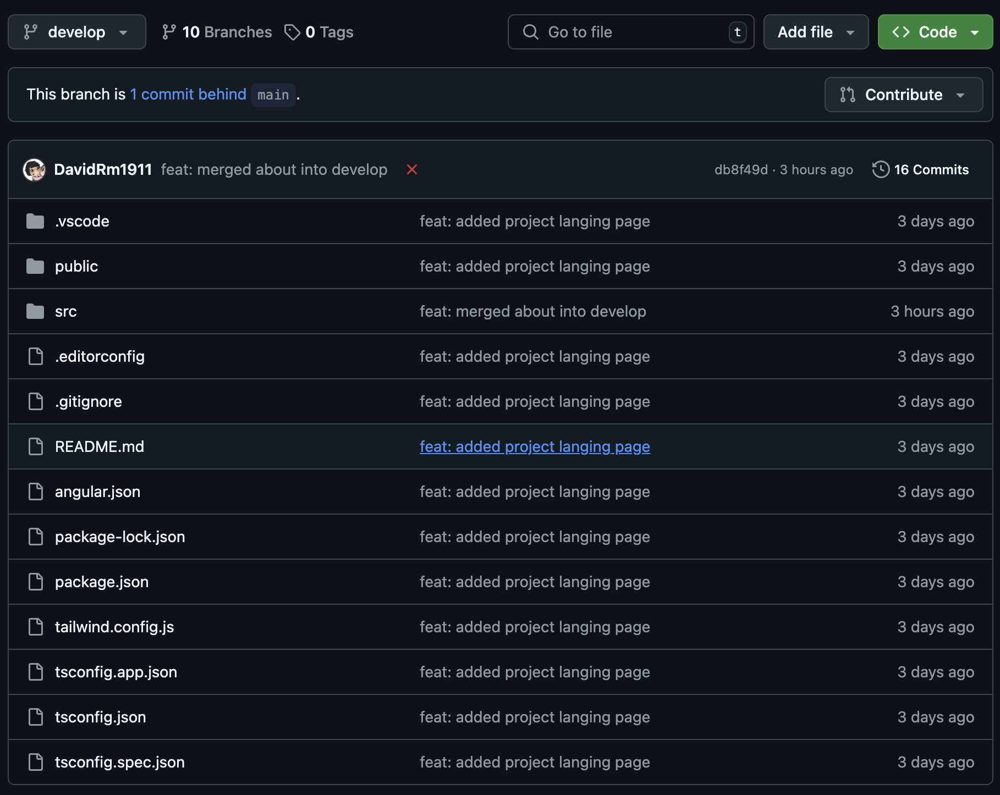

En este caso, se ha utilizado Angular para desarrollar una Landing Page, optando por la herramienta angular-cli-pages, que simplifica tanto la actualización de la página como su despliegue en GitHub Pages.

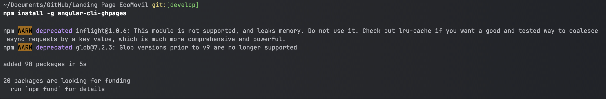

A continuación, se utiliza la herramienta "ngh" para crear una nueva rama llamada "gh-pages", que contendrá los archivos de despliegue y recibe su nombre de la herramienta mencionada.

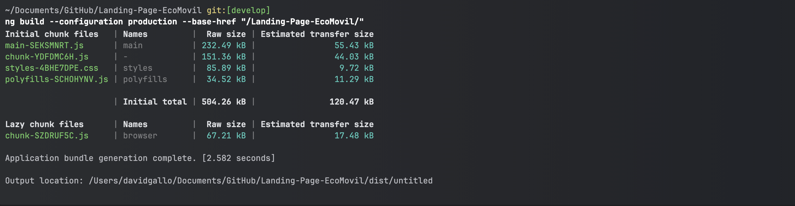

Usamos "ngh" para crear una nueva rama llamada "gh-pages", que almacenará todos los archivos necesarios para el despliegue. El nombre de la rama proviene de la herramienta que estamos utilizando.

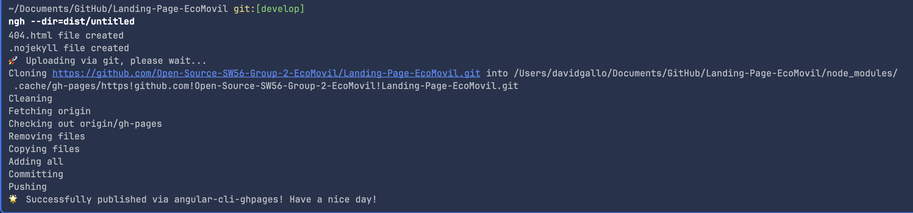

Una vez que los archivos se han publicado en la rama correspondiente, accedemos a "Settings" y, en la sección "Pages", seleccionamos la rama "gh-pages" y la opción / (root). Después de guardar los cambios y esperar un momento, podremos ver la página publicada.

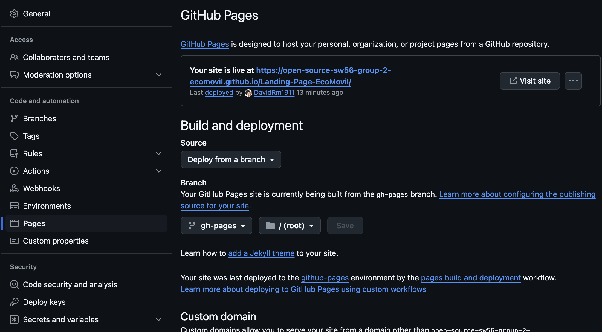

Así es cómo se verá la página final.

Enlace del Landing Page EcoMovil: https://open-source-sw56-group-2-ecomovil.github.io/Landing-Page-EcoMovil/

## 5.2. Landing Page, Services & Applications Implementation

### 5.2.1. Sprint 1

Un Sprint en el contexto de Scrum es un periodo de tiempo fijo y breve en el que el equipo se enfoca en realizar todas las tareas necesarias para lograr el objetivo del producto definido, denominado "Product Goal" (Scrum Alliance, 2024).

### 5.2.1.1. Sprint Planning 1

Un sprint es un intervalo breve y definido durante el cual se completan tareas o actividades específicas dentro de un proyecto, como se aplica en metodologías ágiles como Scrum. El Sprint #1, que comienza el 14 de agosto de 2024, tiene como objetivo diseñar una landing page atractiva para EcoMovil. Esta página debe captar la atención de los visitantes y resaltar los principales beneficios de nuestro producto.

<table>
     <tr> 
        <th>  Sprint #  </th>
        <th> Sprint 1 </th>
     </tr>
     <tr> 
        <td style="font-weight: bold;" colspan="7"> Sprint Planing Background</td>
     </tr>
     <tr>
       <td style="font-weight: bold;"> Date </td>
       <td>  14/08/2024 </td>
     </tr>
     <tr>
       <td style="font-weight: bold;"> Time </td>
       <td> 17:00 horas (GMT-5) </td>
     </tr>
     <tr>
       <td style="font-weight: bold;"> Location </td>
       <td> Modalidad remota a través de Discord <td>
     </tr>
      <tr>
        <td style="font-weight: bold;"> Prepared By </td>
        <td> Oneglio De Paz, Beth Shantal <td>
     </tr>
        <tr>
        <td style="font-weight: bold;"> Attendees (to planning meeting) </td>
        <td> 
             
             Calisaya Sánchez, Juan Jesús
             
             Gallo Quintana, David Ivanoff
             
            Hidalgo Lopez, Mathias Adriano
             
             Oneglio De Paz, Beth Shantal
             
            Vasquez Goicochea, Erick Alessander
        <td>
     </tr>
     <tr>
        <td style="font-weight: bold;"> Sprint 0 Review Summary </td>
        <td> Dado que este es nuestro primer sprint de desarrollo, no hay un resumen de revisión del sprint disponible. <td>
     </tr>
     <tr>
        <td style="font-weight: bold;"> Sprint 0 Retrospective Summary </td>
        <td> Dado que este es nuestro primer sprint de desarrollo, aún no hemos identificado planes de mejora.<td>
     </tr>
     <tr> 
        <td style="font-weight: bold;" colspan="7"> Sprint Goal & User Stories</td>
     </tr>
       <tr>
          <td style="font-weight: bold;"> Sprint 1 Goal</td>
          <td>  En este sprint, se planea implementar la landing page con las secciones de inicio de sesión, hero y elementos de orientación para el usuario, como el footer y "About". Al finalizar el sprint, la landing page debe estar desplegada en GitHub, y cualquier usuario debería poder acceder y ver la página mediante un enlace. <td>
      </tr>
       <tr>
          <td style="font-weight: bold;"> Sprint 1 Velocity </td>
          <td>  26  <td>
      </tr>
      <tr>
          <td style="font-weight: bold;"> Sum of Story Points </td>
          <td> 26 <td>
      </tr>

  </table>

### 5.2.1.2. Sprint Backlog 1

En el primer sprint backlog, el equipo se propuso comenzar y finalizar la landing page. Para organizar y gestionar a los miembros del equipo, se utilizó Trello, una herramienta que permitió dividir las user stories en tareas manejables y asignarlas a los miembros según sus habilidades. El objetivo principal del sprint era desarrollar completamente la landing page, asegurando que fuera tanto atractiva como funcional.

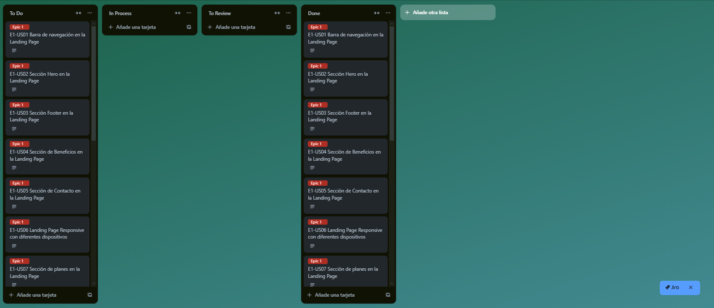 

<table style="width:400px; height:100px;"> 
   <tr>
      <th colspan="4"> Sprint # </th>
      <th colspan="7"> Sprint 1 </th>
   </tr>
   <tr >
     <th colspan="4"> User Story </th>
     <th colspan="7"> Work-Item /Task</th>
   </tr>
   <tr>
     <th > Id </th>
     <th colspan="3"> Title </th>
     <th> Id </th>
     <th > Title </th>
     <th> Description </th>
     <th> Estimation (Hours) </th>
     <th> Assigned To </th> 
     <th> Status (To-do / In-Process / To- Review / Done) </th>
   </tr>
   <tr>
      <th> US01 </th>
     <th colspan="3"> Barra de navegación en la Landing Page </th>
      <th> W01  </th>
     <th> Navbar Section</th>
     <th> Desarrollar el navbar de la landing page de EcoMovil con distintas opciones que nos redirige a otros apartados  </th>
     <th> 1  </th>
     <th> Erick Vasquez </th> 
     <th> Done </th>
   </tr>
    <tr>
      <th> US02 </th>
     <th colspan="3"> Sección Hero en la Landing Page </th>
      <th> W03  </th>
     <th> Hero Section </th>
     <th> Agregar un apartado con una imagen y un título llamativo al ingresar al landing page de EcoMovil   </th>
     <th> 0.8  </th>
     <th> David Gallo </th> 
     <th> Done </th>
   </tr>
   <tr>
      <th> US03 </th>
     <th colspan="3"> Sección Footer en la Landing Page </th>
      <th> W05  </th>
     <th> Footer Section </th>
     <th> Implementar la sección del footer con las direcciones a al información del equipo y los términos de nuestra página web  </th>
     <th> 1.2  </th>
     <th> Beth Oneglio </th> 
     <th> Done </th>
   </tr>
   <tr>
      <th> US04</th>
     <th colspan="3"> Sección Footer en la Landing Page </th>
      <th> W06  </th>
     <th> About us Section </th>
     <th> Implementar la sección "About us" donde se muestra la información adicional. </th>
     <th> 0.8  </th>
     <th> Beth Oneglio </th> 
     <th> Done </th>
   </tr>
    </tr>
   <tr>
      <th> US05</th>
     <th colspan="3"> Sección de Beneficios en la Landing Page</th>
      <th> W07  </th>
     <th> Beneficios Section </th>
     <th> Implementar la sección Beneficios donde se muestran las caracteristicas principales.   </th>
     <th> 0.7  </th>
     <th> Mathias Hidalgo </th> 
     <th> Done </th>
   </tr>
    <tr>
      <th> US06 </th>
     <th colspan="3"> Sección de Contacto en la Landing Page </th>
      <th> W09  </th>
     <th> Contact Section </th>
     <th> Agregar información del equipo para que los usuarios puedan contactarnos. </th>
     <th> 0.5 </th>
     <th> Mathias Hidalgo </th> 
     <th> Done </th>
   </tr>
    <tr>
        <th> US07 </th>
         <th colspan="3"> Landing Page Responsive con diferentes dispositivos </th>
          <th> W10  </th>
         <th> Landing page responsive Section </th>
         <th> Agregar la funcionalidad de responsividad a toda la aplicación web.   </th>
         <th> 0.6 </th>
         <th> Juan Calisaya </th> 
         <th> Done </th>
    </tr>
</table>

### 5.2.1.3. Development Evidence for Sprint Review

| Repository   | Branch                                      | Commit Id | Commit Message                   | User | Commited on (Date) |
| ------------ | ------------------------------------------- | --------- | -------------------------------- | ------------------- | ------------------ |
| landing-page | main       | b863a40         |        | David Gallo | Aug 29, 2024         | 
| landing-page | main       | 36fec62         | feat: add file | Mathias Hidalgo | Aug 29, 2024    |
| landing-page | main       | f827944         | feat: added plans section | Juan Calisaya | Aug 29, 2024       |
| landing-page | main       | cf2b26c   |feat: Added about section         | Beth Oneglio| Aug 30, 2024                |
| landing-page | main       | 8404774             |  feat: Added footer section                     | Beth Oneglio|  Aug 30, 2024 |
| landing-page | main       | b360e5b              |    feat: added header             | Erick Vasquez|      Aug 30, 2024 |
| landing-page | main       | ad8ad4c  |  feat: added how-it-work component     | Erick Vasquez|  Aug 30, 2024 |
| landing-page | main       | 0eb6e8d  |   feat(feature/join): Added join component  | David Gallo|   Sep 1, 2024|
| landing-page | main       | 4aa9478  |  feat(feature/main): added main component  | David Gallo | Sep 1, 2024|
| landing-page | main       | 50b12a4  |  "feat Merge branch 'feature/plans' into develop"| David Gallo | Sep 1, 2024|
| landing-page | main       | b795e73   |  feat: Merged main into develop   | David Gallo | Sep 1, 2024|
| landing-page | main       | c0e34a3    |     feat: merged how-it-works into develop | David Gallo| Sep 1, 2024 |
| landing-page | main       | 80d39b9 |        feat: merged header into develop   | David Gallo |  Sep 1, 2024 |
| landing-page | main       | fc17166 |        feat: merged footer into develop   | David Gallo | Sep 1, 2024 |
| landing-page | main       | db8f49d  |   feat: merged about into develop         | David Gallo | Sep 1, 2024 |
| landing-page | main       | d64296f   |      Create jekyll-gh-pages.yml          | David Gallo |  Sep 1, 2024 |
| landing-page | main       | e4b6d2a |    feat: refactor index.html         | David Gallo| Sep 1, 2024  |
| landing-page | main       | 5721546 |        feat: merged footer into develop | David Gallo |    Sep 1, 2024 |
| landing-page | main       | 06db9c8 |  Merge remote-tracking branch 'refs/remotes/origin/main'  | David Gallo |Sep 1, 2024|
| landing-page | main       | 3274f7d |      feat: added index.html          | David Gallo |  Sep 1, 2024 |
| landing-page | main       | 8842140 |   Create CNAME         | Beth Oneglio |   Sep 4, 2024 |
| landing-page | main       | f5961b4 |   Delete CNAME         | Beth Oneglio |   Sep 4, 2024  |
| landing-page | develop       | b863a40         |         | David Gallo | Aug 29, 2024         | 
| landing-page | develop       | 36fec62         | feat: add file | Mathias Hidalgo | Aug 29, 2024    |
| landing-page | develop       | f827944         | feat: added plans section | Juan Calisaya | Aug 29, 2024       |
| landing-page | develop       | cf2b26c          |   feat: Added about section         | Beth Oneglio|   Aug 30, 2024  |
| landing-page | develop       | 8404774          |   feat: Added footer section        | Beth Oneglio|   Aug 30, 2024  |
| landing-page | develop       | b360e5b          |   feat: added header         | Erick Vasquez|   Aug 30, 2024  |
| landing-page | develop       | ad8ad4c          |   feat: added how-it-work component         | Erick Vasquez|   Aug 30, 2024  |
| landing-page | develop       | 0eb6e8d          |   feat(feature/join): Added join component         | David Gallo|   Sep 1, 2024  |
| landing-page | develop       | 4aa9478          |   feat(feature/main): added main component         | David Gallo|   Sep 1, 2024  |
| landing-page | develop       | 50b12a4          |   "feat Merge branch 'feature/plans' into develop"         | David Gallo|   Sep 1, 2024  |
| landing-page | develop       | b795e73          |   feat: Merged main into develop         | David Gallo|   Sep 1, 2024  |
| landing-page | develop       | c0e34a3          |   feat: merged how-it-works into develop         | David Gallo|   Sep 1, 2024 |
| landing-page | develop       | 80d39b9          |   feat: merged header into develop        | David Gallo|   Sep 1, 2024 |
| landing-page | develop       | fc17166          |   feat: merged footer into develop        | David Gallo|   Sep 1, 2024  |
| landing-page | develop       | db8f49d          |   feat: merged about into develop | David Gallo|   Sep 1, 2024  |
| landing-page | develop       | e6fa6b4          |   feat: added scroll event         | David Gallo|  Sep 1, 2024  |
| landing-page | feature/about       | b863a40         |         | David Gallo | Aug 29, 2024         | 
| landing-page | feature/about       | 36fec62         | feat: add file | Mathias Hidalgo | Aug 29, 2024    |
| landing-page | feature/about       | cf2b26c         |   feat: Added about section         | Beth Oneglio |   Aug 30, 2024  |
| landing-page | feature/footer      | b863a40          |           | David Gallo |   Aug 29, 2024  |
| landing-page | feature/footer      | 36fec62          |   feat: add file         | Mathias Hidalgo |   Aug 29, 2024  |
| landing-page | feature/footer      | 8404774          |   feat: Added footer section         | Beth Oneglio |   Aug 30, 2024  |
| landing-page | feature/header      | b863a40          |           | David Gallo |   Aug 29, 2024  |
| landing-page | feature/header      | 36fec62          |   feat: add file         | Mathias Hidalgo |   Aug 29, 2024  |
| landing-page | feature/header      | b360e5b          |   feat: added header        | Erick Vasquez |   Aug 30, 2024  |
| landing-page | feature/how-it-works       | b863a40          |            | David Gallo |   Aug 29, 2024  |
| landing-page | feature/how-it-works       | 36fec62          |   feat: add file         | Mathias Hidalgo |   Aug 29, 2024  |
| landing-page | feature/how-it-works       | ad8ad4c          |   feat: added how-it-work component         | Erick Vasquez|   Aug 30, 2024  |
| landing-page | feature/join       | b863a40          |            | David Gallo |   Aug 29, 2024  |
| landing-page | feature/join       | 36fec62          |   feat: add file         | Mathias Hidalgo |   Aug 29, 2024  |
| landing-page | feature/join       | 0eb6e8d          |   eat(feature/join): Added join component         | David Gallo |   Aug 30, 2024  |
| landing-page | feature/main       | b863a40          |            | David Gallo |   Aug 29, 2024  |
| landing-page | feature/main       | 36fec62          |   feat: add file         | Mathias Hidalgo |   Aug 29, 2024  |
| landing-page | feature/main       | 4aa9478          |   feat(feature/main): added main component         | David Gallo |   Aug 30, 2024  |
| landing-page | feature/plans       | b863a40          |            | David Gallo |   Aug 29, 2024  |
| landing-page | feature/plans       | 36fec62          |   feat: add file         | Mathias Hidalgo |   Aug 29, 2024  |
| landing-page | feature/plans       | f827944          |   feat: added plans section         | Juan Calisaya |   Aug 29, 2024  |
| landing-page | gh-pages       | f8695f0          |   Auto-generated commit         | David Gallo |   Sep 1, 2024  |
| landing-page | gh-pages       | c74bd50          |   Auto-generated commit         | David Gallo |   Sep 1, 2024  |

### 5.2.1.4. Testing Suite Evidence for Sprint Review

Para la entrega del Sprint 1, nos enfocamos en lograr el desarrollo completo, la implementación y el despliegue del Landing Page. Por lo tanto, la sección de "Testing" se enfocó en la implementación de las necesidades de los usuarios, priorizando secciones fáciles de entender e intuitivas.

| Repository                                                  | Branch         | Commit ID | Commit Message                  | Commited on (Date) |
|-------------------------------------------------------------|----------------|-----------|----------------------------------|--------------------|
| [https://github.com/Open-Source-SW56-Group-2-EcoMovil/Landing-Page-EcoMovil.git](https://github.com/Open-Source-SW56-Group-2-EcoMovil/Landing-Page-EcoMovil.git) | LandingPage | adebcba  | feat: added project landing page  | 29/08/24           |

### 5.2.1.5. Execution Evidence for Sprint Review

En el sprint 1 se logró un avance parcial en la implementación y despliegue de la landing page. Esta página presenta varias secciones donde el usuario puede encontrar información relevante sobre el producto y la startup. A continuación, se presentan algunas evidencias:

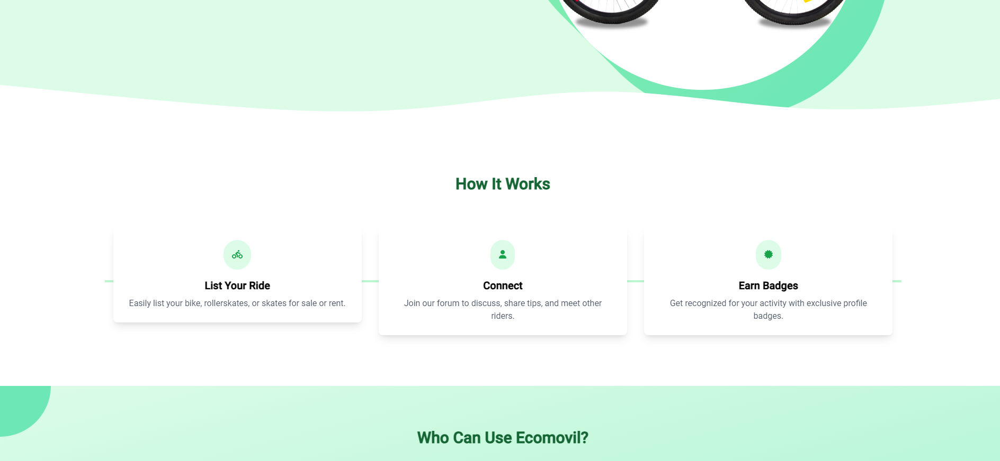

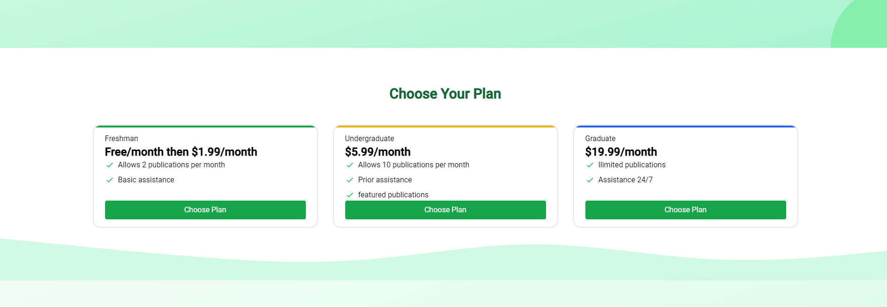

### 5.2.1.6. Services Documentation Evidence for Sprint Review

En este Sprint 1, el enfoque principal ha sido la creación del Landing Page de la aplicación EcoMovil, por lo que no se ha avanzado en la documentación de los servicios. No obstante, está previsto que la documentación de los servicios se desarrolle en los próximos sprints.

### 5.2.1.7. Software Deployment Evidence for Sprint Review

En la entrega del segundo sprint, se desplegó un Landing Page completamente funcional, cumpliendo con las user stories asignadas para este entregable. Durante el Sprint 1, se lanzó la primera versión del Landing Page, que fue alojada en GitHub Pages. A continuación, se presentan las evidencias del despliegue del Landing Page.

- Instrucciones para acceder al Landing Page:

Finalizando la implementación de los cambios y fusionándolos en la rama principal (`main`).

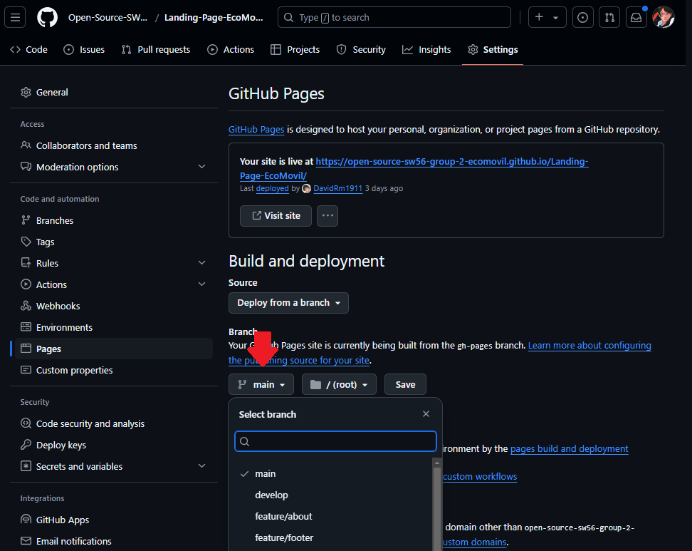

Nos dirigimos a la sección de "Settings" del repositorio y seleccionamos el apartado de "Pages".

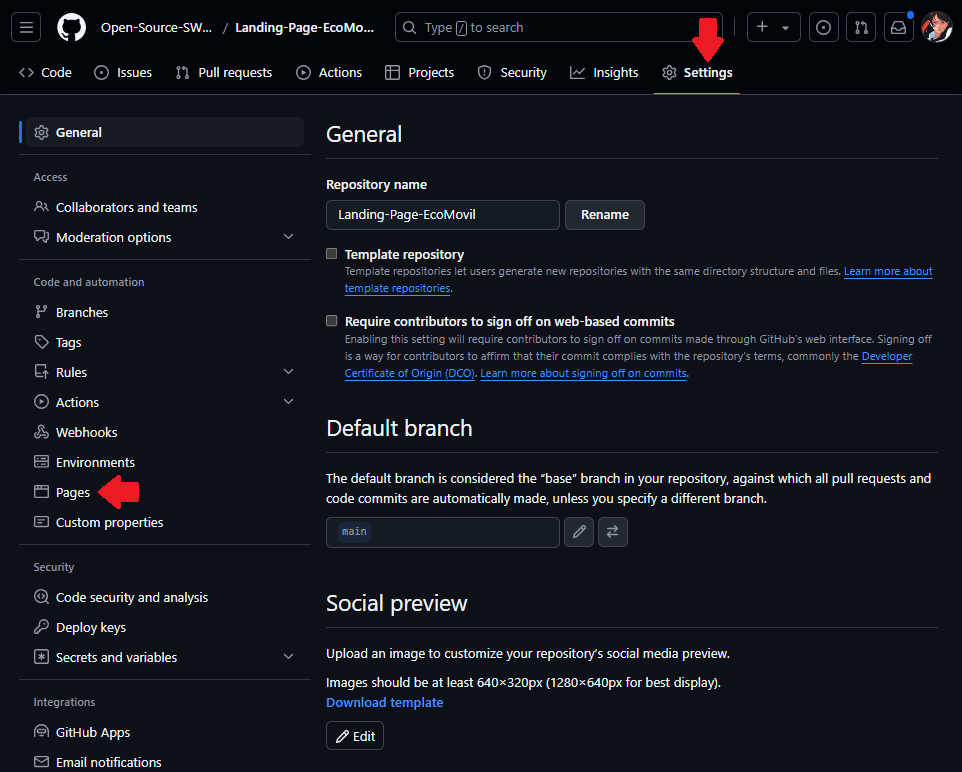

Seleccionamos la rama `gh-pages` como fuente de despliegue, luego hacemos clic en "Save" para ejecutar el deploy.

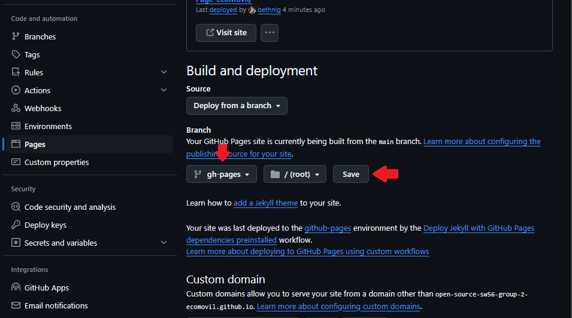

Accedemos al dominio del Landing Page, verificamos que todo esté correctamente configurado y hacemos clic en "Guardar" para finalizar el proceso.

- Imágenes de la pantalla del Landing Page:

### 5.2.1.8. Team Collaboration Insights during Sprint

En esta sección, presentaremos los hallazgos de nuestro equipo para evaluar los resultados del trabajo realizado y la actividad generada.

| Alumno | Actividad | 
|-----------|-----------|
| Calisaya Sánchez, Juan Jesús | Elaboración de las secciones de "Planes" ("plans"). | 
| Gallo Quintana, David Ivanoff | Diseño de la sección "Únete" ("join") y la sección principal ("main"). | 
| Hidalgo Lopez, Mathias Adriano | Desarrollo de la sección "Quién Puede Usar" ("who-can-use"). | 
| Oneglio De Paz, Beth Shantal | Desarrollo de la sección "Acerca de" y el pie de página ("footer") de la página de inicio. | 
| Vasquez Goicochea, Erick Alessander | Creación del encabezado ("header") y la sección "Cómo Funciona" ("how-it-works"). | 

### 5.2.2. Sprint 2

En Scrum, un Sprint es un intervalo de tiempo corto y determinado durante el cual el equipo se dedica a completar todas las tareas requeridas para alcanzar el objetivo del producto, conocido como "Product Goal" (Scrum Alliance, 2024).

### 5.2.2.1. Sprint Planning 2

El Sprint #2, que inicia el 12 de septiembre de 2024, se centrará en el diseño del front-end, concretamente en la creación de la landing page de EcoMovil. El objetivo es permitir que nuestro público pueda visualizar e interactuar con la página web una vez esté desplegada, siguiendo el enfoque ágil de metodologías como Scrum, donde un sprint es un período corto y definido para completar tareas clave del proyecto.

<table>
     <tr> 
        <th>  Sprint #  </th>
        <th> Sprint 2 </th>
     </tr>
     <tr> 
        <td style="font-weight: bold;" colspan="7"> Sprint Planing Background</td>
     </tr>
     <tr>
       <td style="font-weight: bold;"> Date </td>
       <td>  19/09/2024 </td>
     </tr>
     <tr>
       <td style="font-weight: bold;"> Time </td>
       <td> 17:00 horas (GMT-5) </td>
     </tr>
     <tr>
       <td style="font-weight: bold;"> Location </td>
       <td> Modalidad remota a través de Discord <td>
     </tr>
      <tr>
        <td style="font-weight: bold;"> Prepared By </td>
        <td> Oneglio De Paz, Beth Shantal <td>
     </tr>
        <tr>
        <td style="font-weight: bold;"> Attendees (to planning meeting) </td>
        <td> 
             
             Calisaya Sánchez, Juan Jesús
             
             Gallo Quintana, David Ivanoff
             
            Hidalgo Lopez, Mathias Adriano
             
             Oneglio De Paz, Beth Shantal
             
            Vasquez Goicochea, Erick Alessander
        <td>
     </tr>
     <tr>
        <td style="font-weight: bold;"> Sprint 1 Review Summary </td>
        <td> Dado que este es nuestro primer sprint de desarrollo, no hay un resumen de revisión del sprint disponible. <td>
     </tr>
     <tr>
        <td style="font-weight: bold;"> Sprint 1 Retrospective Summary </td>
        <td> Dado que este es nuestro primer sprint de desarrollo, aún no hemos identificado planes de mejora.<td>
     </tr>
     <tr> 
        <td style="font-weight: bold;" colspan="7"> Sprint Goal & User Stories</td>
     </tr>
       <tr>
          <td style="font-weight: bold;"> Sprint 2 Goal</td>
          <td>  Detectamos algunas áreas que pueden optimizarse en las funcionalidades existentes y también planeamos incorporar la funcionalidad de i18n en la landing page. Además, desarrollaremos el front-end de la aplicación web para que sea tanto atractiva como funcional. <td>
      </tr>
       <tr>
          <td style="font-weight: bold;"> Sprint 2 Velocity </td>
          <td>  26  <td
      </tr>
      <tr>
          <td style="font-weight: bold;"> Sum of Story Points </td>
          <td> 26 <td>
      </tr>

  </table>

### 5.2.2.2. Sprint Backlog 2

En el backlog del segundo sprint, el equipo se comprometió a iniciar y completar la creación y despliegue del front-end. Para coordinar y gestionar al equipo, se utilizó Trello, una herramienta que facilitó la división de las user stories en tareas más manejables, asignándolas a los miembros según sus habilidades. El objetivo principal del sprint fue desarrollar y desplegar un front-end que fuera tanto atractivo como funcional.

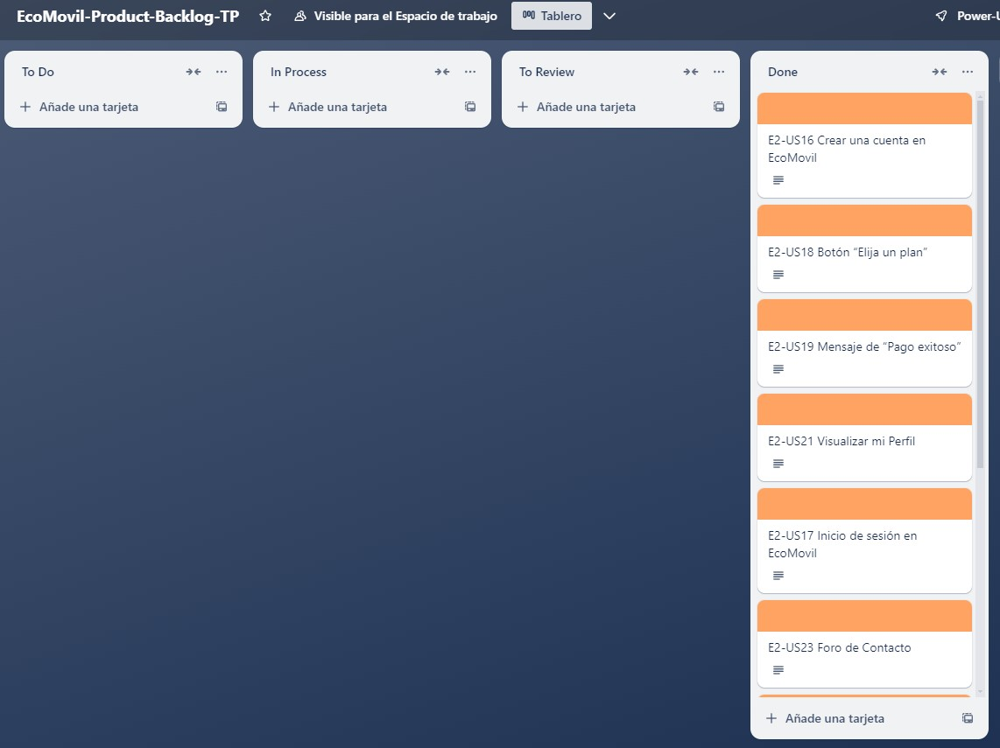

Link del Trello: https://trello.com/b/48W0tEjF/ecomovil-product-backlog-tp

<table style="width:400px; height:100px;"> 
   <tr>
      <th colspan="4"> Sprint # </th>
      <th colspan="7"> Sprint 2 </th>
   </tr>
   <tr >
     <th colspan="4"> User Story </th>
     <th colspan="7"> Work-Item /Task</th>
   </tr>
   <tr>
     <th > Id </th>
     <th colspan="3"> Title </th>
     <th> Id </th>
     <th > Title </th>
     <th> Description </th>
     <th> Estimation (Hours) </th>
     <th> Assigned To </th> 
     <th> Status (To-do / In-Process / To- Review / Done) </th>
   </tr>
   <tr>
      <th> US16 </th>
     <th colspan="3"> Sección Crear una cuenta en EcoMovil </th>
      <th> W01  </th>
     <th> Create-User Section</th>
     <th> Desarrollar el Create-User de nuestro front-end de EcoMovil nos permite que el usuario pueda registrarse en la página. </th>
     <th> 1  </th>
     <th> Beth Oneglio </th> 
     <th> Done </th>
   </tr>
    <tr>
      <th> US17 </th>
     <th colspan="3"> Sección Inicio de sesión en EcoMovil </th>
      <th> W03  </th>
     <th> Login Section </th>
     <th> Implementar el inicio de sesión en nuestro front-end ayuda a que el usuario pueda entrar con su cuenta ya creada. </th>
     <th> 0.8  </th>
     <th> Beth Oneglio </th> 
     <th> Done </th>
   </tr>
   <tr>
      <th> US18 </th>
     <th colspan="3"> Sección Botón “Elija un plan” </th>
      <th> W05  </th>
     <th> Button "Elija un plan" Section </th>
     <th> La implementación del botón es para que los universitarios puedan comprar una suscripción y registrar sus vehículos menores para que los usuarios puedan alquilarlos. </th>
     <th> 1.2  </th>
     <th> Erick </th> 
     <th> Done </th>
   </tr>
   <tr>
      <th> US19</th>
     <th colspan="3"> Sección Mensaje de “Pago exitoso” </th>
      <th> W06  </th>
     <th> Message "Pago exitoso" Section </th>
     <th> Implementar el mensaje es para confirmar al usuario que su pago se realizó correctamente. </th>
     <th> 0.8  </th>
     <th> Erick </th> 
     <th> Done </th>
   </tr>
    </tr>
   <tr>
      <th> US20</th>
     <th colspan="3"> Implementación de API para Búsqueda Geolocalizada de Vehículos</th>
      <th> W07  </th>
     <th> Geolocation Section </th>
     <th> Implementar una API para Búsqueda Geolocalizada de Vehículos permite que los clientes puedan visualizar en qué punto están los vehículos alquilados. </th>
     <th> 0.7  </th>
     <th> David </th> 
     <th> Done </th>
   </tr>
    <tr>
      <th> US21 </th>
     <th colspan="3"> Sección Historial de Vehículos </th>
      <th> W09  </th>
     <th> History Vehicle Section </th>
     <th> Agregar un historial de vehículos permite visualizar todos los vehículos que tiene un universitario en alquiler y por alquilar. </th>
     <th> 0.5 </th>
     <th> Juan Calisaya </th> 
     <th> Done </th>
   </tr>
    <tr>
        <th> US23 </th>
         <th colspan="3"> Foro de Contactos </th>
          <th> W10  </th>
         <th> Contact Forum Section </th>
         <th> Implementar el foro de contacto ayuda a visualizar las opiniones que tienen los clientes sobre los vehículos. </th>
         <th> 5.0 </th>
         <th> Mathias Hidalgo </th> 
         <th> Done </th>
    </tr>
</table>

### 5.2.2.3. Development Evidence for Sprint Review

Como evidencia del sprint review, se presenta una tabla que muestra los commits realizados durante este segundo sprint. Dado que se acordó trabajar en los ajustes finales de la landing page y en el frontend de la aplicación web, se incluyen commits de varios repositorios en los que se realizaron dichas tareas.

| Repository   | Branch                                      | Commit Id | Commit Message                   | User | Commited on (Date) |
| ------------ | ------------------------------------------- | --------- | -------------------------------- | ------------------- | ------------------ |
| Front-End-Ecomovil | main       | bfd8076         | initial commit       | David Gallo | Sep 16, 2024         | 
| Front-End-Ecomovil | main       | e01d04a         | feat(main): Added packages for Angular Material, primeflex, tailwindcss and i18n | David Gallo | Sep 16, 2024    |
| Front-End-Ecomovil | main       | cfad3b1         | feat: added header component for acquirer and Student | David Gallo| Sep 16, 2024       |
| Front-End-Ecomovil | main       | 7d81c3f   |feat(vehicle-section): add vehicle-section component         | David Gallo| Sep 16, 2024                |
| Front-End-Ecomovil | main       | 0f88d27             |  feat(fake-api): setup fake api configuration.                   | David Gallo|  Sep 18, 2024 |
| Front-End-Ecomovil | contact-forum       | aa74bd2              |    feat: add feactures-contact-forum          | Mathias Hidalgo |      Sep 20, 2024 |
| Front-End-Ecomovil | log-in       | 43fee81  |  feat: add log in     | Beth Oneglio |  Sep 19, 2024 |
| Front-End-Ecomovil | planes-profileAcquirer      | 3920ff8  |   feat: add dashboard component  | Erick Vasquez |   Sep 23, 2024|
| Front-End-Ecomovil | planes-profileAcquirer       | 570aaef  |  feat: add profileAcquirer component  | Erick Vasquez | Sep 23, 2024|
| Front-End-Ecomovil | planes-profileAcquirer       | df680b1  |  feat: add confirmation component| Erick Vasquez | Sep 23, 2024|
| Front-End-Ecomovil | planes-profileAcquirer       | e832ad4   |  feat: update db.json   | Erick Vasquez | Sep 23, 2024|
| Front-End-Ecomovil | planes-profileAcquirer       | 0f960b4    |     feat: add profile-page component | Erick Vasquez | Sep 23, 2024 |
| Front-End-Ecomovil | planes-profileAcquirer       | 98d085e |        feat: update routes  | Erick Vasquez |  Sep 23, 2024 |
| Front-End-Ecomovil | planes-profileAcquirer      | 2a22d45 |   fix: delete unused imports   | Erick Vasquez | Sep 23, 2024 |
| Front-End-Ecomovil | planes-profileAcquirer       | 6ae8312  |   feature: update routes       | Erick Vasquez | Sep 23, 2024 |
| Front-End-Ecomovil | planes-profileAcquirer       | 736f5a9   |     fix: delete unused imports         | Erick Vasquez |  Sep 23, 2024 |
| Front-End-Ecomovil | planes-profileAcquirer       | 5f46c1a |   feature: add plan-item & plan-list components      | Erick Vasquez | Sep 23, 2024  |
| Front-End-Ecomovil | planes-profileAcquirer      | f7a7f0d |     feature: add payment component | Erick Vasquez |    Sep 23, 2024 |
| Front-End-Ecomovil | planes-profileAcquirer       | aa7233d |  feature: add payment Service Shared  | Erick Vasquez |Sep 23, 2024|
| Front-End-Ecomovil | planes-profileAcquirer      | db9fd87 |   feature: add planes-page component      | Erick Vasquez |  Sep 23, 2024 |
| Front-End-Ecomovil | planes-profileAcquirer     | 0b65553|  feature: add global variables      | Erick Vasquez |   Sep 23, 2024 |
| Front-End-Ecomovil | planes-profileAcquirer       | 09d5c98 | feature: update routes        | Erick Vasquez |   Sep 23, 2024  |
| Front-End-Ecomovil | planes-profileAcquirer       | db7ddf9        |   feature: add payment-page.component      | Erick Vasquez | Sep 23, 2024         | 
| Front-End-Ecomovil | planes-profileAcquirer       | e578368        | feature: add paypal script | Erick Vasquez | Sep 23, 2024    |
| Front-End-Ecomovil | planes-profileAcquirer       | 8949cce      | feature: update routes | Erick Vasquez | Sep 23, 2024       |
| Front-End-Ecomovil | planes-profileAcquirer      | 0e4e6a5      |  feature: update db.json   | Erick Vasquez |   Sep 23, 2024  |
| Front-End-Ecomovil | planes-profileAcquirer     | d03086c         |  feature: add validation to profile form     | Erick Vasquez |   Sep 23, 2024  |
| Front-End-Ecomovil | profile-university-student       | 7da6ae    |  feat: added markers        | David Gallo |   Sep 19, 2024  |
| Front-End-Ecomovil | profile-university-student       | 81c37bd      |  feat(interactive-map): Added more markers and new values to entity    | David Gallo| Sep 19, 2024  |
| Front-End-Ecomovil | profile-university-student       | 0f0c36d|  feat(interactive-map): add router       | David Gallo |   Sep 19, 2024  |
| Front-End-Ecomovil | profile-university-student       | dd1d6b0|  feat: added localization to vehicle post component       | David Gallo|   Sep 19, 2024  |
| Front-End-Ecomovil | profile-university-student     | 99bb5ed   |  eat(vehicle-post): add commentaries   | David Gallo|   Sep 19, 2024  |
| Front-End-Ecomovil | profile-university-student       | 14d53d4     |   feat(vehicle-details): add vehicle-details component        | David Gallo|   Sep 19, 2024  |
| Front-End-Ecomovil | profile-university-student       | 8fa0f80       |   featvehicle-details: added stars component for vehicle details    | David Gallo|   Sep 19, 2024 |
| Front-End-Ecomovil | profile-university-student       | 07dc164  | feat(vehicle-details): change stars review distribution  | David Gallo|   Sep 19, 2024 |
| Front-End-Ecomovil | register-acquirer      | e35baed       |      feat: add register acquirer.      | Beth Oneglio |  Sep 19, 2024  |
| Front-End-Ecomovil | register-university-student      | b6f895  |   feat: add register university page component.| Beth Oneglio |   Sep 19, 2024  |
| Front-End-Ecomovil | vehicles-choose    | d13329 |  feat: add vehiclesAcquirers component| Erick Vasquez|   Sep 24, 2024  |
| Front-End-Ecomovil | profile-university-student    | 4680ab7 |feat(profile): update db.json with university student and acquirer profiles |Juan Calisaya|   Sep 24, 2024  |
| Front-End-Ecomovil | profile-university-student    | 297c474 |feat(auth): create class user.entity |Juan Calisaya|   Sep 24, 2024  |
| Front-End-Ecomovil | profile-university-student    | 69d5443 |feat(user): implemented user service |Juan Calisaya|   Sep 24, 2024  |
| Front-End-Ecomovil | profile-university-student    | ca74814 |feat(pages): implemented profile university component |Juan Calisaya|   Sep 24, 2024  |
| Front-End-Ecomovil | profile-university-student    | 32ac7a4 |feat(profile): add path profile in router |Juan Calisaya|   Sep 24, 2024  |
| Front-End-Ecomovil | filter-acquirer    | 2711518 | feat(server): update db.json for filter |Juan Calisaya|   Sep 24, 2024  |
| Front-End-Ecomovil | filter-acquirer    | bc48403 | feat(server): update db.json for filter(2) |Juan Calisaya|   Sep 24, 2024  |
| Front-End-Ecomovil | filter-acquirer    | d604484 | feat(filter): implement filter acquirer component |Juan Calisaya|   Sep 24, 2024  |

### 5.2.1.4. Testing Suite Evidence for Sprint Review

Para la entrega del Sprint 1, nos enfocamos en lograr el desarrollo completo, la implementación y el despliegue del Landing Page. Por lo tanto, la sección de "Testing" se enfocó en la implementación de las necesidades de los usuarios, priorizando secciones fáciles de entender e intuitivas.

| Repository                          | Branch         | Commit Id | Commit Message                  | Commited Message Body | Commited on (Date) |
|---------------------------------------|----------------|-----------|----------------------------------|--------------------|--------------------|
| [https://github.com/Open-Source-SW56-Group-2-EcoMovil/Acceptance-Tests](https://github.com/Open-Source-SW56-Group-2-EcoMovil/Acceptance-Tests) | Epic/Acceptance-Tests/main | 32d605bd8dedccda9d4c5db78c6d8ce96ae5ca51 | feat: Initial commit  | 06/09/24    |

### 5.2.1.5. Execution Evidence for Sprint Review

En el sprint 2, se logró un avance parcial en la implementación y despliegue del front-end. Se desarrollaron varias secciones clave donde el usuario puede interactuar con las funcionalidades principales del sistema. A continuación, se presentan algunas evidencias:

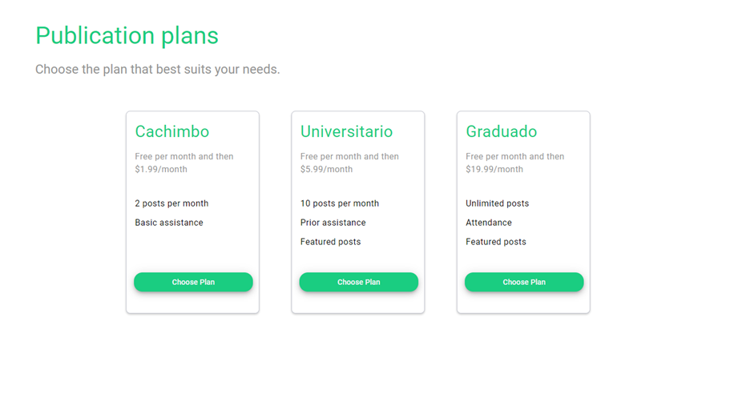

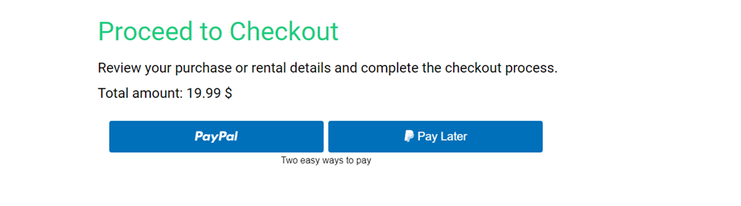

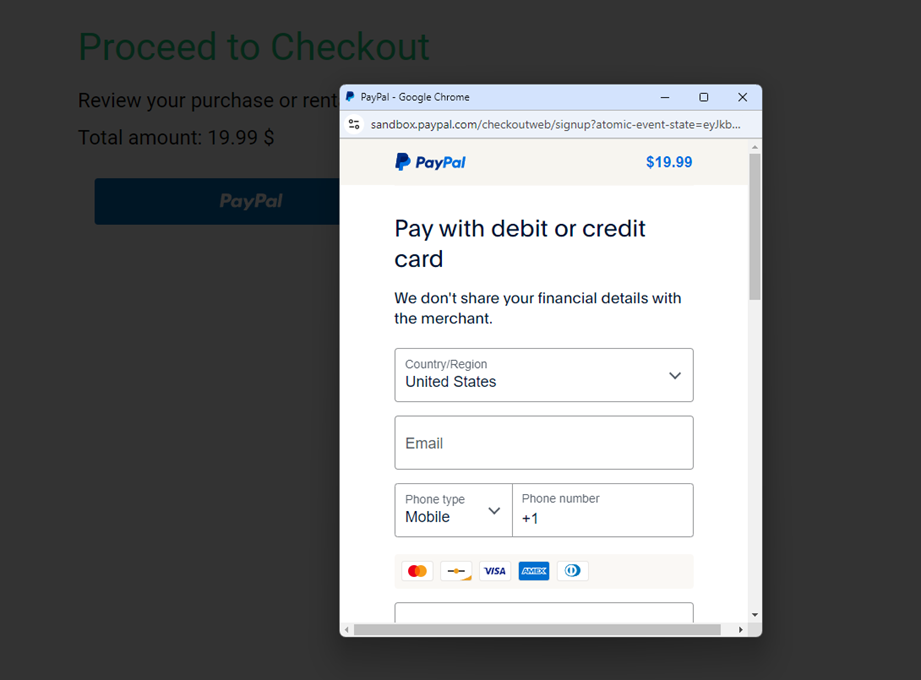

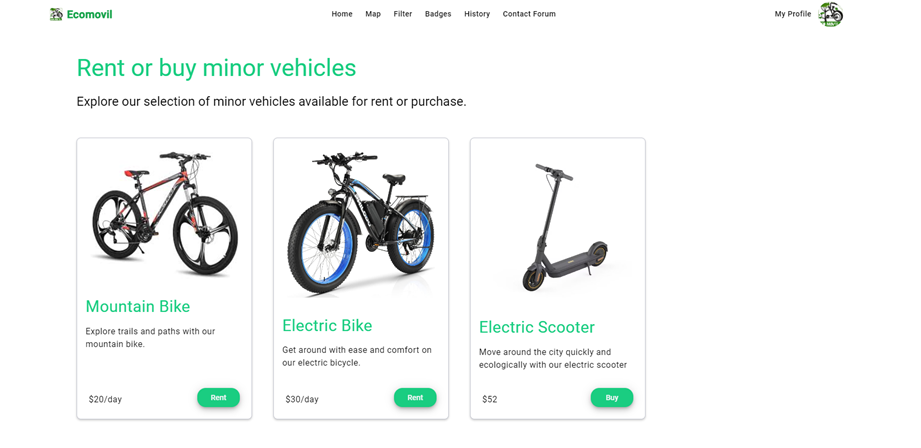

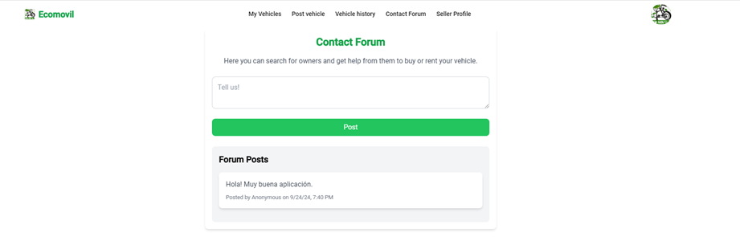

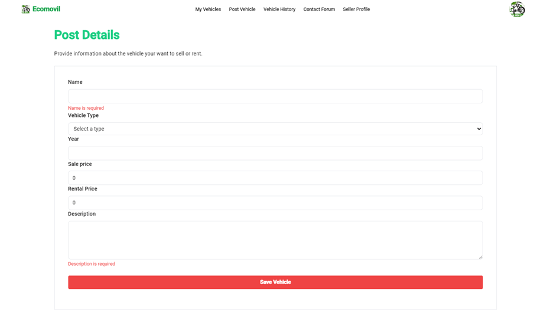

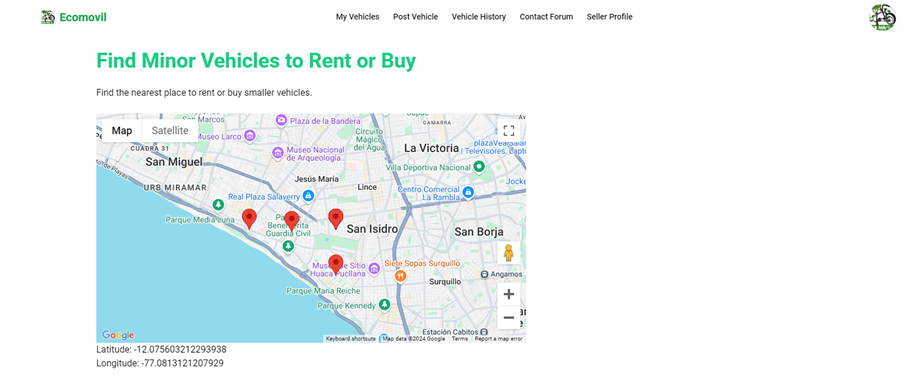

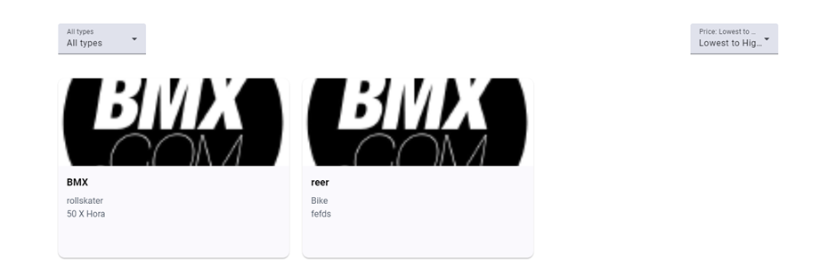

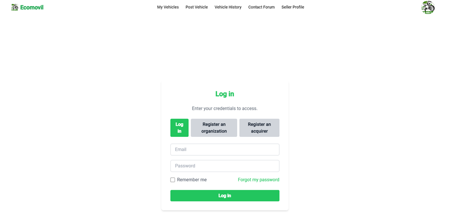

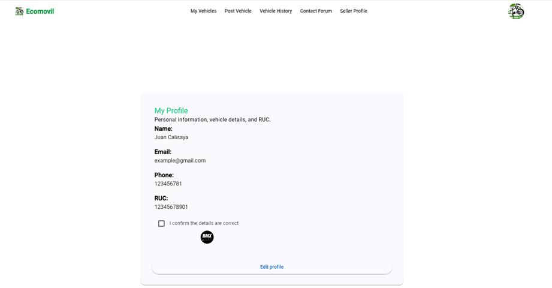

### 5.2.1.6. Services Documentation Evidence for Sprint Review

En este Sprint 2, el enfoque principal ha sido la creación del front-end de la aplicación, con todos sus componentes, servicios respectivos. Sin embargo, está previsto que se realicen mejoras en la gestión de rutas y validaciones.
### 5.2.1.7. Software Deployment Evidence for Sprint Review

En la entrega del segundo sprint, se lanzó el landing page completamente funcional, cumpliendo con los user stories correspondientes al entregable. De igual manera, se desplegó la aplicación web de manera parcial, ya que aún presenta algunos errores que serán solucionados en el próximo sprint.

**Landing Page**:  

El despliegue de la página de destino en GitHub Pages se actualizó, lo que permitió actualizar la implementación de la página de destino.

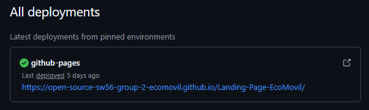 

**Capturas de pantalla de la Landing Page**:

**Web Applications**: 

Se certifica la correcta implementación del frontend de la aplicación web en Azure.

Enlace del Deployment: https://happy-tree-09edbd910.5.azurestaticapps.net/

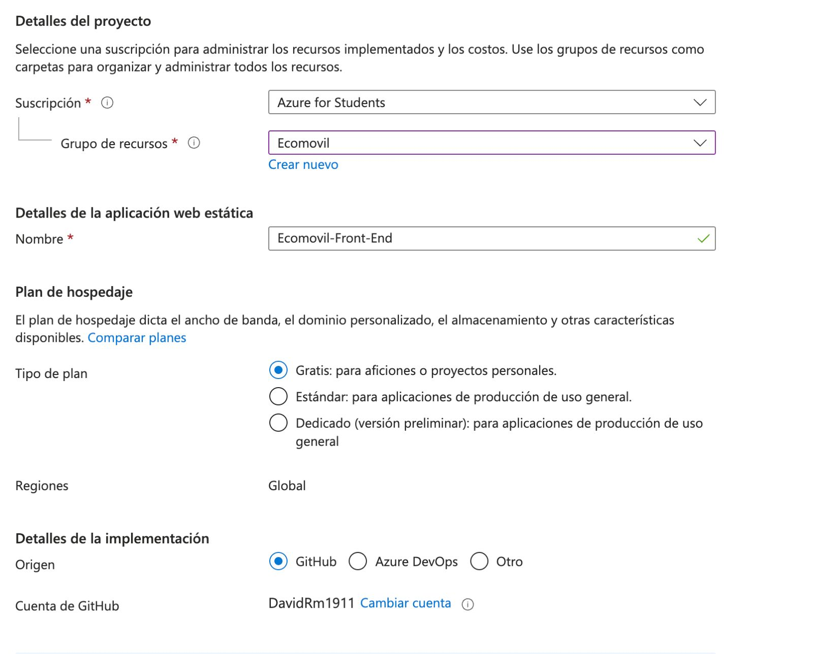

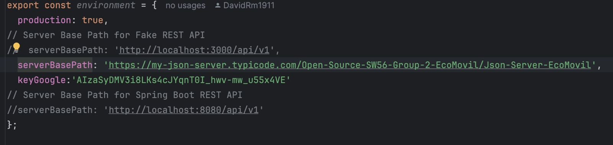

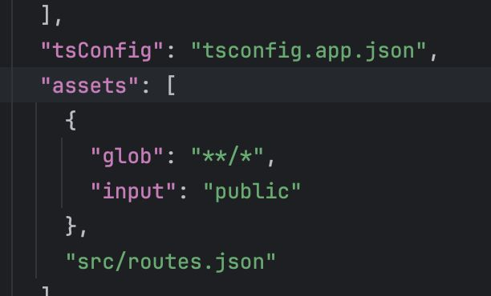

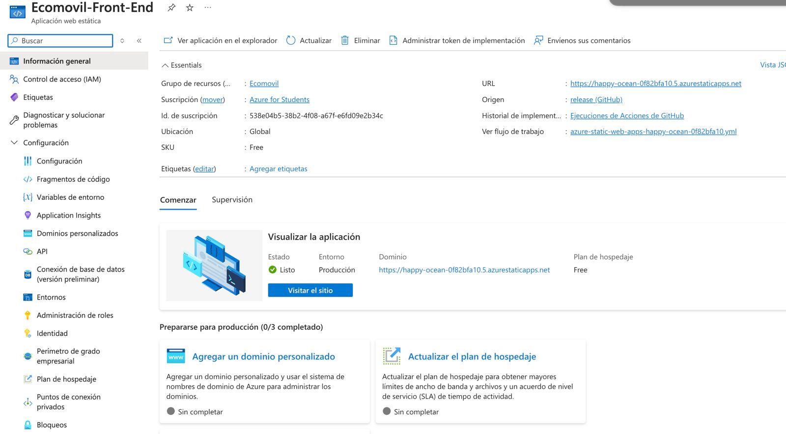

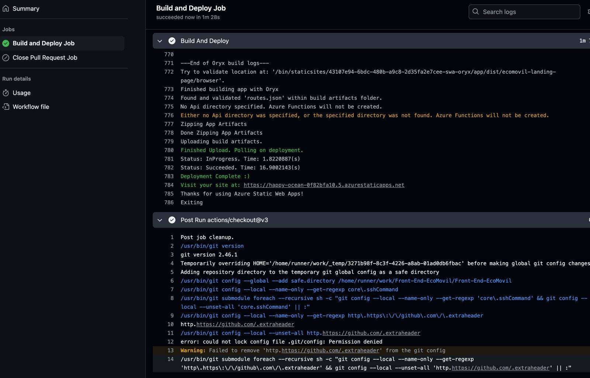

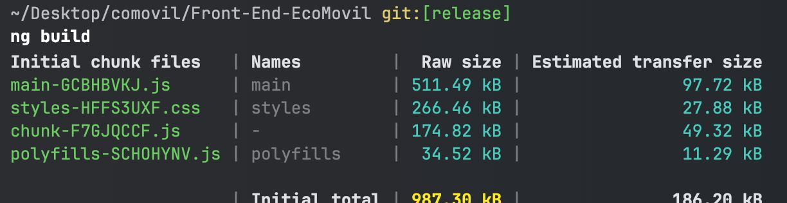

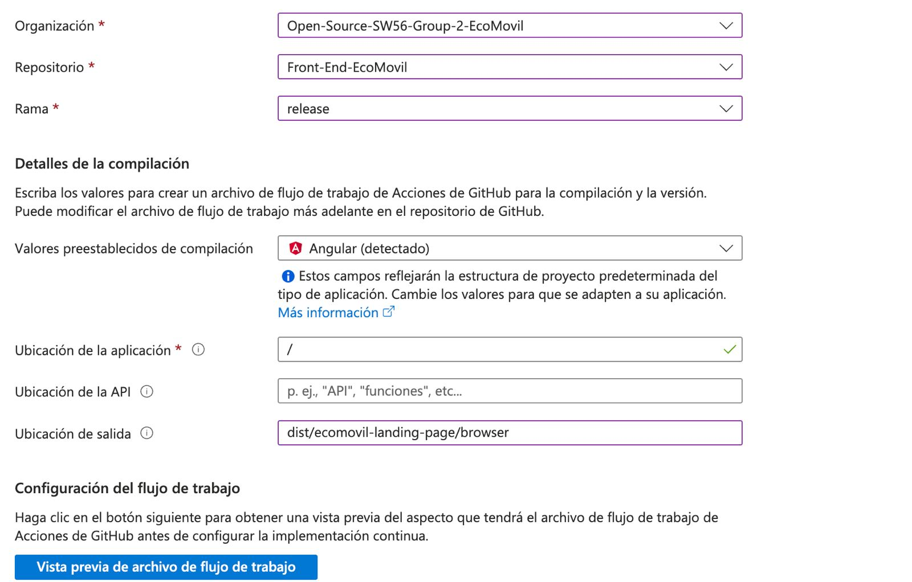

### 5.2.1.8. Team Collaboration Insights during Sprint

En esta sección, presentaremos los hallazgos de nuestro equipo para evaluar los resultados del trabajo realizado y la actividad generada.

| Alumno | Actividad | 
| ------------ | ------------------------------------------- | 
| Calisaya Sánchez, Juan Jesús | Elaborar componente profile Universitario, componente filter Adquiriente. | 
| Gallo Quintana, David Ivanoff | Elaborar componente my vehicles, componente badges, componente interactive map.  | 
| Hidalgo Lopez, Mathias Adriano | Despliegue de la aplicación. Conectar landing page con aplicación. Elaborar componente browsing history, componente contact forum. | 
| Oneglio De Paz, Beth Shantal | Elaborar componente register, componente log in. | 
| Vasquez Goicochea, Erick Alessander | Elaborar componente plans, componente checkout, componente menu. | 

Repositorio Web-Application-EcoMovil:

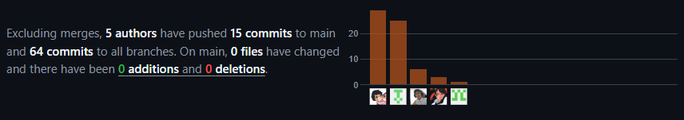 

### 5.2.3. Sprint 3 

El Sprint #3, que inicia el 17 de octubre de 2024, se centrará en el diseño del front-end de EcoMovil. El objetivo es permitir que nuestro público pueda visualizar e interactuar con la aplicación web una vez esté desplegada, siguiendo el enfoque ágil de metodologías como Scrum, donde un sprint es un período corto y definido para completar tareas clave del proyecto.

Durante este sprint, nuestro equipo completó los aspectos finales del front-end y comenzó a establecer la estructura del back-end.

### 5.2.3.1. Sprint Planning 3

<table>
     <tr> 
        <th>  Sprint #  </th>
        <th> Sprint 3 </th>
     </tr>
     <tr> 
        <td style="font-weight: bold;" colspan="7"> Sprint Planing Background</td>
     </tr>
     <tr>
       <td style="font-weight: bold;"> Date </td>
       <td>  28/09/2024 </td>
     </tr>
     <tr>
       <td style="font-weight: bold;"> Time </td>
       <td> 17:00 horas (GMT-5) </td>
     </tr>
     <tr>
       <td style="font-weight: bold;"> Location </td>
       <td> Modalidad remota a través de Discord <td>
     </tr>
      <tr>
        <td style="font-weight: bold;"> Prepared By </td>
        <td> Oneglio De Paz, Beth Shantal <td>
     </tr>
        <tr>
        <td style="font-weight: bold;"> Attendees (to planning meeting) </td>
        <td> 
             
             Calisaya Sánchez, Juan Jesús
             
             Gallo Quintana, David Ivanoff
             
            Hidalgo Lopez, Mathias Adriano
             
             Oneglio De Paz, Beth Shantal
             
            Vasquez Goicochea, Erick Alessander
        <td>
     </tr>
     <tr>
        <td style="font-weight: bold;"> Sprint 2 Review Summary </td>
        <td> Dado que este es nuestro primer sprint de desarrollo, no hay un resumen de revisión del sprint disponible. <td>
     </tr>
     <tr>
        <td style="font-weight: bold;"> Sprint 2 Retrospective Summary </td>
        <td> Dado que este es nuestro primer sprint de desarrollo, aún no hemos identificado planes de mejora.<td>
     </tr>
     <tr> 
        <td style="font-weight: bold;" colspan="7"> Sprint Goal & User Stories</td>
     </tr>
       <tr>
          <td style="font-weight: bold;"> Sprint 3 Goal</td>
          <td>  Nuestro equipo logró avances significativos en el desarrollo del front-end y en la estructuración del back-end. Se estableció una arquitectura sólida, implementando distintos bounded contexts con sus respectivos aggregate roots, así como la división adecuada entre entidades y value objects. Esta organización permite una clara separación de responsabilidades y facilita la gestión de tareas dentro del proyecto.  Se aplicó parcialmente giel patrón CQRS (Command Query Responsibility Segregation) para separar las operaciones de lectura y escritura en el sistema. <td>
      </tr>
       <tr>
          <td style="font-weight: bold;"> Sprint 3 Velocity </td>
          <td>  34  <td
      </tr>
      <tr>
          <td style="font-weight: bold;"> Sum of Story Points </td>
          <td> 34 <td>
      </tr>

  </table>
  

### 5.2.3.2. Sprint Backlog 3

En el backlog del tercer sprint, el equipo se comprometió a iniciar y completar la creación y despliegue del back-end. Para coordinar y gestionar al equipo, se utilizó Trello, una herramienta que facilitó la división de las user stories en tareas más manejables, asignándolas a los miembros según sus habilidades. El objetivo principal del sprint fue desarrollar y desplegar un front-end que fuera tanto atractivo como funcional.

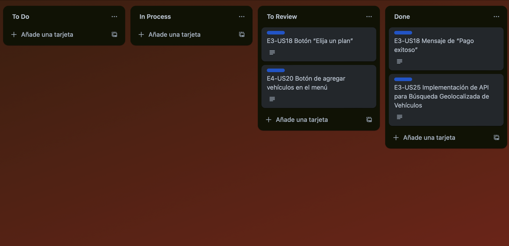

Link del Trello: https://trello.com/b/48W0tEjF/ecomovil-product-backlog-tp

<table style="width:400px; height:100px;"> 
   <tr>
      <th colspan="4"> Sprint # </th>
      <th colspan="7"> Sprint 3 </th>
   </tr>
   <tr >
     <th colspan="4"> User Story </th>
     <th colspan="7"> Work-Item /Task</th>
   </tr>
   <tr>
     <th > Id </th>
     <th colspan="3"> Title </th>
     <th> Id </th>
     <th > Title </th>
     <th> Description </th>
     <th> Estimation (Hours) </th>
     <th> Assigned To </th> 
     <th> Status (To-do / In-Process / To- Review / Done) </th>
   </tr>
      <th> US18 </th>
     <th colspan="3"> Sección Botón “Elija un plan” </th>
      <th> W05  </th>
     <th> Button "Elija un plan" Section </th>
     <th> La implementación del botón es para que los universitarios puedan comprar una suscripción y registrar sus vehículos menores para que los usuarios puedan alquilarlos. </th>
     <th> 2  </th>
     <th> Beth </th> 
     <th> Done </th>
   </tr>
   <tr>
      <th> US19</th>
     <th colspan="3"> Sección Mensaje de “Pago exitoso” </th>
      <th> W06  </th>
     <th> Message "Pago exitoso" Section </th>
     <th> Implementar el mensaje es para confirmar al usuario que su pago se realizó correctamente. </th>
     <th> 7  </th>
     <th> Erick </th> 
     <th> Done </th>
   </tr>
    </tr>
   <tr>
      <th> US20</th>
     <th colspan="3"> Implementación de API para Búsqueda Geolocalizada de Vehículos</th>
      <th> W07  </th>
     <th> Geolocation Section </th>
     <th> Implementar una API para Búsqueda Geolocalizada de Vehículos permite que los clientes puedan visualizar en qué punto están los vehículos alquilados. </th>
     <th> 5  </th>
     <th> David </th> 
     <th> Done </th>
   </tr>
    <tr>
      <th> US25 </th>
     <th colspan="3"> Implementacion de API para busqueda geolocalizada de vehículos </th>
      <th> W09  </th>
     <th> API Geolocalitation  </th>
     <th> agregar geolocalizacion para la ubicacion de los vehiculos al momento de su compra o venta  </th>
     <th> 3 </th>
     <th> Juan Calisaya </th> 
     <th> Done </th>
   </tr>
</table>

### 5.2.2.3. Development Evidence for Sprint Review

Como evidencia del sprint review, se presenta una tabla que muestra los commits realizados durante este tercer sprint. Dado que se acordó trabajar en los ajustes finales del backend de la aplicación web, se incluyen commits de varios repositorios en los que se realizaron dichas tareas.

| Repository   | Branch                                      | Commit Id | Commit Message                   | User | Commited on (Date) |
| ------------ | ------------------------------------------- | --------- | -------------------------------- | ------------------- | ------------------ |
| Back-End-Ecomovil | main       | fd74c6a         | initial commit       | Beth Oneglio | Sep 19, 2024         | 
| Back-End-Ecomovil | main       | aa5f5cc        | Delete REAME.md | Juan Calisaya | Oct 22, 2024    |
| Back-End-Ecomovil | main       | 841182a         | fchore: initial commit |Juan Calisaya| Oct 30, 2024       |
| Back-End-Ecomovil | main       | dc4a276   | feat(shared): add domain layer for shared bounded context         | Juan Calisaya| Oct 31, 2024                |
| Back-End-Ecomovil | main       | 335568a             |  feat(shared): add domain layer for shared bounded context.                   | Juan Calisaya|  Oct 31, 2024 |
| Back-End-Ecomovil | main       | adc5904              |    feat(shared): add interface layer for shared bounded context.| Juan Calisaya |      Oct 31, 2024 |
| Back-End-Ecomovil | main       | 6a3dd36  |  Merge branch 'master'     | Juan Calisaya |  Oct 31, 2024 |
| Back-End-Ecomovil | feature bounded context forum      | 7d4d26f  |   feat(forum): add forum bounded context  | Beth Oneglio |   Nov 1, 2024|
| Back-End-Ecomovil | feature bounded context forum       | c68621d  |  feat(forum): add forum bounded context  | Beth Oneglio | Nov 1, 2024|
| Back-End-Ecomovil | feature bounded context plans       | 39f6ca1  |  feat: Model| Erick Vasquez | Nov 1, 2024|
| Back-End-Ecomovil | feature bounded context plans       | ad03479  |  feat: Model| Erick Vasquez | Nov 1, 2024|
| Back-End-Ecomovil | feature bounded context plans       | e622c26  |  feat: Patron CQRS | Erick Vasquez | Nov 1, 2024|
| Back-End-Ecomovil | feature bounded context plans       | ea9d328  |  feat:add Controller and Reposiotory | Erick Vasquez | Nov 1, 2024|
| Back-End-Ecomovil | feature bounded context profile      | 6d9042d |   feat: Added profile bounded context and acquirer entity  | Mathias Hidalgo | Nov 1, 2024 |
| Back-End-Ecomovil | feature bounded context profile      | e6313ba |   feat: Added profile bounded context and acquirer entity  | Mathias Hidalgo | Nov 1, 2024 |
| Back-End-Ecomovil | feature bounded context profile      | db4d6a7 |   feat: Added profile bounded context and acquirer entity  | Mathias Hidalgo | Nov 1, 2024 |
| Back-End-Ecomovil | feature bounded context profile      | fe2a576 |   feat: Added profile bounded context and acquirer entity  | Mathias Hidalgo | Nov 1, 2024 |
| Back-End-Ecomovil | feature bounded context profile      | 50ad053 |   feat: Added profile bounded context and acquirer entity  | Mathias Hidalgo | Nov 1, 2024 |
| Back-End-Ecomovil | feature bounded context profile      | 643f56c |   feat: Added profile bounded context and acquirer entity  | Mathias Hidalgo | Nov 1, 2024 |
| Back-End-Ecomovil | feature bounded context profile      | 33692c7 |   feat: Added profile bounded context and acquirer entity  | Mathias Hidalgo | Nov 1, 2024 |
| Back-End-Ecomovil | feature bounded context profile      | bfbe237 |   feat: Added profile bounded context and acquirer entity  | Mathias Hidalgo | Nov 1, 2024 |
| Back-End-Ecomovil | feature bounded context profile      | d79a22f |   feat: Added profile bounded context and acquirer entity  | Mathias Hidalgo | Nov 1, 2024 |
| Back-End-Ecomovil | feature bounded context profile      | 6623725 |   feat: Added profile bounded context and acquirer entity  | Mathias Hidalgo | Nov 1, 2024 |
| Back-End-Ecomovil | feature bounded context profile      | d5f4961 |   feat: fixed acquirer bounded context | David Gallo | Nov 1, 2024 |
| Back-End-Ecomovil | feature bounded context vehicle      | 61c4082  |   feat(domain): add CreateVehicleCommand to handle vehicle creation commands      | Juan Calisaya|  Oct 31, 2024 |
| Back-End-Ecomovil | feature bounded context vehicle       | c8e42d9   |  feat(domain): add Vehicle entity to represent vehicle data in domain  | | Juan Calisaya |  Oct 31, 2024 |
| Back-End-Ecomovil | feature bounded context vehicle       | fbb9fb2 |   feat(application): add VehicleCommandService to process vehicle commands | Juan Calisaya|  Oct 31, 2024 |
| Back-End-Ecomovil | feature bounded context vehicle      | 5cf45ae |feat(interfaces): add VehicleController for REST endpoints | Juan Calisaya|  Oct 31, 2024 |
| Back-End-Ecomovil | feature bounded context vehicle       | a117207 | feat(application): add VehicleQueryService to handle vehicle queries | Juan Calisaya|  Oct 31, 2024 |
| Back-End-Ecomovil | feature bounded context vehicle      | 7da53dc |   feat(infrastructure): add VehicleRepository for database operations  | Juan Calisaya|  Oct 31, 2024 |
| Back-End-Ecomovil | feature bounded context vehicle     | 4ff53a1 |  ffix(vehicle): correct vehicle controller logic | Juan Calisaya|  Oct 31, 2024 |

### 5.2.3.4. Testing Suite Evidence for Sprint Review 
Para la entrega del Sprint 3, nos centramos en alcanzar un desarrollo casi completo. Por ello, la fase de "Testing" se orientó a implementar las necesidades de los usuarios, priorizando secciones que fueran intuitivas y fáciles de comprender.

| Repository                                    | Branch    | Commit Id      | Commit Message                              | Commit Message Body                   | Committed on (Date) |
|-----------------------------------------------|-----------|----------------|---------------------------------------------|---------------------------------------|----------------------|
| https://github.com/Open-Source-SW56-Group-2-EcoMovil/Acceptance-Tests | Epic/Acceptance-Tests/epic-01 | c4eef98 | chore: uploaded acceptance test for user stories | | 1/11/2024 |

### 5.2.3.5. Execution Evidence for Sprint Review 

En el sprint 3, se logró un avance parcial en el desarrollo del frontend y backend de la aplicación. Este progreso incluye nuevas vistas relevantes sobre el producto y la startup, además de su versión responsive. A continuación, se presentan algunas evidencias.

### 5.2.3.6. Services Documentation Evidence for Sprint Review 

En este Sprint 3, el enfoque principal ha sido la creación del back-end de la aplicación, con todos sus componentes, servicios respectivos.
A continuación se incluiran las imágenes de los endpoints generados durante este sprint.

### 5.2.3.7. Software Deployment Evidence for Sprint Review

Durante el presente sprint hemos logrado desplegar el back-end, usando SQLServer y Azure.

Url: https://ecomovil-back3.azurewebsites.net/swagger-ui/index.html#/

### 5.2.3.8. Team Collaboration Insights during Sprint 

En esta sección, presentaremos los hallazgos de nuestro equipo para evaluar los resultados del trabajo realizado y la actividad generada.

| Alumno | Actividad | 
| ------------ | ------------------------------------------- | 
| Calisaya Sánchez, Juan Jesús | Elaborar bounded context Vehicle | 
| Gallo Quintana, David Ivanoff | Elaborar bounded context Profile y despliegue  | 
| Hidalgo Lopez, Mathias Adriano | Elaborar bounded context Profile | 
| Oneglio De Paz, Beth Shantal | Elaborar bounded context Forum | 
| Vasquez Goicochea, Erick Alessander | Elaborar bounded context Plans | 

Repositorio Web-Application-EcoMovil:

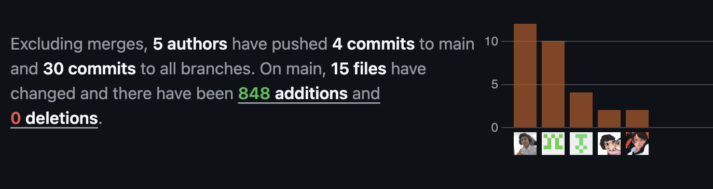 

## 5.3. Validation Interviews 

En la sección "Validation Interviews" de nuestro proyecto, el propósito es mejorar la aplicación mediante una interacción directa con nuestros usuarios principales: universitarios y adquirientes. Mediante entrevistas estructuradas, buscamos recopilar sus opiniones y sugerencias, garantizando así que la aplicación no solo cumpla con los estándares técnicos, sino que también se ajuste a las necesidades operativas y expectativas de los usuarios. A continuación, se describen los objetivos de usuario necesarios para llevar a cabo estas entrevistas.

### 5.3.1. Diseño de Entrevistas 

### Segmento Universitario

#### Preguntas Generales

- ¿Cuál es tu nombre?
- ¿Cuántos años tienes?
- ¿Dónde resides actualmente?
- ¿A qué te dedicas?

#### Preguntas para el Segmento de Propietarios

- ¿Crees que alguna función o característica necesita mejoras? ¿Qué elementos podrían optimizarse para ofrecer una mejor experiencia?
-  ¿Cómo percibes el diseño y funcionalidad de las herramientas de gestión de planes? ¿Te parecieron intuitivas y sencillas de usar?
- ¿Cómo evalúas la opción de publicar y editar tus vehículos en la plataforma? ¿Qué tan fácil o complicado te resultó?
- ¿Te gustó la experiencia de editar tu perfil y personalizarlo? ¿Consideras útiles las opciones de personalización?
- ¿Qué te pareció la facilidad para administrar tu historial de vehículos (alquileres o ventas)? ¿Crees que esta herramienta cumple tus expectativas?
- ¿La interfaz de usuario para actualizar y gestionar tus datos personales te resultó cómoda y funcional?

### Segmento Adquiriente

#### Preguntas Generales

- ¿Cuál es tu nombre?
- ¿Cuántos años tienes?
- ¿Dónde resides actualmente?
- ¿A qué te dedicas?

#### Preguntas para el Segmento de Adquirientes

- ¿Considerarías utilizar nuestra aplicación? ¿Por qué?
- ¿Qué opinas de la calidad de los vehículos y la legibilidad de la tipografía al ver la ubicación en la sección de mapa? ¿Te resultó fácil de usar o crees que se necesitan ajustes?
- ¿Piensas que la aplicación ofrece una buena variedad de vehículos detallados?
- ¿Qué te pareció la experiencia de navegación al buscar vehículos? ¿Fue fácil encontrar lo que buscabas?
- ¿Consideras que la información de los vehículos es clara y suficiente para tomar una decisión de compra o alquiler?
- ¿Qué opinas sobre las opciones de personalización de la búsqueda (por tipo de vehículo, precio)? ¿Te parecieron adecuadas?
- ¿Qué te pareció la opción de gamificación en la aplicación? ¿Consideras que incentiva el uso de la aplicación?
- ¿Crees que la aplicación cumple con tus expectativas en cuanto a la variedad y disponibilidad de vehículos sostenibles?

---

### User Goals

**User Goal:** Iniciar sesión

**User Persona:** Universitarios y Adquirientes  

**Explicación del flujo:**  
Primero, el usuario accede a la aplicación desplegada y visualiza el formulario de inicio de sesión. Aquí, ingresa su correo electrónico y contraseña, ya sea como universitario o adquiriente. Si las credenciales son correctas, el sistema valida la información y redirige al usuario a su dashboard personal.

**User Goal:** Navegar por el dashboard  

**User Persona:** Adquiriente  

**Explicación del flujo:**  
Una vez que el usuario ha iniciado sesión, es redirigido a la sección “Home”, donde puede ver una lista de publicaciones de universitarios que ofrecen vehículos en venta o renta.

**User Goal:** Encontrar vehículos menores para comprar o rentar  

**User Persona:** Adquiriente  

**Explicación del flujo:**  
Al iniciar sesión, el usuario puede acceder a la sección “Map” para visualizar un mapa con los vehículos disponibles cerca de su ubicación.

**User Goal:** Filtro de búsqueda  

**User Persona:** Adquiriente  

**Explicación del flujo:**  
El usuario puede ver los filtros de búsqueda para vehículos, ajustando criterios como el tipo y el precio (ordenados de menor a mayor). Al seleccionar una opción, se despliegan los vehículos que cumplen con los filtros aplicados.

**User Goal:** Ver detalles del vehículo  

**User Persona:** Adquiriente  

**Explicación del flujo:**  
El usuario puede seleccionar un vehículo para ver sus detalles específicos. Además, tiene la opción de iniciar un chat por WhatsApp con el propietario al hacer clic en el enlace, lo que abre WhatsApp para ponerse en contacto.

**User Goal:** Mi Perfil  

**User Persona:** Universitario y Adquiriente  

**Explicación del flujo:**  
Una vez iniciada la sesión, el usuario puede ingresar a la sección “My Profile” para ver la información de su perfil.

**User Goal:** Editar Perfil  
**User Persona:** Universitario y Adquiriente  
**Explicación del flujo:**  
En la sección “My Profile”, el usuario puede hacer clic en “Editar perfil” para acceder a una página donde puede modificar su información personal y su foto.

**User Goal:** Ver mis Planes  

**User Persona:** Universitario  

**Explicación del flujo:**  
Al iniciar sesión, el usuario es redirigido a la sección de planes, donde puede elegir entre tres opciones disponibles. Al seleccionar un plan, es redirigido a PayPal para registrar su tarjeta y completar el pago.

**User Goal:** Ver mis vehículos  

**User Persona:** Universitario  

**Explicación del flujo:**  
Tras pagar uno de los planes, el usuario puede ver los vehículos que otros universitarios han publicado. Debajo de esta lista, puede hacer clic en “Add +” para subir sus propios vehículos con la información correspondiente.

### 5.3.2. Registro de Entrevistas 

**Entrevista a Universitarios.**

Entrevista de validaciones usuarios Universitarios.

| **Entrevista 1**        | **Abel Andrés Valle Zuta**         | 
|:-------------------:|:-------------------:|
| 
Edad
  | 
19 Años
  |
| 
Distrito
  | 
Miraflores
  | 
| 
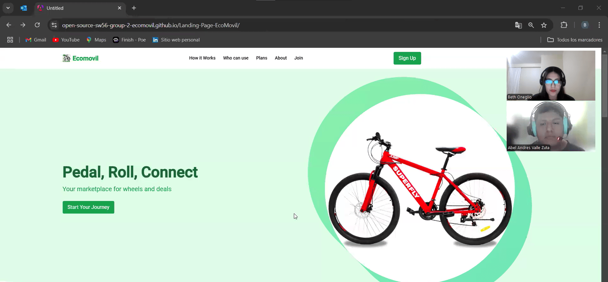
  | 
Abel Valle considera que la aplicación cumple con los requisitos sin necesidad de mejoras o funciones adicionales. En la sección de visualización de vehículos, aprecia ver los vehículos claramente y encuentra el diseño intuitivo, sin necesidad de guías para orientarse en los pasos. Sugiere agregar detalles sobre el propietario de cada vehículo publicado. Le agrada la disposición distribuida de los vehículos y percibe la interfaz como funcional y visualmente atractiva.
  | 
| 
Timing: 0:05 
  | 
URL: https://acortar.link/UZ35w3 
  | 
| **Entrevista 2**        | **Rodrigo André García Yauri**         | 
| 
Edad
  | 
21 Años
  |
| 
Distrito
  | 
Molina
  | 
| 
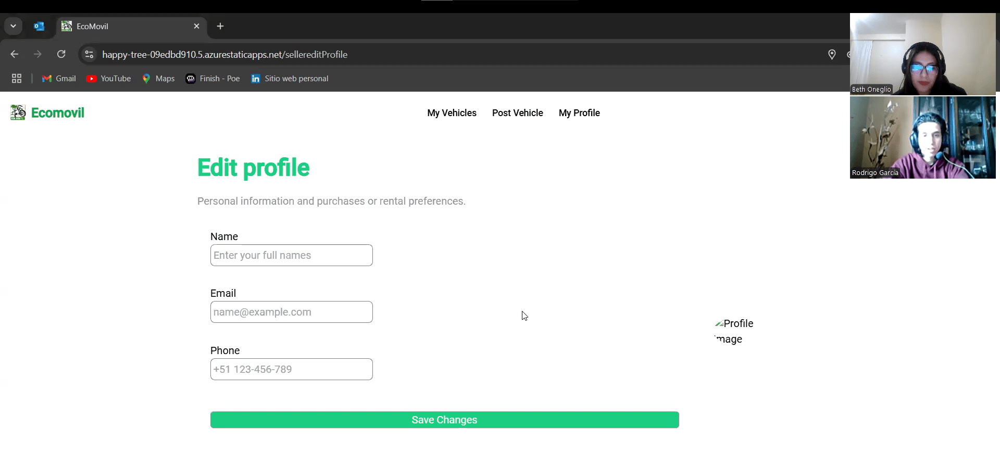
  | 
Rodrigo García ha explorado la aplicación y la encuentra completa en general. Le gustaría que el sistema de rastreo fuera más eficiente. Considera que la aplicación es muy intuitiva y aprecia los detalles de cada vehículo, lo que le brinda una experiencia más personalizada y distintiva en comparación con otras aplicaciones similares. Para él, esta personalización es clave para visualizar los vehículos publicados. También le agradó la interfaz de la aplicación.
  | 
| 
Timing: 4:19 
  | 
URL: https://acortar.link/UZ35w3
  | 
| **Entrevista 3**        | **Brissa Arakemi Hoyos Arevalo**         | 
| 
Edad
  | 
19 Años
  |
| 
Distrito
  | 
Rímac
  | 
| 
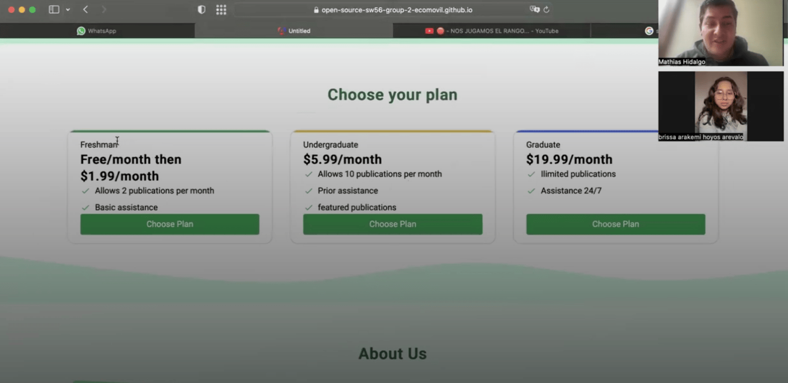
  | 
A Brissa Hoyos le gustó la página y considera que tiene una estructura muy organizada. Destaca la eficiencia y lo completa que es, ya que facilita encontrar cada sección. Le gustaría añadir una función de comunicación directa con el cliente y no eliminaría ningún elemento de la aplicación.
  | 
| 
Timing: 8:02 
  | 
URL: https://acortar.link/UZ35w3 
  | 
 
**Entrevista a Adquirientes.**

Entrevista de validaciones usuarios Adquirientes.

| **Entrevista 1** | **Camila de Jesus Perez Novoa** | 
|:---------------:|:-------------------------------:|
| 
Edad
 | 
22 Años
 |
| 
Distrito
 | 
Barcelona
 |
| 

 | 
Camila Pérez opina que la calidad de los vehículos y la tipografía son adecuadas, siendo comprensibles y bien presentadas. Encuentra que la aplicación es fácil de usar y valora la variedad de vehículos disponibles. Considera que la información sobre el alquiler o la venta es clara, pero le gustaría que se incluyeran comentarios, sugiriendo un apartado de reseñas para guiar a los usuarios.
 |
| 
Timing: 12:48 
 | 
URL: https://acortar.link/UZ35w3
 |
| **Entrevista 2** | **Paola Andrea Vasquez Goicochea** | 
| 
Edad
 | 
27 Años
 |
| 
Distrito
 | 
Independencia
 |
| 
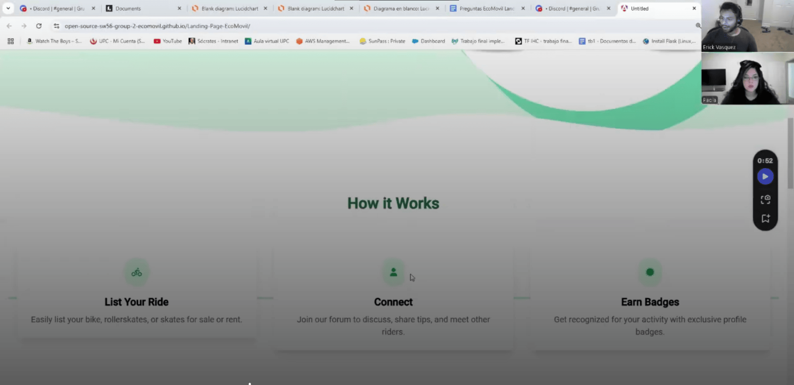
 | 
Paola Vásquez considera que la aplicación es útil y le gusta poder seleccionar vehículos según sus necesidades, promoviendo la sostenibilidad e innovando en ecología. Describe la experiencia como fácil y manejable, cumpliendo con lo esperado. También le agrada la personalización en la búsqueda, especialmente los filtros, que encuentra muy útiles para satisfacer las necesidades tanto de los usuarios como de los vehículos disponibles.
 |
| 
Timing: 19:09 
 | 
URL: https://acortar.link/UZ35w3
 |
| **Entrevista 3** | **Silvia Alexandra Flores Garcia** | 
| 
Edad
 | 
19 Años
 |
| 
Distrito
 | 
San Martín
 |
| 

 | 
Silvia Flores considera que la aplicación es muy interactiva y le agrada su diseño ecológico. Opina que la usaría, ya que le parece innovadora, especialmente por los filtros que facilitan la búsqueda de distintos modelos. Sugeriría hacer más visibles los filtros, aunque en general se entiende bien su uso. También señala que la aplicación se adapta a los distintos gustos de cada persona, con variedad en precios y modelos, lo que le parece alineado con la innovación y el enfoque ecológico.
 |
| 
Timing: 23:05 
 | 
URL: https://acortar.link/UZ35w3
 |

### 5.3.3. Evaluaciones según heurísticas 

### UX Heuristics & Principles Evaluation
### Usability – Inclusive Design – Information Architecture

**CARRERA** : Ingeniería de Software  
**CURSO** : Desarrollo de Aplicaciones Open Source  
**SECCIÓN** : SW56 

**PROFESORES** : Efraín Ricardo Bautista Ubillús  
**AUDITOR** : EcoMovil Squad  
**CLIENTE(S)** : SkillsSapInc

#### SITE o APP A EVALUAR:

EcoMovil

**Propósito:** El objetivo principal de esta evaluación es identificar problemas presentes en la aplicación EcoMovil.  

**Método:** Los descubrimientos en la aplicación se lograrán utilizando la lista de principios heurísticos elaborada por Jakob Nielsen, fundamentada en su investigación original.

#### TAREAS A EVALUAR

#### Evaluación para Landing Page y Aplicación Web

**Landing Page**

1. Se proporciona información detallada sobre la aplicación, destacando sus funcionalidades principales.
2. Se presentan los planes de pago y precios de la aplicación.
3. Incluye un header y footer adecuados, optimizados para la página de inicio.
4. La página principal permite una interacción fluida entre el usuario y la aplicación.

**Aplicación Web**

1. Ingreso a la aplicación para usuarios registrados.
2. Indicadores claros que muestran el progreso o estado de los procesos.
3. Uso de iconos consistentes y comprensibles, alineados con el entorno real.
4. Mensajes de error precisos que indican errores en el registro de datos.
5. Evaluación de patrones de diseño o navegación efectivos.
6. Interfaz de usuario con elementos coherentes y homogéneos.
7. Pestañas de navegación bien organizadas.
8. Botones interactivos, intuitivos y fáciles de utilizar.
9. Navegación fluida y orientación clara dentro de la aplicación.
10. Visualización del perfil de usuario.
11. Visualización del perfil de la organización.
12. Interfaz visualmente atractiva y agradable.

**Tareas Excluidas de la Evaluación Actual**

**Landing Page**

1. Inclusión de enlaces a redes sociales del startup.
2. Política de privacidad y condiciones de uso.

**Aplicación Web**

1. Registro para nuevos usuarios.
2. Funciones de documentación y exportación de registros.
3. Accesibilidad a través de atajos de teclado.
4. Acceso a recursos de ayuda dentro de la aplicación.
5. Inclusión de la política de privacidad y condiciones de uso.
6. Opción de cambio de idioma.

**ESCALA DE SEVERIDAD:**  
Los errores serán puntuados tomando en cuenta la siguiente escala de severidad

| Nivel | Descripción |
|-------|-------------|
| 1     | Problema superficial: puede ser fácilmente superado por el usuario o ocurre con muy poco frecuencia. No necesita ser arreglado a no ser que exista disponibilidad de tiempo. |
| 2     | Problema menor: puede ocurrir un poco más frecuentemente o es un poco más difícil de superar para el usuario. Se le debería asignar una prioridad baja para resolverlo de cara al siguiente release. |
| 3     | Problema mayor: ocurre frecuentemente o los usuarios no son capaces de resolverlos. Es importante que sean corregidos y se les debe asignar una prioridad alta. |
| 4     | Problema muy grave: un error de gran impacto que impide al usuario continuar con el uso de la herramienta. Es imperativo que sea corregido antes del lanzamiento. |

**TABLA RESUMEN:**

Desktop Landing Page

| #  | Problema                                                                                                          | Escala de severidad | Heurística/Principio violada(o)                            |
|----|-------------------------------------------------------------------------------------------------------------------|---------------------|-----------------------------------------------------------|
| 1  | Falta un video de introducción sobre el equipo, lo que podría ayudar a los usuarios a conocer mejor al equipo detrás de la aplicación y generar confianza. | 2                   | Usability: Coincidencia entre el sistema y el mundo real   |
| 2  | Hay un apóstrofe incorrecto en una palabra de la Landing Page, lo que afecta la profesionalidad y la claridad del mensaje. | 2                   | Usability: Diseño estético y minimalista                   |
| 3  | Falta la internacionalización (i18n) en la plataforma, lo que limita la accesibilidad para usuarios de diferentes idiomas. | 1                   | Usability: Flexibilidad y eficiencia de uso               |
| 4  | El texto en el botón “Regístrate” carece de tilde, lo cual afecta la consistencia y la corrección gramatical en la interfaz. | 2                   | Usability: Estética y diseño minimalista                  |
| 5  | Hay un botón innecesario que no aporta funcionalidad adicional, lo que contribuye al desorden visual y dificulta la navegación. | 2                   | Usability: Diseño estético y minimalista                  |

#### DESCRIPCIÓN DE PROBLEMAS:

**PROBLEMA #1**: Falta un video de introducción sobre el equipo, lo que podría ayudar a los usuarios a conocer mejor al equipo detrás de la aplicación y generar confianza.

- **Severidad**: 2
- **Heurística violada**: Usability: Coincidencia entre el sistema y el mundo real

#### Problema:
Actualmente, la aplicación carece de un video de introducción que presente al equipo detrás de la aplicación. Esto limita la posibilidad de que los usuarios conozcan mejor a quienes desarrollan el producto, afectando su percepción de confianza y conexión.

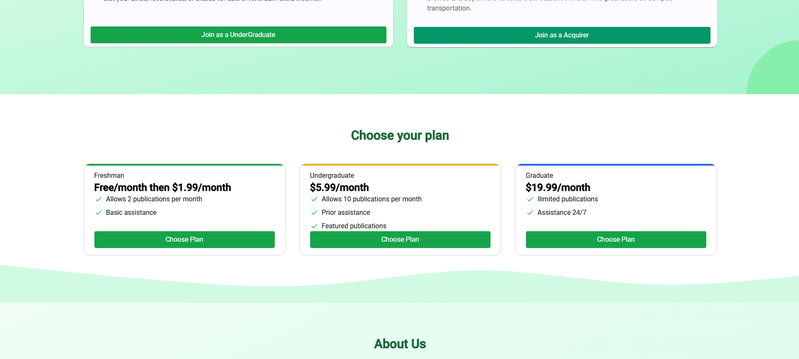

#### Recomendación:
Incluir un video breve en la página "Acerca de nosotros" donde el equipo se presente y explique su misión y valores en relación con la aplicación. Esto permitirá a los usuarios sentirse más conectados y confiados en el servicio ofrecido, al ver quiénes están detrás y cómo comparten sus intereses o preocupaciones.

**PROBLEMA #2**: Hay un apóstrofe incorrecto en una palabra de la Landing Page, lo que afecta la profesionalidad y la claridad del mensaje.

- **Severidad**: 2
- **Heurística violada**: Usabilidad - Diseño estético y minimalista

#### Problema:
En la Landing Page, se ha utilizado un apóstrofe incorrecto en una palabra, lo que puede dar una impresión negativa al usuario al percibirse como un error de redacción. Esto afecta la claridad del mensaje y reduce la percepción de profesionalidad de la página, pudiendo generar desconfianza en algunos usuarios.

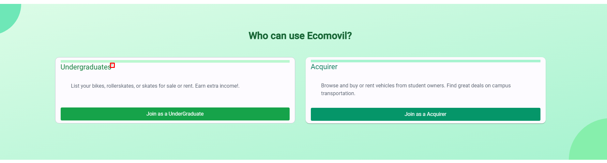

#### Recomendación:
Revisar cuidadosamente el texto de la Landing Page y corregir el apóstrofe incorrecto. Es recomendable hacer una revisión ortográfica completa para evitar errores similares en el futuro y asegurar que el contenido sea claro, profesional y de fácil lectura para los usuarios.

**PROBLEMA #3**: Falta la internacionalización (i18n) en la aplicación, lo que limita la accesibilidad para usuarios de diferentes idiomas.

- **Severidad**: 1
- **Heurística violada**: Usabilidad - Flexibilidad y eficiencia de uso

#### Problema:
La aplicación actualmente solo está disponible en un idioma, lo que dificulta el acceso para usuarios que no hablan ese idioma. Esto limita la usabilidad y accesibilidad del sitio, restringiendo su alcance y la posibilidad de atraer a un público más amplio de diferentes países o regiones. La falta de soporte multilingüe puede generar frustración en los usuarios que no comprenden el idioma principal de la plataforma.

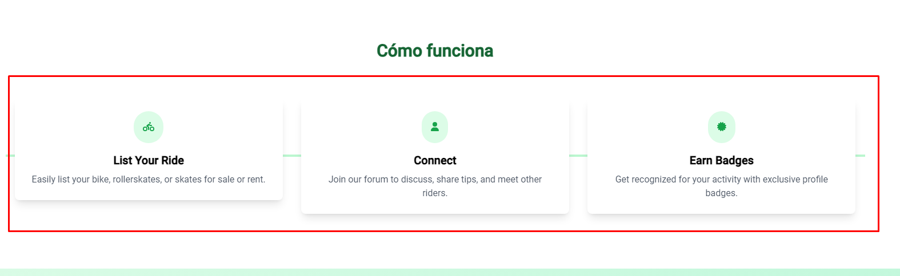

#### Recomendación:
Implementar un sistema de internacionalización (i18n) en la aplicación que permita seleccionar el idioma preferido del usuario. Esto incluiría traducciones precisas de todos los textos de la interfaz, botones y mensajes, asegurando una experiencia de usuario coherente en cada idioma. También se recomienda agregar una opción visible de cambio de idioma en el menú principal o en la cabecera para mejorar la accesibilidad y facilitar el uso de la aplicación para usuarios de diferentes regiones.

**PROBLEMA #4**: El texto en el botón “Regístrate” carece de tilde, lo cual afecta la consistencia y la corrección gramatical en la interfaz.

- **Severidad**: 2
- **Heurística violada**: Usability: Estética y diseño minimalista

#### Problema:
El botón de registro en la interfaz muestra la palabra "Regístrate" sin tilde, apareciendo como "Registrate". Esto representa un error ortográfico que puede afectar la percepción de profesionalidad y cuidado en los detalles de la aplicación. Los errores gramaticales en la interfaz pueden reducir la confianza del usuario en la aplicación, al parecer descuidada o poco profesional.

#### Recomendación:
Corregir el texto del botón para incluir la tilde en “Regístrate”. Además, es recomendable hacer una revisión completa de la ortografía y gramática en toda la interfaz para garantizar la consistencia y corrección en todos los elementos de texto. Esto contribuirá a una mejor experiencia de usuario y a una percepción más profesional de la plataforma.

**PROBLEMA #5**: Hay un botón innecesario que no aporta funcionalidad adicional, lo que contribuye al desorden visual y dificulta la navegación.

- **Severidad**: 2
- **Heurística violada**: Usability: Diseño estético y minimalista 

#### Problema:
La interfaz contiene un botón que no ofrece ninguna funcionalidad adicional ni necesaria para el flujo de usuario. Este botón innecesario crea desorden visual, distrae al usuario y complica la navegación, ya que añade elementos superfluos en la interfaz. La presencia de componentes sin función específica rompe con el principio de minimalismo en el diseño, afectando la claridad y la eficiencia de uso.

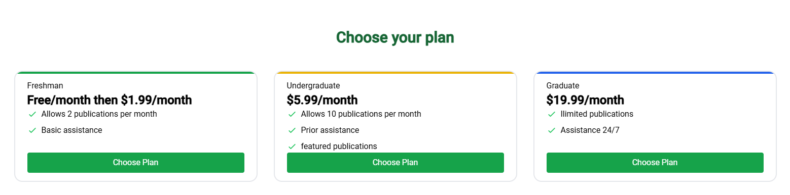

#### Recomendación:
Eliminar el botón innecesario para simplificar la interfaz y mejorar la experiencia de usuario. Revisar la aplicación para identificar otros posibles elementos redundantes o superfluos y mantener únicamente aquellos componentes que aporten valor o funcionalidad clara al usuario. Esto ayudará a lograr un diseño más limpio y fácil de navegar.

Web Application

| #  | Problema                                                                                                               | Escala de severidad | Heurística/Principio violada(o)                           |
|----|------------------------------------------------------------------------------------------------------------------------|---------------------|----------------------------------------------------------|
| 1  | Los botones de "Log In" están demasiado próximos, lo que dificulta su uso correcto                                     | 2                   | Usability - Consistencia y estándares                    |
| 2  | El mapa no se ajusta adecuadamente en dispositivos móviles o pantallas pequeñas                                        | 2                   | Usability - Estética y diseño minimalista                |
| 3  | Los botones de "Rent" y "Buy" carecen de funcionalidad                                                                 | 1                   | Usability - Flexibilidad y eficiencia de uso             |
| 4  | La función de clic para acceder al alquiler o compra de un vehículo específico no está activa                          | 2                   | Usability - Control y Libertad del usuario               |

**PROBLEMA #1**: Los botones de "Log In" están demasiado próximos, lo que dificulta su uso correcto.

- **Severidad**: 2
- **Heurística violada**: Usability - Consistencia y estándares

#### Problema:
La proximidad entre los botones de "Log In" en la interfaz puede llevar a errores al usarlos, dificultando que el usuario seleccione el botón correcto con facilidad. Esta falta de espacio adecuado entre los elementos afecta la usabilidad al no seguir los estándares de diseño consistentes que faciliten la interacción.

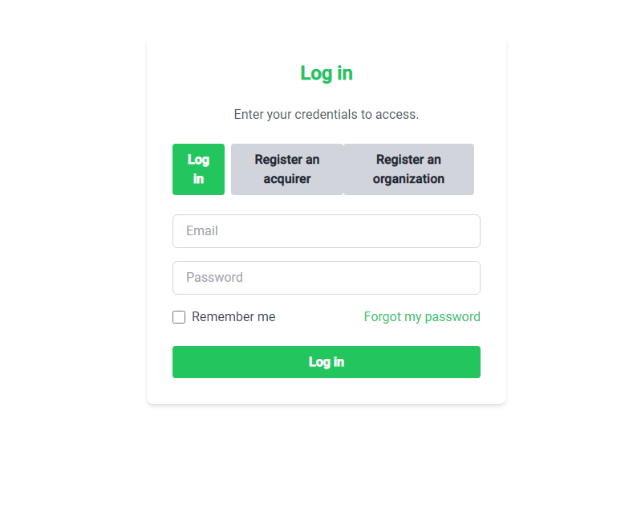

#### Recomendación:
Aumentar la separación entre los botones de "Log In" para reducir la posibilidad de errores de clic y mejorar la precisión en la interacción. Mantener una distancia adecuada entre los elementos interactivos siguiendo las pautas de diseño de usabilidad para mejorar la experiencia del usuario.

**PROBLEMA #2**: El mapa no se ajusta adecuadamente en dispositivos móviles o pantallas pequeñas.

- **Severidad**: 2
- **Heurística violada**: Usability - Estética y diseño minimalista

#### Problema:
La interfaz del mapa no es responsiva, lo que genera problemas de visualización en dispositivos móviles y pantallas pequeñas. Este problema afecta la accesibilidad y estética del diseño, ya que los usuarios no pueden visualizar ni interactuar con el mapa de forma eficiente en diferentes tamaños de pantalla.

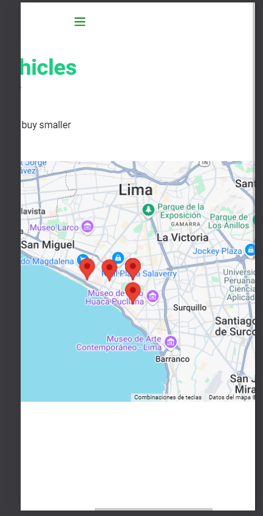

#### Recomendación:
Optimizar el diseño del mapa para que se adapte correctamente a pantallas de diferentes tamaños, especialmente en dispositivos móviles. Implementar un diseño responsivo y minimalista que mantenga la funcionalidad del mapa sin comprometer la claridad visual.

**PROBLEMA #3**: Los botones de "Rent" y "Buy" carecen de funcionalidad.

- **Severidad**: 1
- **Heurística violada**: Usability - Flexibilidad y eficiencia de uso

#### Problema:
Los botones de "Rent" y "Buy" en la interfaz no están habilitados o no realizan ninguna acción al ser seleccionados, lo que afecta la eficiencia de uso y genera confusión en el usuario, al no cumplir con las expectativas de navegación y funcionalidad en la aplicación.

#### Recomendación:
Activar la funcionalidad de los botones de "Rent" y "Buy" para que cumplan con el propósito esperado y mejoren la experiencia de usuario. Asegurarse de que todos los botones en la interfaz tengan una función clara y accesible.

**PROBLEMA #4**: La función de clic para acceder al alquiler o compra de un vehículo específico no está activa.

- **Severidad**: 2
- **Heurística violada**: Usability - Control y Libertad del usuario

#### Problema:
Al intentar hacer clic para acceder a la información de alquiler o compra de un vehículo específico, el enlace o botón no responde, limitando el control y la libertad del usuario para explorar opciones. Esto genera frustración al no poder navegar fluidamente en la plataforma.

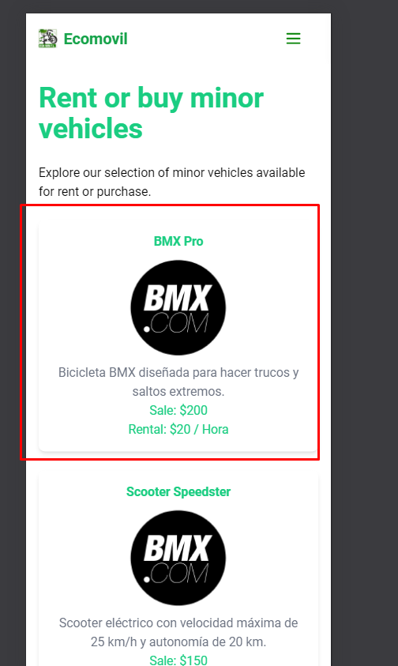

#### Recomendación:
Activar la función de clic para acceder a la información de alquiler o compra de cada vehículo. Verificar que todos los enlaces y botones críticos estén operativos para facilitar la navegación y otorgar al usuario el control necesario para explorar opciones.

### 5.4. Video About-the-Product

A continuación, se muestra el video "Video About-the-Product", que destaca el propósito, las ventajas y las características clave de la aplicación. 

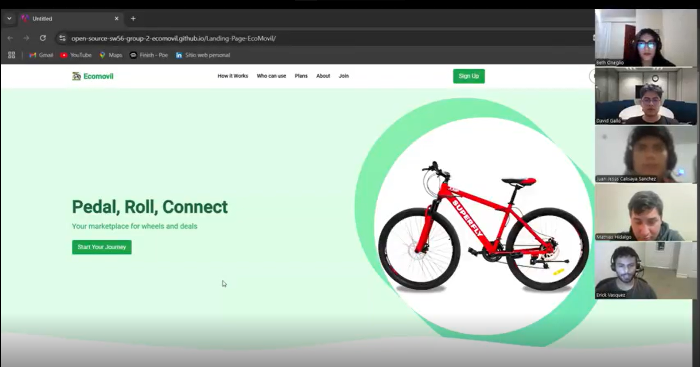

Enlace del video publicado en YouTube: https://www.youtube.com/watch?v=Na3BHmdkkm0

Enlace del video publicado en Stream: https://upcedupe-my.sharepoint.com/:v:/g/personal/u202213423_upc_edu_pe/ET7rrgNghS5NoT7rOt1_kJABDnptt1hQNpeiDSNtXfs94g?nav=eyJyZWZlcnJhbEluZm8iOnsicmVmZXJyYWxBcHAiOiJTdHJlYW1XZWJBcHAiLCJyZWZlcnJhbFZpZXciOiJTaGFyZURpYWxvZy1MaW5rIiwicmVmZXJyYWxBcHBQbGF0Zm9ybSI6IldlYiIsInJlZmVycmFsTW9kZSI6InZpZXcifX0%3D&e=DW0IbK 

### Video About-the-Team

A continuación, se muestra el video "Video About-the-Team".

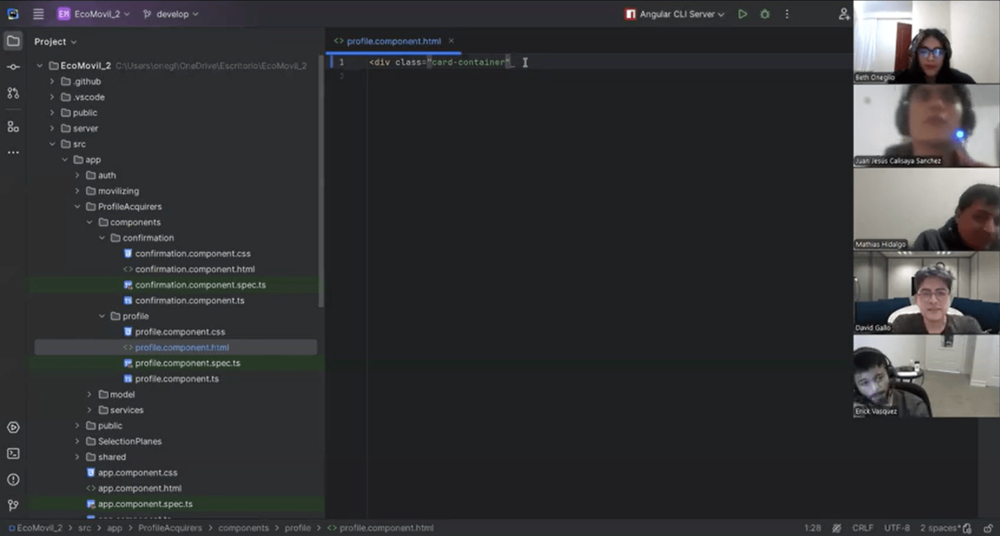

Enlace del video publicado en YouTube: https://www.youtube.com/watch?v=e4aK1I1ep-I&t=12s

Enlace del video publicado en Stream: https://upcedupe-my.sharepoint.com/:v:/g/personal/u202213423_upc_edu_pe/EaIZ4jlhC2ZPjlgMQEVjyxgB48UarlQYY9jbDfdZrAXf2w?nav=eyJyZWZlcnJhbEluZm8iOnsicmVmZXJyYWxBcHAiOiJTdHJlYW1XZWJBcHAiLCJyZWZlcnJhbFZpZXciOiJTaGFyZURpYWxvZy1MaW5rIiwicmVmZXJyYWxBcHBQbGF0Zm9ybSI6IldlYiIsInJlZmVycmFsTW9kZSI6InZpZXcifX0%3D&e=eM9pdc

# Conclusiones

Las tareas asignadas para la entrega TB1 han sido completadas y están documentadas en el repositorio de GitHub de la organización del equipo. Durante la elaboración del informe, se redactaron y graficaron los contenidos en formato Markdown, se realizaron commits para monitorear el progreso, se generaron los artefactos necesarios según las herramientas del proyecto, y se organizaron reuniones para asignar tareas y coordinar el avance del informe.

Las tareas asignadas para la entrega del TP1 incluyeron la implementación y validación del producto utilizando un enfoque ágil, dividido en sprints manejables que facilitaron una rápida iteración e integración continua de retroalimentación. La gestión de la configuración del software garantizó un entorno de desarrollo optimizado y bien gestionado, mientras que la página de inicio, los servicios y las aplicaciones se implementaron de manera eficiente y organizada, con cada sprint planificado y ejecutado de forma transparente. Durante el desarrollo de la aplicación web, aplicamos la arquitectura de DDD (Domain-Driven Design), identificando y modelando los dominios de negocio y estableciendo límites claros entre ellos para asegurar una adecuada separación de responsabilidades. Esta metodología permitió crear un sistema más robusto y flexible, facilitando tanto el mantenimiento como la evolución del software.

Recomendaciones para optimizar el proceso:

- Establecer metas claras para cada miembro del equipo y asegurar que comprendan los objetivos del Sprint.
- Mantener una documentación precisa y actualizada en el repositorio para una fácil referencia.
- Programar revisiones periódicas para evaluar y ajustar el progreso del informe.
- Fomentar una comunicación constante y abierta dentro del equipo para resolver problemas rápidamente.

Estas recomendaciones contribuirán a un proceso más eficiente y a la entrega de un informe de alta calidad.

Las tareas asignadas para el TB2 incluyeron mejoras en la aplicación, validaciones de usuario y revisiones críticas. También se organizó la diagramación en función del "Backend" propuesto por el equipo para desarrollar una actividad más avanzada de acuerdo con la entrega. Se implementaron configuraciones eficientes que favorecieron una buena dinámica y un mayor entendimiento del proyecto. Los sprints del tercer ciclo se organizaron y ejecutaron de manera eficiente, lo que contribuyó a un mejor dominio del negocio.

# Bibliografía

Restrepo, M. E., & Carvajal, J. A. (2021). La calidad de vida en el contexto de la resiliencia en el servicio de salud integral. Revista Latinoamericana de Sistemas e Informática, 19(1), 152-163. http://www.scielo.org.co/pdf/rlsi/v19n1/1794-4449-rlsi-19-01-152.pdf

Blog de la Universidad de San Ignacio de Loyola. (2021). Créditos educativos: Una alternativa para poner fin a la deserción universitaria. Recuperado de https://blogs.usil.edu.pe/novedades/creditos-educativos-una-alternativa-para-poner-fin-la-desercion-universitaria#:~:text=Según%20el%20Ministerio%20de%20Educación,2019%20a%2023.2%20%%20en%202021

Angular. (n.d.). Routing overview. Recuperado de https://v17.angular.io/guide/routing-overview

FontAwesome. (n.d.). FontAwesome documentation. Recuperado de https://docs.fontawesome.com/

Tailwind CSS. (n.d.). Tailwind CSS documentation. Recuperado de https://v2.tailwindcss.com/docs

# Anexos

| Sección                                      | Enlace                                                                                                                                                                                                                           |
|----------------------------------------------|-----------------------------------------------------------------------------------------------------------------------------------------------------------------------------------------------------------------------------------|
| **Product Backlog TB1**                      | [Trello - Product Backlog TB1](https://trello.com/invite/b/661b0a12e3392a7cd56479b3/ATTIe08b35a362a9b35b5e0152e660a454e79586C6AA/ecomovil-product-backlog-tb1)                                                                  |
| **Organización en GitHub**                   | [Repositorio GitHub - Open Source SW56 Group](https://github.com/orgs/Open-Source-SW56-Group-2-EcoMovil/repositories)                                                                                                           |
| **Landing Page de EcoMovil**                 | [Página de Inicio de EcoMovil](https://open-source-sw56-group-2-ecomovil.github.io/Landing-Page-EcoMovil/)                                                                                                                       |
| **Product Backlog TP1**                      | [Trello - Product Backlog TP1](https://trello.com/b/48W0tEjF/ecomovil-product-backlog-tp)                                                                                                                                         |
| **Lean UX Canvas**                           | [Lean UX Canvas - EcoMovil](https://www.canva.com/design/DAGOEXan6rE/pJTlXgHJBmfhVfeAe3pFgA/editutm_content=DAGOEXan6rE&utm_campaign=designshare&utm_medium=link2&utm_source=sharebutton)                                     |
| **Entrevistas de Usuario**                   | [Link a Entrevistas](https://acortar.link/uMdFvk)                                                                                                                                                                                 |
| **To-Be Mapping**                            | [Mapa de Procesos - EcoMovil](https://miro.com/welcomeonboard/ZmlsbFNLbkZuM3Q1NlBVd3ZqcUMzZWFsbGxKaFZRUGJmWjJBUWo0VnlOQUVROThlc0t5SzZEcVh0SWdYWjVJVXwzMDc0NDU3MzQ5NjI2ODA0NjMyfDI=?share_link_id=116933273053)                    |
| **General Style Guidelines**                 | [Guía de Estilo General - EcoMovil](https://www.figma.com/design/GnGrty8UpoDQsPbgKYdQ7E/EcoMovil?node-id=0-1&t=MRGVDtnKEXSGH8Cy-1)                                                                                               |
| **Landing Page Wireframe**                   | [Wireframe de la Landing Page](https://github.com/orgs/Open-Source-SW56-Group-2-EcoMovil/repositories)                                                                                                                           |
| **Landing Page Mock-up**                     | [Mock-up de la Landing Page](https://github.com/orgs/Open-Source-SW56-Group-2-EcoMovil/repositories)                                                                                                                             |
| **Web Applications UX/UI Design**            | [Diseño UX/UI - Mock-ups](https://www.figma.com/design/WATKX4mlDctquazhZwgUB9/Mock-ups?node-id=0-1&t=XIYVHrHcrTEoUWbN-1)                                                                                                        |
| **Landing Page Deployment**                  | [Despliegue de la Landing Page](https://open-source-sw56-group-2-ecomovil.github.io/Landing-Page-EcoMovil/)                                                                                                                      |
| **Video del Product Backlog TB1**            | [Video de Introducción al TB1](https://upcedupe-my.sharepoint.com/:v:/g/personal/u202213423_upc_edu_pe/EesqdEsTMD1OojOu3R3mNcYBIm0dqUSJWg66hAF8Db7ZHw?nav=eyJyZWZlcnJhbEluZm8iOnsicmVmZXJyYWxBcHAiOiJTdHJlYW1XZWJBcHAiLCJyZWZlcnJhbFZpZXciOiJTaGFyZURpYWxvZy1MaW5rIiwicmVmZXJyYWxBcHBQbGF0Zm9ybSI6IldlYiIsInJlZmVycmFsTW9kZSI6InZpZXcifX0%3D&e=OEWvCF)                                                                                                    |
| **Video del Product Backlog TP1**            | [Video de Introducción al TP1](https://upcedupe-my.sharepoint.com/:v:/g/personal/u202213222_upc_edu_pe/Ecdct2y6JdJKi09iLeeWPAsBk0XPFIV3uJCPXULBShtLyw?nav=eyJyZWZlcnJhbEluZm8iOnsicmVmZXJyYWxBcHAiOiJPbmVEcml2ZUZvckJ1c2luZXNzIiwicmVmZXJyYWxBcHBQbGF0Zm9ybSI6IldlYiIsInJlZmVycmFsTW9kZSI6InZpZXciLCJyZWZlcnJhbFZpZXciOiJNeUZpbGVzTGlua0NvcHkifX0&e=a7Tt5K)                                   |
| **My JSON Server**                           | [Servidor JSON - EcoMovil](https://my-json-server.typicode.com/Open-Source-SW56-Group-2-EcoMovil/Json-Server-EcoMovil)                                                                                                          |
| **Conexión del Landing Page con el Front-end** | [Landing Page y Front-end](https://open-source-sw56-group-2-ecomovil.github.io/Landing-Page-EcoMovil/)                                                                                                                           |
| **Video About the Product**                  | https://www.youtube.com/watch?v=Na3BHmdkkm0                                                                                                                                                                                                                   |
| **Video About the Team**                     |  https://www.youtube.com/watch?v=e4aK1I1ep-I                                                                                                                                                                                                                  |
| **Deployment Back-End**                     |  https://ecomovil-back3.azurewebsites.net/swagger-ui/index.html#/                                                                                                                                                                                                                 |
