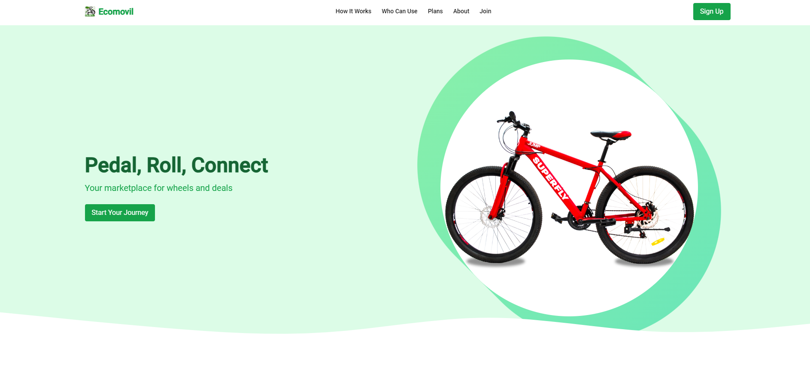
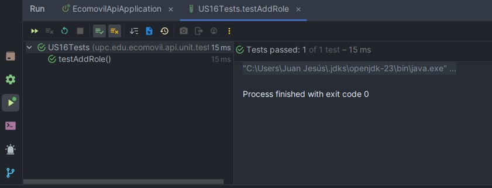

    <strong>Universidad Peruana de Ciencias Aplicadas</strong>     
    </img> 
    <strong>Ingeniería de Software</strong> 
     <strong>Desarrollo de Aplicaciones Open Source - SW56</strong> 
     <strong>Docente: Efraín Ricardo Bautista Ubillús</strong>  

    <strong>Startup: EcoMovil Squad</strong> 
     <strong>Producto: EcoMovil</strong> 

    <h3 align="center">Team Members:</h3>

    <table align="center">
        <tr>
            <th style="text-align:center;">Nombre</th>
            <th style="text-align:center;">Código</th>
        </tr>
        <tr>
            <td style="text-align:center;">Calisaya Sánchez, Juan Jesús</td>
            <td style="text-align:center;">U202121935</td>
        </tr>
        <tr>
            <td style="text-align:center;">Gallo Quintana, David Ivanoff</td>
            <td style="text-align:center;">U20201e475</td>
        </tr>
        <tr>
            <td style="text-align:center;">Hidalgo Lopez, Mathias Adriano</td>
            <td style="text-align:center;">U202213222</td>
        </tr>
        <tr>
            <td style="text-align:center;">Oneglio De Paz, Beth Shantal</td>
            <td style="text-align:center;">U202213423</td>
        </tr>
        <tr>
            <td style="text-align:center;">Vasquez Goicochea, Erick Alessander</td>
            <td style="text-align:center;">U202019871</td>
        </tr>
    </table>
    

</body>

 <strong>2024-02</strong>

 

# Registro de Versiones del Informe

| **Versión** | **Fecha** | **Autor** | **Descripción de Modificación** |
|-------------|-----------|-----------|---------------------------------|
| 1.0         | 15/08/2024| Calisaya, Gallo, Hidalgo, Oneglio, Vasquez | Creación del documento de trabajo en formato Markdown. |
| 1.1         | 18/08/2024| Calisaya, Gallo, Hidalgo, Oneglio, Vasquez | Desarrollo del perfil de la startup y de la solución, identificación de segmentos objetivo y formulación de preguntas para el diseño de entrevistas. |
| 1.2         | 26/08/2024| Calisaya, Gallo, Hidalgo, Oneglio, Vasquez | Redacción de las guías de estilo e infraestructura de la información. |
| 1.3         | 31/08/2024| Calisaya, Gallo, Hidalgo, Oneglio, Vasquez | Realización y registro de entrevistas con los segmentos objetivo y análisis de los resultados. Creación del Impact Mapping. Redacción de las guías de estilo y la arquitectura de la información. |
| 1.4         | 05/09/2024| Calisaya, Gallo, Hidalgo, Oneglio, Vasquez | Elaboración de historias de usuario y del backlog del producto. |
| 1.5         | 05/09/2024| Calisaya, Gallo, Hidalgo, Oneglio, Vasquez | Creación del diagrama de base de datos, diagrama de clases, diccionario de clases, diagramas de contenedores, diagramas de contexto y diagramas de componentes. |
| 1.6         | 05/09/2024| Calisaya, Gallo, Hidalgo, Oneglio, Vasquez | Registro de las evidencias del Sprint. |
| 1.7         | 24/09/2024         | Calisaya, Gallo, Hidalgo, Oneglio, Vásquez | Redacción de la gestión de configuración del software. |
| 1.8         | 23/09/2024         | Calisaya, Gallo, Hidalgo, Oneglio, Vásquez | Redacción de los aspectos de colaboración. |
| 1.9         | 24/09/2024         | Calisaya, Gallo, Hidalgo, Oneglio, Vásquez | Descripción y criterios de aceptación. |
| 1.10        | 24/09/2024         | Calisaya, Gallo, Hidalgo, Oneglio, Vásquez | Repriorización del backlog y evaluación del sprint. |
| 1.11        | 24/09/2024         | Calisaya, Gallo, Hidalgo, Oneglio, Vásquez | Redacción de la documentación de evidencias para la revisión del sprint.|
| 1.12        | 24/09/2024         | Calisaya, Gallo, Hidalgo, Oneglio, Vásquez | Redacción de la documentación de evidencias para la revisión del sprint.|
| 2.1        | 30/10/2024         | Oneglio    | Desarrollo del foro y backend. Validación y diseño de entrevistas. Registro de entrevistas. Evaluaciones basadas en heurísticas. |
| 2.2        | 1/11/2024         | Vásquez   | Planificación del Sprint 3. Desarrollo del backend de pagos. Creación del diagrama de pagos. Registro de entrevistas. |
| 2.3        | 1/11/2024         | Calisaya    | Desarrollo del backend de vehículos. Bounded context de vehículos. Evidencia de testing y ejecución para la revisión del Sprint. |
| 2.4        | 1/11/2024         | Gallo   | Desarrollo del backend de perfil. Límite de contexto de autorización. Documentación de servicios. Evidencia de despliegue de software y revisión del Sprint. Información sobre colaboración en equipo durante el Sprint. |
| 2.5        | 1/11/2024         | Hidalgo | Desarrollo del backend de perfil. Límite de contexto de perfil. Sprint Backlog 3. Evidencia de desarrollo para la revisión del Sprint. |
| 2.6        | 12/11/2024         | Oneglio | Correciones del TB2. |
| 2.7        | 14/11/2024         | Oneglio | Revisión y mejoras en el video sobre el equipo y el producto. |
| 3.1        | 15/11/2024         | Calisaya | Aplicación de mejora continua y ajustes en el diagrama de base de datos. |
| 3.2        | 17/11/2024         | Oneglio | Redacción de la documentación. |
| 3.3        | 12/11/2024         | Oneglio | Avance en las conclusiones. |
| 3.4        | 17/11/2024         | Oneglio | Continuación de la mejora continua y redacción de la documentación. |
| 4.1        | 17/11/2024         | Hidalgo | Planificación del Sprint 4 y creación del Sprint Backlog 4. |
| 4.2        | 17/11/2024         | Oneglio | Subir los enlaces correspondientes en los anexos. |

# Project Report Collaboration Insights

URL del repositorio para el Project Report en la organización de GitHub del equipo: https://github.com/Open-Source-SW56-Group-2-EcoMovil/Final-Project-Documentation-Report

**TB1**

Para la elaboración del informe correspondiente a la entrega TB1, la implementación de las secciones se distribuyó entre los miembros del equipo de la siguiente manera:

| **Integrante** | **Tareas Asignadas**                                                                                                                                                                                                                                                                                                                            | 
|-----------|-------------------------------------------------------------------------------------------------------------------------------------------------------------------------------------------------------------------------------------------------------------------------------------------------------------------------------------------------|
| Calisaya Sánchez, Juan Jesús    | Startup Profile. Solution Profile. Lean UX Problem Statements. Lean UX Assumptions. Entrevista. Impact Mapping, Product Backlog. Web Applications Mock-ups, Web Applications User Flow Diagrams, Web Applications Prototyping. Landing Page. Software Development Environment Configuration, Source Code Management.                            | 
| Gallo Quintana, David Ivanoff    | User Personas. User Task Matrix. User Journey Mapping. Entrevista. C4 Components, Containers. Landing Page. Domain-Driven Software Architecture. Source Code Management.                                                                                                                                                                                                                                    | 
| Hidalgo Lopez, Mathias Adriano    | Entrevistas. Diseño de entrevistas. Análisis de entrevistas. User Sotries. To-Be Mapping. Database Design. Database Diagram. Development Evidence for Sprint Review. Testing Suite Evidence for Sprint Review. Execution Evidence for Sprint Review.                                                                                                                                                                                                                                                                                    | 
| Oneglio De Paz, Beth Shantal   | Lean UX Hypothesis Statements. Lean UX Canvas. Segmentos objetivo. Competidores. Análisis competitivo. Entrevista. Landing Page. Web Applications Wireframes, Web Applications Wireflow Diagrams, Services Documentation Evidence for Sprint Review, Software Deployment Evidence for Sprint Review, Team Collaboration Insights during Sprint. | 
| Vasquez Goicochea, Erick Alessander   | Empathy Mapping. As-is Scenario Mapping. Ubiquitous Language. Entrevista. Labeling Systems. Seo Tag & Meta Tag. Searching System. Class Diagram. Landing Page. Sprint 1.                                                                                                                                                                                 | 

**TP1**

Para la elaboración del informe correspondiente a la entrega TP, la implementación de las secciones se distribuyó entre los miembros del equipo de la siguiente manera:

| **Integrante** | **Tareas Asignadas**                                                                                                                                                                                                                                                                                                                            | 
|-----------|-------------------------------------------------------------------------------------------------------------------------------------------------------------------------------------------------------------------------------------------------------------------------------------------------------------------------------------------------|
| Calisaya Sánchez, Juan Jesús    |Testing Suite Evidence for Sprint Review. Front-end "My profile Universitario", "Filter Adquiriente".                 | 
| Gallo Quintana, David Ivanoff    | Development Evidence for Sprint Review. Front-end "My vehicles Universitario", "Badges Universitario". Front-end "Interactive map Adquiriente", "Badges Adquiriente".                                                                                                                                                                                                                                    | 
| Hidalgo Lopez, Mathias Adriano    | Sprint 2. Front-end "Browsing history Universitario", "Contact Forum Universitario". Front-end "Browsing history Adquiriente", "Contact Forum Adquiriente".                                                                                                                                                                                                                                                                                    | 
| Oneglio De Paz, Beth Shantal   | Corrección del TB1. Software Deployment Evidence for Sprint Review. Conclusiones. Front-end "Register an organization Universitario", "Log in Universitario". Front-end "Register Adquiriente", "Log in Adquiriente". | 
| Vasquez Goicochea, Erick Alessander   | Services Documentation Evidence for Sprint Review. Front-end "Plans Universitario", "Checkout Universitario", "Menu Adquiriente", "Profile Adquiriente".                                                                                                                                                                                | 

**TB2**

| **Integrante** | **Tareas Asignadas** |
|-------------|------------|
| Calisaya Sánchez, Juan Jesús    | - Desarrollo del backend de vehículos.   - Límite de contexto (bounded context) de vehículos.   - Evidencia de testing y ejecución para la revisión del Sprint. |
| Gallo Quintana, David Ivanoff   | - Desarrollo del backend de perfil.   - Límite de contexto de autorización.   - Documentación de servicios.   - Evidencia de despliegue de software y revisión del Sprint.   - Información sobre colaboración en equipo durante el Sprint. |
| Hidalgo Lopez, Mathias Adriano | - Desarrollo del backend de perfil.   - Límite de contexto de perfil.   - Sprint Backlog 3.   - Evidencia de desarrollo para la revisión del Sprint. |
| Oneglio De Paz, Beth Shantal    | - Desarrollo del foro y backend.   - Validación y diseño de entrevistas.   - Registro de entrevistas.   - Evaluaciones basadas en heurísticas. |
| Vasquez Goicochea, Erick Alessander   | - Planificación del Sprint 3.   - Desarrollo del backend de pagos.   - Creación del diagrama de pagos.   - Registro de entrevistas. |

**TF**

| **Integrante**                        | **Tareas Asignadas**                                           |
|---------------------------------------|---------------------------------------------------------------|
| Calisaya Sánchez, Juan Jesús         | - Realizar pruebas, elaborar informe y crear diapositivas.     |
| Gallo Quintana, David Ivanoff        | - Finalizar el Backend, añadir nuevos endpoints.              |
| Hidalgo Lopez, Mathias Adriano       | - Implementar soporte para i18n y hacer el Frontend responsive.|
| Oneglio De Paz, Beth Shantal         | - Corregir el TB2, realizar pruebas, elaborar informe, crear diapositivas y editar los videos. |
| Vasquez Goicochea, Erick Alessander  | - Conectar el Frontend con el Backend.                        |

La colaboración en el informe se llevó a cabo mediante commits frecuentes en el repositorio de la organización EcoMovil Squad.

**GitHub Collaboration Insights**

GitHub también muestra un historial de las ramas principales y los procesos de fusión realizados. Todas las ramas se crearon siguiendo el diseño de GitFlow para asegurar una adecuada organización al utilizar un sistema de control de versiones.

Los miembros del equipo son:

- Calisaya Sánchez, Juan Jesús (JuanCali999)
- Gallo Quintana, David Ivanoff (DavidRm1911)
- Hidalgo Lopez, Mathias Adriano (mathiasadriano)
- Oneglio De Paz, Beth Shantal (bethnlg)
- Vasquez Goicochea, Erick Alessander (erick580)

Se describen las ramas más destacadas de la siguiente manera:

- **main**: Representada en negro. Es la rama principal del proyecto y se actualiza con cada entregable.
- **develop**: Representada en azul. Es la rama principal para el proceso de desarrollo del proyecto.
- **feature-product-design**: Representada en verde. Incluye el contenido de flujos de usuario y wireframes.
- **feature-sprint1**: Representada en amarillo. Contiene los artefactos relacionados con el sprint 1 en el informe.

Los gráficos siguientes muestran los análisis de commits en el repositorio del informe, incluyendo la cantidad de líneas de texto añadidas por cada miembro del equipo.

**TB1**

**TP1**

**TB2**

**TF**

# Contenido
## Tabla de contenidos
### [Registro de versiones del informe](#registro-de-versiones-del-informe)
### [Project Report Collaboration Insights](#project-report-collaboration-insights)
### [Student Outcome](#student-outcome)
## [Capítulo I: Introducción](#capítulo-i-introducción)
- [1.1. Startup Profile](#11-startup-profile)
    - [1.1.1. Descripción de la Startup](#111-descripción-de-la-startup)
    - [1.1.2. Perfiles de integrantes del equipo](#112-perfiles-de-integrantes-del-equipo)
- [1.2. Solution Profile](#12-solution-profile)
    - [1.2.1 Antecedentes y problemática](#121-antecedentes-y-problemática)
    - [1.2.2 Lean UX Process](#122-lean-ux-process)
        - [1.2.2.1. Lean UX Problem Statements](#1221-lean-ux-problem-statements)
        - [1.2.2.2. Lean UX Assumptions](#1222-lean-ux-assumptions)
        - [1.2.2.3. Lean UX Hypothesis Statements](#1223-lean-ux-hypothesis-statements)
        - [1.2.2.4. Lean UX Canvas](#1224-lean-ux-canvas)
- [1.3. Segmentos objetivo](#13-segmentos-objetivo)

## [Capítulo II: Requirements Elicitation & Analysis](#capítulo-ii-requirements-elicitation--analysis)
- [2.1. Competidores](#21-competidores)
    - [2.1.1. Análisis competitivo](#211-análisis-competitivo)
    - [2.1.2. Estrategias y tácticas frente a competidores](#212-estrategias-y-tácticas-frente-a-competidores)
- [2.2. Entrevistas](#22-entrevistas)
    - [2.2.1. Diseño de entrevistas](#221-diseño-de-entrevistas)
    - [2.2.2. Registro de entrevistas](#222-registro-de-entrevistas)
    - [2.2.3. Análisis de entrevistas](#223-análisis-de-entrevistas)
- [2.3. Needfinding](#23-needfinding)
    - [2.3.1. User Personas](#231-user-personas)
    - [2.3.2. User Task Matrix](#232-user-task-matrix)
    - [2.3.3. User Journey Mapping](#233-user-journey-mapping)
    - [2.3.4. Empathy Mapping](#234-empathy-mapping)
    - [2.3.5. As-is Scenario Mapping](#235-as-is-scenario-mapping)
- [2.4. Ubiquitous Language](#24-ubiquitous-language)

  ## [Capítulo III: Requirements Specification](#capítulo-iii-requirements-specification)
- [3.1. To-Be Scenario Mapping](#31-to-be-scenario-mapping)
- [3.2. User Stories](#32-user-stories)
- [3.3. Impact Mapping](#33-impact-mapping)
- [3.4. Product Backlog](#34-product-backlog)

## [Capítulo IV: Product Design](#capítulo-iv-product-design)
- [4.1. Style Guidelines](#41-style-guidelines)
    - [4.1.1. General Style Guidelines](#411-general-style-guidelines)
    - [4.1.2. Web Style Guidelines](#412-web-style-guidelines)
- [4.2. Information Architecture](#42-information-architecture)
    - [4.2.1. Organization Systems](#421-organization-systems)
    - [4.2.2. Labeling Systems](#422-labeling-systems)
    - [4.2.3. SEO Tags and Meta Tags](#423-seo-tags-and-meta-tags)
    - [4.2.4. Searching Systems](#424-searching-systems)
    - [4.2.5. Navigation Systems](#425-navigation-systems)
- [4.3. Landing Page UI Design](#43-landing-page-ui-design)
    - [4.3.1. Landing Page Wireframe](#431-landing-page-wireframe)
    - [4.3.2. Landing Page Mock-up](#432-landing-page-mock-up)
- [4.4. Web Applications UX/UI Design](#44-web-applications-uxui-design)
    - [4.4.1. Web Applications Wireframes](#441-web-applications-wireframes)
    - [4.4.2. Web Applications Wireflow Diagrams](#442-web-applications-wireflow-diagrams)
    - [4.4.3. Web Applications Mock-ups](#443-web-applications-mock-ups)
    - [4.4.4. Web Applications User Flow Diagrams](#444-web-applications-user-flow-diagrams)
- [4.5. Web Applications Prototyping](#45-web-applications-prototyping)
- [4.6. Domain-Driven Software Architecture](#46-domain-driven-software-architecture)
    - [4.6.1. Software Architecture Context Diagram](#461-software-architecture-context-diagram)
    - [4.6.2. Software Architecture Container Diagrams](#462-software-architecture-container-diagrams)
    - [4.6.3. Software Architecture Components Diagrams](#463-software-architecture-components-diagrams)
- [4.7. Software Object-Oriented Design](#47-software-object-oriented-design)
    - [4.7.1. Class Diagrams](#471-class-diagrams)
    - [4.7.2. Class Dictionary](#472-class-dictionary)
- [4.8. Database Design](#48-database-design)
    - [4.8.1. Database Diagram](#481-database-diagram)

## [Capítulo V: Product Implementation, Validation & Deployment](#capítulo-v-product-implementation-validation--deployment)
- [5.1. Software Configuration Management](#51-software-configuration-management)
    - [5.1.1. Software Development Environment Configuration](#511-software-development-environment-configuration)
    - [5.1.2. Source Code Management](#512-source-code-management)
    - [5.1.3. Source Code Style Guide & Conventions](#513-source-code-style-guide--conventions)
    - [5.1.4. Software Deployment Configuration](#514-software-deployment-configuration)
- [5.2. Landing Page, Services & Applications Implementation](#52-landing-page-services--applications-implementation)
    - [5.2.1. Sprint 1](#521-sprint-1)
        - [5.2.1.1. Sprint Planning 1](#5211-sprint-planning-1)
        - [5.2.1.2. Sprint Backlog 1](#5212-sprint-backlog-1)
        - [5.2.1.3. Development Evidence for Sprint Review](#5213-development-evidence-for-sprint-review)
        - [5.2.1.4. Testing Suite Evidence for Sprint Review](#5214-testing-suite-evidence-for-sprint-review)
        - [5.2.1.5. Execution Evidence for Sprint Review](#5215-execution-evidence-for-sprint-review)
        - [5.2.1.6. Services Documentation Evidence for Sprint Review](#5216-services-documentation-evidence-for-sprint-review)
        - [5.2.1.7. Software Deployment Evidence for Sprint Review](#5217-software-deployment-evidence-for-sprint-review)
        - [5.2.1.8. Team Collaboration Insights during Sprint](#5218-team-collaboration-insights-during-sprint)
    - [5.2.2. Sprint 2](#522-sprint-2)
        - [5.2.2.1. Sprint Planning 2](#5221-sprint-planning-2)
        - [5.2.2.2. Sprint Backlog 2](#5222-sprint-backlog-2)
        - [5.2.2.3. Development Evidence for Sprint Review](#5223-development-evidence-for-sprint-review)
        - [5.2.2.4. Testing Suite Evidence for Sprint Review](#5224-testing-suite-evidence-for-sprint-review)
        - [5.2.2.5. Execution Evidence for Sprint Review](#5225-execution-evidence-for-sprint-review)
        - [5.2.2.6. Services Documentation Evidence for Sprint Review](#5226-services-documentation-evidence-for-sprint-review)
        - [5.2.2.7. Software Deployment Evidence for Sprint Review](#5227-software-deployment-evidence-for-sprint-review)
        - [5.2.2.8. Team Collaboration Insights during Sprint](#5228-team-collaboration-insights-during-sprint)
    - [5.2.3. Sprint 3](#523-sprint-3)
        - [5.2.3.1. Sprint Planning 3](#5231-sprint-planning-3)
        - [5.2.3.2. Sprint Backlog 3](#5232-sprint-backlog-3)
        - [5.2.3.3. Development Evidence for Sprint Review](#5233-development-evidence-for-sprint-review)
        - [5.2.3.4. Testing Suite Evidence for Sprint Review](#5234-testing-suite-evidence-for-sprint-review)
        - [5.2.3.5. Execution Evidence for Sprint Review](#5235-execution-evidence-for-sprint-review)
        - [5.2.3.6. Services Documentation Evidence for Sprint Review](#5236-services-documentation-evidence-for-sprint-review)
        - [5.2.3.7. Software Deployment Evidence for Sprint Review](#5237-software-deployment-evidence-for-sprint-review)
        - [5.2.3.8. Team Collaboration Insights during Sprint](#5238-team-collaboration-insights-during-sprint)
    - [5.2.4. Sprint 4](#524-sprint-4)
    - [5.2.4.1. Sprint Planning 3](#5241-sprint-planning-4)
    - [5.2.4.2. Sprint Backlog 3](#5242-sprint-backlog-4)
    - [5.2.4.3. Development Evidence for Sprint Review](#5243-development-evidence-for-sprint-review)
    - [5.2.4.4. Testing Suite Evidence for Sprint Review](#5244-testing-suite-evidence-for-sprint-review)
    - [5.2.4.5. Execution Evidence for Sprint Review](#5245-execution-evidence-for-sprint-review)
    - [5.2.4.6. Services Documentation Evidence for Sprint Review](#5246-services-documentation-evidence-for-sprint-review)
    - [5.2.4.7. Software Deployment Evidence for Sprint Review](#5247-software-deployment-evidence-for-sprint-review)
    - [5.2.4.8. Team Collaboration Insights during Sprint](#5248-team-collaboration-insights-during-sprint)

- [5.3. Validation Interviews](#53-validation-interviews)
    - [5.3.1. Diseño de entrevistas](#531-diseño-de-entrevistas)
    - [5.3.2. Registro de entrevistas](#532-registro-de-entrevistas)
    - [5.3.3. Evaluación según heurísticas](#532-evaluación-según-heurísticas)

- [5.4. Video About the Product](#54-video-about-the-product)

## [Conclusiones](#conclusiones)
- [Video About the Team](#video-about-the-team)

## [Bibliografía](#bibliografía)
## [Anexos](#anexos)

--- 

# Student Outcome
| Criterio específico | Acciones realizadas                                                                                                                                                                                                                                                                                                                                                                                                                                                                                                                                                                                                                                                                                                                                                                                                                                                                                                                                                                                                                                                                                                                                                                                                                                                                                                                                                                                                                                                                                                                                                                                                                                                                                                                                                                                                                                                                                                                                                                                                                                                                                                                                                                                                                                                                                                                                                                                                                                                                                                                                                                                                                                                                                                                                                                                                                                                                                                                                                                                                                                                                                                                                                                                                                                                                                                                                                                                                                                                                                                                                                                                                                                                                                                                                                                                                                                                                                                                                                                                                                                                                                                                                                                                                                                                                                                                                              | Conclusiones                                                                                                                                                                                                                                                                                                                                                                                                    |
|----|------------------------------------------------------------------------------------------------------------------------------------------------------------------------------------------------------------------------------------------------------------------------------------------------------------------------------------------------------------------------------------------------------------------------------------------------------------------------------------------------------------------------------------------------------------------------------------------------------------------------------------------------------------------------------------------------------------------------------------------------------------------------------------------------------------------------------------------------------------------------------------------------------------------------------------------------------------------------------------------------------------------------------------------------------------------------------------------------------------------------------------------------------------------------------------------------------------------------------------------------------------------------------------------------------------------------------------------------------------------------------------------------------------------------------------------------------------------------------------------------------------------------------------------------------------------------------------------------------------------------------------------------------------------------------------------------------------------------------------------------------------------------------------------------------------------------------------------------------------------------------------------------------------------------------------------------------------------------------------------------------------------------------------------------------------------------------------------------------------------------------------------------------------------------------------------------------------------------------------------------------------------------------------------------------------------------------------------------------------------------------------------------------------------------------------------------------------------------------------------------------------------------------------------------------------------------------------------------------------------------------------------------------------------------------------------------------------------------------------------------------------------------------------------------------------------------------------------------------------------------------------------------------------------------------------------------------------------------------------------------------------------------------------------------------------------------------------------------------------------------------------------------------------------------------------------------------------------------------------------------------------------------------------------------------------------------------------------------------------------------------------------------------------------------------------------------------------------------------------------------------------------------------------------------------------------------------------------------------------------------------------------------------------------------------------------------------------------------------------------------------------------------------------------------------------------------------------------------------------------------------------------------------------------------------------------------------------------------------------------------------------------------------------------------------------------------------------------------------------------------------------------------------------------------------------------------------------------------------------------------------------------------------------------------------------------------------------------------------------------|-----------------------------------------------------------------------------------------------------------------------------------------------------------------------------------------------------------------------------------------------------------------------------------------------------------------------------------------------------------------------------------------------------------------|
| Comunica oralmente con efectividad a diferentes rangos de audiencia. | **Calisaya Sánchez, Juan Jesús**  TB1  Para esta entrega, elaboré la descripción de la Startup, incluyendo el Solution Profile, antecedentes y problemática. El proceso Lean UX Process, que abarca los Lean UX Problem Statements y Lean UX Hypotheses, me ayudó a definir claramente los desafíos y validar nuestras hipótesis. Además, el Impact Mapping y el Product Backlog fueron cruciales para priorizar las tareas y establecer una hoja de ruta clara para el desarrollo del proyecto. Finalmente, realicé una Interview y su análisis, lo que me permitió ajustar nuestro enfoque según las necesidades y expectativas de los usuarios. Con esta información, desarrollé los Web Applications Mock-ups, los User Flow Diagrams y el Prototyping, lo que facilitó una visualización más precisa del producto final y mejoró la experiencia de diseño. También configuré el Software Development Environment y gestioné el Source Code, lo que garantizó una base sólida para el desarrollo y la colaboración del equipo.  TP1 En la revisión del sprint, se presentaron los resultados del testing suite para "Mi Perfil Universitario" y "Filtrar Adquiriente". Se validaron las funcionalidades de edición y visualización de datos en "Mi Perfil Universitario", asegurando que los cambios se reflejan correctamente. En "Filtrar Adquiriente", se evaluó la efectividad de los filtros, facilitando a los usuarios la búsqueda de perfiles deseados. Estos resultados demuestran nuestro compromiso con la calidad y la satisfacción del usuario.  TB2 Me aseguro de comunicarme de manera clara y efectiva con diferentes niveles de audiencia. Durante el desarrollo del backend de vehículos y la definición del límite de contexto, adapto mi mensaje para que tanto los miembros técnicos como los no técnicos entiendan el progreso y la funcionalidad. En las revisiones de Sprint, presento las evidencias de pruebas y ejecución de una forma accesible para que todos tengan una visión clara del estado del proyecto.  TF1 He realizado varias pruebas en el sistema para asegurarme de que todo funcione correctamente. Esto incluye pruebas de rendimiento, seguridad y compatibilidad. Los resultados me han permitido garantizar que el sistema está listo para su uso y no presenta fallos.  **Gallo Quintana, David Ivanoff**  TB1  He desarrollado distintas partes del proyecto, incluyendo la elaboración de User Personas, User Task Matrix, User Journey Mapping. Ademas de esto apoye en la realización de entrevistas en este caso hacia el segmento rentador. Finalmente participe en la elaboración del landing page, tanto en sus wireframes, mock-ups, asi como en su despliegue.  TP1 En esta revisión, se validaron las funcionalidades de "Mis Vehículos" e "Insignias" para Universitarios, y "Mapa Interactivo" e "Insignias" para Adquirientes. "Mis Vehículos" permite gestionar vehículos eficientemente, mientras que "Insignias" muestra los logros de los usuarios. El "Mapa Interactivo" ofrece una experiencia intuitiva. Estas funcionalidades están operativas y listas para su implementación.  TB2 Durante el desarrolo del backen del perfil de los estudiantes me esfuerzo en comunicar cada avance y detalle de forma clara y comprensiva a mi grupo de trabajo. En relacion con el Sprint 3,desarrolle lo de colaboration del equipo.  TF1 He finalizado la implementación del Backend y he añadido nuevos endpoints necesarios para que el sistema se comunique con el Frontend. Además, me aseguré de que la arquitectura sea eficiente y escalable para que el sistema pueda crecer sin problemas.   **Hidalgo Lopez, Mathias Adriano**  TB1 Para esta entrega, diseñé las preguntas que hicimos a nuestros segmentos objetivos con el fin de recoger información para implementar posteriormente esas ideas y aspectos en nuestra página web. Además, analicé esas entrevistas para extraer dicha información. Desarrollé el To-Be Mapping para visualizar y planificar cómo deberían funcionar los procesos, sistemas o estructuras una vez que se implementen las mejoras. También elaboré las User Stories para tenerlas en cuenta en la creación de nuestra página web. Finalmente, desarrollé el diagrama de base de datos para mostrar cómo están organizados los datos dentro de la base.  TP1 En la revisión del Sprint 2, se presentaron los resultados del testing suite para "Historial de Navegación" y "Foro de Contacto" tanto para Universitarios como para Adquirientes. Se validó que el historial de navegación se cargue correctamente y que los foros funcionen adecuadamente, permitiendo una comunicación efectiva. Estos resultados destacan nuestro compromiso con la usabilidad y la satisfacción del usuario.  TB2 Durante el desarrolo del backen del perfil de los adquirientes me esfuerzo en comunicar cada avance y detalle de forma clara y comprensiva. En relacion con el Sprint 3,desarrolle lo de sprint backlog y las evidencias del sprint.  TF1 He implementado la internacionalización (i18n) en el Frontend para que la aplicación pueda ser utilizada en varios idiomas, y también me aseguré de que el diseño sea responsive, adaptándose a diferentes tamaños de pantalla y dispositivos, utilizando las mejores prácticas en CSS y JavaScript.  **Oneglio De Paz, Beth Shantal**  TB1 He desarrollado y perfeccionado varios aspectos fundamentales del proyecto, incluyendo la formulación de las hipótesis Lean UX y el Lean UX Canvas. También he definido los segmentos objetivo y los competidores, y realizado un análisis competitivo. Conduje una entrevista a un segmento específico y analicé los resultados obtenidos. Además, avancé considerablemente en la creación de las directrices de estilo, cubriendo las pautas generales, las directrices web, la arquitectura de la información y los sistemas de organización. Esto nos ha preparado para iniciar el trabajo en la landing page con mi equipo. Asimismo, diseñé los "Wireframes" y "Wireflow Diagrams" para aplicaciones web, y preparé la documentación de servicios para la revisión de sprints, así como la evidencia de despliegue de software. También elaboré los "Insights de Colaboración del Equipo durante el Sprint".  TP1 En esta revisión del sprint, se validaron las funcionalidades de "Registrar una Organización" e "Iniciar Sesión" para Universitarios y Adquirientes. Todos los procesos funcionan correctamente, garantizando una experiencia de usuario fluida y segura. Los resultados confirman que las funcionalidades están listas para su uso, destacando nuestro compromiso con la calidad y la satisfacción del usuario.  TB2 Durante el desarrollo del backend de perfil y la implementación de los límites de contexto de autorización, me esfuerzo en comunicar cada avance y detalle de forma clara y comprensible. En las revisiones de Sprint, comparto la documentación de servicios y las evidencias de despliegue, asegurándome de que todos los miembros del equipo comprendan los aspectos técnicos y puedan ver cómo se implementa cada componente. Además, mantengo una comunicación abierta sobre la colaboración en equipo, resaltando el impacto del trabajo conjunto en el progreso del proyecto.  TF1 He corregido el archivo TB2, asegurándome de que todos los datos estén correctos. Además, realicé pruebas de funcionalidad y usabilidad para asegurarme de que el producto cumpla con los requisitos. También edité los videos para que la información sea clara y profesional.  **Vasquez Goicochea, Erick Alessander**  TB1 Contribuí al desarrollo del proyecto mediante la realización de una entrevista y la creación de un Empathy Map y un As Is Scenario Map para comprender mejor a nuestros usuarios. Desarrollé un Ubiquitous Language para asegurar una comunicación consistente, y diseñé un Labelling System, SEO Tags, Meta Tags, un Searching System, y un Navigation System para optimizar la experiencia web y el posicionamiento en motores de búsqueda. También diseñé el diagrama de clases para la arquitectura del software y participé en la creación de la landing page, específicamente en el "header" y la sección "How-It-Works".   TP1  En esta entrega contribuí al desarrollo del front-end en varias secciones del proyecto. En plans Universitario, diseñé la interfaz para la selección de planes; en Checkout Universitario, implementé el flujo de pago con paypal; en Menu Adquiriente, estructuré un lista de vehicles con una navegación intuitiva que se pueden rentar o comprar por el acquirer; y en Profile Adquiriente, desarrollé la gestión del cambio de datos del perfil del acquirer, priorizando la facilidad de uso y seguridad.  TB2 Durante la planificación del Sprint 3 y el desarrollo del backend de pagos, me enfoco en comunicar los aspectos clave y el estado del proyecto, adaptándome a las diferentes necesidades de la audiencia. Al presentar el diagrama de pagos y el registro de entrevistas, procuro explicar cada paso de manera clara para que tanto el equipo técnico como los stakeholders comprendan la funcionalidad y el flujo de pagos. Mi objetivo es que cada presentación sea accesible y útil para todos los involucrados en el proyecto.  TF1  Me encargué de establecer la conexión entre el Frontend y el Backend, asegurando que la comunicación de datos entre ambos componentes sea eficiente. Esto involucró la optimización de las rutas de comunicación para evitar cualquier posible retraso o error en la transferencia de información. | El trabajo realizado ha sido sobresaliente, cumpliendo con todos los segmentos del proyecto. El documento redactado ofrece un detallado informe sobre los pasos seguidos en la planificación, desarrollo y envío del proyecto a producción, garantizando así un resultado digno y completo.  |
| Comunica por escrito con efectividad a diferentes rangos de audiencia. | **Calisaya Sánchez, Juan Jesús**  TB1  Coordiné con el equipo para configurar el Software Development Environment y gestionar el Source Code, garantizando una base sólida para el desarrollo y la colaboración continua. Las reuniones regulares ayudaron a mantenernos alineados y a resolver cualquier problema que surgiera durante el proceso.  TP1 Realicé pruebas en "Mi Perfil Universitario" para asegurar que la edición de datos y la visualización de información académica funcionen correctamente. También implementé y probé la funcionalidad "Filtrar Adquirente", garantizando que los filtros respondan adecuadamente a criterios como ubicación y tipo de vehículo, con resultados que se actualizan en tiempo real.  TB2 Durante el desarrollo del backend de vehículos y la definición del límite de contexto, me enfoco en comunicar por escrito de manera efectiva para audiencias con distintos niveles de conocimiento técnico. Presento las evidencias de pruebas y ejecución de forma que el equipo y los stakeholders comprendan el impacto de cada avance. Mis reportes son detallados y estructurados para que todos puedan seguir el estado de desarrollo de los vehículos sin dificultad.  TF1 He llevado a cabo un conjunto de pruebas exhaustivas para asegurar la calidad del sistema. Estas pruebas incluyen validación de datos, pruebas de rendimiento bajo diferentes condiciones y verificaciones de seguridad para garantizar que el sistema sea confiable y eficiente. Los resultados indican que el sistema cumple con los estándares y está listo para su implementación.  **Gallo Quintana, David Ivanoff**  TB1  Como grupo, consideramos que realizamos las ideas dadas eran tanto plausibles para nosotros como equipo como efectivas hacia los usuarios potenciales. Después de asegurarnos que estas consideraciones se cumplieran, coincidimos tanto en diseño UX/UI en la elaboración de la landing page, además de esto pasamos por varios diseños para llegar al más convincente en cuestión de web app design.  TP1 Realicé pruebas en "Mis Vehículos Universitarios" para verificar que la visualización y gestión de vehículos funcione correctamente. También implementé y validé las "Insignias Universitarias" para asegurar su correcta asignación y visualización. En el módulo "Mapa Interactivo del Adquiriente", comprobé que todas las funciones de interacción y geolocalización operen sin problemas, junto con las "Insignias del Adquiriente" para garantizar su correcta presentación y funcionalidad.  TB2  A lo largo del desarrollo del backend de perfil de estudiante, me asegure de mantener una redaccion clara y concisa para distintos publicos. Ademas de compartir informacion clara al equipo para mantener una buena y fluida comunicacion.  TF1 He finalizado la implementación del Backend y he añadido varios endpoints necesarios para que el sistema se comunique correctamente con el Frontend. Estos endpoints son cruciales para el funcionamiento eficiente y escalable del sistema, permitiendo una integración perfecta entre las distintas capas de la aplicación.  **Hidalgo Lopez, Mathias Adriano**  TB1 Mantuvimos reuniones iniciales para alinear nuestra misión y documentar objetivos claros. Durante el desarrollo, aseguré una comunicación constante, compartiendo ideas y actualizaciones regularmente. Utilicé reportes y mensajes para mantener al equipo informado y comprometido. Esto garantizó un progreso fluido y una colaboración efectiva en todas las etapas del proyecto.  TP1 Realicé pruebas en "Historial de Navegación Universitario" para asegurar que se registre y muestre correctamente la actividad del usuario. También validé el "Foro de Contacto Universitario" para garantizar que los usuarios puedan enviar y recibir mensajes sin inconvenientes. En el "Historial de Navegación del Adquiriente", comprobé su funcionalidad para reflejar adecuadamente las interacciones previas, así como en el "Foro de Contacto del Adquiriente" para asegurar que la comunicación se realice de manera efectiva.  TB2  A lo largo del desarrollo del backen de perfil de adquirientes, me asegure de hacer una redaccion clara y consista para distintos niveles de audiencia. Ademas comparto informacion escrita a mi grupo para mantener una comunicacion fluida.  TF1 He implementado la funcionalidad de internacionalización (i18n) en el Frontend para permitir que la aplicación sea utilizada en varios idiomas. Además, me encargué de hacer el diseño completamente responsive, adaptándose a diferentes tamaños de pantalla utilizando las mejores prácticas en diseño web y programación con CSS y JavaScript.   **Oneglio De Paz, Beth Shantal**  TB1 Al comenzar el trabajo, nos reunimos para revisar a los usuarios y confirmar que nuestra idea y misión estuvieran claramente definidas. Tras plasmar nuestro objetivo en un documento de Word, iniciamos reuniones semanales para avanzar en las entrevistas y hacer un seguimiento detallado de los capítulos. Durante el desarrollo de la landing page, compartimos ideas y ejemplos de diseño para asegurar un progreso más organizado en el futuro.  TP1 Realicé pruebas en "Registrar una Organización Universitaria" para verificar que el proceso de registro sea fluido y que los datos se almacenen correctamente. Además, validé el "Inicio de Sesión Universitario" para asegurar que los usuarios puedan acceder sin problemas. En el módulo "Registrar Adquiriente", comprobé la funcionalidad de registro y la correcta gestión de datos, así como el "Inicio de Sesión del Adquiriente", garantizando que los usuarios puedan ingresar a la plataforma sin inconvenientes.  TB2 A lo largo del desarrollo del backend de perfil y los límites de contexto de autorización, me aseguro de redactar de forma clara y efectiva para distintos niveles de audiencia. Mis reportes de documentación de servicios y evidencias de despliegue están diseñados para que tanto el equipo técnico como los stakeholders comprendan los avances y la funcionalidad del proyecto. Además, comparto información escrita sobre la colaboración en equipo para destacar cómo cada paso nos acerca a los objetivos del Sprint.  TF1 He corregido y actualizado el archivo TB2 para asegurar la exactitud de los datos presentados. Además, realicé varias pruebas de funcionalidad y usabilidad para verificar que el sistema cumpla con los requisitos establecidos. También me encargué de la edición de los videos de presentación para garantizar que la información fuera clara y profesional.   **Vasquez Goicochea, Erick Alessander**  TB1 Al inicio del proyecto, nos reunimos para evaluar nuestras ideas y verificar su viabilidad. Posteriormente, mantuve una comunicación constante con el equipo durante la elaboración del diagrama de clases, asegurando que todos comprendieran la estructura del software y contribuyeran al diseño. Además, mantuve un flujo de comunicación efectivo mediante mensajes y reportes, manteniendo a todos los miembros informados sobre los avances del proyecto.  TP1   Durante el desarrollo del proyecto, mantuve una comunicación efectiva con mi equipo mientras trabajábamos en la implementación del front-end. Desde el inicio, coordinamos nuestras ideas y tareas, asegurando que todos comprendieran las funcionalidades y el diseño. A lo largo del desarrollo, alineamos los JSON de la base de datos para asegurar consistencia y delimitamos los Bounded Context para garantizar una separación clara de responsabilidades; también compartí actualizaciones frecuentes sobre los avances, lo que me aseguró de que todos estuvieran alineados con los objetivos del proyecto y facilitó la colaboración eficiente entre los miembros del equipo.  TB2 Al trabajar en la planificación del Sprint 3 y el desarrollo del backend de pagos, me aseguro de comunicar por escrito de forma clara y adaptada a diferentes audiencias. Al documentar el diagrama de pagos y registrar las entrevistas, organizo la información para que tanto el equipo técnico como los stakeholders puedan entender fácilmente el progreso y la funcionalidad del sistema de pagos. Me esfuerzo en hacer cada mensaje y reporte claro y accesible para todos los involucrados.  TF1  Me encargué de establecer la conexión entre el Frontend y el Backend, asegurando que la comunicación de datos entre ambos componentes sea eficiente. Esto involucró la optimización de las rutas de comunicación para evitar cualquier posible retraso o error en la transferencia de información.                                                                                                                                                                                                                                                                                                                                                                                    | El trabajo realizado ha sido sobresaliente en términos de comunicación, cubriendo todos los aspectos necesarios para garantizar una coordinación efectiva. El documento final no solo detalla los pasos seguidos en la planificación y desarrollo del proyecto, sino que también refleja una comunicación clara y precisa durante todo el proceso, asegurando así una entrega bien fundamentada y comprensible. |

# Capítulo I: Introducción
## 1.1. Startup Profile.

En esta sección se ofrece una descripción del startup y se detallan los perfiles de los integrantes del equipo.

### 1.1.1. Descripción de la startup.

EcoMovil surge en respuesta a la creciente necesidad de alternativas sostenibles de movilidad urbana y el auge de los vehículos ecológicos. A través de una aplicación, facilitamos el acceso a medios de transporte como bicicletas, scooters, skateboards y motos eléctricas, conectando a adquirientes con aquellos que tienen estos vehículos disponibles.

Lo que nos diferencia de otras aplicaciones es que no solo promovemos una alternativa ecológica para la movilidad, sino que también brindamos oportunidades de ingresos flexibles a universitarios, quienes pueden rentar o vender sus vehículos. Además, nuestra aplicación integra funcionalidades que aseguran una experiencia segura, eficiente y divertida para los usuarios.

**Misión:** Facilitar el acceso a una movilidad urbana sostenible, conectando a las personas con vehículos ecológicos a través de una aplicación digital eficiente, contribuyendo a la reducción de la contaminación, y brindando oportunidades de ingresos para universitarios.

**Visión:** Convertirnos en una aplicación líder en movilidad urbana sostenible, facilitando el acceso a vehículos ecológicos y promoviendo un estilo de vida más saludable y consciente con el medio ambiente.

**Logotipo de la Startup:** 

**Logotipo del Servicio:** 

### 1.1.2. Perfiles de los integrantes del equipo

| Descripción de los Miembros del Equipo                                                                                                                                                                                                                                                                                                                                                                                                                        |     Perfiles de los Miembros del Equipo      | 
|:--------------------------------------------------------------------------------------------------------------------------------------------------------------------------------------------------------------------------------------------------------------------------------------------------------------------------------------------------------------------------------------------------------------------------------------------------------------|:--------------------------------------------:|
| Mi nombre es **Juan Jesús Calisaya Sánchez - u202121935**, tengo 20 años y actualmente curso Ingeniería de Software. Me considero una persona responsable, amigable y empática. Poseo conocimientos en C++, SQL, Python, HTML/CSS, JavaScript, C#, entre otros lenguajes y tecnologías. Estas habilidades me serán de gran utilidad para llevar a cabo el proyecto.                                                                                           |    | 
| Mi nombre es **David Ivanoff Gallo Quintana** - u20201e475, tengo 21 años y actualmente curso Ingeniería de Software. Me considero una persona trabajadora, activa y que le gusta ser responsable con los trabajos asignados. Además, poseo conocimientos en algunos lenguajes de programación como Swift, C++ y Python. También estoy abierto a conocer nuevas tecnologías. Creo que estas cualidades me ayudarán a llevar a cabo el proyecto propuesto.   |  | 
| Mi nombre es **Mathias Adriano Hidalgo López**, tengo 19 años y actualmente estudio la carrera de Ingeniería de Software. Soy una persona a la que le gusta colaborar y trabajar en equipo, además de ser activa, con compromiso y disciplina. Poseo conocimientos en C++, C#, además de otros conocimientos de programación adquiridos en ciclos anteriores.                                                                                                                                                                                                                                                                                                                                                                                                                                                                                              |   | 
| Mi nombre es **Beth Shantal Oneglio De Paz - u202213423**, tengo 19 años y estudio Ingeniería de Software en la UPC. Disfruto trabajar en equipo y resolver problemas digitales. Estoy capacitada para enfrentar situaciones estresantes con responsabilidad y liderazgo. Poseo conocimientos avanzados en gestión y programación, adquiridos en ciclos anteriores. Manejo lenguajes y tecnologías como Python, C++, HTML5, CSS3, .NET, Vue.js, C#, JavaScript, PHP, MongoDB y MySQL.                                                                                                      |    | 
| Mi nombre es **Erick Alessander Vasquez Goicochea - u202019871** tengo 23 años y estudio Ing. de Software. Elegí esta carrera porque me interesaban cómo se desarrollaban los programas que daban vida a las computadoras. Cuento con un pensamiento crítico y me considero autodidacta. Tengo conocimientos en C++, JavaScript, C#, MongoDb, SQL.                                                                                                            |  | 

## 1.2. Solution Profile

Está compuesta por dos secciones:

### Antecedentes y Problemática:

Esta sección describe el problema que el proyecto busca resolver. Incluye el enunciado del problema, una descripción de los aspectos clave que la solución debe abordar, así como los objetivos y las restricciones del proyecto.

### Lean UX Process:

Esta sección aplica el proceso de Lean UX y detalla cómo se abordará la resolución del problema mediante el modelo de negocio.

### 1.2.1. Antecedentes y problemática

### Antecedentes:

En la última década, las ciudades han experimentado un cambio en el transporte debido a la creciente conciencia sobre la sostenibilidad y la innovación tecnológica. La popularidad de alternativas ecológicas como bicicletas y scooters eléctricos ha crecido, reflejando la demanda de soluciones de transporte más ágiles y responsables.

Ademas, para la población de la ciudad de Lima metropolitana, el problema más agudo que presentan es el ocasionado por el transporte urbano, caracterizado por la informalidad, ineficiencia y baja calidad de servicio, calificado como transporte inseguro, con una alta tasa de accidentalidad y generador de contaminación ambiental, causante de congestión vehicular (MTC, 2013), y señalado por la OMS como una de las ciudades de Latinoamérica con mayor contaminación sonora. (Solís Fonseca, Salazar Bravo, Romero Carrión, & Solís Salazar, 2013)

Ante este panorama, la necesidad de alternativas de movilidad más ágiles, sostenibles y accesibles se ha vuelto apremiante. En particular, las bicicletas, scooters, skateboards y motos eléctricas se presentan como soluciones viables que no solo ayudan a reducir la huella de carbono, sino que también fomentan un estilo de vida más activo y saludable.

Según el Ministerio de Educación, la tasa de deserción acumulada en la educación superior universitaria pasó de 19.3 % en 2019 a 23.2 % en 2021. Un incremento explicable por el Covid-19, pero que indica que muchos de los universitarios requieren un plus de confianza de parte del sector financiero para poder continuar sus estudios en entidades privadas. (Universidad San Ignacio de Loyola. [USIL], s/f)

Entonces, a medida que aumenta la demanda por movilidad ecológica, también surge la oportunidad de abordar la necesidad de ingresos flexibles entre los universitarios. Con el costo de vida en alza y las presiones académicas, muchos jóvenes buscan fuentes de ingresos que no afecten sus estudios, aprovechando la economía digital para generar ingresos mediante la venta o alquiler de bienes y servicios.

Nuestra aplicación tiene como objetivo transformar la movilidad en Lima y empoderar a los universitarios al ofrecerles una aplicación para generar ingresos de manera flexible. Conectamos a universitarios con adquirientes, creando un ecosistema que integra sostenibilidad y emprendimiento. Buscamos reducir la huella de carbono y mejorar el bienestar económico de los universitarios mediante herramientas de monetización justa y elementos de gamificación. Cada trayecto realizado con un vehículo eléctrico a través de nuestra aplicación representa un avance hacia el equilibrio entre las necesidades económicas y el compromiso con el medio ambiente.

### Problemática (5Ws y 2Hs)

### What (Qué)

#### ¿Cuál es el problema?

No hay ninguna aplicación que combine la movilidad sostenible con la posibilidad de alquilar o vender vehículos menores, mientras ofrece a los universitarios una fuente de ingresos flexible. Los universitarios enfrentan dificultades para encontrar formas de ganar dinero que se adapten a sus horarios, y la ciudad enfrenta problemas de transporte y contaminación.

### When (Cuándo)

#### ¿Cuándo se presenta el problema?

El problema es persistente y ha aumentado en la última década con el crecimiento urbano y la necesidad creciente de alternativas de transporte sostenibles. La necesidad de ingresos flexibles se ha vuelto más urgente debido al aumento en el costo de vida y las presiones académicas.

### Where (Dónde)

#### ¿Dónde surge el problema?

El problema se presenta principalmente en Lima, una ciudad con alta congestión y contaminación. Sin embargo, la necesidad de ingresos flexibles afecta a universitarios en diversas ciudades.

### Who (Quién)

#### ¿Quiénes están involucrados?

Universitarios que tienen vehículos menores como bicicletas, scooters o patinetas y desean generar ingresos adicionales alquilándolos o vendiéndolos, junto con adquirientes a través de la aplicación, que incluyen trabajadores, turistas y cualquier persona en Lima que busca opciones de transporte más económicas, flexibles y sostenibles.

#### ¿A quién le sucede el problema?

El problema afecta principalmente a los universitarios que desean generar ingresos adicionales alquilando o vendiendo sus vehículos menores sin que ello interfiera con sus estudios. Además, impacta a los adquirientes de la aplicación, como trabajadores, turistas y otros usuarios, quienes enfrentan problemas relacionados con la congestión y la contaminación, y buscan opciones de transporte más sostenibles y accesibles.

#### ¿Quién lo utilizará?

- Universitarios: Que rentan o venden sus vehículos menores a través de la aplicación para generar ingresos adicionales.

- Adquirientes: Incluyendo a trabajadores, turistas y personas en general que necesitan soluciones de movilidad prácticas, económicas y ecológicas en Lima.

### Why (Por qué)

#### ¿Cuál es la causa del problema?

La falta de una solución que combine movilidad ecológica con oportunidades de ingresos flexibles limita tanto la capacidad de los universitarios para mejorar su situación económica como la posibilidad de reducir la contaminación y mejorar la movilidad en la ciudad.

### ¿Cuáles son las 2H?

### How (Cómo)

#### ¿En qué condiciones los usuarios usan nuestro producto?

Los usuarios acceden a la aplicación desde cualquier lugar con internet, utilizando dispositivos como computadoras, tabletas o teléfonos inteligentes. La aplicación está diseñada para ser accesible y fácil de usar en diversos entornos, ya sea en casa o en espacios públicos.

#### ¿Cómo nos conocieron los usuarios?

Los usuarios pueden descubrir la aplicación a través de recomendaciones, redes sociales, campañas de marketing digital, eventos universitarios o publicidad en medios relacionados con transporte y sostenibilidad.

#### ¿Cómo prefieren los usuarios acceder a nuestro servicio?

Prefieren usar una aplicación móvil o una aplicación web que sea intuitiva, optimizada para distintos dispositivos, y que ofrezca opciones para motivar el uso de la aplicación.

### How much (Cuánto)

#### ¿Cuánto impacta el problema?

El impacto del problema es significativo en diversos niveles:

Contaminación ambiental: Lima es una de las ciudades más contaminadas de América Latina. El uso predominante de vehículos a combustión interna contribuye con un 40% de las emisiones de CO2 en la ciudad, lo que agrava problemas de salud pública como enfermedades respiratorias y cardiovasculares, afectando a miles de personas cada año.

Congestión vehicular: La ciudad sufre de un tráfico crónico, con niveles de congestión que se encuentran entre los más altos del mundo. Los limeños pierden en promedio 3 horas diarias en el tráfico, lo que resulta en una pérdida de productividad y afecta negativamente la calidad de vida de los habitantes.

Calidad de vida y situación económica de los universitarios: Los estudiantes universitarios en Lima enfrentan dificultades para encontrar empleos flexibles que les permitan generar ingresos mientras continúan con sus estudios. La falta de opciones adecuadas aumenta el estrés financiero de este grupo, que representa aproximadamente el 20% de la población juvenil. Sin una fuente de ingresos adecuada, muchos universitarios se ven obligados a abandonar sus estudios o buscar trabajos precarios.

Costo económico: La falta de alternativas de movilidad sostenibles y accesibles contribuye a que los estudiantes dependan de transporte público ineficiente o de vehículos propios costosos. El transporte público en Lima, aunque asequible, es insuficiente en términos de cobertura y calidad, lo que obliga a los estudiantes a gastar un promedio de 10-15% de su ingreso mensual en transporte, una cifra considerable para su situación económica.

### 1.2.2. Lean UX Process
#### 1.2.2.1. Lean UX Problem statements

#### Problem Statement

Nuestro propósito es desarrollar una aplicación que conecte a universitarios que ya no utilizan sus medios de transporte menores con aquellos que buscan opciones de movilidad más económicas y ecológicas.

Hemos observado que muchos universitarios tienen vehículos como bicicletas, scooters o patinetas que están en desuso, mientras que otros necesitan alternativas de transporte accesibles y sostenibles.

Este problema refleja una preocupación creciente por los costos de transporte, el impacto ambiental y la necesidad de mantener un estilo de vida saludable. La pregunta que nos planteamos es: 

¿Cómo podemos diseñar una aplicación que permita a los universitarios compartir estos vehículos de manera eficiente, promoviendo un transporte económico, sostenible y saludable?

#### 1.2.2.2. Lean UX Assumptions

#### Business Assumptions

#### Necesidades de los Clientes

**Creemos que nuestros clientes buscan** una solución que combine movilidad sostenible con una fuente de ingresos flexible. Los universitarios necesitan generar ingresos adicionales sin comprometer su tiempo de estudio, mientras que los adquirientes, buscan alternativas de transporte ecológicas y accesibles.

#### Solución Propuesta

**Nuestra aplicación web está** diseñada para conectar a los universitarios que poseen vehículos menores (como bicicletas, scooters, skateboards) con personas interesadas en rentarlos o comprarlos. Esto permitirá a los universitarios monetizar los vehículos que no utilizan, al mismo tiempo que ofrece a los adquirientes alternativas de transporte más ecológicas y económicas.

#### Valor Principal

- Para los Universitarios: Una aplicación que les permite alquilar o vender sus vehículos menores, generando ingresos adicionales de manera flexible y sin interferir con sus horarios de estudio.
- Para los Adquirientes: Acceso a vehículos ecológicos que facilitan la movilidad en la ciudad, reduciendo la huella de carbono y mejorando la sostenibilidad del transporte urbano.

#### Beneficios Adicionales

- Sostenibilidad Ambiental: La aplicación contribuye a la reducción de la contaminación urbana al promover el uso de vehículos ecológicos.
- Flexibilidad Económica: Los universitarios pueden adaptar sus ingresos a sus horarios y necesidades personales.
- Facilidad de Acceso: Los usuarios tienen una forma sencilla y eficiente de encontrar y utilizar alternativas de transporte sostenibles.
- Simplicidad y Práctica: La aplicación será diseñada para ser simple y práctica, ahorrando tiempo a los usuarios y facilitando un proceso eficiente tanto para alquilar como para vender vehículos.

#### Adquisición de Clientes

La promoción de la aplicación se realizará a través de redes sociales, campañas de marketing dirigidas a universidades y eventos relacionados con la sostenibilidad y movilidad.

#### Modelo de Ingresos

- Suscripciones para Universitarios: Modelos de suscripción mensual para publicar y destacar vehículos menores en la aplicación.
- Comisiones por Transacciones: Un porcentaje de las tarifas de alquiler o venta puede ser destinado como comisión para la aplicación.

#### Competencia

Competiremos con otros servicios de renta y venta de vehículos como City Bike Lima, Bee Perú y otras plataformas de movilidad urbana. Nuestra ventaja será la combinación única de sostenibilidad, flexibilidad económica y una interfaz intuitiva diseñada específicamente para universitarios. La aplicación será simple y práctica, diseñada para ahorrar tiempo y facilitar el uso.

#### Riesgos Principales

- Adopción del Usuario: La principal preocupación es lograr una base activa de usuarios para poner a rentar o vender los vehículos.
- Satisfacción del Cliente: Es crucial asegurar que la aplicación cumpla con las expectativas en términos de funcionalidad, seguridad y usabilidad.

#### Estrategias para Mitigar Riesgos
- Desarrollo de Comunidad Activa: Fomentar la participación y el feedback continuo de los usuarios para mejorar la aplicación.
- Garantizar Seguridad y Fiabilidad: Implementar medidas de seguridad y seguros temporales para proteger tanto a los universitarios como a los adquirientes.

#### User assumptions

#### ¿Quién es el usuario?

- Universitarios: Se asume que estos usuarios poseen vehículos como bicicletas, scooters o patinetas que no utilizan regularmente y están interesados en generar ingresos adicionales alquilándolos o vendiéndolos a través de la aplicación.

- Adquiriente: Este grupo incluye residentes de Lima, como turistas o trabajadores y otros usuarios, que buscan opciones de transporte más ecológicas, económicas y accesibles, tales como bicicletas, scooters y motos eléctricas.

#### ¿Dónde encaja nuestro producto en sus trabajos o vidas?

- Universitarios: La aplicación les brinda la oportunidad de monetizar vehículos que no están utilizando, ayudando a cubrir sus gastos y aliviar la presión financiera, todo ello sin interferir en sus horarios de estudio.
- Adquirientes: La aplicación les ofrece una alternativa de transporte más sostenible y económica, que puede mejorar su movilidad diaria y reducir su impacto ambiental en la ciudad.

#### ¿Qué problema resuelve nuestro producto?

- Para los Universitarios: Resuelve el problema de generar ingresos adicionales de manera flexible, sin comprometer su tiempo de estudio, al proporcionar una forma sencilla de rentar o vender los vehículos que no usan.
- Para los Adquirientes: Ofrece una solución de transporte más ecológica y económica, abordando la falta de opciones accesibles y contribuyendo a la reducción de la contaminación y la congestión urbana.

#### ¿Cuándo y cómo es usado nuestro producto?

- Universitarios: Usan la aplicación cuando tienen un vehículo disponible que desean rentar o vender. Pueden acceder a la aplicación en cualquier momento para gestionar sus publicaciones y revisar las solicitudes de renta o compra.
- Adquirientes: Usan la aplicación para rentar y comprar vehículos cuando necesitan una alternativa de transporte, especialmente durante períodos de alta demanda o cuando buscan opciones más sostenibles y económicas.

#### ¿Qué características son importantes?

- Valoraciones y Reseñas: Para que los usuarios puedan evaluar la calidad de los vehículos y los servicios de renta o compra.
- Búsqueda Avanzada por Filtro: Para encontrar vehículos según tipo, ubicación, y otros criterios específicos.
- Historial de Renta o Venta de Vehículo: Para mantener un registro de transacciones y facilitar la gestión de los vehículos.
- Foro de Ayuda: Para resolver dudas y ofrecer soporte a los usuarios.
- Mapa Interactivo de los Puntos de Recepción de Vehículo: Para localizar fácilmente los vehículos menores.
- Gamificación: Elementos como logros o badges para incentivar el uso y la participación en la aplicación.

#### Feature Assumptions

- Implementar un sistema de calificación con estrellas que permita a los usuarios dejar reseñas y calificaciones sobre la experiencia de renta o venta.
- Desarrollar una función de búsqueda avanzada que permita a los usuarios filtrar vehículos por criterios como tipo de vehículo y precio.
- Crear un panel de usuario donde los adquirientes puedan ver un historial detallado de todas las transacciones realizadas, incluyendo rentas y ventas de vehículos.
- Incorporar un foro de asistencia en la aplicación que permita a los usuarios comunicarse con los universitarios a través de WhatsApp.
- Incorporar un mapa interactivo que permita visualizar la ubicación de los vehículos.
- Añadir elementos de gamificación, como logros y badges, para recompensar a los usuarios por acciones específicas.

#### Business Outcomes

- Lograr que los usuarios confirmen que la aplicación funciona correctamente y sin interrupciones, asegurando una experiencia de usuario óptima y continua.
- Lograr que el 70% de los usuarios estén satisfechos con el servicio durante el primer trimestre después del lanzamiento, garantizando una alta retención y recomendación del producto.
- Alcanzar una reducción del 40% en la contaminación generada por los usuarios de la aplicación, apoyando la lucha contra el cambio climático a través de soluciones de movilidad ecológica.

#### Users

Los usuarios principales de nuestra aplicación son universitarios que poseen vehículos menores, como bicicletas, scooters o patinetas, y buscan generar ingresos adicionales rentándolos o vendiéndolos. Por otro lado, están los usuarios que necesitan alternativas de transporte más económicas y ecológicas, quienes compran o rentan estos vehículos a través de la aplicación, aprovechando la conveniencia y sostenibilidad que ofrece el servicio.

#### User Outcomes & Benefits

- **Para los Universitarios:**
  **Generar Ingresos Adicionales:** Ofrecen una fuente de ingresos flexibles al rentar o vender vehículos que no utilizan.
  **Contribuir a la Sostenibilidad:** Apoyan una comunidad más ecológica y responsable mediante el uso compartido de recursos.

- **Para los Adquirientes:**
  **Reducir la Huella de Carbono:** Optan por alternativas de transporte sostenibles, disminuyendo su impacto ambiental.
  **Acceso Simplificado al Transporte:** Facilitan el acceso a medios de transporte en momentos de necesidad, mejorando su movilidad.

#### 1.2.2.4. Lean UX Hypothesis Statements

- **Hypothesis Statement 01:**  
  **Creemos que** al ofrecer una aplicación que permita a los universitarios rentar o vender sus vehículos, ayudaremos al medio ambiente al reducir la necesidad de vehículos personales y promover el uso compartido. 
  **Sabremos** que hemos tenido éxito. 
  **Cuando** los universitarios generen ingresos adicionales y recomienden la aplicación a más personas, aumentando así la adopción de la aplicación. 

- **Hypothesis Statement 02:**  
  **Creemos que** al ofrecer distintos medios de transporte más sostenibles, fomentaremos un estilo de vida más ecoamigable entre los universitarios. 
  **Sabremos** que hemos tenido éxito. 
  **Cuando** en distintos distritos de Lima se incrementen los esfuerzos por mejorar la infraestructura para vehículos sostenibles, como la creación de más carriles para bicicletas y monopatines. 

- **Hypothesis Statement 03:**  
  **Creemos que** al proporcionar una variedad más amplia de vehículos, atraeremos a más usuarios a nuestra aplicación. 
  **Sabremos** que hemos tenido éxito. 
  **Cuando** nuestra base de clientes crezca notablemente tras la adición de nuevos tipos de vehículos. 

- **Hypothesis Statement 04:**  
  **Creemos que** al garantizar la seguridad y el mantenimiento de los vehículos, incrementaremos la confianza y satisfacción de los usuarios. 
  **Sabremos** que hemos tenido éxito. 
  **Cuando** la tasa de retención de usuarios aumente y recibamos comentarios positivos sobre la seguridad y el mantenimiento.

- **Hypothesis Statement 05:**  
  **Creemos que** al mejorar la experiencia de usuario de la aplicación, facilitaremos el acceso y el uso de la aplicación para todos los universitarios. 
  **Sabremos** que hemos tenido éxito. 
  **Cuando** observemos un aumento en el tiempo de uso de la aplicación y en la satisfacción general del usuario, reflejado en encuestas y valoraciones. 

#### 1.2.2.4. Lean UX Canvas

El Lean UX Canvas es una herramienta empleada en el ámbito del diseño centrado en el usuario (UX) y la metodología Lean, con el propósito de desarrollar productos de manera más eficiente y eficaz. Su finalidad es ofrecer un marco estructurado que facilita la colaboración entre equipos multidisciplinarios. A continuación, se presenta el Lean UX Canvas que el equipo ha trabajado utilizando **Canva**.

Enlace para acceder al Lean UX Canvas: https://www.canva.com/design/DAGOEXan6rE/pJTlXgHJBmfhVfeAe3pFgA/edit?utm_content=DAGOEXan6rE&utm_campaign=designshare&utm_medium=link2&utm_source=sharebutton

## 1.3. Segmentos Objetivo

Según el Ministerio de Transportes y Comunicaciones, el transporte en Lima Metropolitana presenta problemas graves de informalidad, ineficiencia y alta accidentalidad, lo que lo convierte en un sistema inseguro y un generador significativo de contaminación ambiental (MTC, 2013; Solís Fonseca, Salazar Bravo, Romero Carrión, & Solís Salazar, 2013). Esto ha impulsado la necesidad de alternativas de movilidad más ágiles, sostenibles y accesibles, como bicicletas, scooters y motos eléctricas.

En respuesta a esta situación, nuestro segmento objetivo está compuesto por universitarios de Lima Metropolitana, con edades entre 18 y 28 años, pertenecientes a niveles socioeconómicos medios, que buscan soluciones de transporte que les permitan desplazarse de manera segura y ecológica. Estos jóvenes, motivados por una creciente conciencia sobre la sostenibilidad y la necesidad de reducir su huella de carbono, encuentran en nuestra aplicación una solución para satisfacer sus necesidades de movilidad diaria.

Además, considerando el incremento en la tasa de deserción universitaria, que pasó de 19.3 % en 2019 a 23.2 % en 2021, muchos universitarios necesitan fuentes de ingresos adicionales para continuar sus estudios en universidades privadas (USIL, s/f). Nuestra aplicación web no solo ofrece una solución de movilidad, sino que también les proporciona una oportunidad para generar ingresos flexibles mediante el alquiler y venta de vehículos ecológicos, ayudándoles a mejorar su bienestar económico sin afectar su rendimiento académico.

# Capítulo II: Requirements and Elicitation & Analysis

## 2.1. Competidores

### 2.1.1. Análisis Competitivo

El análisis competitivo es fundamental para la toma de decisiones estratégicas, ya que permite identificar oportunidades y amenazas, además de contribuir a la creación de ventajas competitivas sostenibles en el mercado. Esta herramienta es crucial para que las empresas se mantengan ágiles y tomen decisiones informadas en un entorno empresarial en constante evolución. A continuación, se muestra cómo se ha integrado esta herramienta en el desarrollo del proyecto y el análisis de los competidores.

<table>
    <tr>
      <td colspan="6" align="center"><strong>Competitive Analysis Landscape</strong></td>
    </tr>
    <tr>
      <td align="center"><strong>¿Por qué llevar a cabo este análisis?</strong></td>
      <td colspan="5" align="center">Al analizar la competencia en el mercado, obtenemos una comprensión clara del entorno competitivo en el que se desarrollará nuestro producto. Esto nos ofrece una visión detallada de quiénes son nuestros competidores directos e indirectos, permitiéndonos trazar estrategias basadas en la información recopilada sobre su posicionamiento actual en el mercado. </td>
      </tr>
    <tr>
      <td colspan="2"></td>
      <td align="center">EcoMovil 
        </td>
      <td align="center">Tembici 
        </td>
      <td align="center">Airbnb  
        </td>
      <td align="center">CityBikeLima 
        </td>
    </tr>
    <tr>
      <td align="center" rowspan="2"><strong>Perfil</strong></td>
      <td align="center"><strong>Overview</strong></td>
      <td align="center">Es una aplicación web que conecta a personas interesadas en usar estos medios de transporte con aquellos que los poseen, simplificando el proceso de renta o compra y fomentando una comunidad más consciente del medio ambiente en Perú.</td>
      <td align="center">Es una empresa líder en soluciones de movilidad urbana en América Latina, conocida principalmente por sus sistemas de bicicletas compartidas. Fundada en 2010 en Brasil, Tembici ha expandido sus operaciones a varias ciudades en Brasil, Argentina, y Chile, promoviendo un estilo de vida más saludable y sostenible.</td>
      <td align="center">Es una plataforma de alojamiento en línea que permite a los usuarios alquilar o reservar alojamientos únicos en todo el mundo, desde habitaciones privadas y apartamentos hasta casas completas y propiedades únicas como castillos o casas en árboles.</td>
      <td align="center">Es un sistema de bicicletas compartidas en Lima, Perú, diseñado para ofrecer una alternativa de transporte urbano sostenible y eficiente. El servicio está enfocado en facilitar el desplazamiento en la ciudad, especialmente en áreas con alta congestión vehicular.</td>
    </tr>
    <tr>
      <td align="center"><strong>Ventaja Competitiva ¿Qué valor ofrece a los clientes?</strong></td>
      <td align="center">• Facilita la movilidad urbana al conectar a universitarios con vehículos, ofreciendo características clave como valoraciones y reseñas, filtros avanzados, historial de alquileres y compras, y un mapa interactivo.  
        • Fomenta la participación mediante la implementación de elementos de gamificación. </td>
      <td align="center">• Las estaciones de Tembici están ubicadas en puntos clave de las ciudades, como estaciones de metro, áreas comerciales y zonas residenciales.   
         • El servicio está disponible las 24 horas del día, los 7 días de la semana.</td>
      <td align="center">• Proporciona acceso a una amplia gama de opciones de alojamiento, desde apartamentos y casas hasta propiedades únicas como casas en árboles, castillos, y casas flotantes. 
 • Incluyen actividades y eventos organizados por locales, como tours, clases de cocina, y aventuras al aire libre.</td>
      <td align="center">• Ofrece una variedad de planes de suscripción que permiten a los usuarios elegir entre opciones diarias, semanales y mensuales, adaptándose a diferentes necesidades y presupuestos. 
 • Los costos de alquiler suelen ser accesibles en comparación con otros medios de transporte, haciendo que el uso de bicicletas compartidas sea una opción económica.</td>
    </tr>
    <tr>
      <td align="center" rowspan="2"><strong>Perfil del Marketing</td>
      <td align="center"><strong>Mercado Objetivo</strong></td>
      <td align="center"> Universitarios y adquirientes. </td>
      <td align="center">Usuarios urbanos, turistas, entusiastas de la movilidad sostenible, empresas, gobiernos locales, y comunidades residenciales.</td>
      <td align="center">Viajeros y turistas, profesionales de negocios, anfitriones de propiedades y experiencias, familias y grupos.</td>
      <td align="center">Usuarios urbanos, turistas, defensores de la movilidad sostenible, familias, y colaboradores municipales.</td>
    </tr>
    <tr>
      <td align="center"><strong>Estrategias de Marketing</strong></td>
      <td align="center">Ofrecer una prueba gratuita durante el primer mes a los usuarios.</td>
      <td align="center">• Promociones y descuentos especiales. 
 • Campañas en redes sociales y medios digitales.</td>
      <td align="center">• Publicidad digital y en redes sociales. </td>
      <td align="center">• Colaboraciones con universidades y empresas. 
 • Eventos locales para promover el uso de bicicletas. </td>
    </tr>
    <tr>
      <td align="center" rowspan="3"><strong>Perfil del Producto</strong></td>
      <td align="center"><strong>Productos & Servicios</strong></td>
      <td align="center">Aplicación web que conecta a usuarios interesados en rentar o comprar bicicletas, scooters, skateboards, motos eléctricas, y otros vehículos con aquellos que tienen estos vehículos disponibles.</td>
      <td align="center">Alquiler de bicicletas mediante una aplicación móvil, facilitando la movilidad urbana sostenible y flexible para los usuarios.</td>
      <td align="center">Plataforma en línea que ofrece una amplia gama de opciones de alojamiento, desde habitaciones privadas hasta casas completas, en todo el mundo.</td>
      <td align="center">Proporcionar movilidad urbana sostenible y accesible a través de una aplicación móvil que permite el alquiler y gestión de las bicicletas.</td>
    </tr>
    <tr>
      <td align="center"><strong>Precios & Costos</strong></td>
      <td align="center">• Plan Cachimbo: Ofrece hasta 2 publicaciones al mes para rentar o vender vehículos, con soporte básico. El costo es de $1.99 al mes después del período de prueba. 
 • Plan Universitario: Permite hasta 10 publicaciones al mes, con la opción de destacar tus publicaciones y soporte prioritario. El costo es de $5.99 al mes después del período de prueba. 
 • Plan Graduado: Proporciona publicaciones ilimitadas para rentar o vender vehículos, con soporte 24/7. El costo es de $19.99 al mes después del período de prueba.                 </td>
      <td align="center">• Plan Diario: Aproximadamente $0.50 a $1.00 por hora, con un costo máximo diario que varía entre $5.00 y $10.00. 
 • Plan Mensual: Cuesta entre $25.00 y $40.00. 
 • Plan Anual: Está en el rango de $150.00 a $300.00. </td>
      <td align="center"> • Alojamientos por Noche: Los precios pueden variar desde alrededor de $30 a $200 o más por noche, dependiendo de la ciudad, el tipo de propiedad y la temporada. 
 • Estancias Largas: Muchos anfitriones ofrecen descuentos para estancias de una semana o más, que pueden reducir el costo por noche. 
 • Experiencias: Los precios para experiencias (actividades o tours ofrecidos por locales) generalmente oscilan entre $20 y $100 por persona, aunque pueden variar ampliamente. </td>
      <td align="center">• Plan Diario: Aproximadamente S/ 8.00 a S/ 15.00 por día. 
 • Plan Mensual: Alrededor de S/ 50.00 a S/ 100.00. 
 • Plan Anual: S/ 300.00 a S/ 600.00, dependiendo de la suscripción y beneficios adicionales. </td>
    </tr>
    <tr>
      <td align="center"><strong>Canales de distribución (Web y/o Móvil)</strong></td>
      <td align="center">El servicio estará disponible temporalmente a través de la aplicación.</td>
      <td align="center">App móvil, el sitio web, estaciones físicas, alianzas con empresas y universidades, y redes sociales.</td>
      <td align="center">Sitio web, la app móvil, colaboraciones con agencias de viajes y plataformas de terceros, y redes sociales. </td>
      <td align="center">App móvil, el sitio web, estaciones físicas y redes sociales.</td>
    </tr>
    <tr>
      <td align="center" rowspan="4"><strong>Análisis SWOT</strong></td>
      <td align="center"><strong>Fortalezas</strong></td>
      <td align="center">Facilita una comunicación flexible entre el universitario y el adquiriente a través del foro de contacto.</td>
      <td align="center">• Red de bicicletas amplia y bien establecida. 
 • Tecnología avanzada en la app. </td>
      <td align="center">• Amplia variedad de opciones de alojamiento. 
 • Plataforma global con presencia en numerosos países. </td>
      <td align="center">• Red de estaciones bien distribuida. 
 • Sistema de bicicletas moderno y eficiente. </td>
    <tr>
      <td align="center"><strong>Debilidades</strong></td>
      <td align="center">Baja visibilidad y promoción.</td>
      <td align="center">Cobertura limitada en algunas áreas, mantenimiento y disponibilidad de bicicletas.</td>
      <td align="center">Problemas de seguridad y confianza, inconsistencias en la calidad de las propiedades, falta de regulación y cumplimiento normativo, dificultades en la gestión de disputas, y dependencia de la satisfacción del anfitrión para la experiencia del huésped.</td>
      <td align="center">Infraestructura insuficiente, mantenimiento irregular de bicicletas, problemas con la tecnología de la app, escasa presencia en medios y redes, limitaciones en la expansión y baja fidelización de usuarios</td>
    </tr>
    <tr>
      <td align="center"><strong>Oportunidades</strong></td>
      <td align="center">
   Optimización de las áreas deficientes en las ofertas de nuestros competidores en el mercado y aprovechamiento de la gran demanda entre los universitarios peruanos que poseen vehículos menores no utilizados.</td>
      <td align="center">Expansión a nuevas áreas, alianzas con universidades y empresas, mejora de infraestructura, innovaciones en la app, campañas de concientización e integración con otros transportes.</td>
      <td align="center">Expansión a nuevos destinos, ofertas para grupos, mejoras en la experiencia del huésped, colaboraciones con empresas locales, herramientas para anfitriones y aumento de seguridad mediante tecnología avanzada.</td>
      <td align="center">Expansión a más áreas de la ciudad, asociaciones con universidades y empresas, mejora de la infraestructura de estaciones, actualización tecnológica de la app, campañas de promoción y integración con otros medios de transporte.</td>
    </tr>
    <tr>
      <td align="center"><strong>Amenazas</strong></td>
      <td align="center">Inflación y volatilidad económica. </td>
      <td align="center">Problemas de seguridad, condiciones climáticas adversas, falta de infraestructura adecuada.</td>
      <td align="center">Cambios en regulaciones locales, competencia de otras plataformas de hospedaje.</td>
      <td align="center">Robo o vandalismo de bicicletas.</td>
     </tr>
  </table>
  </body>
  </html>

### 2.1.2. Estrategias y tácticas frente a competidores

Basado en el análisis competitivo previo, se identificaron claramente las fortalezas, oportunidades, debilidades y amenazas de los competidores. Esta información es fundamental para diseñar estrategias y tácticas que permitan superar a la competencia cuando el servicio se lance al mercado de manera rentable. A continuación, se presentan una serie de estrategias y tácticas planificadas para lograr este objetivo.

**Afrontando las fortalezas de nuestros competidores:**

- Lanzar nuevas funcionalidades tecnológicas para destacar en el mercado.
- Ofrecer soporte 24/7 personalizado y proactivo.

**Comprendemos que nuestras fortalezas son:**

- Desarrollo de nuevas características tecnológicas.
- Diferenciación en mercados poco atendidos.

Podemos implementar las siguientes estrategias y tácticas:

**Estrategias**

- Nos enfocaremos en universitarios, ofreciendo opciones de renta o compra a largo plazo para aquellos que necesiten vehículos menores para desplazarse diariamente.

**Tácticas**

- Organizaremos eventos de lanzamiento en universidades o zonas clave.

**Afrontando las oportunidades de nuestros competidores:**

- Implementaremos rápidamente nuevas funciones y mejoras.
- Ofreceremos un foro de contacto excepcional.

**Comprendemos que nuestras debilidades son:**

- No tenemos la misma presencia que competidores establecidos, lo que puede dificultar la captación de usuarios.
- Nuestros recursos son menores, limitando nuestra inversión en marketing y tecnología.

**Estrategias**

- Promoveremos EcoMovil como una alternativa ecológica y sostenible. Implementaremos programas de reforestación o reducción de carbono por cada alquiler o compra, y resaltaremos el uso de vehículos eléctricos y de bajo impacto ambiental.

**Tácticas**

- Identificaremos áreas de alto tránsito estudiantil donde la competencia es limitada. Estableceremos operaciones en estas áreas antes que nuestros competidores, capturando una porción significativa del mercado local.

**Afrontando las oportunidades de nuestros competidores:**

- Resaltaremos nuestro enfoque en la sostenibilidad.
- Nos enfocaremos en áreas con poca competencia y alta demanda.

**Comprendemos que nuestras debilidades son:**

- Menor reconocimiento de marca.
- Presupuesto más ajustado.
- Presencia inicial limitada.

**Estrategias**

- Ofreceremos tarifas con un mes gratuito para los universitarios, lo que nos permitirá construir una base de usuarios estable y recurrente.

**Tácticas**

- Ofreceremos un foro de contacto, especialmente durante las horas pico de uso, como las mañanas antes de clases. Esto nos distinguirá de los competidores que tienen un soporte limitado.

**Afrontando las oportunidades de nuestros competidores:**

- Implementaremos filtros para resaltar la calidad del cliente.

**Comprendemos que nuestras debilidades son:**

- Reconocimiento de marca limitado.
- Presupuesto más reducido para marketing y operaciones.
- Presencia aún en expansión.

## 2.2. Entrevistas

La sección detalla cómo investigamos nuestros segmentos objetivo mediante la recopilación de datos a través de entrevistas.

### 2.2.1. Diseño de entrevistas

Preguntas dirigidas a Universitarios.

----

- Preguntas principales:

1. ¿Podrías decirme tu nombre completo y edad?
2. ¿En qué distrito resides actualmente?
3. ¿Cuál es tu estado civil?
4. ¿Dónde naciste?
5. ¿Que dispositivos tecnológicos?
6. ¿Que navegadores utilizas?
7. ¿Qué tipo de vehículo(s) menor(es) posees?
8. ¿Qué habilidades consideras que tienes en relación con el manejo o mantenimiento de tu(s) vehículo(s)?
9. ¿Qué factores consideras al elegir un vehículo menor? (Ej. economía, estilo, funcionalidad)
10. ¿Qué influencias (familia, amigos, medios, etc.) han afectado tus decisiones al comprar un vehículo?
11. ¿Qué tipos de vehículos tienes disponibles para rentar o vender?
12. ¿Cómo determinar el precio de tus vehículos?
13. ¿Qué medidas de seguridad implementadas para asegurarte de que tus vehículos estén siempre en buen estado antes de rentarlos o venderlos?
14. ¿Cómo manejas la limpieza y desinfección de los vehículos?
15. ¿Cuáles son los requisitos o condiciones para rentar o vender uno de tus vehículos?

- Preguntas complementarias:

1. ¿Sigues algún protocolo específico para la limpieza y desinfección, y con qué frecuencia realizas estas tareas?
2. ¿Qué proceso sigues para verificar la identidad y credibilidad de los posibles adquirientes?
3. ¿Cómo organizas la entrega y recogida de los vehículos? ¿Tienes puntos de recogida específicos o cómo coordinas estos procesos?
4. ¿Cómo manejas las valoraciones y reseñas que dejan los adquirientes?
5. Durante el periodo de renta o venta, ¿qué tipo de soporte proporcionas a los adquirientes?
6. ¿Estás abierto a considerar descuentos o promociones especiales para atraer más adquirientes?
7. ¿Hay alguna mejora o característica que te gustaría ver en la aplicación que utilizas para gestionar tus vehículos? 
    
   Preguntas dirigidas a Adquirientes.

----

- **Preguntas Principales:**

1. ¿Podrías decirme tu nombre completo y edad?
2. ¿En qué distrito resides actualmente?
3. ¿Dónde naciste y en qué lugar vives actualmente?
4. ¿Cuál es tu estado civil?
5. ¿Podrías describir tu nivel socioeconómico? ¿Te consideras en un nivel alto, intermedio o bajo?
6. ¿Podrías contarnos un poco acerca de ti y tu experiencia con el alquiler y la compra de vehículos?
7. ¿Qué te impulsó a buscar una aplicación para alquilar o comprar vehículos?
8. ¿Qué esperas lograr al utilizar una aplicación para alquilar o comprar vehículos?
9. ¿Qué dificultades o problemas has enfrentado en tus experiencias previas con el alquiler y la compra de vehículos?
10. ¿Qué características consideras esenciales en una aplicación para alquilar o comprar vehículos?
11. ¿Qué métodos de pago prefieres para realizar transacciones en línea?
12. ¿Cómo te gustaría recibir notificaciones sobre tus reservas y el estado de los vehículos?
13. ¿Cuál ha sido tu experiencia con la seguridad y protección en el alquiler y la compra de vehículos?
14. ¿Qué mejoras o características adicionales crees que podrían mejorar tu experiencia al usar una aplicación de renta o compra de vehículos?

- **Preguntas Complementarias:**

1. ¿Cómo has gestionado el alquiler o la compra de vehículos en el pasado?
2. ¿Qué tipo de soporte o asistencia esperas recibir durante el proceso de alquiler o compra?
3. ¿Tienes alguna preferencia particular en cuanto a la aplicación o tecnología que se utiliza para acceder a la aplicación?
4. ¿Cómo prefieres gestionar la búsqueda de vehículos en una aplicación?
5. ¿Qué tipo de información te gustaría ver en las descripciones de los vehículos?

---

### 2.2.2. Registro de entrevistas

**Entrevista a Universitarios.**

| **Entrevista 1**        | **Abel Andrés Valle Zuta**         | 
|:-------------------:|:-------------------:|
| 
Edad
  | 
19 Años
  |
| 
Distrito
  | 
Miraflores
  | 
| 

  | 
El usuario valora la aplicación **EcoMovil** porque le proporciona una solución efectiva para aprovechar tres vehículos que no usa. Aprecia cómo la aplicación le facilita el proceso de rentar o vender estos vehículos, permitiéndole generar ingresos adicionales. Además, le gusta que la aplicación le ayuda a contribuir a la movilidad sostenible, haciendo un mejor uso de sus recursos. En general, el usuario encuentra que **EcoMovil** es una herramienta útil y beneficiosa que maximiza el valor de sus vehículos inactivos.
  | 
| 
Timing: 0:00-4:57 
  | 
URL: https://acortar.link/uMdFvk 
  | 
| **Entrevista 2**        | **Rodrigo André García Yauri**         | 
| 
Edad
  | 
21 Años
  |
| 
Distrito
  | 
Molina
  | 
| 

  | 
 En esta oportunidad, se entrevistó a Rodrigo García, un joven de 21 años que reside en el distrito de La Molina y es estudiante de la UPC. Rodrigo utiliza dispositivos como laptop y celular para mantenerse conectado y prefiere Microsoft Edge por ser un navegador ligero. Rodrigo tiene una bicicleta de 3 años, la cual sabe utilizar y lleva regularmente a un establecimiento para darle mantenimiento. Al preguntarle sobre los factores que considera al comprar una bicicleta, menciona el precio y el diseño del vehículo como los más importantes. Además, nos cuenta que decidió comprar una bicicleta para pasar tiempo con amigos y disfrutar de paseos en grupo. Rodrigo también comentó que alquila su bicicleta, a la cual le realiza mantenimiento cada dos meses llevándola a un técnico. Prefiere rentarla a personas cercanas o a quienes no la lleven demasiado lejos. Para verificar la identidad de los arrendatarios, solicita los números de DNI y generalmente se comunica a través de WhatsApp o Messenger para coordinar un punto de encuentro para la entrega del vehículo. Finalmente, Rodrigo expresó su interés en contar con promociones u ofertas para alquilar su bicicleta y mencionó que le gustaría tener una aplicación que le permita alcanzar a más personas, ya que en ocasiones no encuentra suficiente público interesado. 
  | 
| 
Timing: 4:58-10:04 
  | 
URL: https://acortar.link/uMdFvk 
  | 
| **Entrevista 3**        | **Brissa Arakemi Hoyos Arevalo**         | 
| 
Edad
  | 
19 Años
  |
| 
Distrito
  | 
Rímac
  | 
| 

  | 
Brissa valora **EcoMovil** porque le ofrece una solución para utilizar un vehículo menor que no usa. Le interesa nuestra metodología para facilitar el alquiler y la venta de estos vehículos, así como el registro de los mismos. Aprecia la simplicidad con la que una persona puede ofrecer servicios de alquiler y venta a través de nuestra aplicación. Sin embargo, sugiere que deberíamos mejorar las interacciones entre quienes alquilan y quienes ofrecen la renta o compra.
  | 
| 
Timing: 10:04-14:52 
  | 
URL: https://acortar.link/uMdFvk 
  | 

**Entrevista a Adquirientes.**

| **Entrevista 1** | **Camila de Jesus Perez Novoa** | 
|:---------------:|:-------------------------------:|
| 
Edad
 | 
22 Años
 |
| 
Distrito
 | 
Barcelona
 |
| 

 | 
Se entrevistó a Camila, una joven de 21 años de Cuba que actualmente reside en España. Camila está estudiando Medicina y trabaja durante sus vacaciones. Aprovechando su tiempo libre, ha decidido viajar a Perú con una amiga y ha considerado realizar paseos en bicicleta por Miraflores. Camila compartió las características que le gustaría ver en una aplicación para alquilar o comprar bicicletas, basándose en sus experiencias con sus padres. Mencionó que encontró interesante la propuesta y destacó que una de las características más importantes para ella sería un mapa interactivo.
 |
| 
Timing: 14:53-20:01 
 | 
URL: https://acortar.link/uMdFvk 
 |
| **Entrevista 2** | **Paola Andrea Vasquez Goicochea** | 
| 
Edad
 | 
27 Años
 |
| 
Distrito
 | 
Independencia
 |
| 

 | 
Paola, residente en Lima, Independencia, de nivel socioeconómico medio, compartió su experiencia y expectativas con aplicaciones de alquiler y compra de vehículos. Su principal motivación para usar estos servicios fue recorrer distancias medias y disfrutar del paisaje. Valora la amplia gama de vehículos disponibles y la existencia de un foro de ayuda en la aplicación. Sin embargo, tuvo una mala experiencia debido a un cobro inesperado en su tarjeta al utilizar una aplicación de renta y venta de vehículos. Sugirió mejoras como opciones de personalización del vehículo, para añadir comodidades extras como cascos y soportes para teléfono, entre otros.
 |
| 
Timing: 20:02-25:01 
 | 
URL: https://acortar.link/uMdFvk 
 |
| **Entrevista 3** | **Silvia Alexandra Flores Garcia** | 
| 
Edad
 | 
19 Años
 |
| 
Distrito
 | 
San Martín
 |
| 

 | 
Silvia, una estudiante de veterinaria a la que entrevistamos para obtener información valiosa para nuestro proyecto, expresó que la idea de alquilar y vender vehículos menores a través de una aplicación es innovadora, especialmente por su enfoque en opciones que benefician al medio ambiente. Destacó la conveniencia de los métodos de pago por su rapidez y eficiencia. Finalmente, mencionó que le gustaría poder comunicarse directamente con el universitario para discutir detalles de la renta y compra, conocer el estado del vehículo y dejar una valoración.
 |
| 
Timing: 25:02-29:34 
 | 
URL: https://acortar.link/uMdFvk 
 |

### 2.2.3. Análisis de entrevistas

**Análisis del segmento universitario**

Los entrevistados valoran altamente la aplicación EcoMovil por su capacidad para facilitar la renta y la venta de vehículos menores inactivos, permitiéndoles generar ingresos adicionales y contribuir a la movilidad sostenible. El 100% de los usuarios aprecian cómo la aplicación optimiza el proceso de rentar o vender estos vehículos, destacando su utilidad para maximizar el valor de los recursos no utilizados. La facilidad de uso y la funcionalidad para registrar y gestionar los vehículos son aspectos especialmente valorados.

Sin embargo, se identificaron áreas de mejora. Un 67% de los usuarios, como Rodrigo, sugiere incorporar promociones u ofertas para atraer a más adquirientes y mejorar la visibilidad del vehículo. Además, un 33% menciona la necesidad de optimizar la comunicación entre universitario y adquiriente, como se indicó en la tercera entrevista, para hacer el proceso de alquiler y venta más eficiente. También se destacó la importancia de incluir herramientas que permitan una gestión más eficiente de las reservas y el seguimiento de alquileres y ventas. En general, aunque EcoMovil es percibida como una herramienta beneficiosa, mejorar la interacción, las ofertas y las herramientas de gestión podría potenciar aún más la experiencia del usuario.

**Análisis del segmento de adquiriente**

El 100% de los entrevistados valoran la presencia de un mapa interactivo y las opciones de edición de vehículos. Un 67% prefiere usar el servicio para disfrutar del paisaje y recorrer distancias medias, indicando una inclinación hacia experiencias agradables y prácticas de movilidad urbana. No obstante, un 33% ha tenido experiencias desfavorables debido a cobros imprevistos, subrayando la importancia de mantener la claridad en los precios y evitar cargos inesperados.

Además, el 67% valora positivamente la atención al cliente y la posibilidad de comunicarse directamente con el universitario, sugiriendo que una comunicación efectiva es esencial para una experiencia de alquiler y compra satisfactoria. Todos los entrevistados consideran importantes las ventajas ambientales del servicio, lo que refleja una alta conciencia y aprecio por el impacto positivo en el medio ambiente.

Algunos usuarios también sugirieron incluir características adicionales, como opciones de seguro más flexibles y mejoras en el proceso de devolución del vehículo, para aumentar la satisfacción general y la confianza en el servicio.

## 2.3. Needfinding

- Segmento Universitarios:

- Segmento Adquirientes:

### 2.3.2. User Task Matrix

Se presenta el Task Matrix, una tabla que muestra las tareas realizadas por los User Personas, incluyendo su importancia y frecuencia. A continuación, se proporciona un resumen basado en la información presentada.

<table>
    <tr>
        <td></td>
        <td colspan=2>
            <b>Universitarios</b>
        </td>
        <td colspan=2>
            <b>Adquirientes</b>
        </td>
    </tr>
    <tr>
        <td>
            <b>Task</b>
        </td>
        <td>
            <b>Frequency</b>
        </td>
        <td>
            <b>Importance</b>
        </td>
        <td>
        <b>Frequency</b>
        </td>
        <td>
        <b>Importance</b>
        </td>
    </tr>
    <tr>
        <td>
            Montar bicicleta
        </td>
        <td>
        Rarely
        </td>
        <td>
            High
        </td>
        <td>
        Sometimes
        </td>
        <td>
        Medium
        </td>
    </tr>
    <tr>
        <td>
            Generar ingresos
        </td>
        <td>
            Rarely
        </td>
        <td>
            High
        </td>
        <td>
        Always
        </td>
        <td>
        High
        </td>
    </tr>
    <tr>
        <td>
            Viajar
        </td>
        <td>
            Rarely
        </td>
        <td>
            Low
        </td>
        <td>
        Rarely
        </td>
        <td>
        Medium
        </td>
    </tr>
    <tr>
        <td>
            Comprar y rentar vehículos
        </td>
        <td>
            Never
        </td>
        <td>
        Low
        </td>
        <td>
            Rarely
        </td>
        <td>
        Medium
        </td>
    </tr>
    <tr>
        <td>
            Explorar nuevos lugares
        </td>
        <td>
            Rarely
        </td>
        <td>
            Low
        </td>
        <td>
            Sometimes
        </td>
        <td>
        Medium
        </td>
    </tr>
    <tr>
        <td>
            Conocer gente
        </td>
        <td>
            Sometimes
        </td>
        <td>
            Medium
        </td>
        <td>
            Sometimes
        </td>
        <td>
        High
        </td>
    </tr>
    <tr>
        <td>
            Gestionamiento de huella de carbono
        </td>
        <td>
            Never
        </td>
        <td>
            Low
        </td>
        <td>
            Always
        </td>
        <td>
        High
        </td>
    </tr>
    <tr>
        <td>
            Informarse a través del foro de contacto
        </td>
        <td>
            Sometimes
        </td>
        <td>
            Medium
        </td>
        <td>
            Sometimes
        </td>
        <td>
        High
        </td>
    </tr>
    <tr>
        <td>
            Buscar descuentos
        </td>
        <td>
            Sometimes
        </td>
        <td>
            Medium
        </td>
        <td>
            Sometimes
        </td>
        <td>
        High
        </td>
    </tr>
    <tr>
        <td>
            Compartir su experiencia por redes sociales
        </td>
        <td>
            Sometimes
        </td>
        <td>
            Low
        </td>
        <td>
            Always
        </td>
        <td>
        High
        </td>
    </tr>
    <tr>
        <td>
            Contactar a través de WhatsApp
        </td>
        <td>
            Sometimes
        </td>
        <td>
            High
        </td>
        <td>
            Rarely
        </td>
        <td>
        Medium
        </td>
    </tr>
    <tr>
        <td>
            Renovar la suscripción
        </td>
        <td>
            Sometimes
        </td>
        <td>
            Medium
        </td>
        <td>
            Sometimes
        </td>
        <td>
        Medium
        </td>
    </tr>
</table>

En este caso, observamos que para Camila, las tareas relacionadas con la gestión de la huella de carbono son de alta prioridad e importancia, reflejando su fuerte preocupación por el medio ambiente. Camila también se enfoca en explorar nuevos lugares y compartir sus experiencias con amigos y en redes sociales.

Por otro lado, para Alex Hidalgo, la tarea principal está orientada hacia la generación de ingresos, motivado por su necesidad de comprar artículos personales y apoyar a su familia. Alex se centra principalmente en cumplir con sus responsabilidades académicas.

A pesar de sus diferencias, ambos comparten una valoración común en la importancia de la seguridad frente a posibles incidentes.

### 2.3.3. User Journey Mapping

En esta sección se ilustra el recorrido completo del usuario (end-to-end journey) de la aplicación EcoMovil para los segmentos objetivos: Universitarios y adquirientes. El User Journey Mapping comienza desde el momento en que el cliente toma conocimiento de la aplicación, pasando por el proceso de decidir usarla, registrarse, utilizarla y, finalmente, la posibilidad de dejar de usarla.

- Segmento Universitarios:

- Segmento Adquirientes:

### 2.3.4. Empathy Mapping

- Segmento Universitarios:

- Segmento Adquirientes:

### 2.3.5. As-is Scenario Mapping

- Segmento Universitarios:

- Segmento Adquirientes:

## 2.4. Ubiquitous Language

- **Vehicle (Vehículo)**: Entidad central en la plataforma que representa cualquier medio de transporte ecológico disponible para alquiler o compra, como bicicletas, scooters, skateboards, o motos eléctricas.
- **University Student (Universitario)**: Persona que posee un vehículo y lo publica en la plataforma con el objetivo de generar ingresos al rentarlo o venderlo.
- **Acquirer (Adquiriente)**: Usuario que busca alquilar o comprar un vehículo para su transporte personal o recreativo, ya sea a corto o largo plazo.
- **Renting (Alquiler)**: Proceso mediante el cual un Universitario otorga el uso temporal de su vehículo a un Adquiriente a cambio de un pago.
- **Vehicle Listing (Publicación de Vehículo)**: Acción realizada por el Universitario para colocar su vehículo en la plataforma, especificando detalles relevantes como precio, disponibilidad y condiciones de uso.
- **Vehicle Sale (Venta de Vehículo)**: Proceso en el cual un Universitario ofrece un vehículo para su venta definitiva a un Adquiriente.
- **Transaction (Transacción)**: Proceso financiero que ocurre al completar una acción de alquiler o venta, involucrando el pago y la entrega del vehículo.
- **Transaction History (Historial de Transacciones)**: Registro de todas las acciones de alquiler o venta realizadas por un Universitario o Adquiriente en la plataforma.
- **WhatsApp Coordination (Coordinación por WhatsApp)**: Comunicación directa entre un Universitario y un Adquiriente para acordar detalles logísticos como la entrega o recolección del vehículo.
- **Forum (Foro)**: Espacio colaborativo donde los usuarios pueden publicar preguntas, compartir experiencias y resolver dudas relacionadas con vehículos, alquileres, ventas o la plataforma en general.
- **Review and Rating (Calificación y Reseña)**: Sistema donde los Adquirientes pueden calificar su experiencia con un vehículo o Universitario, aportando información relevante para otros usuarios.
- **Temporary Insurance (Seguro Temporal)**: Servicio adicional opcional que brinda cobertura contra accidentes o daños durante el alquiler de un vehículo.
- **Subscription Plan (Plan de Suscripción)**: Niveles de membresía que los Universitarios pueden adquirir para acceder a funcionalidades y beneficios específicos de la plataforma.
- **Flexible Income (Ingreso Flexible)**: Beneficio monetario obtenido por los Universitarios mediante la renta o venta de sus vehículos.
- **Marketplace (Mercado)**: Espacio de la plataforma donde los usuarios pueden buscar, alquilar o comprar vehículos disponibles.
- **Pick-up/Drop-off Point (Punto de Entrega y Recolección)**: Ubicación designada donde los Adquirientes pueden recoger o entregar los vehículos alquilados o comprados.
- **Gamification (Gamificación)**: Estrategia que implementa retos, logros y recompensas para motivar a los usuarios a interactuar más activamente en la plataforma.
- **Cachimbo Plan (Plan Cachimbo)**: Plan básico de suscripción para Universitarios, con un límite de publicaciones y soporte limitado.
- **University Plan (Plan Universitario)**: Plan intermedio de suscripción que ofrece más publicaciones mensuales y soporte prioritario.
- **Graduate Plan (Plan Graduado)**: Plan de suscripción avanzado que brinda a los Universitarios publicaciones ilimitadas y soporte completo.
- **Plan Payment (Pago de Plan)**: Evento en el cual un Universitario realiza una transacción para adquirir o renovar un Plan de Suscripción en la plataforma.
- **Reminder Notification (Notificación de Recordatorio)**: Mensaje automático que se envía a los Universitarios y Adquirientes para recordar eventos importantes como la renovación de un plan, la recolección de un vehículo o la finalización de un período de alquiler.
- **Vehicle Verification (Validación de Vehículo)**: Proceso por el cual la plataforma verifica los detalles y la condición de los vehículos publicados por los Universitarios para garantizar la calidad y seguridad del servicio.
- **Achievement (Logro)**: Recompensas o insignias virtuales que los usuarios pueden obtener al cumplir ciertos objetivos, como alcanzar un número específico de alquileres o recibir calificaciones positivas.

# Capítulo III: Requirements Specification

## 3.1. To-Be Scenario Mapping

Para elaborar el To-be Scenario Mapping, el equipo definió cómo sería el flujo de trabajo después de la implementación de nuestra solución, EcoMovil, para ambos segmentos objetivos. El propósito de este artefacto es comparar y abordar los aspectos negativos identificados en el As-is Scenario.

- Segmento Universitarios:

- Segmento Adquiriente:

## 3.2. User Stories

Las user stories son una manera de transformar el lenguaje informal de los clientes en requisitos de software que deben ser considerados durante el desarrollo del sistema. Una user story bien elaborada proporciona al desarrollador una explicación clara de la funcionalidad que se está construyendo, su propósito y el valor que ofrece al usuario. Para el producto EcoMovil, EcoMovil Squad presenta un conjunto de user stories para el desarrollo de la Landing Page, la aplicación web y user stories técnicas.

<table >
    <tr>
        <th>User Story ID</th>
        <th>Título</th>
        <th>Descripción</th>
        <th>Criterios de Aceptación</th>
        <th>Relacionado con (Epic ID)</th>
    </tr>
  <tr>
        <td>US01</td>
        <td>Barra de navegación en la Landing Page</td>
        <td>

<b>**Como** universitario o adquiriente **quiero** visualizar una landing page **para** conocer las funciones de la aplicación.</td>
<td>**Escenario 1: Visualización de la Barra de Navegación**
 

**Dado que** el universitario o adquiriente se encuentre en la landing page,
**cuando** se muestra la barra de navegación,
**entonces** podrá visualizar diversas secciones y botones.

**Escenario 2: Funcionalidad de Navegación**

**Dado que** el universitario o adquiriente accede a la landing page y visualice la barra de navegación,
**cuando** hace clic en cualquiera de los enlaces de la barra de navegación,
**entonces** debe ser redirigido a la sección correspondiente de la aplicación.</td>
<td>1</td>
</tr>
<tr>
    <td>US02</td>
    <td>Sección Hero en la Landing Page</td>
    <td>
<b>Como</b> universitario o adquiriente <b>quiero</b> ver una sección hero atractiva y clara al acceder a la Landing Page <b>para</b> entender el valor de la aplicación y decidir si deseo saber más sobre ella.</td>
    <td>
Escenario 1: Visualización de la Sección Hero

 
 
Dado que el universitario o adquiriente se encuentre en la landing page,  
cuando se carga la página,  
entonces la sección hero debe ser visible en la parte superior de la página con un diseño atractivo y claro.
    </td>
    <td>1</td>
</tr>
<tr>
    <td>US03</td>
    <td>Sección Footer en la Landing Page</td>
    <td><b>Como</b> universitario o adquiriente <b>quiero</b> visualizar un footer en la landing page <b>para</b> acceder a información adicional.</td>
    <td>
Escenario 1: Visualización de la Sección Footer

 
 
Dado que el universitario o adquiriente se encuentre en la landing page,  
cuando se carga la página,  
entonces la sección footer debe ser visible en la parte inferior de la página con términos de servicio y políticas de privacidad.
    </td>
    <td>1</td>
</tr>
<tr>
    <td>US04</td>
    <td>Sección de Beneficios en la Landing Page</td>
    <td><b>Como</b> universitario o adquiriente <b>quiero</b> ver una sección de cómo funciona EcoMovil, <b>para</b> entender cómo la aplicación puede mejorar mi experiencia ecológica y mi interacción con la aplicación.</td>
    <td>
Escenario 1: Visualización de la Sección de Beneficios

 
 
Dado que el universitario o adquiriente se encuentre en la landing page,  
cuando se carga la página,  
entonces la sección de “Cómo funciona” debe ser visible en la página con una descripción clara y atractiva de cómo EcoMovil puede mejorar la experiencia ecológica y la interacción con la aplicación.
    </td>
    <td>1</td>
</tr>
<tr>
    <td>US05</td>
    <td>Sección de Contacto en la Landing Page</td>
    <td><b>Como</b> universitario o adquiriente <b>quiero</b> tener acceso a una sección de contacto clara y funcional <b>para</b> poder unirme a EcoMovil para comenzar la experiencia.</td>
    <td>
Escenario 1: Visualización de la Sección de Contacto

 
 
Dado que el universitario o adquiriente se encuentre en la landing page,  
cuando se carga la página,  
entonces la sección de Contacto debe ser visible en la página con información clara sobre cómo comunicarse con el equipo de EcoMovil.
    </td>
    <td>1</td>
</tr>
<tr>
    <td>US06</td>
    <td>Landing Page Responsive con diferentes dispositivos</td>
    <td><b>Como</b> universitario o adquiriente <b>quiero</b> que la landing page sea responsive <b>para</b> que pueda visualizar y navegar por ella fácilmente desde cualquier dispositivo (móvil, tablet, o escritorio) sin pérdida de funcionalidad o legibilidad.</td>
    <td>
Escenario 1: Visualización en Diferentes Dispositivos

 
 
Dado que el universitario o adquiriente acceda a la landing page desde un dispositivo móvil, tablet o escritorio,  
cuando se carga la página,  
entonces la landing page debe ajustarse adecuadamente al tamaño de pantalla del dispositivo, manteniendo la funcionalidad completa y la legibilidad del contenido sin necesidad de hacer zoom o desplazamiento horizontal.
    </td>
    <td>1</td>
</tr>
<tr>
    <td>US07</td>
    <td>Sección de planes en la Landing Page</td>
    <td><b>Como</b> universitario o adquiriente <b>quiero</b> acceder a una sección de planes <b>para</b> poder elegir un plan y unirme a EcoMovil para comenzar la experiencia.</td>
    <td>
Escenario 1: Visualización de la Sección de Planes

 
 
Dado que el universitario o adquiriente se encuentre en la landing page,  
cuando se carga la página,  
entonces la sección de planes debe ser visible y accesible, mostrando claramente los diferentes planes disponibles con descripciones y precios, permitiendo al usuario seleccionar el plan que desee y seguir el proceso para unirse a EcoMovil.
    </td>
    <td>1</td>
</tr>
<tr>
    <td>US08</td>
    <td>Sección de acerca de en la Landing Page</td>
    <td><b>Como</b> universitario o adquiriente <b>quiero</b> tener acceso a una sección de “Acerca de” clara y funcional <b>para</b> conocer la historia y misión de EcoMovil.</td>
    <td>
Escenario 1: Visualización de la Sección de Acerca de

 
 
Dado que el universitario o adquiriente se encuentre en la landing page,  
cuando se carga la página,  
entonces la sección de “Acerca de” debe ser visible y accesible, mostrando claramente la historia y misión de EcoMovil con una descripción concisa y atractiva.
    </td>
    <td>1</td>
</tr>
<tr>
    <td>US09</td>
    <td>Sección de unirse en la Landing Page</td>
    <td><b>Como</b> universitario o adquiriente <b>quiero</b> acceder a una sección para unirme a EcoMovil <b>para</b> poder registrar mi correo electrónico e inscribirme en EcoMovil.</td>
    <td>
Escenario 1: Visualización de la Sección de Unirse

 
 
Dado que el universitario o adquiriente se encuentre en la landing page,  
cuando se carga la página,  
entonces la sección de “Unirse” debe ser visible y accesible para registrarse en EcoMovil.
    </td>
    <td>1</td>
</tr>
<tr>
    <td>US10</td>
    <td>Sección de inscribirse en la Landing Page</td>
    <td><b>Como</b> universitario o adquiriente <b>quiero</b> tener acceso a una sección de inscripción <b>para</b> poder ingresar a la aplicación de EcoMovil.</td>
    <td>
Escenario 1: Visualización de la Sección de Inscripción

 
 
Dado que el universitario o adquiriente se encuentre en la landing page,  
cuando se carga la página,  
entonces la sección de “Inscribirse” debe ser visible y accesible.
    </td>
    <td>1</td>
</tr>
<tr>
    <td>US11</td>
    <td>Sección de universitario en la Landing Page</td>
    <td><b>Como</b> universitario, <b>quiero</b> acceder a una sección dedicada a universitarios <b>para</b> unirme como universitario a EcoMovil.</td>
    <td>
Escenario 1: Visualización de la Sección de Universitario

 
 
Dado que el universitario se encuentre en la landing page,  
cuando se carga la página,  
entonces la sección dedicada a universitarios debe ser visible y accesible, mostrando información específica para universitarios.
    </td>
    <td>1</td>
</tr>
<tr>
    <td>US12</td>
    <td>Sección de "conozca más sobre nosotros" en la Landing Page</td>
    <td><b>Como</b> universitario o adquiriente, <b>quiero</b> acceder a una sección de “Conozca más sobre nosotros” <b>para</b> obtener información detallada sobre EcoMovil.</td>
    <td>
Escenario 1: Visualización de la Sección “Conozca Más Sobre Nosotros”

 
 
Dado que el universitario o adquiriente se encuentre en la landing page,  
cuando se carga la página,  
entonces la sección “Conozca más sobre nosotros” debe ser visible y accesible, mostrando información detallada sobre la aplicación.
    </td>
    <td>1</td>
</tr>
<tr>
    <td>US13</td>
    <td>Botón de empieza tu viaje en la Landing Page</td>
    <td><b>Como</b> universitario o adquiriente, <b>quiero</b> encontrar un botón <b>para</b> empezar mi viaje en EcoMovil. </td>
    <td>
Escenario 1: Visualización del Botón "Empieza tu viaje"

 
 
Dado que el universitario o adquiriente se encuentre en la landing page,  
cuando se carga la página,  
entonces el botón “Empieza tu viaje” debe ser visible y accesible, destacándose en la página con un diseño atractivo que motive a los usuarios a comenzar su experiencia en EcoMovil.
    </td>
    <td>1</td>
</tr>
<tr>
    <td>US14</td>
    <td>Sección de todos los derechos reservados en la Landing Page</td>
    <td><b>Como</b> universitario o adquiriente, <b>quiero</b> ver una sección de derechos reservados <b>para</b> estar seguro de que EcoMovil protege mis derechos. </td>
    <td>
Escenario 1: Visualización de la Sección "Todos los derechos reservados"

 
 
Dado que el universitario o adquiriente se encuentre en la landing page,  
cuando se carga la página,  
entonces la sección de “Todos los derechos reservados” debe ser visible al final de la página, mostrando de forma clara que los derechos del usuario están protegidos por EcoMovil.
    </td>
    <td>1</td>
</tr>
<tr>
    <td>US15</td>
    <td>Sección de adquiriente en la Landing Page</td>
    <td><b>Como</b> adquiriente, <b>quiero</b> ver una sección de derechos reservados <b>para</b> estar seguro de que EcoMovil protege mis derechos. </td>
    <td>
Escenario 1: Visualización de la Sección "Todos los derechos reservados"

 
 
Dado que el adquiriente se encuentre en la landing page,  
cuando se carga la página,  
entonces la sección de “Todos los derechos reservados” debe ser visible al final de la página, mostrando de forma clara que los derechos del usuario están protegidos por EcoMovil.
    </td>
    <td>1</td>
</tr>
<tr>
    <td>US16</td>
    <td>Crear una cuenta en EcoMovil</td>
    <td><b>Como</b> universitario <b>quiero</b> crear mi cuenta registrándome <b>para</b> ingresar a la aplicación. </td>
    <td>
        Escenario 1: Creación de cuenta en EcoMovil
         
         
        <b>Dado que</b> el usuario se encuentra en la página de registro de EcoMovil,  
         
        <b>cuando</b> completa correctamente el formulario de registro con su RUC, correo electrónico, nombre, y contraseña,  
         
        <b>y</b> hace clic en el botón de "Registrar",  
         
        <b>entonces</b> se debería crear su cuenta,  
         
        <b>y</b> el usuario será redirigido automáticamente a la página de inicio.
    </td>
    <td>2</td>
</tr>
<tr>
    <td>US17</td>
    <td>Inicio de sesión en EcoMovil</td>
    <td><b>Como</b> universitario y adquiriente <b>quiero</b> iniciar sesión <b>para</b> ingresar a la aplicación. </td>
    <td>
        Escenario 1: Inicio de sesión en EcoMovil
         
         
        <b>Dado que</b> el usuario se encuentra en la página de inicio de sesión de EcoMovil,  
         
        <b>cuando</b> ingresa correctamente su correo electrónico y contraseña,  
         
        <b>y</b> hace clic en el botón de "Iniciar sesión",  
         
        <b>entonces</b> el usuario debería ser autenticado. 
    </td>
    <td>2</td>
</tr>
<tr>
    <td>US18</td>
    <td>Botón “Elija un plan”</td>
    <td><b>Como</b> universitario <b>quiero</b> elegir un plan <b>para</b> alquilar o comprar mis vehículos.</td>
    <td>
        Escenario 1: Selección del plan en EcoMovil
         
         
        <b>Dado que</b> el usuario se encuentra en la página de selección de planes de EcoMovil,  
         
        <b>cuando</b> el usuario visualiza los planes disponibles,  
         
        <b>cuando</b> hace clic en el botón "Elija un plan" para el plan deseado,  
         
        <b>entonces</b> el usuario debería ser redirigido a la página de pasar por la caja del plan seleccionado,  
         
        <b>entonces</b> el usuario podrá proceder con el alquiler o la compra.
    </td>
    <td>3</td>
</tr>
<tr>
    <td>US19</td>
    <td>Mensaje de “Pago exitoso”</td>
    <td><b>Como</b> universitario <b>quiero</b> visualizar la confirmación de mi pago <b>para</b> alquilar o comprar mis vehículos.</td>
    <td>
        Escenario 1: Confirmación de “Pago exitoso” en EcoMovil
         
         
        <b>Dado que</b> el usuario ha completado el proceso de pago en EcoMovil,  
         
        <b>cuando</b> el pago se procesa correctamente,  
         
        <b>entonces</b> el usuario debería ser redirigido a una página de confirmación de “Pago exitoso”,  
         
        <b>entonces</b> el usuario verá un mensaje que confirma que el pago fue exitoso.
    </td>
    <td>3</td>
</tr>
<tr>
    <td>US20</td>
    <td>Botón de agregar vehículos en el menú</td>
    <td><b>Como</b> universitario <b>quiero</b> publicar mis vehículos <b>para</b> rentarlos y/o venderlos.</td>
    <td>
        Escenario 1: Agregar vehículos a través del menú en EcoMovil
         
         
        <b>Dado que</b> el usuario está autenticado y se encuentra en el menú principal de EcoMovil,  
         
        <b>cuando</b> el usuario selecciona la opción "Agregar" en el menú,  
         
        <b>cuando</b> el usuario completa el formulario de agregar vehículo con la información requerida (como tipo, descripción, fotos, precio),  
         
        <b>cuando</b> hace clic en el botón "Publicar Vehículo",  
         
        <b>entonces</b> el vehículo debería ser añadido a su lista de vehículos disponibles para alquiler o venta,  
         
        <b>entonces</b> el usuario debería recibir una confirmación de que el vehículo se ha publicado exitosamente.
    </td>
    <td>4</td>
</tr>
<tr>
    <td>US21</td>
    <td>Visualizar mi Perfil</td>
    <td><b>Como</b> universitario <b>quiero</b> visualizar mi perfil <b>para</b> ver mis nombres completos, correo electrónico, número de contacto y RUC.</td>
    <td>
        Escenario 1: Visualización del perfil en EcoMovil
         
         
        <b>Dado que</b> el usuario está autenticado y se encuentra en su página de perfil en EcoMovil,  
         
        <b>cuando</b> el usuario accede a la sección "Perfil del vendedor" desde el menú,  
         
        <b>entonces</b> el usuario debería ver su información personal completa,  
         
        <b>entonces</b> la página debe mostrar claramente el nombre completo, correo electrónico, número de contacto y RUC del usuario.
    </td>
    <td>5</td>
</tr>
<tr>
    <td>US22</td>
    <td>Historial de Vehículos</td>
    <td><b>Como</b> universitario y adquiriente <b>quiero</b> visualizar mi historial de vehículos <b>para</b> tener conocimiento de los vehículos que he alquilado, comprado, rentado o vendido.</td>
    <td>
        Escenario 1: Visualización del historial de vehículos en EcoMovil
         
         
        <b>Dado que</b> el usuario está autenticado y se encuentra en su página de perfil en EcoMovil,  
         
        <b>cuando</b> el usuario accede a la sección "Historial de Vehículos" desde el menú.  
         
      <td>4</td>
</tr>
<tr>
    <td>US23</td>
    <td>Foro de Contacto</td>
    <td><b>Como</b> universitario y adquiriente <b>quiero</b> visualizar el foro de contacto <b>para</b> ver una lista de propietarios contactándose mediante WhatsApp.</td>
    <td>
        Escenario 1: Visualización del Foro de Contacto en EcoMovil
         
         
        <b>Dado que</b> el usuario está autenticado y se encuentra en la página del foro de contacto en EcoMovil,  
         
        <b>cuando</b> el usuario accede a la sección "Foro" desde el menú,  
         
        <b>entonces</b> el usuario debería ver una lista de propietarios que han publicado sus datos de contacto a través de WhatsApp.
    <td>6</td>
</tr>
<tr>
    <td>US24</td>
    <td>Configuración Personalizada de Tailwind CSS para Identidad de Marca</td>
    <td><b>Como</b> equipo de desarrollo, <b>quiero</b> configurar los archivos de configuración de Tailwind CSS (tailwind.config.js) <b>para</b> personalizar la paleta de colores y las fuentes, para que el diseño de la aplicación se alinee con nuestra identidad de marca y estilo.</td>
    <td>
        Escenario 1: Configuración Personalizada de Tailwind CSS para Identidad de Marca
         
         
        <b>Dado que</b> soy un miembro del equipo de desarrollo y tengo acceso al archivo tailwind.config.js,
         
        <b>cuando</b> edito el archivo tailwind.config.js para incluir la paleta de colores y las fuentes personalizadas,
         
        <b>entonces</b> La paleta de colores en tailwind.config.js debería reflejar los colores específicos de la marca.
    <td>7</td>
</tr>
<tr>
    <td>US25</td>
    <td>Implementación de API para Búsqueda Geolocalizada de Vehículos</td>
    <td><b>Como</b> equipo de desarrollo, <b>quiero</b> implementar una API que permita la búsqueda geolocalizada de vehículos, <b>para</b> facilitar la consulta de disponibilidad en tiempo real.</td>
    <td>
        Escenario 1: Implementación de API para Búsqueda Geolocalizada de Vehículos
         
         
        <b>Dado que</b> el equipo de desarrollo ha configurado la infraestructura para la API y ha definido los endpoints necesarios para la búsqueda de vehículos,
         
        <b>cuando</b> un usuario realiza una solicitud de búsqueda geolocalizada a través de la aplicación,
         
        <b>entonces</b> la API debe recibir la ubicación actual del usuario y devolver una lista de vehículos disponibles cercanos,
        <b>entonces</b> cada vehículo en la lista debe incluir información sobre la distancia desde la ubicación del usuario, la disponibilidad actual y los detalles relevantes del vehículo.
    <td>7</td>
</tr>
<tr> 
    <td>US26</td> 
    <td>Buscar vehículos</td> 
    <td>Como usuario, quiero buscar y filtrar vehículos disponibles, para encontrar el que mejor se adapta a mis necesidades.</td> 
    <td> 
        Escenario 1: Buscar un vehículo disponible por tipo    
        <b>Dado que</b> un usuario está en la página de búsqueda de vehículos y quiere encontrar un tipo específico de vehículo,   
        <b>cuando</b> el usuario ingresa el tipo de vehículo deseado (por ejemplo, "bicicleta", "scooter") en el campo de búsqueda y aplica los filtros disponibles,   
        <b>entonces</b> se muestran todos los vehículos disponibles que coinciden con el tipo seleccionado. 
    </td>
     <td>4</td>
</tr>
<tr> 
    <td>US27</td> 
    <td>Crear discusión</td> 
    <td>Como usuario, quiero crear y participar en discusiones, para compartir y obtener información.</td> 
    <td> 
        Escenario 1: Crear una nueva discusión    
        <b>Dado que</b> un usuario ha iniciado sesión y se encuentra en la sección de discusiones del foro,   
        <b>cuando</b> el usuario selecciona la opción para crear una nueva discusión, ingresa un título y un mensaje inicial, y presiona el botón "Publicar",   
        <b>entonces</b> se crea una nueva discusión visible para otros usuarios del foro,   
        <b>y entonces</b> otros usuarios pueden visualizar la discusión y agregar respuestas. 
    </td>
     <td>6</td>
</tr>

<tr>
    <td>US28</td>
    <td>Actualizar perfil</td>
    <td>Como usuario, quiero actualizar mi perfil, para que mi información esté siempre correcta.</td>
    <td>
        Escenario 1: Actualizar la información personal del perfil
          
        <b>Dado que</b> un usuario ha iniciado sesión y accede a la página de su perfil,
         
        <b>cuando</b> el usuario modifica su información personal (como nombre, correo electrónico o número de teléfono) y guarda los cambios,
         
        <b>entonces</b> la información actualizada se almacena correctamente en el sistema,
         
        <b>y entonces</b> el usuario ve un mensaje de confirmación indicando que el perfil ha sido actualizado exitosamente.
    </td>
     <td>5</td>
</tr>
<tr> 
    <td>US29</td> 
    <td>Notificación de pago</td> 
    <td>Como usuario, quiero recibir notificaciones de pago exitoso, para asegurarme de que todo está correcto.</td> 
    <td> 
        Escenario 1: Recibir notificación de pago exitoso    
        <b>Dado que</b> un usuario ha realizado un pago para alquilar o comprar un vehículo en la plataforma,   
        <b>cuando</b> el sistema procesa el pago y la transacción es exitosa,   
        <b>entonces</b> el usuario recibe una notificación inmediata en la aplicación indicando que el pago se ha realizado con éxito,   
        <b>y entonces</b> el usuario recibe un correo electrónico de confirmación con los detalles de la transacción. 
    </td>
     <td>3</td>
</tr>
<tr> 
    <td>US30</td> 
    <td>Implementar una sección de video para "About the Product"</td> 
    <td>Como usuario, quiero recibir notificaciones de pago exitoso, para asegurarme de que todo está correcto. Implementar una sección de video para "About the Product"
</td> 
    <td> 
    Escenario: Visualizar video de "Acerca del Producto"
    Dado El usuario está en la página de "Acerca del Producto" (frontend)
    Cuando Visualiza la sección de video
    Entonces el sistema muestra el video correctamente con controles visibles (frontend)
    Y el video se reproduce correctamente al hacer clic en el botón de reproducción (frontend)
    Y el video tiene una duración máxima de 3 minutos (frontend)
    </td>
     <td>4</td>
</tr>
<tr> 
    <td>US31</td> 
    <td>Implementar una sección de video para "About the Team"</td> 
    <td>Como usuario quiero ver un video sobre el equipo, para conocer mejor al equipo detrás del producto.
</td> 
    <td> 
    Escenario: Visualizar video de "Acerca del Equipo" 
    Dado que El usuario está en la página de "Acerca del Equipo" (frontend) 
    Cuando Visualiza la sección de video 
    Entonces el sistema muestra el video correctamente con controles visibles (frontend) 
    Y el video se reproduce correctamente al hacer clic en el botón de reproducción (frontend) 
    Y el video tiene una duración máxima de 3 minutos (frontend)
    </td>
    <td>4</td>
</tr>
<tr> 
    <td>US32</td> 
    <td>Implementar la internacionalización de la Aplicación</td> 
    <td>Como usuario, quiero poder cambiar el idioma de la aplicación para usar la aplicación en el idioma que me resulte más cómodo.</td> 
    <td> 
    Escenario: Cambiar idioma de la aplicación
     Dado el usuario está en cualquier página de la aplicación (frontend)
     Cuando el usuario selecciona el idioma en el menú de idiomas
     Entonces el sistema cambia el idioma de la aplicación a idioma (frontend)
     Y todos los textos en la interfaz se actualizan correctamente al idioma seleccionado (frontend)
    </td>
    <td>4</td>
</tr> 
</table>

## 3.3. Impact Mapping

En esta sección, presentamos el **Impact Mapping** para el proyecto de **EcoMovil**, cuyo objetivo es desarrollar e implementar un mapa interactivo que facilite la localización. Este mapa es esencial para optimizar la experiencia de nuestros usuarios y alcanzar los objetivos comerciales.

El **Impact Mapping** ofrece una visión clara de cómo los objetivos de negocio, las necesidades de los usuarios y las funcionalidades propuestas se interconectan. Asegura que cada elemento del desarrollo esté alineado con nuestras metas, contribuyendo al éxito de **EcoMovil** y mejorando tanto la experiencia de los universitarios como la de los adquirientes.

## 3.4. Product Backlog

<table>
    <thead>
        <tr>
            <th># Orden</th>
            <th>User Story ID</th>
            <th>Título</th>
            <th>Descripción</th>
            <th>Story Points</th>
        </tr>
    </thead>
    <tbody>
        <tr>
            <td>1</td>
            <td>US01</td>
            <td>Barra de navegación en la Landing Page</td>
            <td><b>Como</b> universitario o adquiriente <b>quiero</b> visualizar una landing page<b>para</b> conocer las funciones de la aplicación.</td>
            <td>3</td>
        </tr>
        <tr>
            <td>2</td>
            <td>US02</td>
            <td>Sección Hero en la Landing Page</td>
            <td><b>Como</b> universitario o adquiriente, <b>quiero</b> ver una sección hero atractiva y clara al acceder a la Landing Page <b>para</b> entender el valor de la aplicación y decidir si deseo saber más sobre ella.</td>
            <td>5</td>
        </tr>
        <tr>
            <td>3</td>
            <td>US03</td>
            <td>Sección Footer en la Landing Page</td>
            <td><b>Como</b> universitario o adquiriente, <b>quiero</b> visualizar un footer en la landing page <b>para</b> acceder rápidamente a información adicional.</td>
            <td>2</td>
        </tr>
        <tr>
            <td>4</td>
            <td>US04</td>
            <td>Sección de Beneficios en la Landing Page</td>
            <td><b>Como</b> universitario o adquiriente, <b>quiero</b> ver una sección de cómo funciona EcoMovil, <b>para</b> entender cómo la aplicación puede mejorar mi experiencia ecológica y mi interacción con la aplicación.</td>
            <td>5</td>
        </tr>
        <tr>
            <td>5</td>
            <td>US05</td>
            <td>Sección de Contacto en la Landing Page</td>
            <td><b>Como</b> universitario o adquiriente, <b>quiero</b> tener acceso a una sección de contacto clara y funcional <b>para</b> poder unirme a EcoMovil para comenzar la experiencia.</td>
            <td>3</td>
        </tr>
        <tr>
            <td>6</td>
            <td>US06</td>
            <td>Landing Page Responsive con diferentes dispositivos</td>
            <td><b>Como</b> universitario o adquiriente, <b>quiero</b> que la landing page sea responsive <b>para</b> que pueda visualizar y navegar por ella fácilmente desde cualquier dispositivo (móvil, tablet, o escritorio) sin pérdida de funcionalidad o legibilidad.</td>
            <td>7</td>
        </tr>
        <tr>
            <td>7</td>
            <td>US07</td>
            <td>Sección de planes en la Landing Page</td>
            <td><b>Como</b> universitario o adquiriente, <b>quiero</b> acceder a una sección de planes <b>para</b> poder elegir un plan y unirme a EcoMovil para comenzar la experiencia.</td>
            <td>5</td>
        </tr>
        <tr>
            <td>8</td>
            <td>US08</td>
            <td>Sección de acerca de en la Landing Page</td>
            <td><b>Como</b> universitario o adquiriente, <b>quiero</b> tener acceso a una sección de "Acerca de" clara y funcional <b>para</b> conocer la historia y misión de EcoMovil.</td>
            <td>4</td>
        </tr>
        <tr>
            <td>9</td>
            <td>US09</td>
            <td>Sección de unirse en la Landing Page</td>
            <td><b>Como</b> universitario o adquiriente, <b>quiero</b> acceder a una sección para unirme a EcoMovil <b>para</b> poder registrar mi correo electrónico e inscribirme en EcoMovil.</td>
            <td>4</td>
        </tr>
        <tr>
            <td>10</td>
            <td>US10</td>
            <td>Sección de inscribirse en la Landing Page</td>
            <td><b>Como</b> universitario o adquiriente, <b>quiero</b> tener acceso a una sección de inscripción <b>para</b> poder ingresar a la aplicación de EcoMovil.</td>
            <td>5</td>
        </tr>
        <tr>
            <td>11</td>
            <td>US11</td>
            <td>Sección de universitario en la Landing Page</td>
            <td><b>Como</b> universitario, <b>quiero</b> acceder a una sección dedicada a universitarios <b>para</b> unirme como universitario a EcoMovil.</td>
            <td>4</td>
        </tr>
        <tr>
            <td>12</td>
            <td>US12</td>
            <td>Sección de "conozca más sobre nosotros" en la Landing Page</td>
            <td><b>Como</b> universitario o adquiriente, <b>quiero</b> acceder a una sección de "Conozca más sobre nosotros" <b>para</b> ingresar a EcoMovil.</td>
            <td>4</td>
        </tr>
        <tr>
            <td>13</td>
            <td>US13</td>
            <td>Botón de empieza tu viaje en la Landing Page</td>
            <td><b>Como</b> universitario o adquiriente, <b>quiero</b> encontrar un botón <b>para</b> empezar mi viaje en EcoMovil. </td>
            <td>3</td>
        </tr>
        <tr>
            <td>14</td>
            <td>US14</td>
            <td>Sección de todos los derechos reservados en la Landing Page</td>
            <td><b>Como</b> universitario o adquiriente, <b>quiero</b> ver una sección de derechos reservados <b>para</b> estar seguro de que EcoMovil protege mis derechos.</td>
            <td>3</td>
        </tr>
        <tr>
            <td>15</td>
            <td>US15</td>
            <td>Sección de adquiriente en la Landing Page</td>
            <td><b>Como</b> adquiriente, <b>quiero</b> acceder a una sección dedicada a adquirientes <b>para</b> comprar, vender, alquilar o rentar en EcoMovil.</td>
            <td>5</td>
        </tr>
        <tr>  
            <td>16</td>
            <td>US16</td>
            <td>Implementación de API para Búsqueda Geolocalizada de Vehículos</td>
            <td><b>Como</b> equipo de desarrollo, <b>quiero</b> implementar una API que permita la búsqueda geolocalizada de vehículos, <b>para</b> facilitar la consulta de disponibilidad en tiempo real.</td>
            <td>5</td>
        </tr>
         <tr>  
            <td>17</td>
            <td>US17</td> 
            <td>Configuración Personalizada de Tailwind CSS para Identidad de Marca</td>
            <td><b>Como</b> equipo de desarrollo, <b>quiero</b> configurar los archivos de configuración de Tailwind CSS (tailwind.config.js) <b>para</b> personalizar la paleta de colores y las fuentes, para que el diseño de la aplicación se alinee con nuestra identidad de marca y estilo.</td>
            <td>5</td>
        </tr>
    </tbody>
</table>
 

Enlace: https://trello.com/invite/b/661b0a12e3392a7cd56479b3/ATTId873230114b58cf1283849f79a6c16f00E74F0C5/ecomovil-product-backlog-tb1-sprint-1

# Capítulo IV: Product Design

Este capítulo cubre todos los aspectos relacionados con el diseño de la solución, incluyendo el estilo visual, los diagramas C4, los diagramas de clases y los modelos de base de datos.

## 4.1. Style Guidelines

### 4.1.1. General Style Guidelines

Es un conjunto de normas y directrices que determinan cómo se deben redactar, diseñar o presentar documentos, contenido en línea, software u otros trabajos creativos. A continuación, se detallan los parámetros implementados en la estructura del proyecto.

**Branding:**

**Brand Overview:**

**EcoMovil** es una aplicación que ofrece una alternativa ágil y ecológica para la movilidad urbana, conectando a usuarios que desean alquilar o comprar vehículos sostenibles como bicicletas, scooters, skateboards y motos eléctricas con quienes los tienen disponibles. La aplicación facilita el proceso de alquiler o compra, apoyando también a estudiantes en la generación de ingresos flexibles. Entre sus características clave se incluyen un sistema de valoraciones y reseñas con estrellas, búsqueda avanzada con filtros, un historial de transacciones, un mapa interactivo de puntos de recepción y entrega, elementos de gamificación con logros y recompensas. EcoMovil promueve una movilidad sostenible y un estilo de vida activo y responsable con el medio ambiente.

- **Misión:** Facilitar el acceso a una movilidad urbana sostenible, conectando a las personas con vehículos ecológicos a través de una aplicación digital eficiente, contribuyendo a la reducción de la contaminación, y brindando oportunidades de ingresos para universitarios.

- **Visión:** Convertirnos en una aplicación líder en movilidad urbana sostenible, facilitando el acceso a vehículos ecológicos y promoviendo un estilo de vida más saludable y consciente con el medio ambiente.

**Brand Name:**

EcoMovil es una solución que surge de la combinación de "Eco", representando ecología y sostenibilidad, y "Movil", destacando la movilidad urbana. Esta aplicación está diseñada para fomentar el emprendimiento universitario y la sostenibilidad en Perú, brindando a los estudiantes la oportunidad de generar ingresos alquilando o vendiendo vehículos ecológicos. Al mismo tiempo, contribuye a reducir la contaminación y promueve un estilo de vida más activo.

**Colores:**

Los colores desempeñan un papel fundamental en la primera impresión que los usuarios tienen de la aplicación. Basándose en los principios de la psicología del color, se ha seleccionado el verde como el color principal de la paleta cromática. Este color simboliza crecimiento y creatividad, que son valores esenciales de la startup. Además, el verde está asociado con la ecología, que es el enfoque principal de la aplicación, y con la armonía, un concepto que buscamos reflejar en la interacción con el servicio. Las tonalidades secundarias elegidas abarcan distintos matices de verde claro, verde oscuro y verde pálido. Como colores secundarios, también se incluyen variantes de verde fosforescente, crema claro y anaranjado amarillo.

**Tipografia:**

La tipografía juega un papel crucial en establecer la jerarquía entre los diferentes grupos de contenido en la aplicación, además de guiar al usuario a través de la interfaz. Para el proyecto, se ha elegido la fuente "Alata" en sus estilos Medium y Normal, para asegurar una mayor legibilidad. Además, la organización tipográfica se estructura en cuatro niveles para los elementos del diseño (body y heading), lo que ayuda a mantener una disposición clara y coherente del contenido.

La estructura tipográfica del proyecto se organiza en cuatro niveles de jerarquía para los encabezados:

- Heading 01: Tamaño de 34px.
- Heading 02: Tamaño de 22px.
- Heading 03: Tamaño de 17px.
- Heading 04: Tamaño de 15px.

### 4.1.2. Web Style Guidelines

El enfoque de la aplicación web "EcoMovil" se basa en la eficiencia, la formación y la ecología en todos los procesos. Las diferentes etapas y formularios necesarios están organizados en secciones clave: Página principal, Acerca de nosotros, Inscríbase, Vehículos, Beneficios y Contacto, que ocupan la mayor parte de la pantalla para facilitar la navegación y ofrecer una experiencia de usuario fluida y coherente.

- **Imágenes:** 
  En el diseño web de "EcoMovil", se utilizarán imágenes descriptivas de manera estratégica. Las imágenes de vehículos menores y de la empresa estarán en la página de inicio, con el logo de la empresa ubicado en la parte superior izquierda para facilitar su identificación. Además, cada sección principal contará con imágenes representativas de los vehículos menores, reforzando la visión ecológica para el usuario. Para optimizar la experiencia en aplicaciones de escritorio, se evitarán imágenes de fondo, optando en su lugar por imágenes laterales que guíen al usuario a través de la interfaz de manera funcional.

- **Botones:** 
  Los botones en la aplicación web "EcoMovil" siguen las especificaciones establecidas en las General Style Guidelines. Generalmente, estos botones se encuentran en la parte inferior de la sección principal de la pantalla, permitiendo al usuario realizar acciones que se reflejan en la vista superior. Para acciones que inicien nuevos procesos o afecten el funcionamiento general de la aplicación, se incluyen botones de confirmación. Todos los botones están diseñados con un estilo distintivo y un alto contraste en comparación con el resto de la aplicación, asegurando que sean fácilmente visibles. Además, se aplica la teoría del color en los botones, donde los colores específicos indican acciones que eliminan procesos o los concluyen.

- **Pantallas Emergentes:** 
  Las pantallas emergentes en "EcoMovil" están diseñadas para confirmar acciones clave que son cruciales para el funcionamiento del negocio y tienen un impacto significativo en el mismo. Estas pantallas emergentes enfatizan la importancia de resolver el asunto en cuestión antes de que el usuario pueda continuar navegando por la aplicación, subrayando la necesidad de tomar decisiones informadas en momentos críticos.

**Mobile Style Guidelines**

El enfoque para la vista móvil de la aplicación EcoMovil sigue el mismo principio que la vista de escritorio. Este enfoque se centra en la ecología y en la eficiencia de los procesos. Las etapas y formularios necesarios están representados en secciones y formularios que ocupan la mayor parte de la pantalla.

- **Imágenes:** 
  En el diseño móvil de "EcoMovil", se utilizarán imágenes descriptivas de manera estratégica. Las imágenes de vehículos menores y de la empresa estarán en el inicio, con el logo de la empresa ubicado en la parte superior izquierda para facilitar su identificación. Para optimizar la experiencia en aplicaciones se evitarán imágenes de fondo, optando en su lugar por imágenes laterales que guíen al usuario a través de la interfaz de manera funcional.

- **Botones:** 
  Los botones en la aplicación móvil "EcoMovil" siguen las especificaciones establecidas en las General Style Guidelines. Generalmente, estos botones se encuentran en la parte inferior de la sección principal de la pantalla, permitiendo al usuario realizar acciones que se reflejan en la vista superior. Para acciones que inicien nuevos procesos o afecten el funcionamiento general de la aplicación, se incluyen botones de confirmación. Todos los botones están diseñados con un estilo distintivo y un alto contraste en comparación con el resto de la aplicación, asegurando que sean fácilmente visibles. Además, se aplica la teoría del color en los botones, donde los colores específicos indican acciones que eliminan procesos o los concluyen.

## 4.2. Information Architecture

Dado que EcoMovil gestiona un flujo funcional esencial para el negocio, es fundamental que el usuario tenga claridad sobre las etapas y procesos involucrados. La información está estructurada de manera categórica y secuencial, permitiendo al usuario avanzar a través de un módulo que representa el proceso general, ya sea un ingreso o una ganancia. A medida que el usuario registra las diferentes fases del vehículo, estas se reflejan en varias pantallas de la aplicación. Además, la vista del "Panel de Control" proporciona una visión general de las funcionalidades clave de la aplicación, facilitando la supervisión y gestión de los procesos.

### 4.2.1. Organization System

El sistema de organización de la aplicación de "EcoMovil" está diseñado para estructurar visualmente el contenido y facilitar la navegación.

La organización visual del contenido se distribuye en diversas vistas dentro de la aplicación, utilizando una estructura jerárquica que resalta los elementos más importantes en la pantalla. Este enfoque se aplica a las pantallas de inicio de sesión, donde los títulos e imágenes de los vehículos ocupan una mayor parte del espacio visual. Las opciones para modificar información sobre los vehículos se integran de manera armoniosa con el fondo blanco de la aplicación, lo que permite que los usuarios se enfoquen primero en los vehículos antes de notar las opciones de edición.

El proceso principal de las fases de compra y alquiler sigue una organización secuencial, facilitando que los usuarios puedan visualizar sus planes y completar un pago de manera fluida. En varias etapas, como la publicación de vehículos, el uso de filtros y el historial, el contenido es esencial para que los usuarios realicen un seguimiento eficiente dentro de la aplicación.

En la vista principal (home), se ofrece una secuencia de vehículos diseñada para que los usuarios exploren las opciones disponibles para compra o alquiler. Además, en otras secciones, como el filtro y el foro de contacto, se proporcionan herramientas para que los usuarios publiquen vehículos, y se incluye una opción de comunicación directa mediante WhatsApp. El propósito de esta categorización es ofrecer una experiencia visual clara y organizada, tanto en la visualización de los vehículos en el mapa como en el historial de vehículos, que también contará con imágenes relacionadas.

### 4.2.2. Labeling System

En nuestra aplicación EcoMovil, el sistema de etiquetas estará bien organizado y claramente representado para que los usuarios puedan identificar y utilizar las diversas funciones de manera intuitiva y sencilla. El **Logo/Home** es un botón oculto dentro del logo de la aplicación que redirige a los usuarios a la página de inicio. La etiqueta **How it Works** dirige a una sección que explica cómo funciona la aplicación y sus principales características para que los usuarios las comprendan. **Who can use** describe los tipos de usuarios que pueden beneficiarse de la aplicación, mientras que **Plans** presenta las opciones de suscripción disponibles junto con sus precios. Finalmente, **Sign up** es un botón que lleva a la página para crear una cuenta nueva.

### 4.2.3. SEO Tags and Meta Tags

Las metaetiquetas proporcionan información codificada y definen los metadatos de una página web. Aunque no son visibles para los usuarios, son leídas por navegadores y rastreadores web, lo que permite un análisis más sencillo de los archivos HTML y facilita el mantenimiento del contenido. Además, estas etiquetas son fundamentales para mejorar el posicionamiento de nuestra página en los motores de búsqueda.

Las metas etiquetas que utilizaremos son:

### Landing Page

| **Attribute** | **Value** |
|---------------|-----------|
| Charset       | UTF-8     |
| Viewport      | width=device-width, initial-scale=1.0 |
| CSS Link      | ./src/css/styles.css |
| Title         | EcoMovil - Urban Mobility Solution Landing Page |
| Description   | Explore our Landing page to redirect you to rent or buy eco-friendly vehicles like bicycles, scooters, and more. Start your journey towards a green city today. |
| Keywords      | urban mobility, eco-friendly vehicles, bike rental, scooter rental, sustainable transportation |
| Author        | EcoMovil Team |

### Aplicación

| **Attribute** | **Value** |
|---------------|-----------|
| Charset       | UTF-8     |
| Viewport      | width=device-width, initial-scale=1.0 |
| CSS Link      | ./src/css/styles.css |
| Title         | EcoMovil - Your Eco-Friendly Vehicle Rental Platform with interesting features to rent or buy eco-friendly vehicles |
| Description   | EcoMobility provides a user-friendly platform for renting or buying bicycles, scooters, and other eco-friendly vehicles. Explore, book, and manage your rentals with ease. |
| Keywords      | vehicle rental, bike rental, scooter rental, eco-friendly vehicles, urban mobility, sustainable travel, temporary insurance, badges, flexible income options |
| Author        | EcoMovil Team |

### 4.2.4. Searching Systems

En EcoMovil, el sistema de búsqueda facilitará a los usuarios encontrar rápidamente los vehículos que desean alquilar o comprar, adaptándose a sus necesidades. Sus principales funciones incluirán búsqueda por palabras clave para localizar vehículos específicos, filtros avanzados para refinar la búsqueda según diversos criterios, y un historial de búsquedas recientes para acceder rápidamente a búsquedas previas.

### 4.2.5. Navigation Systems

El sistema de navegación es esencial para permitir que los usuarios se muevan con facilidad por la aplicación, asegurando una experiencia de usuario agradable. La aplicación web tendrá una barra de navegación con diversas opciones para guiar al usuario a la sección que le interese. También contará con un pie de página (footer) que proporcionará enlaces adicionales a secciones como "Sobre Nosotros", donde los usuarios podrán conocer nuestra visión y al equipo detrás de la aplicación.

## 4.3. Landing Page UI Design

Esta interfaz fue diseñada con simplicidad en mente, empleando colores claros como el verde para subrayar nuestro compromiso con el medio ambiente. Está optimizada para garantizar que los usuarios puedan leer cómodamente en cualquier dispositivo, con un tamaño de letra adecuado. Además, la interfaz es completamente responsive, adaptándose a cualquier dispositivo para ofrecer una experiencia de usuario óptima.

### 4.3.1. Landing Page Wireframe

#### 4.3.1.1. Landing Page for Web

Primero, se muestra la landing page vista desde un navegador web en escritorio. Esta página incluye secciones importantes para el usuario, que ofrecen información sobre los beneficios que obtendrá al usar el producto, los planes de pago disponibles, así como la misión, visión y valores de la startup.

#### 4.3.1.2. Landing Page for Mobile Web Browser

A continuación, se presenta la landing page vista desde un navegador web móvil. Este diseño contiene los mismos elementos que la versión de escritorio, pero adaptados a las dimensiones de un dispositivo móvil. Crear una landing page responsive es valioso para los usuarios, ya que les permite acceder desde cualquier dispositivo y obtener la misma información sin dificultades.

### 4.3.2. Landing Page Mock-up

#### 4.3.2.1. Landing Page Mock-up for Web

El wireframe para la vista en navegador de escritorio de la landing page fue clave para planificar la disposición de los elementos. Con base en este esquema, se creó el mock-up de la landing page, que mantiene los mismos contenidos detallados anteriormente. La imagen siguiente muestra cómo se ha aplicado la paleta de colores primaria y secundaria, así como la tipografía previamente definida.

#### 4.3.2.2. Landing Page for Mobile

El mock-up de la landing page en la vista móvil incluye los mismos elementos previamente mencionados. Se destaca que la tipografía seleccionada y el contraste de colores entre el texto y el fondo facilitan la legibilidad de la información en ambos dispositivos.

## 4.4. Web Applications UX/UI Design

### 4.4.1. Web Applications Wireframes

**Web Application para Dekstop Web Browser**

**Segmento Universitario**

**Crear Cuenta**

La siguiente imagen presenta la sección de "registro de empresa", donde los universitarios podrán proporcionar la información requerida para crear una cuenta en la aplicación y empezar a disfrutar de los beneficios que ofrece EcoMovil.

**Inicio de sesión**

La siguiente imagen muestra el wireframe de la sección de "inicio de sesión" vista desde una aplicación web en escritorio. En esta sección, los usuarios deberán ingresar sus credenciales para acceder a la aplicación, siempre y cuando ya hayan creado una cuenta previamente.

**Elegir Planes**

La siguiente imagen muestra la sección de "Selección de pago", donde se presentan las diferentes categorías de planes disponibles en la aplicación. Cada uno de los tres planes ha sido diseñado cuidadosamente para atender las necesidades particulares de las empresas.

**Pago**

La siguiente imagen corresponde a la sección de "Pasarela de pagos", donde los universitarios son redirigidos a un formulario para seleccionar y registrar su método de pago. En esta sección también se muestra el monto del plan elegido. Tras completar el proceso de pago con éxito, el usuario recibe una notificación con la confirmación de su suscripción y la fecha de registro.

**Proceder el Pago**

En la siguiente imagen se puede ver el mensaje de pago exitoso, donde el universitario confirma que ha realizado el pago de manera satisfactoria y que ahora puede utilizar la aplicación sin inconvenientes.

**Home**

En esta sección, se puede ver el home con varias secciones que se explorarán más adelante. En particular, nos enfocamos en la parte de "Mis vehículos", donde podrás observar a otros universitarios siguiendo la iniciativa y subiendo sus propios vehículos.

**Detalles del Vehículo**

En esta sección, podrás ver los detalles de cada vehículo mostrado en la sección del home.

**Mis vehículos**

En esta parte, el universitario podrá subir sus vehículos añadiendo una imagen representativa y detalles del vehículo. Finalmente, deberá hacer clic en el botón "Agregar" para completar el proceso.

**Mi Perfil**

En esta sección, podrás ver tu perfil y agregar más datos, como tu RUC, correo electrónico y otros detalles, además de tu foto representativa. Finalmente, deberás hacer clic en el botón "Save changes" para guardar los cambios.

**Historial del Vehículo**

En esta sección, puedes ver el historial de los vehículos publicados y los detalles correspondientes.

**Foro de Contacto**

En esta sección, podrás publicar tu número de contacto y el vehículo que estás dispuesto a vender o alquilar, permitiendo que otros usuarios se contacten contigo o le den "like" a tu publicación.

**Segmento Adquiriente**

**Crear cuenta**

En esta sección, el adquiriente podrá registrarse proporcionando datos específicos como su nombre, correo electrónico y contraseña. Además, deberá marcar la casilla "Acepto los términos y condiciones."

**Iniciar Sesión**

En esta sección, el adquiriente podrá iniciar sesión ingresando su correo electrónico y contraseña.

**Home**

En esta sección, el adquiriente podrá visualizar el "Home", donde tendrá acceso a diversos vehículos menores con información como nombre, descripción y precio. También encontrará botones para "Rentar" o "Comprar" cada vehículo.

**Mi perfil**

En esta sección, podrás visualizar el perfil del adquiriente, incluyendo detalles como el nombre, correo y teléfono. También habrá un botón para confirmar si los detalles son correctos y, finalmente, un botón de "Guardar".

**Mapa Interactivo**

En esta sección, el adquiriente podrá visualizar un mapa interactivo.

**Filtro**

En esta sección, podrás visualizar los filtros con vehículos y sus imágenes descriptivas, así como los botones de "Comprar" o "Rentar".

**Detalles del Vehículo**

Al hacer clic en un vehículo, el adquiriente podrá ver las descripciones del mismo, incluidos sus "Badges", tipo de vehículo, año, precio y una descripción detallada. Además, tendrá la opción de comunicarse por WhatsApp con el propietario del vehículo y podrá seleccionar entre los botones "Rentar Vehículo" o "Comprar Vehículo".

**Historial**

En esta sección, el adquiriente podrá visualizar el historial de los vehículos.

**Foro de Contacto**

En esta sección, el adquiriente podrá visualizar los mensajes de los diferentes universitarios que incluyeron su número de teléfono, con la opción de conectarse directamente a través de WhatsApp.

**Web Application para Mobile Web Browser**

**Segmento Universitario**

**Logo**

Aquí, el universitario podrá ver el logo de EcoMovil con un mensaje de "Cargando" en la parte inferior.

**Registro**

Los universitarios podrán registrarse en EcoMovil ingresando su RUC, correo electrónico, nombre completo y contraseña. También deberán aceptar los términos y condiciones antes de hacer clic en el botón de "Registrarse".

**Iniciar sesión**

Los universitarios podrán iniciar sesión ingresando su correo electrónico y contraseña. También habrá una opción de "Recuérdame" para facilitar el acceso en caso de que olviden el usuario o la contraseña. Finalmente, deberán hacer clic en el botón de "Iniciar sesión".

**Planes**

Aquí, el usuario podrá seleccionar uno de los tres planes disponibles para comenzar a usar la aplicación y ofrecer sus vehículos al público objetivo. Deberá hacer clic en el botón de "Escoger Plan".

**Proceder al pago**

En esta sección, el usuario podrá acceder al plan realizando el pago con su tarjeta e ingresando los datos correspondientes. Después de hacer clic en el botón de "Confirmar", recibirá un mensaje de pago exitoso.

**Vehículos**

Aquí, el universitario podrá visualizar las publicaciones de otros universitarios y sus vehículos para inspirarse. Luego, podrá acceder a la sección "Mi Vehículo" para agregar uno o dos vehículos, dependiendo de su plan, haciendo clic en el botón "Agregar".

**Historial**

Aquí, podremos ver el historial de los vehículos publicados por el universitario.

**Foro de Contacto**

El universitario podrá subir un mensaje en el post indicando que está vendiendo o rentando un vehículo, incluyendo su número de celular para que el arrendatario pueda comunicarse con él a través de WhatsApp.

**Mi Perfil**

En esta sección, podrás ver tu perfil, incluyendo tu foto, nombre completo, correo electrónico, número de teléfono y RUC. Finalmente, podrás guardar tus datos.

**Segmento Adquiriente**

**Logo**

Aquí, el adquiriente podrá ver el logo de EcoMovil con un mensaje de "Cargando" en la parte inferior.

**Registro**

Los adquirientes podrán registrarse en EcoMovil ingresando su correo electrónico, nombre completo y contraseña. También deberán aceptar los términos y condiciones antes de hacer clic en el botón de "Registrarse".

**Iniciar sesión**

Los adquirientes podrán iniciar sesión ingresando su correo electrónico y contraseña. También habrá una opción de "Recuérdame" para facilitar el acceso en caso de que olviden el usuario o la contraseña. Finalmente, deberán hacer clic en el botón de "Iniciar sesión".

**Alquilar o comprar vehículos menores**

Aquí podrás explorar diferentes vehículos y utilizar el botón "Rentar" o "Comprar" según tu interés.

**Mi Perfil**

El adquiriente podrá ver su perfil, agregar o corregir su foto, nombre, correo electrónico y teléfono. También deberá confirmar que los detalles son correctos y, finalmente, hacer clic en el botón "Guardar".

**Vehículo y Filtros**

Aquí podrás ver el mapa interactivo y el filtro, que incluye secciones para tipos de vehículos y precios.

**Detalles del Vehículo**

Aquí podrás visualizar los detalles del vehículo que seleccionaste, incluyendo sus descripciones, y tendrás los botones de "Alquilar" o "Comprar".

**Historial de Vehículo y Foro de Contacto**

El adquiriente tendrá la opción de ver los vehículos en su historial y acceder al foro de contacto, donde podrá visualizar los posts de los universitarios que incluyen su número de WhatsApp, facilitando el contacto directo si desean el vehículo.

### 4.4.2. Web Applications Wireflow Diagrams

**User Goal: Iniciar sesión y Registrarse**

**Perfil del Usuario: Universitario**

**Descripción del Flujo:**

Primero, el usuario ingresará a la aplicación desplegada. En la pantalla inicial, se le presentará un formulario para ingresar sus datos de inicio de sesión. Para los universitarios, el formulario requerirá el RUC, nombre, correo electrónico y contraseña.

**User Goal: Pagos de los Planes**

El universitario podrá elegir entre 3 planes y seleccionar uno haciendo clic en el botón "Elegir Plan". Al hacerlo, será redirigido al proceso de pago, donde deberá ingresar los datos de su tarjeta y confirmar que la información es correcta. Una vez confirmado, el sistema mostrará un mensaje de pago exitoso. Al hacer clic en el botón "Comenzar", el usuario accederá al menú de vehículos.

**User Goal: Navegar por el dashboard**

Descripción del Flujo: Una vez que el universitario haya iniciado sesión, será dirigido al panel de control, donde podrá ver varias opciones. La primera opción es "Detalles del Vehículo", donde podrá consultar la información de cada vehículo. Luego, encontrará la sección de "Perfil", donde podrá actualizar sus datos y foto. También habrá una sección llamada "Historial de Vehículos", donde podrá revisar los vehículos que ha subido. Finalmente, estará disponible el "Foro de Contacto", donde podrá publicar un anuncio para vender o alquilar, permitiendo que los interesados se comuniquen directamente por WhatsApp.

**User Goal: Iniciar sesión y Registrarse**

**Perfil del Usuario: Adquiriente**

**Descripción del Flujo:**

Primero, el usuario ingresará a la aplicación desplegada. En la pantalla inicial, se le presentará un formulario para ingresar sus datos de inicio de sesión. Para los adquirientes, el formulario requerirá el nombre, correo electrónico y contraseña.

**User Goal: Visualizar los Vehículos**

El adquiriente, al estar en la página de inicio, podrá ver los vehículos disponibles junto con sus descripciones. Al hacer clic en el botón "Alquilar" o "Comprar", será redirigido a la página de detalles del vehículo, donde podrá consultar el tipo, precio, descripción y distintivos del vehículo. Luego, al presionar el botón "Guardar", el vehículo se añadirá a su historial de vehículos guardados.

**User Goal: Navegar por el dashboard**

Descripción del Flujo: Una vez que el adquiriente haya iniciado sesión, será dirigido al panel de control, donde encontrará varias opciones. La primera opción es "Mapa Interactivo", que le permitirá ver la ubicación de cada vehículo. Luego, encontrará la sección de "Filtro", donde podrá buscar y visualizar vehículos según su tipo y precio. También tendrá acceso a la sección de "Foro de Contacto", donde podrá ponerse en contacto con el universitario para adquirir el vehículo. Finalmente, estará disponible la opción "Mi Perfil", donde podrá revisar y actualizar sus datos personales.

### 4.4.3. Web Applications Mock-ups

**Web Application para Desktop Web Browser**

**Segmento Universitario**

**Crear Cuenta**

La siguiente imagen presenta la sección de "registro de empresa", donde los universitarios podrán proporcionar la información requerida para crear una cuenta en la aplicación y empezar a disfrutar de los beneficios que ofrece EcoMovil.

**Inicio de sesión**

La siguiente imagen muestra el wireframe de la sección de "inicio de sesión" vista desde una aplicación web en escritorio. En esta sección, los usuarios deberán ingresar sus credenciales para acceder a la aplicación, siempre y cuando ya hayan creado una cuenta previamente.

**Elegir Planes**

La siguiente imagen muestra la sección de "Selección de pago", donde se presentan las diferentes categorías de planes disponibles en la aplicación. Cada uno de los tres planes ha sido diseñado cuidadosamente para atender las necesidades particulares de las empresas.

**Pago**

La siguiente imagen corresponde a la sección de "Pasarela de pagos", donde los universitarios son redirigidos a un formulario para seleccionar y registrar su método de pago. En esta sección también se muestra el monto del plan elegido. Tras completar el proceso de pago con éxito, el usuario recibe una notificación con la confirmación de su suscripción y la fecha de registro.

**Proceder el Pago**

En la siguiente imagen se puede ver el mensaje de pago exitoso, donde el universitario confirma que ha realizado el pago de manera satisfactoria y que ahora puede utilizar la aplicación sin inconvenientes.

**Home**

En esta sección, se puede ver el home con varias secciones que se explorarán más adelante. En particular, nos enfocamos en la parte de "Mis vehículos", donde podrás observar a otros universitarios siguiendo la iniciativa y subiendo sus propios vehículos.

**Detalles del Vehículo**

En esta sección, podrás ver los detalles de cada vehículo mostrado en la sección del home.

**Mis vehículos**

En esta parte, el universitario podrá subir sus vehículos añadiendo una imagen representativa y detalles del vehículo. Finalmente, deberá hacer clic en el botón "Agregar" para completar el proceso.

**Mi Perfil**

En esta sección, podrás ver tu perfil y agregar más datos, como tu RUC, correo electrónico y otros detalles, además de tu foto representativa. Finalmente, deberás hacer clic en el botón "Save changes" para guardar los cambios.

**Historial del Vehículo**

En esta sección, puedes ver el historial de los vehículos publicados y los detalles correspondientes.

**Foro de Contacto**

En esta sección, podrás publicar tu número de contacto y el vehículo que estás dispuesto a vender o alquilar, permitiendo que otros usuarios se contacten contigo o le den "like" a tu publicación.

**Segmento Adquiriente**

**Crear cuenta**

En esta sección, el adquiriente podrá registrarse proporcionando datos específicos como su nombre, correo electrónico y contraseña. Además, deberá marcar la casilla "Acepto los términos y condiciones."

**Iniciar Sesión**

En esta sección, el adquiriente podrá iniciar sesión ingresando su correo electrónico y contraseña.

**Home**

En esta sección, el adquiriente podrá visualizar el "Home", donde tendrá acceso a diversos vehículos menores con información como nombre, descripción y precio. También encontrará botones para "Rentar" o "Comprar" cada vehículo.

**Mi perfil**

En esta sección, podrás visualizar el perfil del adquiriente, incluyendo detalles como el nombre, correo y teléfono. También habrá un botón para confirmar si los detalles son correctos y, finalmente, un botón de "Guardar".

**Mapa Interactivo**

En esta sección, el adquiriente podrá visualizar un mapa interactivo.

**Filtro**

En esta sección, podrás visualizar los filtros con vehículos y sus imágenes descriptivas, así como los botones de "Comprar" o "Rentar".

**Detalles del Vehículo**

Al hacer clic en un vehículo, el adquiriente podrá ver las descripciones del mismo, incluidos sus "Badges", tipo de vehículo, año, precio y una descripción detallada. Además, tendrá la opción de comunicarse por WhatsApp con el propietario del vehículo y podrá seleccionar entre los botones "Rentar Vehículo" o "Comprar Vehículo".

**Historial**

En esta sección, el adquiriente podrá visualizar el historial de los vehículos.

**Foro de Contacto**

En esta sección, el adquiriente podrá visualizar los mensajes de los diferentes universitarios que incluyeron su número de teléfono, con la opción de conectarse directamente a través de WhatsApp.

**Web Application para Mobile Web Browser**

**Segmento Universitario**

**Logo**

Aquí, el universitario podrá ver el logo de EcoMovil con un mensaje de "Cargando" en la parte inferior.

**Registro**

Los universitarios podrán registrarse en EcoMovil ingresando su RUC, correo electrónico, nombre completo y contraseña. También deberán aceptar los términos y condiciones antes de hacer clic en el botón de "Registrarse".

**Iniciar sesión**

Los universitarios podrán iniciar sesión ingresando su correo electrónico y contraseña. También habrá una opción de "Recuérdame" para facilitar el acceso en caso de que olviden el usuario o la contraseña. Finalmente, deberán hacer clic en el botón de "Iniciar sesión".

**Planes**

Aquí, el usuario podrá seleccionar uno de los tres planes disponibles para comenzar a usar la aplicación y ofrecer sus vehículos al público objetivo. Deberá hacer clic en el botón de "Escoger Plan".

**Proceder al pago**

En esta sección, el usuario podrá acceder al plan realizando el pago con su tarjeta e ingresando los datos correspondientes. Después de hacer clic en el botón de "Confirmar", recibirá un mensaje de pago exitoso.

**Vehículos**

Aquí, el universitario podrá visualizar las publicaciones de otros universitarios y sus vehículos para inspirarse. Luego, podrá acceder a la sección "Mi Vehículo" para agregar uno o dos vehículos, dependiendo de su plan, haciendo clic en el botón "Agregar".

**Historial**

Aquí, podremos ver el historial de los vehículos publicados por el universitario.

**Foro de Contacto**

El universitario podrá subir un mensaje en el post indicando que está vendiendo o rentando un vehículo, incluyendo su número de celular para que el arrendatario pueda comunicarse con él a través de WhatsApp.

**Mi Perfil**

En esta sección, podrás ver tu perfil, incluyendo tu foto, nombre completo, correo electrónico, número de teléfono y RUC. Finalmente, podrás guardar tus datos.

**Segmento Adquiriente**

**Logo**

Aquí, el adquiriente podrá ver el logo de EcoMovil con un mensaje de "Cargando" en la parte inferior.

**Registro**

Los adquirientes podrán registrarse en EcoMovil ingresando su correo electrónico, nombre completo y contraseña. También deberán aceptar los términos y condiciones antes de hacer clic en el botón de "Registrarse".

**Iniciar sesión**

Los adquirientes podrán iniciar sesión ingresando su correo electrónico y contraseña. También habrá una opción de "Recuérdame" para facilitar el acceso en caso de que olviden el usuario o la contraseña. Finalmente, deberán hacer clic en el botón de "Iniciar sesión".

**Alquilar o comprar vehículos menores**

Aquí podrás explorar diferentes vehículos y utilizar el botón "Rentar" o "Comprar" según tu interés.

**Mi Perfil**

El adquiriente podrá ver su perfil, agregar o corregir su foto, nombre, correo electrónico y teléfono. También deberá confirmar que los detalles son correctos y, finalmente, hacer clic en el botón "Guardar".

**Vehículo y Filtros**

Aquí podrás ver el mapa interactivo y el filtro, que incluye secciones para tipos de vehículos y precios.

**Detalles del Vehículo**

Aquí podrás visualizar los detalles del vehículo que seleccionaste, incluyendo sus descripciones, y tendrás los botones de "Alquilar" o "Comprar".

**Historial de Vehículo y Foro de Contacto**

El adquiriente tendrá la opción de ver los vehículos en su historial y acceder al foro de contacto, donde podrá visualizar los posts de los universitarios que incluyen su número de WhatsApp, facilitando el contacto directo si desean el vehículo.

### 4.4.4. Web Applications User Flow Diagrams

**User Goal: Iniciar sesión y Registrarse**

**Perfil del Usuario: Universitario**

**Descripción del Flujo:**

Primero, el usuario ingresará a la aplicación desplegada. En la pantalla inicial, se le presentará un formulario para ingresar sus datos de inicio de sesión. Para los universitarios, el formulario requerirá el RUC, nombre, correo electrónico y contraseña.

**User Goal: Pagos de los Planes**

El universitario podrá elegir entre 3 planes y seleccionar uno haciendo clic en el botón "Elegir Plan". Al hacerlo, será redirigido al proceso de pago, donde deberá ingresar los datos de su tarjeta y confirmar que la información es correcta. Una vez confirmado, el sistema mostrará un mensaje de pago exitoso. Al hacer clic en el botón "Comenzar", el usuario accederá al menú de vehículos.

**User Goal: Navegar por el dashboard**

Descripción del Flujo: Una vez que el universitario haya iniciado sesión, será dirigido al panel de control, donde podrá ver varias opciones. La primera opción es "Detalles del Vehículo", donde podrá consultar la información de cada vehículo. Luego, encontrará la sección de "Perfil", donde podrá actualizar sus datos y foto. También habrá una sección llamada "Historial de Vehículos", donde podrá revisar los vehículos que ha subido. Finalmente, estará disponible el "Foro de Contacto", donde podrá publicar un anuncio para vender o alquilar, permitiendo que los interesados se comuniquen directamente por WhatsApp.

**User Goal: Iniciar sesión y Registrarse**

**Perfil del Usuario: Adquiriente**

**Descripción del Flujo:**

Primero, el usuario ingresará a la aplicación desplegada. En la pantalla inicial, se le presentará un formulario para ingresar sus datos de inicio de sesión. Para los adquirientes, el formulario requerirá el nombre, correo electrónico y contraseña.

**User Goal: Visualizar los Vehículos**

El adquiriente, al estar en la página de inicio, podrá ver los vehículos disponibles junto con sus descripciones. Al hacer clic en el botón "Alquilar" o "Comprar", será redirigido a la página de detalles del vehículo, donde podrá consultar el tipo, precio, descripción y distintivos del vehículo. Luego, al presionar el botón "Guardar", el vehículo se añadirá a su historial de vehículos guardados.

**User Goal: Navegar por el dashboard**

Descripción del Flujo: Una vez que el adquiriente haya iniciado sesión, será dirigido al panel de control, donde encontrará varias opciones. La primera opción es "Mapa Interactivo", que le permitirá ver la ubicación de cada vehículo. Luego, encontrará la sección de "Filtro", donde podrá buscar y visualizar vehículos según su tipo y precio. También tendrá acceso a la sección de "Foro de Contacto", donde podrá ponerse en contacto con el universitario para adquirir el vehículo. Finalmente, estará disponible la opción "Mi Perfil", donde podrá revisar y actualizar sus datos personales.

## 4.5. Web Applications Prototyping

Para desarrollar los prototipos de la interfaz de usuario tanto para Desktop como para navegadores móviles, se tomaron en cuenta varios principios esenciales:

1. **Simplicidad y Usabilidad:** Se buscó que la navegación fuera sencilla e intuitiva, permitiendo a los usuarios entender claramente las funciones de la aplicación, como el mapa interactivo y la opción de filtros.

2. **Diseño Adaptable:** Se prestó atención a la necesidad de un diseño adaptable que garantice la compatibilidad de la aplicación con diferentes tamaños de pantalla, evitando que los usuarios enfrenten restricciones según el dispositivo que utilicen.

3. **Enfoque en Información Clave:** El diseño está orientado a presentar solo los datos más importantes para los usuarios dentro del segmento objetivo.

## 4.6. Domain-Driven Software Arquitecture

El Domain Driven Design (DDD) busca lograr un entendimiento compartido del dominio que engloba el espacio del problema. Este enfoque facilita la colaboración entre desarrolladores y expertos del dominio. DDD no se limita a la utilización de un lenguaje ubicuo, sino que también incluye un conjunto de patrones, procedimientos y diagramas arquitectónicos. Estos artefactos tienen como objetivo alinear el software con el dominio y fortalecer el enfoque compartido del DDD.

### 4.6.1. Software Architecture Context Diagram

El diagrama de contexto ofrece una visión general de alto nivel de las interacciones entre el sistema de software EcoMovil, los usuarios y, en su caso, otros sistemas externos.

### 4.6.2. Software Architecture Container Diagram

El diagrama de contenedores proporciona una vista general de alto nivel de las interacciones entre las aplicaciones y las fuentes de datos involucradas en la ejecución del sistema de software EcoMovil.

### 4.6.3. Software Architecture Component Diagram

Los diagramas de componentes muestran las relaciones entre los componentes principales del sistema de software, detallando la implementación de los módulos correspondientes en el programa.

En esta sección inicial se presentan los requisitos no funcionales de la aplicación.

Aquí se ilustran los componentes relacionados con el perfil de usuario.

En esta sección se detallan los componentes asociados a los vehículos.

Aquí se muestran los componentes dedicados a la autenticación de usuarios.

## 4.7. Software Object-Oriented Design
### 4.7.1. Class Diagrams

Profile Bounded Context

Plan Bounded Context

Post Bounded Context

Vehicle Bounded Context

Reservation Bounded Context

### 4.7.2. Class Dictionary

<table border="0" width="50%">
  <tr>
    <td colspan="2" valign="top">Observer</td>
  </tr>
  <tr>
    <td colspan="1" valign="top" width="40%">Attribute</td>
    <td colspan="2" valign="top">Description</td>
  </tr>
  <tr>
    <td colspan="1" valign="top">id</td>
    <td colspan="2" valign="top">Unique identifier of the observer</td>
  </tr>
  <tr>
    <td colspan="1" valign="top">observerId</td>
    <td colspan="2" valign="top">Additional identifier for the subscriber</td>
  </tr>
  <tr>
    <td colspan="1" valign="top" width="40%">Method</td>
    <td colspan="2" valign="top">Description</td>
  </tr>
  <tr>
    <td colspan="1" valign="top">update()</td>
    <td colspan="2" valign="top">Method called when there is an update in the observed subject.</td>
  </tr>
</table>

<table border="0" width="50%">
  <tr>
    <td colspan="2" valign="top">AcquirersObserver</td>
  </tr>
  <tr>
    <td colspan="1" valign="top" width="40%">Method</td>
    <td colspan="2" valign="top">Description</td>
  </tr>
  <tr>
    <td colspan="1" valign="top">update()</td>
    <td colspan="2" valign="top">Implementation of the update method specific to handling updates related to rentals or purchases.</td>
  </tr>
</table>

<table border="0" width="50%">
  <tr>
    <td colspan="2" valign="top">Rental or Buy</td>
  </tr>
  <tr>
    <td colspan="1" valign="top" width="40%">Attribute</td>
    <td colspan="2" valign="top">Description</td>
  </tr>
  <tr>
    <td colspan="1" valign="top">Id</td>
    <td colspan="2" valign="top">Unique identifier of the rental or purchase</td>
  </tr>
  <tr>
    <td colspan="1" valign="top">startDate</td>
    <td colspan="2" valign="top">Start date of the rental or purchase</td>
  </tr>
  <tr>
    <td colspan="1" valign="top">endDate</td>
    <td colspan="2" valign="top">End date of the rental</td>
  </tr>
  <tr>
    <td colspan="1" valign="top">status</td>
    <td colspan="2" valign="top">Status of the rental or purchase (active, completed, pending)</td>
  </tr>
  <tr>
    <td colspan="1" valign="top">totalCost</td>
    <td colspan="2" valign="top">Total cost of the rental or purchase</td>
  </tr>
  <tr>
    <td colspan="1" valign="top" width="40%">Method</td>
    <td colspan="2" valign="top">Description</td>
  </tr>
  <tr>
    <td colspan="1" valign="top">startRental()</td>
    <td colspan="2" valign="top">Method to create a new rental or purchase.</td>
  </tr>
  <tr>
    <td colspan="1" valign="top">endRental()</td>
    <td colspan="2" valign="top">Method to end a rental or purchase.</td>
  </tr>
  <tr>
    <td colspan="1" valign="top">cancelRent()</td>
    <td colspan="2" valign="top">Method to cancel a rental or purchase.</td>
  </tr>
  <tr>
    <td colspan="1" valign="top">calculateCost()</td>
    <td colspan="2" valign="top">Method to calculate the final cost.</td>
  </tr>
</table>

<table border="0" width="50%">
  <tr>
    <td colspan="2" valign="top">Vehicle</td>
  </tr>
  <tr>
    <td colspan="1" valign="top" width="40%">Attribute</td>
    <td colspan="2" valign="top">Description</td>
  </tr>
  <tr>
    <td colspan="1" valign="top">Id</td>
    <td colspan="2" valign="top">Unique identifier of the vehicle</td>
  </tr>
  <tr>
    <td colspan="1" valign="top">status</td>
    <td colspan="2" valign="top">Availability of the vehicle</td>
  </tr>
  <tr>
    <td colspan="1" valign="top">priceperHour</td>
    <td colspan="2" valign="top">Price of the vehicle</td>
  </tr>
  <tr>
    <td colspan="1" valign="top" width="40%">Method</td>
    <td colspan="2" valign="top">Description</td>
  </tr>
  <tr>
    <td colspan="1" valign="top">isitAvailability()</td>
    <td colspan="2" valign="top">Method to check the availability of the vehicle.</td>
  </tr>
  <tr>
    <td colspan="1" valign="top">changeStatus(status:String)</td>
    <td colspan="2" valign="top">Method to change the status of the vehicle</td>
  </tr>
  <tr>
    <td colspan="1" valign="top">updatePrice()</td>
    <td colspan="2" valign="top">Method to update the price of the vehicle</td>
  </tr>
</table>

<table border="0" width="50%">
  <tr>
    <td colspan="2" valign="top">UniversityStudent</td>
  </tr>
  <tr>
    <td colspan="1" valign="top" width="40%">Attribute</td>
    <td colspan="2" valign="top">Description</td>
  </tr>
  <tr>
    <td colspan="1" valign="top">Id</td>
    <td colspan="2" valign="top">Unique identifier of the university student</td>
  </tr>
  <tr>
    <td colspan="1" valign="top">name</td>
    <td colspan="2" valign="top">Name of the university student</td>
  </tr>
  <tr>
    <td colspan="1" valign="top">email</td>
    <td colspan="2" valign="top">Email contact information of the university student</td>
  </tr>
  <tr>
    <td colspan="1" valign="top" width="40%">Method</td>
    <td colspan="2" valign="top">Description</td>
  </tr>
  <tr>
    <td colspan="1" valign="top">updateOwnerInfo()</td>
    <td colspan="2" valign="top">Method to update the student's information.</td>
  </tr>
</table>

## 4.8. Database Design

Para el presente proyecto, se ha elegido el motor de base de datos PostgreSQL debido a su robustez y sus características avanzadas de manejo de datos. PostgreSQL permite la expansión de los recursos de la base de datos según las necesidades del negocio, ofreciendo herramientas avanzadas para el manejo de datos complejos y transacciones seguras.

### 4.8.1. Database Diagram

Enlace: https://lucid.app/lucidchart/e06db2ed-90a9-4d18-9e17-cdc374991f9c/edit?viewport_loc=415%2C329%2C2176%2C904%2C0_0&invitationId=inv_9c243997-a36f-4661-8b63-4d07191632d1

# Capítulo V: Product Implementation, Validation & Deployment
## 5.1. Software Configuration Management

### 5.1.1. Software Development Environment Configuration

**Requirements Management**

1. Trello: Es una herramienta para gestionar proyectos, especialmente aquellos basados en metodologías ágiles. Facilita la visualización y actualización del progreso de tareas e historias de usuario dentro de un sprint en desarrollo.

Ruta de referencia: https://trello.com/es

**User Experience Design (UX/UI)**

1. Figma: Herramienta para la creación de prototipos y diseño gráfico, principalmente empleada en el ámbito digital. En este proyecto, servirá para desarrollar prototipos de la aplicación y sus versiones para navegadores en escritorio y móviles.

Ruta de referencia: https://www.figma.com/login

2. Lucidchart: Aplicación para la creación de diagramas de flujo. Se utilizará para el diseño de wireflows, user-flows y el diagrama de clases asociado con la aplicación.

Ruta de referencia: https://www.lucidchart.com

**Software Testing**

1. Gherkin: Gherkin es un lenguaje usado para definir los criterios de aceptación de una historia de usuario de forma estructurada. Proporciona una forma estandarizada de escribir escenarios en un formato legible tanto para equipos técnicos como no técnicos. Para más información.

Ruta de referencia: https://cucumber.io/docs/gherkin/

**Software Development**

1. Visual Studio Code: Entorno de desarrollo integrado seleccionado para la creación y compilación del código, debido al dominio del equipo con esta herramienta. Este IDE aporta valor al proyecto por su capacidad para añadir extensiones útiles, soportar edición de texto en varios lenguajes de programación y estar disponible en diferentes sistemas operativos, entre otras ventajas.

Ruta de referencia: https://code.visualstudio.com/

2. HTML5: Lenguaje de marcado para la estructura de páginas web. Se utilizará en el proyecto para organizar y presentar el contenido de la aplicación.

Ruta de referencia: https://www.w3schools.com/html/html5_syntax.asp

4. CSS: Hojas de Estilo en Cascada, un lenguaje que controla el diseño y la apariencia de las páginas web, complementando a HTML.

Ruta de referencia: https://google.github.io/styleguide/htmlcssguide.html

4. Angular: Framework de desarrollo para aplicaciones web de una sola página (SPA) que utiliza TypeScript. Desarrollado por Google, facilita la creación de aplicaciones web dinámicas y eficientes.

Ruta de referencia: https://angular.io/

5. TypeScript: Lenguaje de programación que extiende JavaScript añadiendo tipado estático y otras características avanzadas, mejorando el desarrollo de aplicaciones complejas y a gran escala.

Ruta de referencia: https://www.typescriptlang.org/

**Software Deployment**

1. Git: Sistema de control de versiones que facilita el registro y la gestión de las diversas versiones del código. Servirá para mantener un historial de modificaciones y simplificar la resolución de errores. El equipo accederá a través de la línea de comandos en sus equipos locales.

Ruta de referencia: https://git-scm.com/

**Software Documentation and Project Management**

1. GitHub: Plataforma en la nube que almacenará los repositorios del proyecto, permitiendo la colaboración en tiempo real y la revisión de las aportaciones de cada miembro del equipo. El acceso se realizará a través de los navegadores web.

Ruta de referencia: https://github.com/

### 5.1.2. Source Code Management

El proyecto implementará el modelo **GitFlow** como estándar para el control de versiones, utilizando **GitHub** como plataforma principal. Este enfoque permitirá una gestión estructurada y ordenada de las ramas, facilitando el desarrollo colaborativo. A continuación, se presenta cómo se integrará GitFlow en el flujo de trabajo y los enlaces a los repositorios de GitHub correspondientes:

**GitFlow Workflow:**
- Ramas principales: `main` y `develop` para producción y desarrollo.
- Ramas de características (features) para el desarrollo de nuevas funcionalidades.
- Ramas de corrección (hotfix) para soluciones rápidas en producción.

**Repositorios de GitHub:**
- Enlace a la organización en GitHub: https://github.com/orgs/Open-Source-SW56-Group-2-EcoMovil/repositories
- Enlace al repositorio de la **Landing Page**: https://open-source-sw56-group-2-ecomovil.github.io/Landing-Page-EcoMovil/
   

**Estructura de Ramas (Branches) en GitFlow:**

1. **Rama Master (Principal):** Es la rama principal del proyecto, donde se mantendrán versiones estables y finales de la aplicación. Solo se permitirán cambios que hayan sido previamente probados y verificados en otras ramas.

2. **Rama Develop (Desarrollo):** Su función es mantener el progreso continuo del proyecto. Es aquí donde el equipo colaborará en las nuevas funcionalidades antes de que sean incorporadas a la rama principal.

3. **Ramas de Funcionalidad (Feature branches):** Cada nueva característica del proyecto se desarrollará en su propia rama. Una vez completada y probada, se fusionará en la rama de desarrollo. Las ramas seguirán un patrón de nombres descriptivo, por ejemplo, `feature/nombre-de-la-funcionalidad`.

4. **Ramas de Lanzamiento (Release branches):** Estas ramas se crearán cuando una versión esté lista para ser lanzada. Se utilizará el **versionamiento semántico** para asignar un número de versión a cada release.

5. **Ramas de Corrección (Hotfix branches):** Estas ramas se usarán para aplicar correcciones urgentes a la rama principal, generalmente errores críticos que afecten a la experiencia del usuario.

**Convenciones de Commits:**
Se adoptará la especificación **Conventional Commits**, basada en las directrices de **Angular Commit Guidelines**.

### 5.1.3. Source Code Style Guide & Conventions

En EcoMovil se han implementado diversas convenciones de estilo para el desarrollo en varios lenguajes.

#### Tecnologías utilizadas:

**HTML y CSS (Guía de Estilo de Google HTML/CSS):**
- El documento comienza con `!DOCTYPE html`.
- Se incluyen meta etiquetas necesarias y el elemento `title` dentro de `head`.
- Se usa una indentación de dos espacios y minúsculas para elementos, atributos y selectores.
- Los atributos se escriben entre comillas y todos los elementos tienen su etiqueta de cierre.
- Se evita el uso de líneas demasiado largas y las imágenes incluyen especificaciones de tamaño y texto alternativo (`alt`).
- Los atributos de las imágenes incluyen dimensiones `width` y `height` para mejorar la accesibilidad (ej: ``).

**TypeScript:**
- Se emplean clases e interfaces, se agregan comentarios y se controlan flujos lógicos.
- Se usan nombres descriptivos para las variables y funciones.

**Gherkin (Convenciones de Gherkin para especificaciones legibles):**
- Se utilizan las palabras clave "Given", "When", "Then" y "And" para describir los pasos de los escenarios.
- Se indentan los pasos con "And", añadiendo líneas en blanco entre pasos y escenarios.
- Los parámetros se rodean con comillas simples.

**Java:**
- Se usan clases, métodos y variables, siguiendo convenciones funcionales.

**Angular:**
- Los nombres siguen la convención PascalCase.
- Los componentes, servicios y clases están en archivos separados.
- Las plantillas y hojas de estilo se manejan en archivos distintos, con el uso de decoradores como `@Component`, `@Injectable` y `@Input`.
- Se emplea inyección de dependencias para gestionar servicios y las convenciones de código se centran en nombres claros.

**Gherkin**:
- Busca mejorar la comunicación entre negocio y técnico con BDD, organizando los escenarios mediante saltos de línea y palabras clave ("Given", "When", "Then", "And") para estructurar escenarios. Los saltos de línea ayudan a distinguir entre los distintos tipos de escenarios, mejorando la legibilidad y organización.

### 5.1.4. Software Deployment Configuration

**Landing Page Deployment**

Para desplegar la landing page, es necesario cumplir con ciertos requisitos previos, como disponer de una cuenta personal, una organización y un repositorio donde se alojarán los archivos. Con esto listo, se puede comenzar el despliegue. Los pasos son los siguientes:

1. Crear una carpeta llamada "docs" que contendrá la landing page.
2. Verificar que los archivos estén correctamente nombrados: "index.html" para la página principal, "style.css" para los estilos, y una carpeta "img" para las imágenes.
3. Subir los archivos al repositorio con un commit.
4. Dirigirse a Settings > Pages y seleccionar la rama correspondiente, usualmente "main" o "master".
5. Definir la carpeta "docs" como la ubicación de la página.
6. Esperar a que GitHub finalice las comprobaciones. Al terminar, se generará un enlace que permitirá acceder a la landing page publicada.

Este proceso permite el despliegue automático de la landing page utilizando GitHub Pages.

A continuación, se detallarán las acciones llevadas a cabo para alcanzar este propósito.

Lo primero es garantizar que el repositorio esté configurado de manera adecuada.

En este caso, se ha utilizado Angular para desarrollar una Landing Page, optando por la herramienta angular-cli-pages, que simplifica tanto la actualización de la página como su despliegue en GitHub Pages.

A continuación, se utiliza la herramienta "ngh" para crear una nueva rama llamada "gh-pages", que contendrá los archivos de despliegue y recibe su nombre de la herramienta mencionada.

Usamos "ngh" para crear una nueva rama llamada "gh-pages", que almacenará todos los archivos necesarios para el despliegue. El nombre de la rama proviene de la herramienta que estamos utilizando.

Una vez que los archivos se han publicado en la rama correspondiente, accedemos a "Settings" y, en la sección "Pages", seleccionamos la rama "gh-pages" y la opción / (root). Después de guardar los cambios y esperar un momento, podremos ver la página publicada.

Así es cómo se verá la página final.

Enlace del Landing Page EcoMovil: https://open-source-sw56-group-2-ecomovil.github.io/Landing-Page-EcoMovil/

## 5.2. Landing Page, Services & Applications Implementation

### 5.2.1. Sprint 1

Un Sprint en el contexto de Scrum es un periodo de tiempo fijo y breve en el que el equipo se enfoca en realizar todas las tareas necesarias para lograr el objetivo del producto definido, denominado "Product Goal" (Scrum Alliance, 2024).

### 5.2.1.1. Sprint Planning 1

Un sprint es un intervalo breve y definido durante el cual se completan tareas o actividades específicas dentro de un proyecto, como se aplica en metodologías ágiles como Scrum. El Sprint #1, que comienza el 14 de agosto de 2024, tiene como objetivo diseñar una landing page atractiva para EcoMovil. Esta página debe captar la atención de los visitantes y resaltar los principales beneficios de nuestro producto.

<table>
     <tr> 
        <th>  Sprint #  </th>
        <th> Sprint 1 </th>
     </tr>
     <tr> 
        <td style="font-weight: bold;" colspan="7"> Sprint Planing Background</td>
     </tr>
     <tr>
       <td style="font-weight: bold;"> Date </td>
       <td>  14/08/2024 </td>
     </tr>
     <tr>
       <td style="font-weight: bold;"> Time </td>
       <td> 17:00 horas (GMT-5) </td>
     </tr>
     <tr>
       <td style="font-weight: bold;"> Location </td>
       <td> Modalidad remota a través de Discord <td>
     </tr>
      <tr>
        <td style="font-weight: bold;"> Prepared By </td>
        <td> Oneglio De Paz, Beth Shantal <td>
     </tr>
        <tr>
        <td style="font-weight: bold;"> Attendees (to planning meeting) </td>
        <td> 
             
             Calisaya Sánchez, Juan Jesús
             
             Gallo Quintana, David Ivanoff
             
            Hidalgo Lopez, Mathias Adriano
             
             Oneglio De Paz, Beth Shantal
             
            Vasquez Goicochea, Erick Alessander
        <td>
     </tr>
     <tr>
        <td style="font-weight: bold;"> Sprint 0 Review Summary </td>
        <td> Dado que este es nuestro primer sprint de desarrollo, no hay un resumen de revisión del sprint disponible. <td>
     </tr>
     <tr>
        <td style="font-weight: bold;"> Sprint 0 Retrospective Summary </td>
        <td> Dado que este es nuestro primer sprint de desarrollo, aún no hemos identificado planes de mejora.<td>
     </tr>
     <tr> 
        <td style="font-weight: bold;" colspan="7"> Sprint Goal & User Stories</td>
     </tr>
       <tr>
          <td style="font-weight: bold;"> Sprint 1 Goal</td>
          <td>  En este sprint, se planea implementar la landing page con las secciones de inicio de sesión, hero y elementos de orientación para el usuario, como el footer y "About". Al finalizar el sprint, la landing page debe estar desplegada en GitHub, y cualquier usuario debería poder acceder y ver la página mediante un enlace. <td>
      </tr>
       <tr>
          <td style="font-weight: bold;"> Sprint 1 Velocity </td>
          <td>  26  <td>
      </tr>
      <tr>
          <td style="font-weight: bold;"> Sum of Story Points </td>
          <td> 26 <td>
      </tr>

  </table>

### 5.2.1.2. Sprint Backlog 1

En el primer sprint backlog, el equipo se propuso comenzar y finalizar la landing page. Para organizar y gestionar a los miembros del equipo, se utilizó Trello, una herramienta que permitió dividir las user stories en tareas manejables y asignarlas a los miembros según sus habilidades. El objetivo principal del sprint era desarrollar completamente la landing page, asegurando que fuera tanto atractiva como funcional.

<table style="width:100%; height:auto; border-collapse: collapse;">
   <tr>
      <th colspan="4"> Sprint # </th>
      <th colspan="7"> Sprint 1 </th>
   </tr>
   <tr>
     <th colspan="4"> User Story </th>
     <th colspan="7"> Work-Item / Task </th>
   </tr>
   <tr>
     <th> Id </th>
     <th colspan="3"> Title </th>
     <th> Id </th>
     <th> Title </th>
     <th> Description </th>
     <th> Estimation (Hours) </th>
     <th> Assigned To </th>
     <th> Status (To-do / In-Process / To-Review / Done) </th>
   </tr>
   <tr>
      <th> US01 </th>
     <th colspan="3"> Barra de navegación en la Landing Page </th>
      <th> UT01 </th>
     <th> Sección de la barra de navegación </th>
     <th> Desarrollar el navbar de la landing page de EcoMovil y asegurar que las opciones de navegación sean intuitivas </th>
     <th> 1 </th>
     <th> Erick Vasquez </th> 
     <th> Done </th>
   </tr>
   <tr>
      <th> US01 </th>
     <th colspan="3"> Barra de navegación en la Landing Page </th>
      <th> UT02</th>
     <th> Mejoras en la barra de navegación </th>
     <th> Mejorar la interacción del usuario con el navbar añadiendo animaciones o transiciones suaves </th>
     <th> 5 </th>
     <th> Erick Vasquez </th> 
     <th> Done </th>
   </tr>
   <tr>
      <th> US02 </th>
     <th colspan="3"> Sección Hero en la Landing Page </th>
      <th> UT03</th>
     <th> Sección de Hero </th>
     <th> Crear una sección destacada con una imagen impactante y un título atractivo en la landing page </th>
     <th> 8 </th>
     <th> David Gallo </th> 
     <th> Done </th>
   </tr>
   <tr>
      <th> US02 </th>
     <th colspan="3"> Sección Hero en la Landing Page </th>
      <th> UT04 </th>
     <th> Ajustes de la sección de Hero </th>
     <th> Ajustar el diseño y la responsividad de la sección hero para diferentes tamaños de pantalla </th>
     <th> 4 </th>
     <th> David Gallo </th> 
     <th> Done </th>
   </tr>
   <tr>
      <th> US03 </th>
     <th colspan="3"> Sección Footer en la Landing Page </th>
      <th> UT05 </th>
     <th> Sección de pie de página </th>
     <th> Desarrollar la sección del pie de página con enlaces a la información sobre el equipo y los términos de uso </th>
     <th> 2 </th>
     <th> Beth Oneglio </th> 
     <th> Done </th>
   </tr>
   <tr>
      <th> US03 </th>
     <th colspan="3"> Sección Footer en la Landing Page </th>
      <th> UT06 </th>
     <th> Funcionalidad del pie de página </th>
     <th> Asegurar que los enlaces en el pie de página sean funcionales y estén correctamente organizados </th>
     <th> 5 </th>
     <th> Beth Oneglio </th> 
     <th> Done </th>
   </tr>
   <tr>
      <th> US04 </th>
     <th colspan="3"> Sección "About Us" en la Landing Page </th>
      <th> UT07 </th>
     <th> Sobre nosotros sección </th>
     <th> Implementar la sección "About us" para ofrecer detalles sobre el equipo y la misión de la empresa </th>
     <th> 8 </th>
     <th> Beth Oneglio </th> 
     <th> Done </th>
   </tr>
   <tr>
      <th> US04 </th>
     <th colspan="3"> Sección "About Us" en la Landing Page </th>
      <th> UT08 </th>
     <th> Sobre nosotras Contenido de la sección </th>
     <th> Agregar contenido detallado sobre la historia y misión de la empresa en la sección "About us" </th>
     <th> 7 </th>
     <th> Beth Oneglio </th> 
     <th> Done </th>
   </tr>
   <tr>
      <th> US05 </th>
     <th colspan="3"> Sección de Beneficios en la Landing Page </th>
      <th> UT09</th>
     <th> Sección Beneficios </th>
     <th> Desarrollar una sección que resuma las características clave y beneficios de EcoMovil </th>
     <th> 7 </th>
     <th> Mathias Hidalgo </th> 
     <th> Done </th>
   </tr>
   <tr>
      <th> US05 </th>
     <th colspan="3"> Sección de Beneficios en la Landing Page </th>
      <th> UT10 </th>
     <th> Disposición de la sección de beneficios </th>
     <th> Ajustar el diseño y los elementos visuales para una mejor presentación de los beneficios </th>
     <th> 6 </th>
     <th> Mathias Hidalgo </th> 
     <th> Done </th>
   </tr>
   <tr>
      <th> US06 </th>
     <th colspan="3"> Sección de Contacto en la Landing Page </th>
      <th> UT11 </th>
     <th> Sección de contacto </th>
     <th> Agregar la información de contacto del equipo para facilitar la comunicación con los usuarios </th>
     <th> 5 </th>
     <th> Mathias Hidalgo </th> 
     <th> Done </th>
   </tr>
   <tr>
      <th> US06 </th>
     <th colspan="3"> Sección de Contacto en la Landing Page </th>
      <th> UT12 </th>
     <th> Formulario de contacto </th>
     <th> Implementar un formulario de contacto funcional en la sección </th>
     <th> 5 </th>
     <th> Mathias Hidalgo </th> 
     <th> Done </th>
   </tr>
   <tr>
      <th> US07 </th>
     <th colspan="3"> Landing Page Responsive con diferentes dispositivos </th>
      <th> UT13 </th>
     <th> Página de destino adaptable </th>
     <th> Asegurar que la landing page sea completamente funcional y visualmente adecuada en diferentes dispositivos y tamaños de pantalla </th>
     <th> 6 </th>
     <th> Juan Calisaya </th> 
     <th> Done </th>
   </tr>
   <tr>
      <th> US07 </th>
     <th colspan="3"> Landing Page Responsive con diferentes dispositivos </th>
      <th> UT14 </th>
     <th> Optimización para dispositivos móviles </th>
     <th> Optimizar el diseño de la página para una mejor experiencia en dispositivos móviles </th>
     <th> 4 </th>
     <th> Juan Calisaya </th> 
     <th> Done </th>
   </tr>
</table>

### 5.2.1.3. Development Evidence for Sprint Review

| Repository   | Branch                                      | Commit Id | Commit Message                   | User | Commited on (Date) |
| ------------ | ------------------------------------------- | --------- | -------------------------------- | ------------------- | ------------------ |
| landing-page | main       | b863a40         |        | David Gallo | Aug 29, 2024         | 
| landing-page | main       | 36fec62         | feat: add file | Mathias Hidalgo | Aug 29, 2024    |
| landing-page | main       | f827944         | feat: added plans section | Juan Calisaya | Aug 29, 2024       |
| landing-page | main       | cf2b26c   |feat: Added about section         | Beth Oneglio| Aug 30, 2024                |
| landing-page | main       | 8404774             |  feat: Added footer section                     | Beth Oneglio|  Aug 30, 2024 |
| landing-page | main       | b360e5b              |    feat: added header             | Erick Vasquez|      Aug 30, 2024 |
| landing-page | main       | ad8ad4c  |  feat: added how-it-work component     | Erick Vasquez|  Aug 30, 2024 |
| landing-page | main       | 0eb6e8d  |   feat(feature/join): Added join component  | David Gallo|   Sep 1, 2024|
| landing-page | main       | 4aa9478  |  feat(feature/main): added main component  | David Gallo | Sep 1, 2024|
| landing-page | main       | 50b12a4  |  "feat Merge branch 'feature/plans' into develop"| David Gallo | Sep 1, 2024|
| landing-page | main       | b795e73   |  feat: Merged main into develop   | David Gallo | Sep 1, 2024|
| landing-page | main       | c0e34a3    |     feat: merged how-it-works into develop | David Gallo| Sep 1, 2024 |
| landing-page | main       | 80d39b9 |        feat: merged header into develop   | David Gallo |  Sep 1, 2024 |
| landing-page | main       | fc17166 |        feat: merged footer into develop   | David Gallo | Sep 1, 2024 |
| landing-page | main       | db8f49d  |   feat: merged about into develop         | David Gallo | Sep 1, 2024 |
| landing-page | main       | d64296f   |      Create jekyll-gh-pages.yml          | David Gallo |  Sep 1, 2024 |
| landing-page | main       | e4b6d2a |    feat: refactor index.html         | David Gallo| Sep 1, 2024  |
| landing-page | main       | 5721546 |        feat: merged footer into develop | David Gallo |    Sep 1, 2024 |
| landing-page | main       | 06db9c8 |  Merge remote-tracking branch 'refs/remotes/origin/main'  | David Gallo |Sep 1, 2024|
| landing-page | main       | 3274f7d |      feat: added index.html          | David Gallo |  Sep 1, 2024 |
| landing-page | main       | 8842140 |   Create CNAME         | Beth Oneglio |   Sep 4, 2024 |
| landing-page | main       | f5961b4 |   Delete CNAME         | Beth Oneglio |   Sep 4, 2024  |
| landing-page | develop       | b863a40         |         | David Gallo | Aug 29, 2024         | 
| landing-page | develop       | 36fec62         | feat: add file | Mathias Hidalgo | Aug 29, 2024    |
| landing-page | develop       | f827944         | feat: added plans section | Juan Calisaya | Aug 29, 2024       |
| landing-page | develop       | cf2b26c          |   feat: Added about section         | Beth Oneglio|   Aug 30, 2024  |
| landing-page | develop       | 8404774          |   feat: Added footer section        | Beth Oneglio|   Aug 30, 2024  |
| landing-page | develop       | b360e5b          |   feat: added header         | Erick Vasquez|   Aug 30, 2024  |
| landing-page | develop       | ad8ad4c          |   feat: added how-it-work component         | Erick Vasquez|   Aug 30, 2024  |
| landing-page | develop       | 0eb6e8d          |   feat(feature/join): Added join component         | David Gallo|   Sep 1, 2024  |
| landing-page | develop       | 4aa9478          |   feat(feature/main): added main component         | David Gallo|   Sep 1, 2024  |
| landing-page | develop       | 50b12a4          |   "feat Merge branch 'feature/plans' into develop"         | David Gallo|   Sep 1, 2024  |
| landing-page | develop       | b795e73          |   feat: Merged main into develop         | David Gallo|   Sep 1, 2024  |
| landing-page | develop       | c0e34a3          |   feat: merged how-it-works into develop         | David Gallo|   Sep 1, 2024 |
| landing-page | develop       | 80d39b9          |   feat: merged header into develop        | David Gallo|   Sep 1, 2024 |
| landing-page | develop       | fc17166          |   feat: merged footer into develop        | David Gallo|   Sep 1, 2024  |
| landing-page | develop       | db8f49d          |   feat: merged about into develop | David Gallo|   Sep 1, 2024  |
| landing-page | develop       | e6fa6b4          |   feat: added scroll event         | David Gallo|  Sep 1, 2024  |
| landing-page | feature/about       | b863a40         |         | David Gallo | Aug 29, 2024         | 
| landing-page | feature/about       | 36fec62         | feat: add file | Mathias Hidalgo | Aug 29, 2024    |
| landing-page | feature/about       | cf2b26c         |   feat: Added about section         | Beth Oneglio |   Aug 30, 2024  |
| landing-page | feature/footer      | b863a40          |           | David Gallo |   Aug 29, 2024  |
| landing-page | feature/footer      | 36fec62          |   feat: add file         | Mathias Hidalgo |   Aug 29, 2024  |
| landing-page | feature/footer      | 8404774          |   feat: Added footer section         | Beth Oneglio |   Aug 30, 2024  |
| landing-page | feature/header      | b863a40          |           | David Gallo |   Aug 29, 2024  |
| landing-page | feature/header      | 36fec62          |   feat: add file         | Mathias Hidalgo |   Aug 29, 2024  |
| landing-page | feature/header      | b360e5b          |   feat: added header        | Erick Vasquez |   Aug 30, 2024  |
| landing-page | feature/how-it-works       | b863a40          |            | David Gallo |   Aug 29, 2024  |
| landing-page | feature/how-it-works       | 36fec62          |   feat: add file         | Mathias Hidalgo |   Aug 29, 2024  |
| landing-page | feature/how-it-works       | ad8ad4c          |   feat: added how-it-work component         | Erick Vasquez|   Aug 30, 2024  |
| landing-page | feature/join       | b863a40          |            | David Gallo |   Aug 29, 2024  |
| landing-page | feature/join       | 36fec62          |   feat: add file         | Mathias Hidalgo |   Aug 29, 2024  |
| landing-page | feature/join       | 0eb6e8d          |   eat(feature/join): Added join component         | David Gallo |   Aug 30, 2024  |
| landing-page | feature/main       | b863a40          |            | David Gallo |   Aug 29, 2024  |
| landing-page | feature/main       | 36fec62          |   feat: add file         | Mathias Hidalgo |   Aug 29, 2024  |
| landing-page | feature/main       | 4aa9478          |   feat(feature/main): added main component         | David Gallo |   Aug 30, 2024  |
| landing-page | feature/plans       | b863a40          |            | David Gallo |   Aug 29, 2024  |
| landing-page | feature/plans       | 36fec62          |   feat: add file         | Mathias Hidalgo |   Aug 29, 2024  |
| landing-page | feature/plans       | f827944          |   feat: added plans section         | Juan Calisaya |   Aug 29, 2024  |
| landing-page | gh-pages       | f8695f0          |   Auto-generated commit         | David Gallo |   Sep 1, 2024  |
| landing-page | gh-pages       | c74bd50          |   Auto-generated commit         | David Gallo |   Sep 1, 2024  |

### 5.2.1.4. Testing Suite Evidence for Sprint Review

Para la entrega del Sprint 1, nos enfocamos en lograr el desarrollo completo, la implementación y el despliegue del Landing Page. Por lo tanto, la sección de "Testing" se enfocó en la implementación de las necesidades de los usuarios, priorizando secciones fáciles de entender e intuitivas.

| Repository                                                  | Branch         | Commit ID | Commit Message                  | Commited on (Date) |
|-------------------------------------------------------------|----------------|-----------|----------------------------------|--------------------|
| [https://github.com/Open-Source-SW56-Group-2-EcoMovil/Landing-Page-EcoMovil.git](https://github.com/Open-Source-SW56-Group-2-EcoMovil/Landing-Page-EcoMovil.git) | LandingPage | adebcba  | feat: added project landing page  | 29/08/24           |

### 5.2.1.5. Execution Evidence for Sprint Review

En el sprint 1 se logró un avance parcial en la implementación y despliegue de la landing page. Esta página presenta varias secciones donde el usuario puede encontrar información relevante sobre el producto y la startup. A continuación, se presentan algunas evidencias:

### 5.2.1.6. Services Documentation Evidence for Sprint Review

En este Sprint 1, el enfoque principal ha sido la creación del Landing Page de la aplicación EcoMovil, por lo que no se ha avanzado en la documentación de los servicios. No obstante, está previsto que la documentación de los servicios se desarrolle en los próximos sprints.

### 5.2.1.7. Software Deployment Evidence for Sprint Review

En la entrega del segundo sprint, se desplegó un Landing Page completamente funcional, cumpliendo con las user stories asignadas para este entregable. Durante el Sprint 1, se lanzó la primera versión del Landing Page, que fue alojada en GitHub Pages. A continuación, se presentan las evidencias del despliegue del Landing Page.

- Instrucciones para acceder al Landing Page:

Finalizando la implementación de los cambios y fusionándolos en la rama principal (`main`).

Nos dirigimos a la sección de "Settings" del repositorio y seleccionamos el apartado de "Pages".

Seleccionamos la rama `gh-pages` como fuente de despliegue, luego hacemos clic en "Save" para ejecutar el deploy.

Accedemos al dominio del Landing Page, verificamos que todo esté correctamente configurado y hacemos clic en "Guardar" para finalizar el proceso.

- Imágenes de la pantalla del Landing Page:

### 5.2.1.8. Team Collaboration Insights during Sprint

En esta sección, presentaremos los hallazgos de nuestro equipo para evaluar los resultados del trabajo realizado y la actividad generada.

| Alumno | Actividad | 
|-----------|-----------|
| Calisaya Sánchez, Juan Jesús | Elaboración de las secciones de "Planes" ("plans"). | 
| Gallo Quintana, David Ivanoff | Diseño de la sección "Únete" ("join") y la sección principal ("main"). | 
| Hidalgo Lopez, Mathias Adriano | Desarrollo de la sección "Quién Puede Usar" ("who-can-use"). | 
| Oneglio De Paz, Beth Shantal | Desarrollo de la sección "Acerca de" y el pie de página ("footer") de la página de inicio. | 
| Vasquez Goicochea, Erick Alessander | Creación del encabezado ("header") y la sección "Cómo Funciona" ("how-it-works"). | 

### 5.2.2. Sprint 2

En Scrum, un Sprint es un intervalo de tiempo corto y determinado durante el cual el equipo se dedica a completar todas las tareas requeridas para alcanzar el objetivo del producto, conocido como "Product Goal" (Scrum Alliance, 2024).

### 5.2.2.1. Sprint Planning 2

El Sprint #2, que inicia el 12 de septiembre de 2024, se centrará en el diseño del front-end, concretamente en la creación de la landing page de EcoMovil. El objetivo es permitir que nuestro público pueda visualizar e interactuar con la página web una vez esté desplegada, siguiendo el enfoque ágil de metodologías como Scrum, donde un sprint es un período corto y definido para completar tareas clave del proyecto.

<table>
     <tr> 
        <th>  Sprint #  </th>
        <th> Sprint 2 </th>
     </tr>
     <tr> 
        <td style="font-weight: bold;" colspan="7"> Sprint Planing Background</td>
     </tr>
     <tr>
       <td style="font-weight: bold;"> Date </td>
       <td>  19/09/2024 </td>
     </tr>
     <tr>
       <td style="font-weight: bold;"> Time </td>
       <td> 17:00 horas (GMT-5) </td>
     </tr>
     <tr>
       <td style="font-weight: bold;"> Location </td>
       <td> Modalidad remota a través de Discord <td>
     </tr>
      <tr>
        <td style="font-weight: bold;"> Prepared By </td>
        <td> Oneglio De Paz, Beth Shantal <td>
     </tr>
        <tr>
        <td style="font-weight: bold;"> Attendees (to planning meeting) </td>
        <td> 
             
             Calisaya Sánchez, Juan Jesús
             
             Gallo Quintana, David Ivanoff
             
            Hidalgo Lopez, Mathias Adriano
             
             Oneglio De Paz, Beth Shantal
             
            Vasquez Goicochea, Erick Alessander
        <td>
     </tr>
     <tr>
        <td style="font-weight: bold;"> Sprint 1 Review Summary </td>
        <td> Dado que este es nuestro primer sprint de desarrollo, no hay un resumen de revisión del sprint disponible. <td>
     </tr>
     <tr>
        <td style="font-weight: bold;"> Sprint 1 Retrospective Summary </td>
        <td> Dado que este es nuestro primer sprint de desarrollo, aún no hemos identificado planes de mejora.<td>
     </tr>
     <tr> 
        <td style="font-weight: bold;" colspan="7"> Sprint Goal & User Stories</td>
     </tr>
       <tr>
          <td style="font-weight: bold;"> Sprint 2 Goal</td>
          <td>  Detectamos algunas áreas que pueden optimizarse en las funcionalidades existentes y también planeamos incorporar la funcionalidad de i18n en la landing page. Además, desarrollaremos el front-end de la aplicación web para que sea tanto atractiva como funcional. <td>
      </tr>
       <tr>
          <td style="font-weight: bold;"> Sprint 2 Velocity </td>
          <td>  26  </td>
      </tr>
      <tr>
          <td style="font-weight: bold;"> Sum of Story Points </td>
          <td> 26 <td>
      </tr>
  </table>

### 5.2.2.2. Sprint Backlog 2

En el backlog del segundo sprint, el equipo se comprometió a iniciar y completar la creación y despliegue del front-end. Para coordinar y gestionar al equipo, se utilizó Trello, una herramienta que facilitó la división de las user stories en tareas más manejables, asignándolas a los miembros según sus habilidades. El objetivo principal del sprint fue desarrollar y desplegar un front-end que fuera tanto atractivo como funcional.

Link del Trello: https://trello.com/b/48W0tEjF/ecomovil-product-backlog-tp

<table style="width:400px; height:100px;"> 
   <tr>
      <th colspan="4"> Sprint # </th>
      <th colspan="7"> Sprint 2 </th>
   </tr>
   <tr >
     <th colspan="4"> User Story </th>
     <th colspan="7"> Work-Item /Task</th>
   </tr>
   <tr>
     <th > Id </th>
     <th colspan="3"> Title </th>
     <th> Id </th>
     <th > Title </th>
     <th> Description </th>
     <th> Estimation (Hours) </th>
     <th> Assigned To </th> 
     <th> Status (To-do / In-Process / To- Review / Done) </th>
   </tr>
   <tr>
      <th> US16 </th>
     <th colspan="3"> Sección Crear una cuenta en EcoMovil </th>
      <th> TK01  </th>
     <th> Sección de creación de usuarios</th>
     <th> Desarrollar el Create-User de nuestro front-end de EcoMovil nos permite que el usuario pueda registrarse en la página. </th>
     <th> 1  </th>
     <th> Beth Oneglio </th> 
     <th> Done </th>
   </tr>
   <tr>
      <th> </th>
     <th colspan="3"></th>
      <th> TK02 </th>
     <th> Validación de formulario </th>
     <th> Implementar validaciones de los formularios para garantizar que la información ingresada sea correcta antes de registrarse. </th>
     <th> 5 </th>
     <th> Beth Oneglio </th> 
     <th> Done </th>
   </tr>
   <tr>
      <th> US17 </th>
     <th colspan="3"> Sección Inicio de sesión en EcoMovil </th>
      <th> TK03  </th>
     <th> Sección de inicio de sesión</th>
     <th> Implementar el inicio de sesión en nuestro front-end ayuda a que el usuario pueda entrar con su cuenta ya creada. </th>
     <th> 8  </th>
     <th> Beth Oneglio </th> 
     <th> Done </th>
   </tr>
   <tr>
      <th> </th>
     <th colspan="3"></th>
      <th> TK04 </th>
     <th> Persistencia de la sesión </th>
     <th> Implementar la persistencia de sesión para mantener al usuario logueado mientras navega en la aplicación. </th>
     <th> 4 </th>
     <th> Beth Oneglio </th> 
     <th> Done </th>
   </tr>
   <tr>
      <th> US18 </th>
     <th colspan="3"> Sección Botón “Elija un plan” </th>
      <th> TK05  </th>
     <th> Botón Sección "Elija un plan" </th>
     <th> La implementación del botón es para que los universitarios puedan comprar una suscripción y registrar sus vehículos menores para que los usuarios puedan alquilarlos. </th>
     <th> 2  </th>
     <th> Erick </th> 
     <th> Done </th>
   </tr>
   <tr>
      <th> </th>
     <th colspan="3"></th>
      <th> TK06 </th>
     <th> Flujo de suscripción </th>
     <th> Implementar el flujo de suscripción para que los usuarios puedan seleccionar un plan y proceder con el pago. </th>
     <th> 7 </th>
     <th> Erick </th> 
     <th> Done </th>
   </tr>
   <tr>
      <th> US19</th>
     <th colspan="3"> Sección Mensaje de “Pago exitoso” </th>
      <th> TK07  </th>
     <th> Mensaje Sección "Pago exitoso" </th>
     <th> Implementar el mensaje es para confirmar al usuario que su pago se realizó correctamente. </th>
     <th> 8  </th>
     <th> Erick </th> 
     <th> Done </th>
   </tr>
   <tr>
      <th> </th>
     <th colspan="3"></th>
      <th> TK08</th>
     <th>Confirmación de pago </th>
     <th> Implementar la lógica de confirmación de pago para asegurar que el usuario reciba un mensaje tras completar su transacción. </th>
     <th> 5 </th>
     <th> Erick </th> 
     <th> Done </th>
   </tr>
   <tr>
      <th> US20</th>
     <th colspan="3"> Implementación de API para Búsqueda Geolocalizada de Vehículos</th>
      <th> TK09  </th>
     <th> Sección de geolocalización </th>
     <th> Implementar una API para Búsqueda Geolocalizada de Vehículos permite que los clientes puedan visualizar en qué punto están los vehículos alquilados. </th>
     <th> 7  </th>
     <th> David </th> 
     <th> Done </th>
   </tr>
   <tr>
      <th> </th>
     <th colspan="3"></th>
      <th>TK10 </th>
     <th> Precisión de geolocalización </th>
     <th> Mejorar la precisión de la geolocalización para garantizar que los usuarios puedan ver la ubicación exacta de los vehículos. </th>
     <th> 1 </th>
     <th> David </th> 
     <th> Done </th>
   </tr>
   <tr>
      <th> US21 </th>
     <th colspan="3"> Sección Historial de Vehículos </th>
      <th> TK11  </th>
     <th> Sección de Historia del Vehículo </th>
     <th> Agregar un historial de vehículos permite visualizar todos los vehículos que tiene un universitario en alquiler y por alquilar. </th>
     <th> 5 </th>
     <th> Juan Calisaya </th> 
     <th> Done </th>
   </tr>
   <tr>
      <th> </th>
     <th colspan="3"></th>
      <th>TK12 </th>
     <th> Filtros de historial </th>
     <th> Implementar filtros de búsqueda para que los usuarios puedan ordenar su historial de vehículos por fecha, estado o tipo de vehículo. </th>
     <th> 4 </th>
     <th> Juan Calisaya </th> 
     <th> Done </th>
   </tr>
   <tr>
        <th> US23 </th>
         <th colspan="3"> Foro de Contactos </th>
          <th> TK13  </th>
         <th> Sección del foro de contacto </th>
         <th> Implementar el foro de contacto ayuda a visualizar las opiniones que tienen los clientes sobre los vehículos. </th>
         <th> 5 </th>
         <th> Mathias Hidalgo </th> 
         <th> Done </th>
    </tr>
   <tr>
      <th> </th>
     <th colspan="3"></th>
      <th> TK14 </th>
     <th>Interacción en el foro </th>
     <th> Mejorar la interacción en el foro permitiendo que los usuarios puedan responder y valorar los comentarios. </th>
     <th> 2 </th>
     <th> Mathias Hidalgo </th> 
     <th> Done </th>
   </tr>
</table>

### 5.2.2.3. Development Evidence for Sprint Review

Como evidencia del sprint review, se presenta una tabla que muestra los commits realizados durante este segundo sprint. Dado que se acordó trabajar en los ajustes finales de la landing page y en el frontend de la aplicación web, se incluyen commits de varios repositorios en los que se realizaron dichas tareas.

| Repository   | Branch                                      | Commit Id | Commit Message                   | User | Commited on (Date) |
| ------------ | ------------------------------------------- | --------- | -------------------------------- | ------------------- | ------------------ |
| Front-End-Ecomovil | main       | bfd8076         | initial commit       | David Gallo | Sep 16, 2024         | 
| Front-End-Ecomovil | main       | e01d04a         | feat(main): Added packages for Angular Material, primeflex, tailwindcss and i18n | David Gallo | Sep 16, 2024    |
| Front-End-Ecomovil | main       | cfad3b1         | feat: added header component for acquirer and Student | David Gallo| Sep 16, 2024       |
| Front-End-Ecomovil | main       | 7d81c3f   |feat(vehicle-section): add vehicle-section component         | David Gallo| Sep 16, 2024                |
| Front-End-Ecomovil | main       | 0f88d27             |  feat(fake-api): setup fake api configuration.                   | David Gallo|  Sep 18, 2024 |
| Front-End-Ecomovil | contact-forum       | aa74bd2              |    feat: add feactures-contact-forum          | Mathias Hidalgo |      Sep 20, 2024 |
| Front-End-Ecomovil | log-in       | 43fee81  |  feat: add log in     | Beth Oneglio |  Sep 19, 2024 |
| Front-End-Ecomovil | planes-profileAcquirer      | 3920ff8  |   feat: add dashboard component  | Erick Vasquez |   Sep 23, 2024|
| Front-End-Ecomovil | planes-profileAcquirer       | 570aaef  |  feat: add profileAcquirer component  | Erick Vasquez | Sep 23, 2024|
| Front-End-Ecomovil | planes-profileAcquirer       | df680b1  |  feat: add confirmation component| Erick Vasquez | Sep 23, 2024|
| Front-End-Ecomovil | planes-profileAcquirer       | e832ad4   |  feat: update db.json   | Erick Vasquez | Sep 23, 2024|
| Front-End-Ecomovil | planes-profileAcquirer       | 0f960b4    |     feat: add profile-page component | Erick Vasquez | Sep 23, 2024 |
| Front-End-Ecomovil | planes-profileAcquirer       | 98d085e |        feat: update routes  | Erick Vasquez |  Sep 23, 2024 |
| Front-End-Ecomovil | planes-profileAcquirer      | 2a22d45 |   fix: delete unused imports   | Erick Vasquez | Sep 23, 2024 |
| Front-End-Ecomovil | planes-profileAcquirer       | 6ae8312  |   feature: update routes       | Erick Vasquez | Sep 23, 2024 |
| Front-End-Ecomovil | planes-profileAcquirer       | 736f5a9   |     fix: delete unused imports         | Erick Vasquez |  Sep 23, 2024 |
| Front-End-Ecomovil | planes-profileAcquirer       | 5f46c1a |   feature: add plan-item & plan-list components      | Erick Vasquez | Sep 23, 2024  |
| Front-End-Ecomovil | planes-profileAcquirer      | f7a7f0d |     feature: add payment component | Erick Vasquez |    Sep 23, 2024 |
| Front-End-Ecomovil | planes-profileAcquirer       | aa7233d |  feature: add payment Service Shared  | Erick Vasquez |Sep 23, 2024|
| Front-End-Ecomovil | planes-profileAcquirer      | db9fd87 |   feature: add planes-page component      | Erick Vasquez |  Sep 23, 2024 |
| Front-End-Ecomovil | planes-profileAcquirer     | 0b65553|  feature: add global variables      | Erick Vasquez |   Sep 23, 2024 |
| Front-End-Ecomovil | planes-profileAcquirer       | 09d5c98 | feature: update routes        | Erick Vasquez |   Sep 23, 2024  |
| Front-End-Ecomovil | planes-profileAcquirer       | db7ddf9        |   feature: add payment-page.component      | Erick Vasquez | Sep 23, 2024         | 
| Front-End-Ecomovil | planes-profileAcquirer       | e578368        | feature: add paypal script | Erick Vasquez | Sep 23, 2024    |
| Front-End-Ecomovil | planes-profileAcquirer       | 8949cce      | feature: update routes | Erick Vasquez | Sep 23, 2024       |
| Front-End-Ecomovil | planes-profileAcquirer      | 0e4e6a5      |  feature: update db.json   | Erick Vasquez |   Sep 23, 2024  |
| Front-End-Ecomovil | planes-profileAcquirer     | d03086c         |  feature: add validation to profile form     | Erick Vasquez |   Sep 23, 2024  |
| Front-End-Ecomovil | profile-university-student       | 7da6ae    |  feat: added markers        | David Gallo |   Sep 19, 2024  |
| Front-End-Ecomovil | profile-university-student       | 81c37bd      |  feat(interactive-map): Added more markers and new values to entity    | David Gallo| Sep 19, 2024  |
| Front-End-Ecomovil | profile-university-student       | 0f0c36d|  feat(interactive-map): add router       | David Gallo |   Sep 19, 2024  |
| Front-End-Ecomovil | profile-university-student       | dd1d6b0|  feat: added localization to vehicle post component       | David Gallo|   Sep 19, 2024  |
| Front-End-Ecomovil | profile-university-student     | 99bb5ed   |  eat(vehicle-post): add commentaries   | David Gallo|   Sep 19, 2024  |
| Front-End-Ecomovil | profile-university-student       | 14d53d4     |   feat(vehicle-details): add vehicle-details component        | David Gallo|   Sep 19, 2024  |
| Front-End-Ecomovil | profile-university-student       | 8fa0f80       |   featvehicle-details: added stars component for vehicle details    | David Gallo|   Sep 19, 2024 |
| Front-End-Ecomovil | profile-university-student       | 07dc164  | feat(vehicle-details): change stars review distribution  | David Gallo|   Sep 19, 2024 |
| Front-End-Ecomovil | register-acquirer      | e35baed       |      feat: add register acquirer.      | Beth Oneglio |  Sep 19, 2024  |
| Front-End-Ecomovil | register-university-student      | b6f895  |   feat: add register university page component.| Beth Oneglio |   Sep 19, 2024  |
| Front-End-Ecomovil | vehicles-choose    | d13329 |  feat: add vehiclesAcquirers component| Erick Vasquez|   Sep 24, 2024  |
| Front-End-Ecomovil | profile-university-student    | 4680ab7 |feat(profile): update db.json with university student and acquirer profiles |Juan Calisaya|   Sep 24, 2024  |
| Front-End-Ecomovil | profile-university-student    | 297c474 |feat(auth): create class user.entity |Juan Calisaya|   Sep 24, 2024  |
| Front-End-Ecomovil | profile-university-student    | 69d5443 |feat(user): implemented user service |Juan Calisaya|   Sep 24, 2024  |
| Front-End-Ecomovil | profile-university-student    | ca74814 |feat(pages): implemented profile university component |Juan Calisaya|   Sep 24, 2024  |
| Front-End-Ecomovil | profile-university-student    | 32ac7a4 |feat(profile): add path profile in router |Juan Calisaya|   Sep 24, 2024  |
| Front-End-Ecomovil | filter-acquirer    | 2711518 | feat(server): update db.json for filter |Juan Calisaya|   Sep 24, 2024  |
| Front-End-Ecomovil | filter-acquirer    | bc48403 | feat(server): update db.json for filter(2) |Juan Calisaya|   Sep 24, 2024  |
| Front-End-Ecomovil | filter-acquirer    | d604484 | feat(filter): implement filter acquirer component |Juan Calisaya|   Sep 24, 2024  |

### 5.2.2.4. Testing Suite Evidence for Sprint Review

Para la entrega del Sprint 2, nos enfocamos en lograr el desarrollo completo, la implementación y el despliegue del Landing Page. Por lo tanto, la sección de "Testing" se enfocó en la implementación de las necesidades de los usuarios, priorizando secciones fáciles de entender e intuitivas.

| Repository                                    | Branch    | Commit Id      | Commit Message                              | Commit Message Body                   | Committed on (Date) |
|-----------------------------------------------|-----------|----------------|---------------------------------------------|---------------------------------------|----------------------|
| https://github.com/Open-Source-SW56-Group-2-EcoMovil/Acceptance-Tests | Epic/Acceptance-Tests/epic-02 | 700b47e7810dc889051eec663b8447fcef58ca98 | feat: add epic 2 and 3 | | 18/11/2024 |

### 5.2.2.5. Execution Evidence for Sprint Review

En el sprint 2, se logró un avance parcial en la implementación y despliegue del front-end. Se desarrollaron varias secciones clave donde el usuario puede interactuar con las funcionalidades principales del sistema. A continuación, se presentan algunas evidencias:

### 5.2.2.6. Services Documentation Evidence for Sprint Review

En este Sprint 2, el enfoque principal ha sido la creación del front-end de la aplicación, con todos sus componentes, servicios respectivos. Sin embargo, está previsto que se realicen mejoras en la gestión de rutas y validaciones.

### 5.2.2.7. Software Deployment Evidence for Sprint Review

En la entrega del segundo sprint, se lanzó el landing page completamente funcional, cumpliendo con los user stories correspondientes al entregable. De igual manera, se desplegó la aplicación web de manera parcial, ya que aún presenta algunos errores que serán solucionados en el próximo sprint.

**Landing Page**:

El despliegue de la página de destino en GitHub Pages se actualizó, lo que permitió actualizar la implementación de la página de destino.

**Capturas de pantalla de la Landing Page**:

**Web Applications**:

Se certifica la correcta implementación del frontend de la aplicación web en Azure.

Enlace del Deployment: https://happy-tree-09edbd910.5.azurestaticapps.net/

### 5.2.2.8. Team Collaboration Insights during Sprint

En esta sección, presentaremos los hallazgos de nuestro equipo para evaluar los resultados del trabajo realizado y la actividad generada.

| Alumno | Actividad | 
| ------------ | ------------------------------------------- | 
| Calisaya Sánchez, Juan Jesús | Elaborar componente profile Universitario, componente filter Adquiriente. | 
| Gallo Quintana, David Ivanoff | Elaborar componente my vehicles, componente badges, componente interactive map.  | 
| Hidalgo Lopez, Mathias Adriano | Despliegue de la aplicación. Conectar landing page con aplicación. Elaborar componente browsing history, componente contact forum. | 
| Oneglio De Paz, Beth Shantal | Elaborar componente register, componente log in. | 
| Vasquez Goicochea, Erick Alessander | Elaborar componente plans, componente checkout, componente menu. | 

Repositorio Web-Application-EcoMovil:

### 5.2.3. Sprint 3

El Sprint #3, que inicia el 17 de octubre de 2024, se centrará en el diseño del front-end de EcoMovil. El objetivo es permitir que nuestro público pueda visualizar e interactuar con la aplicación web una vez esté desplegada, siguiendo el enfoque ágil de metodologías como Scrum, donde un sprint es un período corto y definido para completar tareas clave del proyecto.

Durante este sprint, nuestro equipo completó los aspectos finales del front-end y comenzó a establecer la estructura del back-end.

### 5.2.3.1. Sprint Planning 3

<table>
     <tr> 
        <th>  Sprint #  </th>
        <th> Sprint 3 </th>
     </tr>
     <tr> 
        <td style="font-weight: bold;" colspan="7"> Sprint Planing Background</td>
     </tr>
     <tr>
       <td style="font-weight: bold;"> Date </td>
       <td>  28/09/2024 </td>
     </tr>
     <tr>
       <td style="font-weight: bold;"> Time </td>
       <td> 17:00 horas (GMT-5) </td>
     </tr>
     <tr>
       <td style="font-weight: bold;"> Location </td>
       <td> Modalidad remota a través de Discord <td>
     </tr>
      <tr>
        <td style="font-weight: bold;"> Prepared By </td>
        <td> Oneglio De Paz, Beth Shantal <td>
     </tr>
        <tr>
        <td style="font-weight: bold;"> Attendees (to planning meeting) </td>
        <td> 
             
             Calisaya Sánchez, Juan Jesús
             
             Gallo Quintana, David Ivanoff
             
            Hidalgo Lopez, Mathias Adriano
             
             Oneglio De Paz, Beth Shantal
             
            Vasquez Goicochea, Erick Alessander
        <td>
     </tr>
     <tr>
        <td style="font-weight: bold;"> Sprint 2 Review Summary </td>
        <td> Durante el desarrollo del Sprint 2, se logró implementar con éxito el frontend de EcoMovil y se realizó el despliegue utilizando GitHub Pages. Se cumplió con todos los requisitos funcionales establecidos para el sprint. <td>
     </tr>
     <tr>
        <td style="font-weight: bold;"> Sprint 2 Retrospective Summary </td>
        <td> El Sprint 2 fue satisfactorio. Como mejora, haremos el merge anticipadamente y mantendremos una comunicación más constante con el líder para evitar conflictos en el desarrollo del frontend y informe.<td>
     </tr>
     <tr> 
        <td style="font-weight: bold;" colspan="7"> Sprint Goal & User Stories</td>
     </tr>
       <tr>
          <td style="font-weight: bold;"> Sprint 3 Goal</td>
          <td>  Nuestro equipo logró avances significativos en el desarrollo del front-end y en la estructuración del back-end. Se estableció una arquitectura sólida, implementando distintos bounded contexts con sus respectivos aggregate roots, así como la división adecuada entre entidades y value objects. Esta organización permite una clara separación de responsabilidades y facilita la gestión de tareas dentro del proyecto.  Se aplicó parcialmente giel patrón CQRS (Command Query Responsibility Segregation) para separar las operaciones de lectura y escritura en el sistema. <td>
      </tr>
       <tr>
          <td style="font-weight: bold;"> Sprint 3 Velocity </td>
          <td>  34  </td>
      </tr>
      <tr>
          <td style="font-weight: bold;"> Sum of Story Points </td>
          <td> 34 <td>
      </tr>
  </table>

### 5.2.3.2. Sprint Backlog 3

En el backlog del tercer sprint, el equipo se comprometió a iniciar y completar la creación y despliegue del back-end. Para coordinar y gestionar al equipo, se utilizó Trello, una herramienta que facilitó la división de las user stories en tareas más manejables, asignándolas a los miembros según sus habilidades. El objetivo principal del sprint fue desarrollar y desplegar un front-end que fuera tanto atractivo como funcional.

<table style="width: 100%; border-collapse: collapse;">
   <thead>
      <tr>
         <th colspan="1">Sprint #</th>
         <th colspan="7">Sprint 3</th>
      </tr>
      <tr>
         <th colspan="2">User Story</th>
         <th colspan="6">Work-Item / Task</th>
      </tr>
      <tr>
         <th>Id</th>
         <th>Title</th>         
         <th>Id</th>
         <th>Title</th>
         <th>Description</th>
         <th>Estimation (Hours)</th>
         <th>Assigned To</th>
         <th>Status (To-do / In-Process / To-Review / Done)</th>
      </tr>
   </thead>
<tbody>
   <tr>
      <tr>
         <td rowspan="3">US18</td>
         <td rowspan="3">Bot&oacute;n &ldquo;Elija un plan&rdquo;</td>
      </tr>
      <tr>
         <td>TK17</td>
         <td>Endpoint para redirecci&oacute;n de planes</td>
         <td>Configurar endpoint que gestione la redirecci&oacute;n del bot&oacute;n para mostrar detalles de pago.</td>
         <td>4</td>
         <td>Erick V&aacute;squez</td>
         <td>Done</td>            
      </tr>   
      <tr>
         <td>TK18</td>
         <td>L&oacute;gica de control para selecci&oacute;n de planes</td>
         <td>Implementar l&oacute;gica de backend para almacenar selecci&oacute;n de planes en la base de datos.</td>
         <td>8</td>
         <td>Erick V&aacute;squez</td>
         <td>Done</td>            
      </tr>      
   </tr>
   <tr>
      <tr>
         <td rowspan="3">US20</td>
         <td rowspan="3">Bot&oacute;n &ldquo;Agregar veh&iacute;culo&rdquo;</td>
      </tr>
      <tr>
         <td>TK19</td>
         <td>Servicio para publicar veh&iacute;culos</td>
         <td>Crear servicio que gestione la publicaci&oacute;n de veh&iacute;culos en la plataforma.</td>
         <td>6</td>
         <td>Juan Calisaya</td>
         <td>Done</td>
      </tr>   
      <tr>
         <td>TK20</td>            
         <td>Validaci&oacute;n de datos para veh&iacute;culo</td>
         <td>Implementar validaci&oacute;n en backend para datos de publicaci&oacute;n de veh&iacute;culo.</td>
         <td>6</td>
         <td>Juan Calisaya</td>
         <td>Done</td>          
      </tr>      
   </tr>
   <tr>
      <tr>
         <td rowspan="3">US26</td>
         <td rowspan="3">B&uacute;squeda de veh&iacute;culos</td>
      </tr>
      <tr>
         <td>TK21</td>
         <td>Filtrar veh&iacute;culos por tipo</td>
         <td>Desarrollar l&oacute;gica de backend para filtrar veh&iacute;culos por tipo.</td>
         <td>6</td>
         <td>Juan Calisaya</td>
         <td>Done</td>
      </tr>   
      <tr>
         <td>TK22</td>            
         <td>Filtrar veh&iacute;culos por ubicaci&oacute;n</td>
         <td>Implementar l&oacute;gica para filtrar veh&iacute;culos por ubicaci&oacute;n en el backend.</td>
         <td>5</td>
         <td>Mathias Hidalgo</td>
         <td>Done</td>          
      </tr>      
   </tr>
   <tr>
      <tr>
         <td rowspan="3">US27</td>
         <td rowspan="3">Crear discusi&oacute;n en el foro</td>
      </tr>
      <tr>
         <td>TK23</td>
         <td>API para creaci&oacute;n de discusiones en foro</td>
         <td>Desarrollar endpoint que permita crear discusiones en el foro.</td>
         <td>6</td>
         <td>Beth Oneglio</td>
         <td>Done</td>
      </tr>   
      <tr>
         <td>TK24</td>            
         <td>Notificaci&oacute;n de respuestas en foro</td>
         <td>Implementar notificaciones en backend para alertar al usuario sobre respuestas.</td>
         <td>5</td>
         <td>Beth Oneglio</td>
         <td>Done</td>          
      </tr>      
   </tr>
   <tr>
      <tr>
         <td rowspan="3">US28</td>
         <td rowspan="3">Actualizar perfil</td>
      </tr>
      <tr>
         <td>TK25</td>
         <td>API para actualizaci&oacute;n de perfil</td>
         <td>Crear servicio para permitir a usuarios actualizar sus datos de perfil.</td>
         <td>8</td>
         <td>David Gallo</td>
         <td>Done</td>
      </tr>   
      <tr>
         <td>TK26</td>            
         <td>Validaci&oacute;n en backend de perfil de usuario</td>
         <td>Incluir validaci&oacute;n de campos en la actualizaci&oacute;n del perfil desde backend.</td>
         <td>6</td>
         <td>David Gallo</td>
         <td>Done</td>          
      </tr>      
   </tr>
</tbody>
</table>

Enlace del Sprint 3: https://trello.com/invite/b/6723f3fa38d9a3b46f930233/ATTI49b7970eb0dbb929c08c831aa8e5a1deCEE8E93E/ecomovil-product-backlog-tb2-sprint-3

Link del Trello: https://trello.com/b/Wi4vZd7O/ecomovil-product-backlog-sprint-3

### 5.2.3.3. Development Evidence for Sprint Review

Como evidencia del sprint review, se presenta una tabla que muestra los commits realizados durante este tercer sprint. Dado que se acordó trabajar en los ajustes finales del backend de la aplicación web, se incluyen commits de varios repositorios en los que se realizaron dichas tareas.

| Repository   | Branch                                      | Commit Id | Commit Message                   | User | Commited on (Date) |
| ------------ | ------------------------------------------- | --------- | -------------------------------- | ------------------- | ------------------ |
| Back-End-Ecomovil | main       | fd74c6a         | initial commit       | Beth Oneglio | Sep 19, 2024         | 
| Back-End-Ecomovil | main       | aa5f5cc        | Delete REAME.md | Juan Calisaya | Oct 22, 2024    |
| Back-End-Ecomovil | main       | 841182a         | fchore: initial commit |Juan Calisaya| Oct 30, 2024       |
| Back-End-Ecomovil | main       | dc4a276   | feat(shared): add domain layer for shared bounded context         | Juan Calisaya| Oct 31, 2024                |
| Back-End-Ecomovil | main       | 335568a             |  feat(shared): add domain layer for shared bounded context.                   | Juan Calisaya|  Oct 31, 2024 |
| Back-End-Ecomovil | main       | adc5904              |    feat(shared): add interface layer for shared bounded context.| Juan Calisaya |      Oct 31, 2024 |
| Back-End-Ecomovil | main       | 6a3dd36  |  Merge branch 'master'     | Juan Calisaya |  Oct 31, 2024 |
| Back-End-Ecomovil | feature bounded context forum      | 7d4d26f  |   feat(forum): add forum bounded context  | Beth Oneglio |   Nov 1, 2024|
| Back-End-Ecomovil | feature bounded context forum       | c68621d  |  feat(forum): add forum bounded context  | Beth Oneglio | Nov 1, 2024|
| Back-End-Ecomovil | feature bounded context plans       | 39f6ca1  |  feat: Model| Erick Vasquez | Nov 1, 2024|
| Back-End-Ecomovil | feature bounded context plans       | ad03479  |  feat: Model| Erick Vasquez | Nov 1, 2024|
| Back-End-Ecomovil | feature bounded context plans       | e622c26  |  feat: Patron CQRS | Erick Vasquez | Nov 1, 2024|
| Back-End-Ecomovil | feature bounded context plans       | ea9d328  |  feat:add Controller and Reposiotory | Erick Vasquez | Nov 1, 2024|
| Back-End-Ecomovil | feature bounded context profile      | 6d9042d |   feat: Added profile bounded context and acquirer entity  | Mathias Hidalgo | Nov 1, 2024 |
| Back-End-Ecomovil | feature bounded context profile      | e6313ba |   feat: Added profile bounded context and acquirer entity  | Mathias Hidalgo | Nov 1, 2024 |
| Back-End-Ecomovil | feature bounded context profile      | db4d6a7 |   feat: Added profile bounded context and acquirer entity  | Mathias Hidalgo | Nov 1, 2024 |
| Back-End-Ecomovil | feature bounded context profile      | fe2a576 |   feat: Added profile bounded context and acquirer entity  | Mathias Hidalgo | Nov 1, 2024 |
| Back-End-Ecomovil | feature bounded context profile      | 50ad053 |   feat: Added profile bounded context and acquirer entity  | Mathias Hidalgo | Nov 1, 2024 |
| Back-End-Ecomovil | feature bounded context profile      | 643f56c |   feat: Added profile bounded context and acquirer entity  | Mathias Hidalgo | Nov 1, 2024 |
| Back-End-Ecomovil | feature bounded context profile      | 33692c7 |   feat: Added profile bounded context and acquirer entity  | Mathias Hidalgo | Nov 1, 2024 |
| Back-End-Ecomovil | feature bounded context profile      | bfbe237 |   feat: Added profile bounded context and acquirer entity  | Mathias Hidalgo | Nov 1, 2024 |
| Back-End-Ecomovil | feature bounded context profile      | d79a22f |   feat: Added profile bounded context and acquirer entity  | Mathias Hidalgo | Nov 1, 2024 |
| Back-End-Ecomovil | feature bounded context profile      | 6623725 |   feat: Added profile bounded context and acquirer entity  | Mathias Hidalgo | Nov 1, 2024 |
| Back-End-Ecomovil | feature bounded context profile      | d5f4961 |   feat: fixed acquirer bounded context | David Gallo | Nov 1, 2024 |
| Back-End-Ecomovil | feature bounded context vehicle      | 61c4082  |   feat(domain): add CreateVehicleCommand to handle vehicle creation commands      | Juan Calisaya|  Oct 31, 2024 |
| Back-End-Ecomovil | feature bounded context vehicle       | c8e42d9   |  feat(domain): add Vehicle entity to represent vehicle data in domain  | | Juan Calisaya |  Oct 31, 2024 |
| Back-End-Ecomovil | feature bounded context vehicle       | fbb9fb2 |   feat(application): add VehicleCommandService to process vehicle commands | Juan Calisaya|  Oct 31, 2024 |
| Back-End-Ecomovil | feature bounded context vehicle      | 5cf45ae |feat(interfaces): add VehicleController for REST endpoints | Juan Calisaya|  Oct 31, 2024 |
| Back-End-Ecomovil | feature bounded context vehicle       | a117207 | feat(application): add VehicleQueryService to handle vehicle queries | Juan Calisaya|  Oct 31, 2024 |
| Back-End-Ecomovil | feature bounded context vehicle      | 7da53dc |   feat(infrastructure): add VehicleRepository for database operations  | Juan Calisaya|  Oct 31, 2024 |
| Back-End-Ecomovil | feature bounded context vehicle     | 4ff53a1 |  ffix(vehicle): correct vehicle controller logic | Juan Calisaya|  Oct 31, 2024 |

### 5.2.3.4. Testing Suite Evidence for Sprint Review
Para la entrega del Sprint 3, nos centramos en alcanzar un desarrollo casi completo. Por ello, la fase de "Testing" se orientó a implementar las necesidades de los usuarios, priorizando secciones que fueran intuitivas y fáciles de comprender.

| Repository                                    | Branch    | Commit Id      | Commit Message                              | Commit Message Body                   | Committed on (Date) |
|-----------------------------------------------|-----------|----------------|---------------------------------------------|---------------------------------------|----------------------|
| https://github.com/Open-Source-SW56-Group-2-EcoMovil/Acceptance-Tests | Epic/Acceptance-Tests/epic-03 | 700b47e7810dc889051eec663b8447fcef58ca98 | feat: add epic 2 and 3 | | 18/11/2024 |

### 5.2.3.5. Execution Evidence for Sprint Review

En el sprint 3, se logró un avance parcial en el desarrollo del frontend y backend de la aplicación. Este progreso incluye nuevas vistas relevantes sobre el producto y la startup, además de su versión responsive. A continuación, se presentan algunas evidencias.

### 5.2.3.6. Services Documentation Evidence for Sprint Review

En este Sprint 3, el enfoque principal ha sido la creación del back-end de la aplicación, con todos sus componentes, servicios respectivos.
A continuación se incluiran las imágenes de los endpoints generados durante este sprint.

### 5.2.3.7. Software Deployment Evidence for Sprint Review

Durante el presente sprint hemos logrado desplegar el back-end, usando SQLServer y Azure.

Url: https://ecomovil-back3.azurewebsites.net/swagger-ui/index.html#/

### 5.2.3.8. Team Collaboration Insights during Sprint

En esta sección, presentaremos los hallazgos de nuestro equipo para evaluar los resultados del trabajo realizado y la actividad generada.

| Alumno | Actividad | 
| ------------ | ------------------------------------------- | 
| Calisaya Sánchez, Juan Jesús | Elaborar bounded context Vehicle | 
| Gallo Quintana, David Ivanoff | Elaborar bounded context Profile y despliegue  | 
| Hidalgo Lopez, Mathias Adriano | Elaborar bounded context Profile | 
| Oneglio De Paz, Beth Shantal | Elaborar bounded context Forum | 
| Vasquez Goicochea, Erick Alessander | Elaborar bounded context Plans | 

Repositorio Web-Application-EcoMovil:

### 5.2.4. Sprint 4

### 5.2.4.1. Sprint Planning 4

El Sprint #4 comienza el 13/11/2024 y tiene como objetivo completar, integrar y lanzar tanto el Front-end como el Back-end de la aplicación.

<table>
     <tr> 
        <th>  Sprint #  </th>
        <th> Sprint 4 </th>
     </tr>
     <tr> 
        <td style="font-weight: bold;" colspan="3"> Sprint Planning Background</td>
     </tr>
     <tr>
       <td style="font-weight: bold;"> Date </td>
       <td>  13/11/2024 </td>
     </tr>
     <tr>
       <td style="font-weight: bold;"> Time </td>
       <td> 11:00 A.M. </td>
     </tr>
     <tr>
       <td style="font-weight: bold;"> Location </td>
       <td> Modalidad remota a través de Discord <td>
     </tr>
      <tr>
        <td style="font-weight: bold;"> Prepared By </td>
        <td> Oneglio De Paz, Beth Shantal <td>
     </tr>
        <tr>
        <td style="font-weight: bold;"> Attendees (to planning meeting) </td>
        <td> 
             
             Calisaya Sánchez, Juan Jesús
             
             Gallo Quintana, David Ivanoff
             
            Hidalgo Lopez, Mathias Adriano
             
             Oneglio De Paz, Beth Shantal
             
            Vasquez Goicochea, Erick Alessander
        <td>
     </tr>
     <tr>
        <td style="font-weight: bold;"> Sprint 4 Review Summary </td>
        <td> El sprint anterior planteó seguir avanzando en el desarrollo del Front-end de la aplicación y lanzar una versión inicial del Back-end con endpoints operativos. Se ha comprobado que el equipo alcanzó todos los objetivos establecidos. <td>
     </tr>
     <tr>
        <td style="font-weight: bold;"> Sprint 4 Retrospective Summary </td>
        <td> Los story points no fueron completamente apropiados. Aunque la comunicación constante mantuvo al equipo al tanto, las historias de usuario fueron poco claras. Es necesario mejorar la documentación del testing y hacer las historias de usuario más simples para que los desarrolladores las comprendan fácilmente. <td>
     </tr>
     <tr> 
        <td style="font-weight: bold;" colspan="3"> Sprint Goal & User Stories</td>
     </tr>
       <tr>
          <td style="font-weight: bold;"> Sprint 4 Goal</td>
          <td>  Nuestro equipo logró importantes avances durante este sprint: completamos la landing page, finalizamos el i18n en el front end y la adaptación responsive, desarrollamos los endpoints, y terminamos el testing. Los próximos pasos incluyen conectar el front end con el back end y realizar el despliegue final. <td>
      </tr>
       <tr>
          <td style="font-weight: bold;"> Sprint 4 Velocity </td>
          <td>  33  </td>
      </tr>
      <tr>
          <td style="font-weight: bold;"> Sum of Story Points </td>
          <td> 33 <td>
      </tr>
  </table>

### 5.2.4.2. Sprint Backlog 4

En el backlog del cuarto sprint, el equipo finalizó tanto el front end como el back end de la aplicación web. Para organizar y gestionar al equipo se utilizó Trello, que facilitó dividir las historias de usuario en tareas manejables y asignarlas a los distintos miembros según sus habilidades.

Enlace del Trello: https://trello.com/invite/b/6735240cb8e0131932666410/ATTIfbe9369ef45e8ff47bfdc01816f4e798ABCAD3B0/ecomovil-product-backlog-sprint-4

<table style="width: 100%; border-collapse: collapse; border: 1px solid black;">
   <thead>
      <tr>
         <th style="border: 1px solid black;" colspan="1">Sprint #</th>
         <th style="border: 1px solid black;" colspan="7">Sprint 4</th>
      </tr>
      <tr>
         <th style="border: 1px solid black;" colspan="2">User Story</th>
         <th style="border: 1px solid black;" colspan="6">Work-Item / Task</th>
      </tr>
      <tr>
         <th style="border: 1px solid black;">Id</th>
         <th style="border: 1px solid black;">Title</th>         
         <th style="border: 1px solid black;">Id</th>
         <th style="border: 1px solid black;">Title</th>
         <th style="border: 1px solid black;">Description</th>
         <th style="border: 1px solid black;">Estimation (Hours)</th>
         <th style="border: 1px solid black;">Assigned To</th>
         <th style="border: 1px solid black;">Status (To-do / In-Process / To-Review / Done)</th>
      </tr>
   </thead>
   <tbody>
      <tr>
         <td rowspan="2" style="border: 1px solid black;">US32</td>
         <td rowspan="2" style="border: 1px solid black;">Implementar una sección de video para "About the Product"</td>
         <td style="border: 1px solid black;">TK28</td>
         <td style="border: 1px solid black;">Crear sección "About Product"</td>
         <td style="border: 1px solid black;">Crear un componente modular en Angular para la sección "About the Product"</td>
         <td style="border: 1px solid black;">4</td>
         <td style="border: 1px solid black;">David Gallo</td>
         <td style="border: 1px solid black;">Done</td>
      </tr>
      <tr>
         <td style="border: 1px solid black;">TK29</td>
         <td style="border: 1px solid black;">Refinar diseño responsivo</td>
         <td style="border: 1px solid black;">Ajustar los estilos CSS del componente para que sea completamente responsivo en diferentes dispositivos</td>
         <td style="border: 1px solid black;">2</td>
         <td style="border: 1px solid black;">David Gallo</td>
         <td style="border: 1px solid black;">Done</td>
      </tr>
      <tr>
         <td rowspan="2" style="border: 1px solid black;">US31</td>
         <td rowspan="2" style="border: 1px solid black;">Implementar una sección de video para "About the Team"</td>
         <td style="border: 1px solid black;">TK30</td>
         <td style="border: 1px solid black;">Crear sección "About the Team"</td>
         <td style="border: 1px solid black;">Crear un componente modular en Angular para la sección "About the Team"</td>
         <td style="border: 1px solid black;">4</td>
         <td style="border: 1px solid black;">Beth Oneglio</td>
         <td style="border: 1px solid black;">Done</td>
      </tr>
      <tr>
         <td style="border: 1px solid black;">TK31</td>
         <td style="border: 1px solid black;">Refinar diseño responsivo</td>
         <td style="border: 1px solid black;">Ajustar los estilos CSS del componente para que sea completamente responsivo en diferentes dispositivos</td>
         <td style="border: 1px solid black;">2</td>
         <td style="border: 1px solid black;">Beth Oneglio</td>
         <td style="border: 1px solid black;">Done</td>
      </tr>
      <tr>
         <td rowspan="2" style="border: 1px solid black;">US30</td>
         <td rowspan="2" style="border: 1px solid black;">Implementar la internacionalización de la Aplicación</td>
         <td style="border: 1px solid black;">TK32</td>
         <td style="border: 1px solid black;">Configuración e integración del selector de idioma</td>
         <td style="border: 1px solid black;">Implementar la configuración de internacionalización usando @ngx-translate/core. Integrar el componente de selección de idioma y conectar la lógica para cambiar y persistir dinámicamente el idioma.</td>
         <td style="border: 1px solid black;">2</td>
         <td style="border: 1px solid black;">Juan Calisaya</td>
         <td style="border: 1px solid black;">Done</td>
      </tr>
      <tr>
         <td style="border: 1px solid black;">TK33</td>
         <td style="border: 1px solid black;">Implementar traducciones en toda la aplicación</td>
         <td style="border: 1px solid black;">Reemplaza los textos estáticos de la aplicación con claves de traducción de los archivos JSON, asegurando que todas las páginas y componentes reflejen el idioma seleccionado.</td>
         <td style="border: 1px solid black;">7</td>
         <td style="border: 1px solid black;">Mathias Hidalgo</td>
         <td style="border: 1px solid black;">Done</td>
      </tr>
      <tr>
         <td rowspan="3" style="border: 1px solid black;">US26</td>
         <td rowspan="3" style="border: 1px solid black;">Buscar vehículos (API)</td>
         <td style="border: 1px solid black;">TK34</td>
         <td style="border: 1px solid black;">Implementar lógica de búsqueda y filtrado en el servicio</td>
         <td style="border: 1px solid black;">Diseña y ajusta la entidad Vehicle con atributos como tipo, precio, ubicación y disponibilidad. Configura el repositorio con métodos personalizados para búsquedas avanzadas usando Spring Data JPA.</td>
         <td style="border: 1px solid black;">6</td>
         <td style="border: 1px solid black;">David Gallo</td>
         <td style="border: 1px solid black;">Done</td>
      </tr>
      <tr>
         <td style="border: 1px solid black;">TK35</td>
         <td style="border: 1px solid black;">Crear endpoints RESTful para buscar vehículos</td>
         <td style="border: 1px solid black;">Implementa controladores RESTful con endpoints para buscar y filtrar vehículos, incluyendo parámetros de consulta (tipo, precioMin, precioMax, ubicación) y valida las entradas de los usuarios.</td>
         <td style="border: 1px solid black;">5</td>
         <td style="border: 1px solid black;">David Gallo</td>
         <td style="border: 1px solid black;">Done</td>
      </tr>
      <tr>
         <td style="border: 1px solid black;">TK36</td>
         <td style="border: 1px solid black;">Implementar pruebas unitarias y de integración</td>
         <td style="border: 1px solid black;">Crea pruebas unitarias para el servicio y pruebas de integración para los endpoints. Simula escenarios con datos de ejemplo y valida que los resultados sean precisos para las combinaciones de filtros aplicados.</td>
         <td style="border: 1px solid black;">8</td>
         <td style="border: 1px solid black;">Juan Calisaya</td>
         <td style="border: 1px solid black;">Done</td>
      </tr>
      <tr>
         <td rowspan="3" style="border: 1px solid black;">US16</td>
         <td rowspan="3" style="border: 1px solid black;">Crear una cuenta en EcoMovil</td>
         <td style="border: 1px solid black;">TK37</td>
         <td style="border: 1px solid black;">Implementar el agregado User en la Domain Layer</td>
         <td style="border: 1px solid black;">Crear el agregado User con atributos como id, nombre, email, password (encriptado) y role. Implementar lógica de negocio, como validaciones de datos y reglas para crear nuevos usuarios.</td>
         <td style="border: 1px solid black;">5</td>
         <td style="border: 1px solid black;">David Gallo</td>
         <td style="border: 1px solid black;">Done</td>
      </tr>
      <tr>
         <td style="border: 1px solid black;">TK38</td>
         <td style="border: 1px solid black;">Crear el servicio de registro en la Application Layer</td>
         <td style="border: 1px solid black;">Implementar un servicio en la capa de aplicación para manejar la lógica del registro de usuarios, incluyendo validaciones y uso del repositorio para persistencia.</td>
         <td style="border: 1px solid black;">5</td>
         <td style="border: 1px solid black;">David Gallo</td>
         <td style="border: 1px solid black;">Done</td>
      </tr>
      <tr>
         <td style="border: 1px solid black;">TK39</td>
         <td style="border: 1px solid black;">Crear el endpoint de registro en la Interfaces Layer</td>
         <td style="border: 1px solid black;">Exponer un endpoint RESTful para que los usuarios puedan registrarse enviando su nombre, email y contraseña. Manejar errores como email duplicado o entradas inválidas.</td>
         <td style="border: 1px solid black;">4</td>
         <td style="border: 1px solid black;">David Gallo</td>
         <td style="border: 1px solid black;">Done</td>
      </tr>
      <tr>
         <td rowspan="3" style="border: 1px solid black;">US17</td>
         <td rowspan="3" style="border: 1px solid black;">Inicio de sesión en EcoMovil</td>
         <td style="border: 1px solid black;">TK40</td>
         <td style="border: 1px solid black;">Crear el servicio de autenticación en la Application Layer</td>
         <td style="border: 1px solid black;">Implementar un servicio que valide las credenciales del usuario contra los datos almacenados. Generar un token JWT para los usuarios autenticados.</td>
         <td style="border: 1px solid black;">5</td>
         <td style="border: 1px solid black;">David Gallo</td>
         <td style="border: 1px solid black;">Done</td>
      </tr>
      <tr>
         <td style="border: 1px solid black;">TK41</td>
         <td style="border: 1px solid black;">Crear el endpoint de inicio de sesión en la Interfaces Layer</td>
         <td style="border: 1px solid black;">Exponer un endpoint RESTful para que los usuarios inicien sesión enviando su email y contraseña. Manejar respuestas para credenciales inválidas o usuarios no registrados.</td>
         <td style="border: 1px solid black;">5</td>
         <td style="border: 1px solid black;">David Gallo</td>
         <td style="border: 1px solid black;">Done</td>
      </tr>
      <tr>
         <td style="border: 1px solid black;">TK42</td>
         <td style="border: 1px solid black;">Crear pruebas unitarias y de integración para autenticación</td>
         <td style="border: 1px solid black;">Implementar pruebas unitarias para los servicios de autenticación y pruebas de integración para los endpoints de inicio de sesión y acceso a rutas protegidas.</td>
         <td style="border: 1px solid black;">8</td>
         <td style="border: 1px solid black;">Beth Oneglio</td>
         <td style="border: 1px solid black;">Done</td>
      </tr>
   </tbody>
</table>

5.2.4.3. Development Evidence for Sprint Review

Como evidencia del Sprint Review, se muestra una tabla de commits realizados en este tercer sprint, abarcando los repositorios de frontend y backend de la aplicación web.

| Repository   | Branch                                      | Commit Id | Commit Message                   | User | Commited on (Date) |
| ------------ | ------------------------------------------- | --------- | -------------------------------- | ------------------- | ------------------ |
| Front-End-Ecomovil | feature/i18n-internationalization       | 432c543         | feat: add i18n-internationalization       | Juan Calisaya | Nov 14, 2024         | 
| Front-End-Ecomovil | feature/i18n-internationalization       | d962d1f         | feat: add i18n-internationalization | Juan Calisaya | Nov 14, 2024    |
| Front-End-Ecomovil | feature/i18n-internationalization       | fb74fc1         | feat: updated package.json | Juan Calisaya | Nov 14, 2024       |
| Front-End-Ecomovil | feature/i18n-internationalization       | 64c41c0   | chore: configure providers for http client and translate service.  | Juan Calisaya | Nov 14, 2024   |
| Front-End-Ecomovil | feature/i18n-internationalization       | 389ac85             |  feat(fake-api): setup fake api configuration.                   | Juan Calisaya |  Nov 14, 2024 |
| Front-End-Ecomovil | feature/i18n-internationalization       | 8b29671              |    feat: updated i18n          | Juan Calisaya |      Nov 15, 2024 |
| Front-End-Ecomovil | feature/i18n-internationalization       | af1fb28  |  feat: updated i18n-internationalization     | Juan Calisaya |  Nov 16, 2024 |
| Front-End-Ecomovil | develop       | 432c543         | feat: add i18n-internationalization       | Juan Calisaya | Nov 14, 2024         | 
| Front-End-Ecomovil | develop       | d962d1f         | feat: add i18n-internationalization | Juan Calisaya | Nov 14, 2024    |
| Front-End-Ecomovil | develop       | fb74fc1         | feat: updated package.json | Juan Calisaya | Nov 14, 2024       |
| Front-End-Ecomovil | develop       | 64c41c0   | chore: configure providers for http client and translate service.  | Juan Calisaya | Nov 14, 2024                |
| Front-End-Ecomovil | develop       | 389ac85             |  feat(fake-api): setup fake api configuration.                   | Juan Calisaya |  Nov 14, 2024 |
| Front-End-Ecomovil | develop       | 8b29671              |    feat: updated i18n          | Juan Calisaya |      Nov 15, 2024 |
| Front-End-Ecomovil | develop       | af1fb28  |  feat: updated i18n-internationalization     | Juan Calisaya |  Nov 16, 2024 |
| Back-End-Ecomovil | develop       | 3b9b52b  |   feat: added information for deployment  | David Gallo |    Nov 13, 2024 |
| Back-End-Ecomovil | develop       | 10b6576  |  feat: added vehicles  | David Gallo |  Nov 13, 2024 |
| Back-End-Ecomovil | develop       | 080bc99  |  feat: add vehicle| David Gallo |  Nov 13, 2024 |
| Back-End-Ecomovil | develop       | 4b931fe  |  feat: added type, name, year   | David Gallo |  Nov 13, 2024 |
| Back-End-Ecomovil | develop       | cf207f2  |     feat: added price | David Gallo |  Nov 13, 2024 |
| Back-End-Ecomovil | develop       | aac51e0  |        feat: finished vehicles  | David Gallo |   Nov 13, 2024 |
| Back-End-Ecomovil | develop       | ce45beb  |   feat: fixed endpoints   | David Gallo |  Nov 13, 2024 |
| Back-End-Ecomovil | develop       | c770a5d  |   feat: plan2       | David Gallo |  Nov 13, 2024 |
| Back-End-Ecomovil | develop       | c16cb7e  |     feat: added iam without swagger token config         | David Gallo |  Nov 14, 2024 |
| Back-End-Ecomovil | develop       | 8a4774c  |   feat: deleted iam      | David Gallo | Nov 14, 2024  |
| Back-End-Ecomovil | develop       | 416416f  |     feat: added iam | David Gallo |    Nov 14, 2024 |
| Back-End-Ecomovil | develop       | e2788d0  |  feat: added facade for Plan  | David Gallo |Nov 15, 2024|
| Back-End-Ecomovil | develop       | 631e20f  |   feat: added getAllStudentsByPlanId      | David Gallo | Nov 15, 20244 |
| Back-End-Ecomovil | develop       | aedaa88  |  feat: added student facade to connect with vehicle      | David Gallo |   Nov 15, 2024 |
| Back-End-Ecomovil | develop       | 9c7a41b  | feat: added reservations        | David Gallo |   Nov 15, 2024  |
| Back-End-Ecomovil | develop       | 6c1c30d  |   feat: added reservations conection with vehicles     | David Gallo | Nov 15, 2024         | 
| Back-End-Ecomovil | develop       | 186a5e5  | feat: added ExternalProfileService to forum bounded context | David Gallo | Nov 15, 2024    |
| Back-End-Ecomovil | develop       | 7d10993  | feat: added update reservation | David Gallo | Nov 15, 2024       |
| Back-End-Ecomovil | develop       | 5ee3027  |  feat: added update to plan   | David Gallo |    Nov 16, 2024  |
| Back-End-Ecomovil | develop       | 492a1a1  |  test(auth): add unit tests for JWT-based login functionality     | Beth Oneglio |    Nov 16, 2024  |
| Back-End-Ecomovil | develop       | 52f9ef   |  test(auth): add unit tests for JWT-based login functionality       | Beth Oneglio |    Nov 16, 2024  |

5.2.4.4. Testing Suite Evidence for Sprint Review

Para la entrega del Sprint 4, nos centramos en alcanzar un desarrollo completo. Por ello, la fase de "Testing" se orientó a implementar las necesidades de los usuarios, priorizando secciones que fueran intuitivas y fáciles de comprender.

| Repository | Branch | Commit Id | Commit Message | Commit Message Body | Committed on (Date) |
|------------|--------|-----------|----------------|---------------------|---------------------|
| https://github.com/Open-Source-SW56-Group-2-EcoMovil/Back-End-EcoMovil | "develop" | test(auth) | test(auth): add unit tests for JWT-based login functionality | 16/11/2024 |                     |

5.2.4.5. Execution Evidence for Sprint Review

En el Sprint 4, se completó el desarrollo tanto del frontend como del backend de la aplicación web, incluyendo su versión responsiva, en español e inglés. A continuación, se presentan algunas evidencias.

- US24:

- US28:

Enlace para ver el video que explica los logros alcanzados en el Sprint: https://upcedupe-my.sharepoint.com/:v:/g/personal/u202213423_upc_edu_pe/EWRFicbfLOBCmMH02n9CBJEBKMKGdXdYpHIIOLWwqFlFPg?nav=eyJyZWZlcnJhbEluZm8iOnsicmVmZXJyYWxBcHAiOiJTdHJlYW1XZWJBcHAiLCJyZWZlcnJhbFZpZXciOiJTaGFyZURpYWxvZy1MaW5rIiwicmVmZXJyYWxBcHBQbGF0Zm9ybSI6IldlYiIsInJlZmVycmFsTW9kZSI6InZpZXcifX0%3D&e=n50lwC

5.2.4.6. Services Documentation Evidence for Sprint Review

Para el Sprint 4, se planificó desarrollar únicamente el front-end y back-end. Inicialmente, se utilizó un servidor JSON local. El back-end fue creado y está vinculado al front-end para realizar consultas y obtener datos.

- Web Service:

- Universitario:

| **Endpoint**      | **Operaciones**    | **Parametros**  | **URL**  |
|-------------------|-------------------|------------------|-----------|
| **Profile**       | GET               | {id}           | api/v1/profiles/{id}    |
|                   | POST              | No tiene.      | api/v1/profiles    |
|                   | PUT               | {id}           | api/v1/profiles/{id}    |
| **Reservation**   | GET               | No tiene.      | api/v1/reservations   |
|                   | GET               | {ProfileId}    | api/v1/reservations/{ProfileId}    |
|                   | POST              | No tiene.      | api/v1/reservations    |
|                   | PUT               | {id}           | api/v1/reservations?ProfileId={id}    |
|                   | DELETE            | {id}           | api/v1/reservations/{id}    |
| **Posts**         | GET               | No tiene.      | api/v1/posts    |
|                   | GET               | {name}         | api/v1/posts/{name}    |
|                   | POST              | No tiene.      | api/v1/posts    |
|                   | PUT               | {id}           | api/v1/posts/{id}   |
|                   | DELETE            | {id}           | api/v1/posts/{id}   |

- Adquiriente:

| **Endpoint**      | **Operaciones**    | **Parametros**  | **URL**  |
|-------------------|-------------------|------------------|-----------|
| **Vehicles**       | GET               | No tiene.      | api/v1/vehicles                           |
|                    | GET               | {id}           | api/v1/vehicles/{id}                           |
|                    | POST              | No tiene.      | api/v1/vehicles                           |
|                    | PUT               | {id}           | api/v1/vehicles/{id}                           |
|                    | DELETE            | {id}           | api/v1/vehicles/{id}                           |
| **Profile**        | GET               | {id}           | api/v1/profiles/{id}                           |
|                    | POST              | No tiene.      | api/v1/profiles                           |
|                    | PUT               | {id}           | api/v1/profiles/{id}                           |
| **Reservation**    | GET               | No tiene.      | api/v1/reservations                           |
|                    | GET               | {ProfileId}    | api/v1/reservations/{ProfileId}                           |
|                    | POST              | No tiene.      | api/v1/reservations                           |
|                    | PUT               | {id}           | api/v1/reservations?ProfileId={id}                           |
|                    | DELETE            | {id}           | api/v1/reservations/{id}                           |
| **Posts**          | GET               | No tiene.      | api/v1/posts                           |
|                    | GET               | {word}         | api/v1/posts/{word}                           |
|                    | POST              | No tiene.      | api/v1/posts                           |
|                    | PUT               | {id}           | api/v1/posts/{id}                           |
|                    | DELETE            | {id}           | api/v1/posts/{id}                    |

- Web Service Images:

Enlace del repositorio: https://github.com/Open-Source-SW56-Group-2-EcoMovil/Front-End-EcoMovil

- Web Service Commit Details:

| Repository   | Branch                                      | Commit Id | Commit Message                   | User | Commited Message Body | Commited on (Date) |
| ------------ | ------------------------------------------- | --------- | -------------------------------- | ------------------- | ------------------- | ------------------ |
| Back-End-Ecomovil | main       | fd74c6a         | Initial commit       | Beth Oneglio |    | Sep 19, 2024         | 
| Back-End-Ecomovil | main       | aa5f5cc         | Delete README.md | Juan Calisaya |     | Oct 22, 2024    |
| Back-End-Ecomovil | main       | 841182a         | chore: initial commit | Juan Calisaya |    | Oct 30, 2024      |
| Back-End-Ecomovil | main       | dc4a276   | feat(shared): add infrastructure layer for shared bounded context.  | Juan Calisaya |    | Oct 31, 2024   |
| Back-End-Ecomovil | main       | 335568a             |  feat(shared): add domain layer for shared bounded context.              | Juan Calisaya |    |  Oct 31, 2024 |
| Back-End-Ecomovil | main       | adc5904              |    feat(shared): add interface layer for shared bounded context.          | Juan Calisaya |     |     Oct 31, 2024 |
| Back-End-Ecomovil | main       | 6a3dd36  |  Merge branch 'master'     | Juan Calisaya |     | Oct 31, 2024 |
| Back-End-Ecomovil | feacture/bounded-context-forum       | 7d4d26f      | feat(forum): add forum bounded context.       | Beth Oneglio |    |  Nov 1, 2024         | 
| Back-End-Ecomovil | feacture/bounded-context-forum       | c68621d       | feat(forum): add forum bounded context.  | Beth Oneglio |     | Nov 1, 2024    |
| Back-End-Ecomovil | feacture/bounded-context-plans       | 39f6ca1       | feat: Model | Erick Vasquez |    |  Nov 1, 2024       |
| Back-End-Ecomovil | feacture/bounded-context-plans       | ad03479       | feat: Model   | Erick Vasqueza |    |  Nov 1, 2024                |
| Back-End-Ecomovil | feacture/bounded-context-plans       | e622c26        |  feat: Patron CQRS       | Erick Vasquez |    |   Nov 1, 2024 |
| Back-End-Ecomovil | feacture/bounded-context-plans       | ea9d328       |    feat:add Controller and Reposiotory       | Erick Vasquez |     |    Nov 1, 2024 |
| Back-End-Ecomovil | feacture/bounded-context-vehicle     | 61c4082  | feat(domain): add CreateVehicleCommand to handle vehicle creation commands | Juan Calisaya |     |  Nov 1, 2024 |
| Back-End-Ecomovil | feacture/bounded-context-vehicle     | c8e42d9  | feat(domain): add Vehicle entity to represent vehicle data in domain     | Juan Calisaya |     |  Nov 1, 2024 |
| Back-End-Ecomovil | feacture/bounded-context-vehicle     | fbb9fb2  | feat(application): add VehicleCommandService to process vehicle commands     | Juan Calisaya |     |  Nov 1, 2024 |
| Back-End-Ecomovil | feacture/bounded-context-vehicle     | 5cf45ae  | feat(interfaces): add VehicleController for REST endpoints     | Juan Calisaya |     |  Nov 1, 2024 |
| Back-End-Ecomovil | feacture/bounded-context-vehicle     | a117207  | feat(application): add VehicleQueryService to handle vehicle queries     | Juan Calisaya |     |  Nov 1, 2024 |
| Back-End-Ecomovil | feacture/bounded-context-vehicle     | 7da53dc  | feat(infrastructure): add VehicleRepository for database operations     | Juan Calisaya |     |  Nov 1, 2024 |
| Back-End-Ecomovil | feacture/bounded-context-vehicle     | 4ff53a1  | fix(vehicle): correct vehicle controller logic     | Juan Calisaya |     |  Nov 1, 2024 |
| Back-End-Ecomovil | feacture/bounded-context-profile     | cf54f3a  | feat: Added profile bounded context and student entity      | David Gallo |     | Oct 31, 2024 |
| Back-End-Ecomovil | feacture/bounded-context-profile     | 6d9042d  | feat: Added profile bounded context and acquirer entity     | Mathias Hidalgo |     | Nov 1, 2024 |
| Back-End-Ecomovil | feacture/bounded-context-profile     | e6313ba  | feat: Added profile bounded context and acquirer entity     | Mathias Hidalgo |     | Nov 1, 2024 |
| Back-End-Ecomovil | feacture/bounded-context-profile     | db4d6a7  | feat: Added profile bounded context and acquirer entity     | Mathias Hidalgo |     | Nov 1, 2024 |
| Back-End-Ecomovil | feacture/bounded-context-profile     | fe2a576  | feat: Added profile bounded context and acquirer entity     | Mathias Hidalgo |     | Nov 1, 2024 |
| Back-End-Ecomovil | feacture/bounded-context-profile     | 50ad053  | feat: Added profile bounded context and acquirer entity     | Mathias Hidalgo |     | Nov 1, 2024 |
| Back-End-Ecomovil | feacture/bounded-context-profile     | 643f56c  | feat: Added profile bounded context and acquirer entity     | Mathias Hidalgo |     | Nov 1, 2024 |
| Back-End-Ecomovil | feacture/bounded-context-profile     | 33692c7  | feat: Added profile bounded context and acquirer entity     | Mathias Hidalgo |     | Nov 1, 2024 |
| Back-End-Ecomovil | feacture/bounded-context-profile     | bfbe237  | feat: Added profile bounded context and acquirer entity     | Mathias Hidalgo |     | Nov 1, 2024 |
| Back-End-Ecomovil | feacture/bounded-context-profile     | d79a22f  | feat: Added profile bounded context and acquirer entity     | Mathias Hidalgo |     | Nov 1, 2024 |
| Back-End-Ecomovil | feacture/bounded-context-profile     | 6623725  | feat: Added profile bounded context and acquirer entity     | Mathias Hidalgo |     | Nov 1, 2024 |
| Back-End-Ecomovil | feacture/bounded-context-profile     | d5f4961  | feat: fixed acquirer bounded context     | David Gallo |     | Nov 1, 2024 |
| Back-End-Ecomovil | develop       | 3b9b52b  |   feat: added information for deployment  | David Gallo |     |   Nov 13, 2024 |
| Back-End-Ecomovil | develop       | 10b6576  |  feat: added vehicles  | David Gallo |     | Nov 13, 2024 |
| Back-End-Ecomovil | develop       | 080bc99  |  feat: add vehicle| David Gallo |     | Nov 13, 2024 |
| Back-End-Ecomovil | develop       | 4b931fe  |  feat: added type, name, year   | David Gallo |    |  Nov 13, 2024 |
| Back-End-Ecomovil | develop       | cf207f2  |     feat: added price | David Gallo |     | Nov 13, 2024 |
| Back-End-Ecomovil | develop       | aac51e0  |        feat: finished vehicles  | David Gallo |    |   Nov 13, 2024 |
| Back-End-Ecomovil | develop       | ce45beb  |   feat: fixed endpoints   | David Gallo |     | Nov 13, 2024 |
| Back-End-Ecomovil | develop       | c770a5d  |   feat: plan2       | David Gallo |     | Nov 13, 2024 |
| Back-End-Ecomovil | develop       | c16cb7e  |     feat: added iam without swagger token config         | David Gallo |     | Nov 14, 2024 |
| Back-End-Ecomovil | develop       | 8a4774c  |   feat: deleted iam      | David Gallo |     | Nov 14, 2024  |
| Back-End-Ecomovil | develop       | 416416f  |     feat: added iam | David Gallo |      |  Nov 14, 2024 |
| Back-End-Ecomovil | develop       | e2788d0  |  feat: added facade for Plan  | David Gallo |     | Nov 15, 2024|
| Back-End-Ecomovil | develop       | 631e20f  |   feat: added getAllStudentsByPlanId      | David Gallo |     | Nov 15, 20244 |
| Back-End-Ecomovil | develop       | aedaa88  |  feat: added student facade to connect with vehicle      | David Gallo |     |  Nov 15, 2024 |
| Back-End-Ecomovil | develop       | 9c7a41b  | feat: added reservations        | David Gallo |     |  Nov 15, 2024  |
| Back-End-Ecomovil | develop       | 6c1c30d  |   feat: added reservations conection with vehicles     | David Gallo |     | Nov 15, 2024         | 
| Back-End-Ecomovil | develop       | 186a5e5  | feat: added ExternalProfileService to forum bounded context | David Gallo |     | Nov 15, 2024    |
| Back-End-Ecomovil | develop       | 7d10993  | feat: added update reservation | David Gallo |     | Nov 15, 2024       |
| Back-End-Ecomovil | develop       | 5ee3027  |  feat: added update to plan   | David Gallo |     |    Nov 16, 2024  |
| Back-End-Ecomovil | develop       | 492a1a1  |  test(auth): add unit tests for JWT-based login functionality     | Beth Oneglio |      |  Nov 16, 2024  |
| Back-End-Ecomovil | develop       | 52f9ef   |  test(auth): add unit tests for JWT-based login functionality       | Beth Oneglio |      |  Nov 16, 2024  |

5.2.4.7. Software Deployment Evidence for Sprint Review

En la entrega del cuarto sprint, se completó y desplegó el landing page funcional, cumpliendo con las user stories establecidas. Además, se desplegaron tanto la aplicación web como el back-end en su totalidad.

- Capturas de la pantalla Landing Page:

- Web Application Front-end:

Enlace del Front-end: https://happy-tree-09edbd910.5.azurestaticapps.net/login

- Web Services Back-end:

Ultimo despliegue del Web Service:

Enlace del Back-end: https://back-end-ecomovil-deploy-production.up.railway.app/swagger-ui/index.html#/

- Capturas de pantalla del Web Application:

5.2.4.8. Team Collaboration Insights during Sprint

En esta sección, presentaremos los hallazgos de nuestro equipo para evaluar los resultados del trabajo realizado y la actividad generada.

| Alumno | Actividad | 
| ------------ | ------------------------------------------- | 
| Calisaya Sánchez, Juan Jesús | Elaborar el testing | 
| Gallo Quintana, David Ivanoff | Elaborar el despliegue del Back-end  | 
| Hidalgo Lopez, Mathias Adriano | Implementar el i18n y el responsive en el Front-end | 
| Oneglio De Paz, Beth Shantal | Elaborar el testing y el informe | 
| Vasquez Goicochea, Erick Alessander | Implementar la conexión del Front-end y Back-end | 

Repositorio Web-Application-EcoMovil:

-Repositorio Landing:

-Repositorio Back-end:

## 5.3. Validation Interviews

En la sección "Validation Interviews" de nuestro proyecto, el propósito es mejorar la aplicación mediante una interacción directa con nuestros usuarios principales: universitarios y adquirientes. Mediante entrevistas estructuradas, buscamos recopilar sus opiniones y sugerencias, garantizando así que la aplicación no solo cumpla con los estándares técnicos, sino que también se ajuste a las necesidades operativas y expectativas de los usuarios. A continuación, se describen los objetivos de usuario necesarios para llevar a cabo estas entrevistas.

### 5.3.1. Diseño de Entrevistas

### Segmento Universitario

#### Preguntas Generales

- ¿Cuál es tu nombre?
- ¿Cuántos años tienes?
- ¿Dónde resides actualmente?
- ¿A qué te dedicas?

#### Preguntas para el Segmento de Propietarios

- ¿Crees que alguna función o característica necesita mejoras? ¿Qué elementos podrían optimizarse para ofrecer una mejor experiencia?
-  ¿Cómo percibes el diseño y funcionalidad de las herramientas de gestión de planes? ¿Te parecieron intuitivas y sencillas de usar?
- ¿Cómo evalúas la opción de publicar y editar tus vehículos en la plataforma? ¿Qué tan fácil o complicado te resultó?
- ¿Te gustó la experiencia de editar tu perfil y personalizarlo? ¿Consideras útiles las opciones de personalización?
- ¿Qué te pareció la facilidad para administrar tu historial de vehículos (alquileres o ventas)? ¿Crees que esta herramienta cumple tus expectativas?
- ¿La interfaz de usuario para actualizar y gestionar tus datos personales te resultó cómoda y funcional?

### Segmento Adquiriente

#### Preguntas Generales

- ¿Cuál es tu nombre?
- ¿Cuántos años tienes?
- ¿Dónde resides actualmente?
- ¿A qué te dedicas?

#### Preguntas para el Segmento de Adquirientes

- ¿Considerarías utilizar nuestra aplicación? ¿Por qué?
- ¿Qué opinas de la calidad de los vehículos y la legibilidad de la tipografía al ver la ubicación en la sección de mapa? ¿Te resultó fácil de usar o crees que se necesitan ajustes?
- ¿Piensas que la aplicación ofrece una buena variedad de vehículos detallados?
- ¿Qué te pareció la experiencia de navegación al buscar vehículos? ¿Fue fácil encontrar lo que buscabas?
- ¿Consideras que la información de los vehículos es clara y suficiente para tomar una decisión de compra o alquiler?
- ¿Qué opinas sobre las opciones de personalización de la búsqueda (por tipo de vehículo, precio)? ¿Te parecieron adecuadas?
- ¿Qué te pareció la opción de gamificación en la aplicación? ¿Consideras que incentiva el uso de la aplicación?
- ¿Crees que la aplicación cumple con tus expectativas en cuanto a la variedad y disponibilidad de vehículos sostenibles?

---

### User Goals

**User Goal:** Iniciar sesión

**User Persona:** Universitarios y Adquirientes

**Explicación del flujo:**  
Primero, el usuario accede a la aplicación desplegada y visualiza el formulario de inicio de sesión. Aquí, ingresa su correo electrónico y contraseña, ya sea como universitario o adquiriente. Si las credenciales son correctas, el sistema valida la información y redirige al usuario a su dashboard personal.

**User Goal:** Navegar por el dashboard

**User Persona:** Adquiriente

**Explicación del flujo:**  
Una vez que el usuario ha iniciado sesión, es redirigido a la sección “Home”, donde puede ver una lista de publicaciones de universitarios que ofrecen vehículos en venta o renta.

**User Goal:** Encontrar vehículos menores para comprar o rentar

**User Persona:** Adquiriente

**Explicación del flujo:**  
Al iniciar sesión, el usuario puede acceder a la sección “Map” para visualizar un mapa con los vehículos disponibles cerca de su ubicación.

**User Goal:** Filtro de búsqueda

**User Persona:** Adquiriente

**Explicación del flujo:**  
El usuario puede ver los filtros de búsqueda para vehículos, ajustando criterios como el tipo y el precio (ordenados de menor a mayor). Al seleccionar una opción, se despliegan los vehículos que cumplen con los filtros aplicados.

**User Goal:** Ver detalles del vehículo

**User Persona:** Adquiriente

**Explicación del flujo:**  
El usuario puede seleccionar un vehículo para ver sus detalles específicos. Además, tiene la opción de iniciar un chat por WhatsApp con el propietario al hacer clic en el enlace, lo que abre WhatsApp para ponerse en contacto.

**User Goal:** Mi Perfil

**User Persona:** Universitario y Adquiriente

**Explicación del flujo:**  
Una vez iniciada la sesión, el usuario puede ingresar a la sección “My Profile” para ver la información de su perfil.

**User Goal:** Editar Perfil  
**User Persona:** Universitario y Adquiriente  
**Explicación del flujo:**  
En la sección “My Profile”, el usuario puede hacer clic en “Editar perfil” para acceder a una página donde puede modificar su información personal y su foto.

**User Goal:** Ver mis Planes

**User Persona:** Universitario

**Explicación del flujo:**  
Al iniciar sesión, el usuario es redirigido a la sección de planes, donde puede elegir entre tres opciones disponibles. Al seleccionar un plan, es redirigido a PayPal para registrar su tarjeta y completar el pago.

**User Goal:** Ver mis vehículos

**User Persona:** Universitario

**Explicación del flujo:**  
Tras pagar uno de los planes, el usuario puede ver los vehículos que otros universitarios han publicado. Debajo de esta lista, puede hacer clic en “Add +” para subir sus propios vehículos con la información correspondiente.

### 5.3.2. Registro de Entrevistas

**Entrevista a Universitarios.**

Entrevista de validaciones usuarios Universitarios.

| **Entrevista 1**        | **Abel Andrés Valle Zuta**         | 
|:-------------------:|:-------------------:|
| 
Edad
  | 
19 Años
  |
| 
Distrito
  | 
Miraflores
  | 
| 

  | 
Abel Valle considera que la aplicación cumple con los requisitos sin necesidad de mejoras o funciones adicionales. En la sección de visualización de vehículos, aprecia ver los vehículos claramente y encuentra el diseño intuitivo, sin necesidad de guías para orientarse en los pasos. Sugiere agregar detalles sobre el propietario de cada vehículo publicado. Le agrada la disposición distribuida de los vehículos y percibe la interfaz como funcional y visualmente atractiva.
  | 
| 
Timing: 0:05 
  | 
URL: https://acortar.link/UZ35w3 
  | 
| **Entrevista 2**        | **Rodrigo André García Yauri**         | 
| 
Edad
  | 
21 Años
  |
| 
Distrito
  | 
Molina
  | 
| 

  | 
Rodrigo García ha explorado la aplicación y la encuentra completa en general. Le gustaría que el sistema de rastreo fuera más eficiente. Considera que la aplicación es muy intuitiva y aprecia los detalles de cada vehículo, lo que le brinda una experiencia más personalizada y distintiva en comparación con otras aplicaciones similares. Para él, esta personalización es clave para visualizar los vehículos publicados. También le agradó la interfaz de la aplicación.
  | 
| 
Timing: 4:19 
  | 
URL: https://acortar.link/UZ35w3
  | 
| **Entrevista 3**        | **Brissa Arakemi Hoyos Arevalo**         | 
| 
Edad
  | 
19 Años
  |
| 
Distrito
  | 
Rímac
  | 
| 

  | 
A Brissa Hoyos le gustó la página y considera que tiene una estructura muy organizada. Destaca la eficiencia y lo completa que es, ya que facilita encontrar cada sección. Le gustaría añadir una función de comunicación directa con el cliente y no eliminaría ningún elemento de la aplicación.
  | 
| 
Timing: 8:02 
  | 
URL: https://acortar.link/UZ35w3 
  | 

**Entrevista a Adquirientes.**

Entrevista de validaciones usuarios Adquirientes.

| **Entrevista 1** | **Camila de Jesus Perez Novoa** | 
|:---------------:|:-------------------------------:|
| 
Edad
 | 
22 Años
 |
| 
Distrito
 | 
Barcelona
 |
| 

 | 
Camila Pérez opina que la calidad de los vehículos y la tipografía son adecuadas, siendo comprensibles y bien presentadas. Encuentra que la aplicación es fácil de usar y valora la variedad de vehículos disponibles. Considera que la información sobre el alquiler o la venta es clara, pero le gustaría que se incluyeran comentarios, sugiriendo un apartado de reseñas para guiar a los usuarios.
 |
| 
Timing: 12:48 
 | 
URL: https://acortar.link/UZ35w3
 |
| **Entrevista 2** | **Paola Andrea Vasquez Goicochea** | 
| 
Edad
 | 
27 Años
 |
| 
Distrito
 | 
Independencia
 |
| 

 | 
Paola Vásquez considera que la aplicación es útil y le gusta poder seleccionar vehículos según sus necesidades, promoviendo la sostenibilidad e innovando en ecología. Describe la experiencia como fácil y manejable, cumpliendo con lo esperado. También le agrada la personalización en la búsqueda, especialmente los filtros, que encuentra muy útiles para satisfacer las necesidades tanto de los usuarios como de los vehículos disponibles.
 |
| 
Timing: 19:09 
 | 
URL: https://acortar.link/UZ35w3
 |
| **Entrevista 3** | **Silvia Alexandra Flores Garcia** | 
| 
Edad
 | 
19 Años
 |
| 
Distrito
 | 
San Martín
 |
| 

 | 
Silvia Flores considera que la aplicación es muy interactiva y le agrada su diseño ecológico. Opina que la usaría, ya que le parece innovadora, especialmente por los filtros que facilitan la búsqueda de distintos modelos. Sugeriría hacer más visibles los filtros, aunque en general se entiende bien su uso. También señala que la aplicación se adapta a los distintos gustos de cada persona, con variedad en precios y modelos, lo que le parece alineado con la innovación y el enfoque ecológico.
 |
| 
Timing: 23:05 
 | 
URL: https://acortar.link/UZ35w3
 |

### 5.3.3. Evaluaciones según heurísticas

### UX Heuristics & Principles Evaluation
### Usability – Inclusive Design – Information Architecture

**CARRERA** : Ingeniería de Software  
**CURSO** : Desarrollo de Aplicaciones Open Source  
**SECCIÓN** : SW56

**PROFESORES** : Efraín Ricardo Bautista Ubillús  
**AUDITOR** : EcoMovil Squad  
**CLIENTE(S)** : SkillsSapInc

#### SITE o APP A EVALUAR:

EcoMovil

**Propósito:** El objetivo principal de esta evaluación es identificar problemas presentes en la aplicación EcoMovil.

**Método:** Los descubrimientos en la aplicación se lograrán utilizando la lista de principios heurísticos elaborada por Jakob Nielsen, fundamentada en su investigación original.

#### TAREAS A EVALUAR

#### Evaluación para Landing Page y Aplicación Web

**Landing Page**

1. Se proporciona información detallada sobre la aplicación, destacando sus funcionalidades principales.
2. Se presentan los planes de pago y precios de la aplicación.
3. Incluye un header y footer adecuados, optimizados para la página de inicio.
4. La página principal permite una interacción fluida entre el usuario y la aplicación.

**Aplicación Web**

1. Ingreso a la aplicación para usuarios registrados.
2. Indicadores claros que muestran el progreso o estado de los procesos.
3. Uso de iconos consistentes y comprensibles, alineados con el entorno real.
4. Mensajes de error precisos que indican errores en el registro de datos.
5. Evaluación de patrones de diseño o navegación efectivos.
6. Interfaz de usuario con elementos coherentes y homogéneos.
7. Pestañas de navegación bien organizadas.
8. Botones interactivos, intuitivos y fáciles de utilizar.
9. Navegación fluida y orientación clara dentro de la aplicación.
10. Visualización del perfil de usuario.
11. Visualización del perfil de la organización.
12. Interfaz visualmente atractiva y agradable.

**Tareas Excluidas de la Evaluación Actual**

**Landing Page**

1. Inclusión de enlaces a redes sociales del startup.
2. Política de privacidad y condiciones de uso.

**Aplicación Web**

1. Registro para nuevos usuarios.
2. Funciones de documentación y exportación de registros.
3. Accesibilidad a través de atajos de teclado.
4. Acceso a recursos de ayuda dentro de la aplicación.
5. Inclusión de la política de privacidad y condiciones de uso.
6. Opción de cambio de idioma.

**ESCALA DE SEVERIDAD:**  
Los errores serán puntuados tomando en cuenta la siguiente escala de severidad

| Nivel | Descripción |
|-------|-------------|
| 1     | Problema superficial: puede ser fácilmente superado por el usuario o ocurre con muy poco frecuencia. No necesita ser arreglado a no ser que exista disponibilidad de tiempo. |
| 2     | Problema menor: puede ocurrir un poco más frecuentemente o es un poco más difícil de superar para el usuario. Se le debería asignar una prioridad baja para resolverlo de cara al siguiente release. |
| 3     | Problema mayor: ocurre frecuentemente o los usuarios no son capaces de resolverlos. Es importante que sean corregidos y se les debe asignar una prioridad alta. |
| 4     | Problema muy grave: un error de gran impacto que impide al usuario continuar con el uso de la herramienta. Es imperativo que sea corregido antes del lanzamiento. |

**TABLA RESUMEN:**

Desktop Landing Page

| #  | Problema                                                                                                          | Escala de severidad | Heurística/Principio violada(o)                            |
|----|-------------------------------------------------------------------------------------------------------------------|---------------------|-----------------------------------------------------------|
| 1  | Falta un video de introducción sobre el equipo, lo que podría ayudar a los usuarios a conocer mejor al equipo detrás de la aplicación y generar confianza. | 2                   | Usability: Coincidencia entre el sistema y el mundo real   |
| 2  | Hay un apóstrofe incorrecto en una palabra de la Landing Page, lo que afecta la profesionalidad y la claridad del mensaje. | 2                   | Usability: Diseño estético y minimalista                   |
| 3  | Falta la internacionalización (i18n) en la plataforma, lo que limita la accesibilidad para usuarios de diferentes idiomas. | 1                   | Usability: Flexibilidad y eficiencia de uso               |
| 4  | El texto en el botón “Regístrate” carece de tilde, lo cual afecta la consistencia y la corrección gramatical en la interfaz. | 2                   | Usability: Estética y diseño minimalista                  |
| 5  | Hay un botón innecesario que no aporta funcionalidad adicional, lo que contribuye al desorden visual y dificulta la navegación. | 2                   | Usability: Diseño estético y minimalista                  |

#### DESCRIPCIÓN DE PROBLEMAS:

**PROBLEMA #1**: Falta un video de introducción sobre el equipo, lo que podría ayudar a los usuarios a conocer mejor al equipo detrás de la aplicación y generar confianza.

- **Severidad**: 2
- **Heurística violada**: Usability: Coincidencia entre el sistema y el mundo real

#### Problema:
Actualmente, la aplicación carece de un video de introducción que presente al equipo detrás de la aplicación. Esto limita la posibilidad de que los usuarios conozcan mejor a quienes desarrollan el producto, afectando su percepción de confianza y conexión.

#### Recomendación:
Incluir un video breve en la página "Acerca de nosotros" donde el equipo se presente y explique su misión y valores en relación con la aplicación. Esto permitirá a los usuarios sentirse más conectados y confiados en el servicio ofrecido, al ver quiénes están detrás y cómo comparten sus intereses o preocupaciones.

**PROBLEMA #2**: Hay un apóstrofe incorrecto en una palabra de la Landing Page, lo que afecta la profesionalidad y la claridad del mensaje.

- **Severidad**: 2
- **Heurística violada**: Usabilidad - Diseño estético y minimalista

#### Problema:
En la Landing Page, se ha utilizado un apóstrofe incorrecto en una palabra, lo que puede dar una impresión negativa al usuario al percibirse como un error de redacción. Esto afecta la claridad del mensaje y reduce la percepción de profesionalidad de la página, pudiendo generar desconfianza en algunos usuarios.

#### Recomendación:
Revisar cuidadosamente el texto de la Landing Page y corregir el apóstrofe incorrecto. Es recomendable hacer una revisión ortográfica completa para evitar errores similares en el futuro y asegurar que el contenido sea claro, profesional y de fácil lectura para los usuarios.

**PROBLEMA #3**: Falta la internacionalización (i18n) en la aplicación, lo que limita la accesibilidad para usuarios de diferentes idiomas.

- **Severidad**: 1
- **Heurística violada**: Usabilidad - Flexibilidad y eficiencia de uso

#### Problema:
La aplicación actualmente solo está disponible en un idioma, lo que dificulta el acceso para usuarios que no hablan ese idioma. Esto limita la usabilidad y accesibilidad del sitio, restringiendo su alcance y la posibilidad de atraer a un público más amplio de diferentes países o regiones. La falta de soporte multilingüe puede generar frustración en los usuarios que no comprenden el idioma principal de la plataforma.

#### Recomendación:
Implementar un sistema de internacionalización (i18n) en la aplicación que permita seleccionar el idioma preferido del usuario. Esto incluiría traducciones precisas de todos los textos de la interfaz, botones y mensajes, asegurando una experiencia de usuario coherente en cada idioma. También se recomienda agregar una opción visible de cambio de idioma en el menú principal o en la cabecera para mejorar la accesibilidad y facilitar el uso de la aplicación para usuarios de diferentes regiones.

**PROBLEMA #4**: El texto en el botón “Regístrate” carece de tilde, lo cual afecta la consistencia y la corrección gramatical en la interfaz.

- **Severidad**: 2
- **Heurística violada**: Usability: Estética y diseño minimalista

#### Problema:
El botón de registro en la interfaz muestra la palabra "Regístrate" sin tilde, apareciendo como "Registrate". Esto representa un error ortográfico que puede afectar la percepción de profesionalidad y cuidado en los detalles de la aplicación. Los errores gramaticales en la interfaz pueden reducir la confianza del usuario en la aplicación, al parecer descuidada o poco profesional.

#### Recomendación:
Corregir el texto del botón para incluir la tilde en “Regístrate”. Además, es recomendable hacer una revisión completa de la ortografía y gramática en toda la interfaz para garantizar la consistencia y corrección en todos los elementos de texto. Esto contribuirá a una mejor experiencia de usuario y a una percepción más profesional de la plataforma.

**PROBLEMA #5**: Hay un botón innecesario que no aporta funcionalidad adicional, lo que contribuye al desorden visual y dificulta la navegación.

- **Severidad**: 2
- **Heurística violada**: Usability: Diseño estético y minimalista

#### Problema:
La interfaz contiene un botón que no ofrece ninguna funcionalidad adicional ni necesaria para el flujo de usuario. Este botón innecesario crea desorden visual, distrae al usuario y complica la navegación, ya que añade elementos superfluos en la interfaz. La presencia de componentes sin función específica rompe con el principio de minimalismo en el diseño, afectando la claridad y la eficiencia de uso.

#### Recomendación:
Eliminar el botón innecesario para simplificar la interfaz y mejorar la experiencia de usuario. Revisar la aplicación para identificar otros posibles elementos redundantes o superfluos y mantener únicamente aquellos componentes que aporten valor o funcionalidad clara al usuario. Esto ayudará a lograr un diseño más limpio y fácil de navegar.

Web Application

| #  | Problema                                                                                                               | Escala de severidad | Heurística/Principio violada(o)                           |
|----|------------------------------------------------------------------------------------------------------------------------|---------------------|----------------------------------------------------------|
| 1  | Los botones de "Log In" están demasiado próximos, lo que dificulta su uso correcto                                     | 2                   | Usability - Consistencia y estándares                    |
| 2  | El mapa no se ajusta adecuadamente en dispositivos móviles o pantallas pequeñas                                        | 2                   | Usability - Estética y diseño minimalista                |
| 3  | Los botones de "Rent" y "Buy" carecen de funcionalidad                                                                 | 1                   | Usability - Flexibilidad y eficiencia de uso             |
| 4  | La función de clic para acceder al alquiler o compra de un vehículo específico no está activa                          | 2                   | Usability - Control y Libertad del usuario               |

**PROBLEMA #1**: Los botones de "Log In" están demasiado próximos, lo que dificulta su uso correcto.

- **Severidad**: 2
- **Heurística violada**: Usability - Consistencia y estándares

#### Problema:
La proximidad entre los botones de "Log In" en la interfaz puede llevar a errores al usarlos, dificultando que el usuario seleccione el botón correcto con facilidad. Esta falta de espacio adecuado entre los elementos afecta la usabilidad al no seguir los estándares de diseño consistentes que faciliten la interacción.

#### Recomendación:
Aumentar la separación entre los botones de "Log In" para reducir la posibilidad de errores de clic y mejorar la precisión en la interacción. Mantener una distancia adecuada entre los elementos interactivos siguiendo las pautas de diseño de usabilidad para mejorar la experiencia del usuario.

**PROBLEMA #2**: El mapa no se ajusta adecuadamente en dispositivos móviles o pantallas pequeñas.

- **Severidad**: 2
- **Heurística violada**: Usability - Estética y diseño minimalista

#### Problema:
La interfaz del mapa no es responsiva, lo que genera problemas de visualización en dispositivos móviles y pantallas pequeñas. Este problema afecta la accesibilidad y estética del diseño, ya que los usuarios no pueden visualizar ni interactuar con el mapa de forma eficiente en diferentes tamaños de pantalla.

#### Recomendación:
Optimizar el diseño del mapa para que se adapte correctamente a pantallas de diferentes tamaños, especialmente en dispositivos móviles. Implementar un diseño responsivo y minimalista que mantenga la funcionalidad del mapa sin comprometer la claridad visual.

**PROBLEMA #3**: Los botones de "Rent" y "Buy" carecen de funcionalidad.

- **Severidad**: 1
- **Heurística violada**: Usability - Flexibilidad y eficiencia de uso

#### Problema:
Los botones de "Rent" y "Buy" en la interfaz no están habilitados o no realizan ninguna acción al ser seleccionados, lo que afecta la eficiencia de uso y genera confusión en el usuario, al no cumplir con las expectativas de navegación y funcionalidad en la aplicación.

#### Recomendación:
Activar la funcionalidad de los botones de "Rent" y "Buy" para que cumplan con el propósito esperado y mejoren la experiencia de usuario. Asegurarse de que todos los botones en la interfaz tengan una función clara y accesible.

**PROBLEMA #4**: La función de clic para acceder al alquiler o compra de un vehículo específico no está activa.

- **Severidad**: 2
- **Heurística violada**: Usability - Control y Libertad del usuario

#### Problema:
Al intentar hacer clic para acceder a la información de alquiler o compra de un vehículo específico, el enlace o botón no responde, limitando el control y la libertad del usuario para explorar opciones. Esto genera frustración al no poder navegar fluidamente en la plataforma.

#### Recomendación:
Activar la función de clic para acceder a la información de alquiler o compra de cada vehículo. Verificar que todos los enlaces y botones críticos estén operativos para facilitar la navegación y otorgar al usuario el control necesario para explorar opciones.

### 5.4. Video About-the-Product

A continuación, se muestra el video "Video About-the-Product", que destaca el propósito, las ventajas y las características clave de la aplicación.

Enlace del video publicado en YouTube: https://www.youtube.com/watch?v=Na3BHmdkkm0

Enlace del video publicado en Stream: https://upcedupe-my.sharepoint.com/:v:/g/personal/u202213423_upc_edu_pe/ET7rrgNghS5NoT7rOt1_kJABDnptt1hQNpeiDSNtXfs94g?nav=eyJyZWZlcnJhbEluZm8iOnsicmVmZXJyYWxBcHAiOiJTdHJlYW1XZWJBcHAiLCJyZWZlcnJhbFZpZXciOiJTaGFyZURpYWxvZy1MaW5rIiwicmVmZXJyYWxBcHBQbGF0Zm9ybSI6IldlYiIsInJlZmVycmFsTW9kZSI6InZpZXcifX0%3D&e=DW0IbK

### Video About-the-Team

A continuación, se muestra el video "Video About-the-Team".

Enlace del video publicado en YouTube: https://youtu.be/UFqRGq8VyIg

Enlace del video publicado en Stream: https://upcedupe-my.sharepoint.com/:v:/g/personal/u202213423_upc_edu_pe/ESVmq7eIuTdMisUnHizweHUBMSJujUcv6CZkeGVkeDSAeA?nav=eyJyZWZlcnJhbEluZm8iOnsicmVmZXJyYWxBcHAiOiJTdHJlYW1XZWJBcHAiLCJyZWZlcnJhbFZpZXciOiJTaGFyZURpYWxvZy1MaW5rIiwicmVmZXJyYWxBcHBQbGF0Zm9ybSI6IldlYiIsInJlZmVycmFsTW9kZSI6InZpZXcifX0%3D&e=KRoi8C

# Conclusiones

Las tareas asignadas para la entrega TB1 han sido completadas y documentadas en el repositorio de GitHub del equipo. Durante la elaboración del informe, se redactaron y graficaron los contenidos en formato Markdown, se realizaron commits para monitorear el progreso, se generaron los artefactos necesarios con las herramientas del proyecto y se organizaron reuniones para asignar tareas y coordinar el avance del informe.

En cuanto a la entrega del TP1, se implementó y validó el producto utilizando un enfoque ágil, dividido en sprints manejables que permitieron una rápida iteración e integración continua de retroalimentación. La gestión de la configuración del software aseguró un entorno de desarrollo optimizado y bien gestionado, y la implementación de la página de inicio, los servicios y las aplicaciones se realizó de forma eficiente y organizada, con sprints planificados y ejecutados de manera transparente. Durante el desarrollo de la aplicación web, se aplicó la arquitectura de DDD (Domain-Driven Design), que permitió identificar y modelar los dominios de negocio, estableciendo límites claros entre ellos para asegurar una adecuada separación de responsabilidades. Esto facilitó la creación de un sistema robusto y flexible, favoreciendo tanto el mantenimiento como la evolución del software.

Para la entrega TB2 y el trabajo final, se concluye que es fundamental establecer una base sólida de diseño antes de comenzar a escribir el código. En este sentido, la creación de un diagrama de clases adecuado ayuda a visualizar cómo se interrelacionan las entidades implementadas.

La redacción de los criterios de aceptación en lenguaje Gherkin para las historias de usuario en este sprint asegura que se cubran los posibles escenarios de interacción entre el usuario y la plataforma, lo que ayuda a eliminar resultados no deseados y garantizar el correcto funcionamiento de las funcionalidades.

Es importante considerar tiempo adicional para cada sprint con el fin de corregir las historias de usuario pendientes o no planificadas. Este sprint presentó restricciones de tiempo debido a imprevistos.

Finalmente, la documentación de los módulos y artefactos facilita la comprensión de las funcionalidades disponibles, proporcionando ejemplos prácticos e interactivos.

Recomendaciones para optimizar el proceso:

- Establecer metas claras para cada miembro del equipo y asegurar que comprendan los objetivos del Sprint.
- Mantener una documentación precisa y actualizada en el repositorio para una fácil referencia.
- Programar revisiones periódicas para evaluar y ajustar el progreso del informe.
- Fomentar una comunicación constante y abierta dentro del equipo para resolver problemas rápidamente.

Estas recomendaciones contribuirán a un proceso más eficiente y a la entrega de un informe de alta calidad.

Las tareas asignadas para el TB2 incluyeron mejoras en la aplicación, validaciones de usuario y revisiones críticas. También se organizó la diagramación en función del "Backend" propuesto por el equipo para desarrollar una actividad más avanzada de acuerdo con la entrega. Se implementaron configuraciones eficientes que favorecieron una buena dinámica y un mayor entendimiento del proyecto. Los sprints del tercer ciclo se organizaron y ejecutaron de manera eficiente, lo que contribuyó a un mejor dominio del negocio.

# Bibliografía

Restrepo, M. E., & Carvajal, J. A. (2021). La calidad de vida en el contexto de la resiliencia en el servicio de salud integral. Revista Latinoamericana de Sistemas e Informática, 19(1), 152-163. http://www.scielo.org.co/pdf/rlsi/v19n1/1794-4449-rlsi-19-01-152.pdf

Blog de la Universidad de San Ignacio de Loyola. (2021). Créditos educativos: Una alternativa para poner fin a la deserción universitaria. Recuperado de https://blogs.usil.edu.pe/novedades/creditos-educativos-una-alternativa-para-poner-fin-la-desercion-universitaria#:~:text=Según%20el%20Ministerio%20de%20Educación,2019%20a%2023.2%20%%20en%202021

Angular. (n.d.). Routing overview. Recuperado de https://v17.angular.io/guide/routing-overview

FontAwesome. (n.d.). FontAwesome documentation. Recuperado de https://docs.fontawesome.com/

Tailwind CSS. (n.d.). Tailwind CSS documentation. Recuperado de https://v2.tailwindcss.com/docs

# Anexos

To-Be Mapping: https://miro.com/welcomeonboard/ZmlsbFNLbkZuM3Q1NlBVd3ZqcUMzZWFsbGxKaFZRUGJmWjJBUWo0VnlOQUVROThlc0t5SzZEcVh0SWdYWjVJVXwzMDc0NDU3MzQ5NjI2ODA0NjMyfDI=?share_link_id=116933273053

Enlace del Lean Ux Canvas: https://www.canva.com/design/DAGOEXan6rE/pJTlXgHJBmfhVfeAe3pFgA/editutm_content=DAGOEXan6rE&utm_campaign=designshare&utm_medium=link2&utm_source=sharebutton

Enlace de Entrevistas: https://acortar.link/uMdFvk

Enlace Web Applications UX/UI Design: https://www.figma.com/design/WATKX4mlDctquazhZwgUB9/Mock-ups?node-id=0-1&t=XIYVHrHcrTEoUWbN-1

Enlace General Style Guidelines: https://www.figma.com/design/GnGrty8UpoDQsPbgKYdQ7E/EcoMovil?node-id=0-1&t=MRGVDtnKEXSGH8Cy-1

Enlace Landing Page Mock-up: https://github.com/orgs/Open-Source-SW56-Group-2-EcoMovil/repositories

Enlace Landing Page Wireframes: https://github.com/orgs/Open-Source-SW56-Group-2-EcoMovil/repositories

Enlace del Backlog 1: https://trello.com/b/Z7J4iU6N/ecomovil-sprint-1

Enlace del Backlog 2: https://trello.com/b/48W0tEjF/ecomovil-product-backlog-tp

Enlace del Backlog 3: https://trello.com/b/asdWkojU/ruedarent-sprint-3

Enlace del Backlog 4: https://trello.com/invite/b/6735240cb8e0131932666410/ATTIfbe9369ef45e8ff47bfdc01816f4e798ABCAD3B0/ecomovil-product-backlog-sprint-4

Enlace Video About the Team: https://youtu.be/UFqRGq8VyIg

Enlace Video About the Product: https://www.youtube.com/watch?v=Na3BHmdkkm0

Enlace My JSON Server: https://my-json-server.typicode.com/Open-Source-SW56-Group-2-EcoMovil/Json-Server-EcoMovil

Enlace de la organización en GitHub: https://github.com/orgs/Open-Source-SW56-Group-2-EcoMovil/repositories

Enlace del Frontend: https://happy-tree-09edbd910.5.azurestaticapps.net/login

Enlace del Landing Page: https://open-source-sw56-group-2-ecomovil.github.io/Landing-Page-EcoMovil/

Enlace del Backend: https://back-end-ecomovil-deploy-production.up.railway.app/swagger-ui/index.html#/

Enlace del Diagrama de Base de Datos: https://lucid.app/lucidchart/e06db2ed-90a9-4d18-9e17-cdc374991f9c/edit?viewport_loc=415%2C329%2C2176%2C904%2C0_0&invitationId=inv_9c243997-a36f-4661-8b63-4d07191632d1

Enlace del video del trabajo final: https://upcedupe-my.sharepoint.com/:v:/g/personal/u202213423_upc_edu_pe/EWRFicbfLOBCmMH02n9CBJEBKMKGdXdYpHIIOLWwqFlFPg?nav=eyJyZWZlcnJhbEluZm8iOnsicmVmZXJyYWxBcHAiOiJTdHJlYW1XZWJBcHAiLCJyZWZlcnJhbFZpZXciOiJTaGFyZURpYWxvZy1MaW5rIiwicmVmZXJyYWxBcHBQbGF0Zm9ybSI6IldlYiIsInJlZmVycmFsTW9kZSI6InZpZXcifX0%3D&e=RvrmLV
