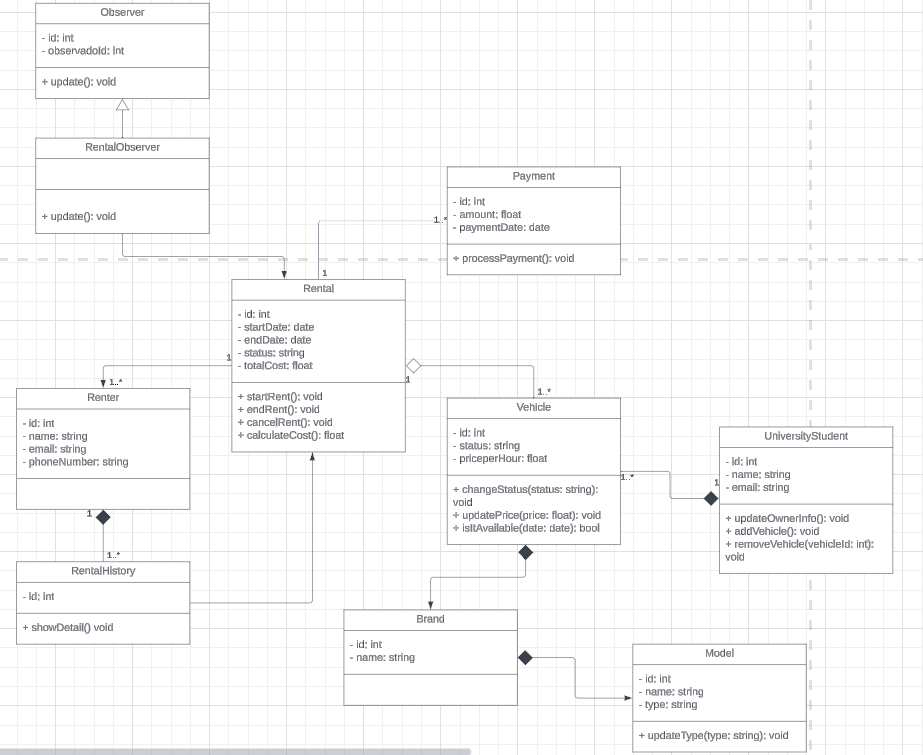

# Capítulo IV: Product Design

Este capítulo cubre todos los aspectos relacionados con el diseño de la solución, incluyendo el estilo visual, los diagramas C4, los diagramas de clases y los modelos de base de datos.

## 4.1. Style Guidelines

### 4.1.1. General Style Guidelines

Es un conjunto de normas y directrices que determinan cómo se deben redactar, diseñar o presentar documentos, contenido en línea, software u otros trabajos creativos. A continuación, se detallan los parámetros implementados en la estructura del proyecto.

**Branding:**

**Brand Overview:**

**EcoMovil** es una aplicación que ofrece una alternativa ágil y ecológica para la movilidad urbana, conectando a usuarios que desean alquilar o comprar vehículos sostenibles como bicicletas, scooters, skateboards y motos eléctricas con quienes los tienen disponibles. La aplicación facilita el proceso de alquiler o compra, apoyando también a estudiantes en la generación de ingresos flexibles. Entre sus características clave se incluyen un sistema de valoraciones y reseñas con estrellas, búsqueda avanzada con filtros, un historial de transacciones, un mapa interactivo de puntos de recepción y entrega, elementos de gamificación con logros y recompensas. EcoMovil promueve una movilidad sostenible y un estilo de vida activo y responsable con el medio ambiente.

- **Misión:** Facilitar el acceso a una movilidad urbana sostenible, conectando a las personas con vehículos ecológicos a través de una aplicación digital eficiente, contribuyendo a la reducción de la contaminación, y brindando oportunidades de ingresos para universitarios.

- **Visión:** Convertirnos en una aplicación líder en movilidad urbana sostenible, facilitando el acceso a vehículos ecológicos y promoviendo un estilo de vida más saludable y consciente con el medio ambiente.

  

**Brand Name:**

EcoMovil es una solución que surge de la combinación de "Eco", representando ecología y sostenibilidad, y "Movil", destacando la movilidad urbana. Esta aplicación está diseñada para fomentar el emprendimiento universitario y la sostenibilidad en Perú, brindando a los estudiantes la oportunidad de generar ingresos alquilando o vendiendo vehículos ecológicos. Al mismo tiempo, contribuye a reducir la contaminación y promueve un estilo de vida más activo.

**Colores:**

Los colores desempeñan un papel fundamental en la primera impresión que los usuarios tienen de la aplicación. Basándose en los principios de la psicología del color, se ha seleccionado el verde como el color principal de la paleta cromática. Este color simboliza crecimiento y creatividad, que son valores esenciales de la startup. Además, el verde está asociado con la ecología, que es el enfoque principal de la aplicación, y con la armonía, un concepto que buscamos reflejar en la interacción con el servicio. Las tonalidades secundarias elegidas abarcan distintos matices de verde claro, verde oscuro y verde pálido. Como colores secundarios, también se incluyen variantes de verde fosforescente, crema claro y anaranjado amarillo.

**Tipografia:**

La tipografía juega un papel crucial en establecer la jerarquía entre los diferentes grupos de contenido en la aplicación, además de guiar al usuario a través de la interfaz. Para el proyecto, se ha elegido la fuente "Alata" en sus estilos Medium y Normal, para asegurar una mayor legibilidad. Además, la organización tipográfica se estructura en cuatro niveles para los elementos del diseño (body y heading), lo que ayuda a mantener una disposición clara y coherente del contenido.

La estructura tipográfica del proyecto se organiza en cuatro niveles de jerarquía para los encabezados:

- Heading 01: Tamaño de 34px.
- Heading 02: Tamaño de 22px.
- Heading 03: Tamaño de 17px.
- Heading 04: Tamaño de 15px.

### 4.1.2. Web Style Guidelines

El enfoque de la aplicación web "EcoMovil" se basa en la eficiencia, la formación y la ecología en todos los procesos. Las diferentes etapas y formularios necesarios están organizados en secciones clave: Página principal, Acerca de nosotros, Inscríbase, Vehículos, Beneficios y Contacto, que ocupan la mayor parte de la pantalla para facilitar la navegación y ofrecer una experiencia de usuario fluida y coherente.

- **Imágenes:** 
En el diseño web de "EcoMovil", se utilizarán imágenes descriptivas de manera estratégica. Las imágenes de vehículos menores y de la empresa estarán en la página de inicio, con el logo de la empresa ubicado en la parte superior izquierda para facilitar su identificación. Además, cada sección principal contará con imágenes representativas de los vehículos menores, reforzando la visión ecológica para el usuario. Para optimizar la experiencia en aplicaciones de escritorio, se evitarán imágenes de fondo, optando en su lugar por imágenes laterales que guíen al usuario a través de la interfaz de manera funcional.

- **Botones:** 
Los botones en la aplicación web "EcoMovil" siguen las especificaciones establecidas en las General Style Guidelines. Generalmente, estos botones se encuentran en la parte inferior de la sección principal de la pantalla, permitiendo al usuario realizar acciones que se reflejan en la vista superior. Para acciones que inicien nuevos procesos o afecten el funcionamiento general de la aplicación, se incluyen botones de confirmación. Todos los botones están diseñados con un estilo distintivo y un alto contraste en comparación con el resto de la aplicación, asegurando que sean fácilmente visibles. Además, se aplica la teoría del color en los botones, donde los colores específicos indican acciones que eliminan procesos o los concluyen.

- **Pantallas Emergentes:** 
Las pantallas emergentes en "EcoMovil" están diseñadas para confirmar acciones clave que son cruciales para el funcionamiento del negocio y tienen un impacto significativo en el mismo. Estas pantallas emergentes enfatizan la importancia de resolver el asunto en cuestión antes de que el usuario pueda continuar navegando por la aplicación, subrayando la necesidad de tomar decisiones informadas en momentos críticos.

**Mobile Style Guidelines**

El enfoque para la vista móvil de la aplicación EcoMovil sigue el mismo principio que la vista de escritorio. Este enfoque se centra en la ecología y en la eficiencia de los procesos. Las etapas y formularios necesarios están representados en secciones y formularios que ocupan la mayor parte de la pantalla.

- **Imágenes:** 
En el diseño móvil de "EcoMovil", se utilizarán imágenes descriptivas de manera estratégica. Las imágenes de vehículos menores y de la empresa estarán en el inicio, con el logo de la empresa ubicado en la parte superior izquierda para facilitar su identificación. Para optimizar la experiencia en aplicaciones se evitarán imágenes de fondo, optando en su lugar por imágenes laterales que guíen al usuario a través de la interfaz de manera funcional.

- **Botones:** 
Los botones en la aplicación móvil "EcoMovil" siguen las especificaciones establecidas en las General Style Guidelines. Generalmente, estos botones se encuentran en la parte inferior de la sección principal de la pantalla, permitiendo al usuario realizar acciones que se reflejan en la vista superior. Para acciones que inicien nuevos procesos o afecten el funcionamiento general de la aplicación, se incluyen botones de confirmación. Todos los botones están diseñados con un estilo distintivo y un alto contraste en comparación con el resto de la aplicación, asegurando que sean fácilmente visibles. Además, se aplica la teoría del color en los botones, donde los colores específicos indican acciones que eliminan procesos o los concluyen.

## 4.2. Information Architecture

Dado que EcoMovil gestiona un flujo funcional esencial para el negocio, es fundamental que el usuario tenga claridad sobre las etapas y procesos involucrados. La información está estructurada de manera categórica y secuencial, permitiendo al usuario avanzar a través de un módulo que representa el proceso general, ya sea un ingreso o una ganancia. A medida que el usuario registra las diferentes fases del vehículo, estas se reflejan en varias pantallas de la aplicación. Además, la vista del "Panel de Control" proporciona una visión general de las funcionalidades clave de la aplicación, facilitando la supervisión y gestión de los procesos.

### 4.2.1. Organization System

El sistema de organización de la aplicación de "EcoMovil" está diseñado para estructurar visualmente el contenido y facilitar la navegación.

La organización visual del contenido se distribuye en diversas vistas dentro de la aplicación, utilizando una estructura jerárquica que resalta los elementos más importantes en la pantalla. Este enfoque se aplica a las pantallas de inicio de sesión, donde los títulos e imágenes de los vehículos ocupan una mayor parte del espacio visual. Las opciones para modificar información sobre los vehículos se integran de manera armoniosa con el fondo blanco de la aplicación, lo que permite que los usuarios se enfoquen primero en los vehículos antes de notar las opciones de edición.

El proceso principal de las fases de compra y alquiler sigue una organización secuencial, facilitando que los usuarios puedan visualizar sus planes y completar un pago de manera fluida. En varias etapas, como la publicación de vehículos, el uso de filtros y el historial, el contenido es esencial para que los usuarios realicen un seguimiento eficiente dentro de la aplicación.

En la vista principal (home), se ofrece una secuencia de vehículos diseñada para que los usuarios exploren las opciones disponibles para compra o alquiler. Además, en otras secciones, como el filtro y el foro de contacto, se proporcionan herramientas para que los usuarios publiquen vehículos, y se incluye una opción de comunicación directa mediante WhatsApp. El propósito de esta categorización es ofrecer una experiencia visual clara y organizada, tanto en la visualización de los vehículos en el mapa como en el historial de vehículos, que también contará con imágenes relacionadas.

### 4.2.2. Labeling System

En nuestra aplicación EcoMovil, el sistema de etiquetas estará bien organizado y claramente representado para que los usuarios puedan identificar y utilizar las diversas funciones de manera intuitiva y sencilla. El **Logo/Home** es un botón oculto dentro del logo de la aplicación que redirige a los usuarios a la página de inicio. La etiqueta **How it Works** dirige a una sección que explica cómo funciona la aplicación y sus principales características para que los usuarios las comprendan. **Who can use** describe los tipos de usuarios que pueden beneficiarse de la aplicación, mientras que **Plans** presenta las opciones de suscripción disponibles junto con sus precios. Finalmente, **Sign up** es un botón que lleva a la página para crear una cuenta nueva.

### 4.2.3. SEO Tags and Meta Tags

Las metaetiquetas proporcionan información codificada y definen los metadatos de una página web. Aunque no son visibles para los usuarios, son leídas por navegadores y rastreadores web, lo que permite un análisis más sencillo de los archivos HTML y facilita el mantenimiento del contenido. Además, estas etiquetas son fundamentales para mejorar el posicionamiento de nuestra página en los motores de búsqueda. 

Las metas etiquetas que utilizaremos son:

### Landing Page

| **Attribute** | **Value** |
|---------------|-----------|
| Charset       | UTF-8     |
| Viewport      | width=device-width, initial-scale=1.0 |
| CSS Link      | ./src/css/styles.css |
| Title         | EcoMovil - Urban Mobility Solution Landing Page |
| Description   | Explore our Landing page to redirect you to rent or buy eco-friendly vehicles like bicycles, scooters, and more. Start your journey towards a green city today. |
| Keywords      | urban mobility, eco-friendly vehicles, bike rental, scooter rental, sustainable transportation |
| Author        | EcoMovil Team |

### Aplicación 

| **Attribute** | **Value** |
|---------------|-----------|
| Charset       | UTF-8     |
| Viewport      | width=device-width, initial-scale=1.0 |
| CSS Link      | ./src/css/styles.css |
| Title         | EcoMovil - Your Eco-Friendly Vehicle Rental Platform with interesting features to rent or buy eco-friendly vehicles |
| Description   | EcoMobility provides a user-friendly platform for renting or buying bicycles, scooters, and other eco-friendly vehicles. Explore, book, and manage your rentals with ease. |
| Keywords      | vehicle rental, bike rental, scooter rental, eco-friendly vehicles, urban mobility, sustainable travel, temporary insurance, badges, flexible income options |
| Author        | EcoMovil Team |

### 4.2.4. Searching Systems

En EcoMovil, el sistema de búsqueda facilitará a los usuarios encontrar rápidamente los vehículos que desean alquilar o comprar, adaptándose a sus necesidades. Sus principales funciones incluirán búsqueda por palabras clave para localizar vehículos específicos, filtros avanzados para refinar la búsqueda según diversos criterios, y un historial de búsquedas recientes para acceder rápidamente a búsquedas previas.

### 4.2.5. Navigation Systems

El sistema de navegación es esencial para permitir que los usuarios se muevan con facilidad por la aplicación, asegurando una experiencia de usuario agradable. La aplicación web tendrá una barra de navegación con diversas opciones para guiar al usuario a la sección que le interese. También contará con un pie de página (footer) que proporcionará enlaces adicionales a secciones como "Sobre Nosotros", donde los usuarios podrán conocer nuestra visión y al equipo detrás de la aplicación.

## 4.3. Landing Page UI Design

Esta interfaz fue diseñada con simplicidad en mente, empleando colores claros como el verde para subrayar nuestro compromiso con el medio ambiente. Está optimizada para garantizar que los usuarios puedan leer cómodamente en cualquier dispositivo, con un tamaño de letra adecuado. Además, la interfaz es completamente responsive, adaptándose a cualquier dispositivo para ofrecer una experiencia de usuario óptima.

### 4.3.1. Landing Page Wireframe

#### 4.3.1.1. Landing Page for Web

Primero, se muestra la landing page vista desde un navegador web en escritorio. Esta página incluye secciones importantes para el usuario, que ofrecen información sobre los beneficios que obtendrá al usar el producto, los planes de pago disponibles, así como la misión, visión y valores de la startup.

#### 4.3.1.2. Landing Page for Mobile Web Browser

A continuación, se presenta la landing page vista desde un navegador web móvil. Este diseño contiene los mismos elementos que la versión de escritorio, pero adaptados a las dimensiones de un dispositivo móvil. Crear una landing page responsive es valioso para los usuarios, ya que les permite acceder desde cualquier dispositivo y obtener la misma información sin dificultades.

### 4.3.2. Landing Page Mock-up 

#### 4.3.2.1. Landing Page Mock-up for Web

El wireframe para la vista en navegador de escritorio de la landing page fue clave para planificar la disposición de los elementos. Con base en este esquema, se creó el mock-up de la landing page, que mantiene los mismos contenidos detallados anteriormente. La imagen siguiente muestra cómo se ha aplicado la paleta de colores primaria y secundaria, así como la tipografía previamente definida.

#### 4.3.2.2. Landing Page for Mobile

El mock-up de la landing page en la vista móvil incluye los mismos elementos previamente mencionados. Se destaca que la tipografía seleccionada y el contraste de colores entre el texto y el fondo facilitan la legibilidad de la información en ambos dispositivos.

## 4.4. Web Applications UX/UI Design

### 4.4.1. Web Applications Wireframes

**Web Application para Dekstop Web Browser**

**Segmento Universitario**

**Crear Cuenta**

La siguiente imagen presenta la sección de "registro de empresa", donde los universitarios podrán proporcionar la información requerida para crear una cuenta en la aplicación y empezar a disfrutar de los beneficios que ofrece EcoMovil.

**Inicio de sesión**

La siguiente imagen muestra el wireframe de la sección de "inicio de sesión" vista desde una aplicación web en escritorio. En esta sección, los usuarios deberán ingresar sus credenciales para acceder a la aplicación, siempre y cuando ya hayan creado una cuenta previamente.

**Elegir Planes**

La siguiente imagen muestra la sección de "Selección de pago", donde se presentan las diferentes categorías de planes disponibles en la aplicación. Cada uno de los tres planes ha sido diseñado cuidadosamente para atender las necesidades particulares de las empresas.

**Pago**

La siguiente imagen corresponde a la sección de "Pasarela de pagos", donde los universitarios son redirigidos a un formulario para seleccionar y registrar su método de pago. En esta sección también se muestra el monto del plan elegido. Tras completar el proceso de pago con éxito, el usuario recibe una notificación con la confirmación de su suscripción y la fecha de registro.

**Proceder el Pago**

En la siguiente imagen se puede ver el mensaje de pago exitoso, donde el universitario confirma que ha realizado el pago de manera satisfactoria y que ahora puede utilizar la aplicación sin inconvenientes.

**Home**

En esta sección, se puede ver el home con varias secciones que se explorarán más adelante. En particular, nos enfocamos en la parte de "Mis vehículos", donde podrás observar a otros universitarios siguiendo la iniciativa y subiendo sus propios vehículos.

**Detalles del Vehículo**

En esta sección, podrás ver los detalles de cada vehículo mostrado en la sección del home.

**Mis vehículos**

En esta parte, el universitario podrá subir sus vehículos añadiendo una imagen representativa y detalles del vehículo. Finalmente, deberá hacer clic en el botón "Agregar" para completar el proceso.

**Mi Perfil**

En esta sección, podrás ver tu perfil y agregar más datos, como tu RUC, correo electrónico y otros detalles, además de tu foto representativa. Finalmente, deberás hacer clic en el botón "Save changes" para guardar los cambios.

**Historial del Vehículo**

En esta sección, puedes ver el historial de los vehículos publicados y los detalles correspondientes.

**Foro de Contacto**

En esta sección, podrás publicar tu número de contacto y el vehículo que estás dispuesto a vender o alquilar, permitiendo que otros usuarios se contacten contigo o le den "like" a tu publicación.

**Segmento Adquiriente**

**Crear cuenta**

En esta sección, el adquiriente podrá registrarse proporcionando datos específicos como su nombre, correo electrónico y contraseña. Además, deberá marcar la casilla "Acepto los términos y condiciones."

**Iniciar Sesión**

En esta sección, el adquiriente podrá iniciar sesión ingresando su correo electrónico y contraseña.

**Home**

En esta sección, el adquiriente podrá visualizar el "Home", donde tendrá acceso a diversos vehículos menores con información como nombre, descripción y precio. También encontrará botones para "Rentar" o "Comprar" cada vehículo.

**Mi perfil**

En esta sección, podrás visualizar el perfil del adquiriente, incluyendo detalles como el nombre, correo y teléfono. También habrá un botón para confirmar si los detalles son correctos y, finalmente, un botón de "Guardar".

**Mapa Interactivo**

En esta sección, el adquiriente podrá visualizar un mapa interactivo.

**Filtro**

En esta sección, podrás visualizar los filtros con vehículos y sus imágenes descriptivas, así como los botones de "Comprar" o "Rentar".

**Detalles del Vehículo**

Al hacer clic en un vehículo, el adquiriente podrá ver las descripciones del mismo, incluidos sus "Badges", tipo de vehículo, año, precio y una descripción detallada. Además, tendrá la opción de comunicarse por WhatsApp con el propietario del vehículo y podrá seleccionar entre los botones "Rentar Vehículo" o "Comprar Vehículo".

**Historial**

En esta sección, el adquiriente podrá visualizar el historial de los vehículos.

**Foro de Contacto**

En esta sección, el adquiriente podrá visualizar los mensajes de los diferentes universitarios que incluyeron su número de teléfono, con la opción de conectarse directamente a través de WhatsApp.

**Web Application para Mobile Web Browser**

**Segmento Universitario**

**Logo**

Aquí, el universitario podrá ver el logo de EcoMovil con un mensaje de "Cargando" en la parte inferior.

**Registro**

Los universitarios podrán registrarse en EcoMovil ingresando su RUC, correo electrónico, nombre completo y contraseña. También deberán aceptar los términos y condiciones antes de hacer clic en el botón de "Registrarse".

**Iniciar sesión**

Los universitarios podrán iniciar sesión ingresando su correo electrónico y contraseña. También habrá una opción de "Recuérdame" para facilitar el acceso en caso de que olviden el usuario o la contraseña. Finalmente, deberán hacer clic en el botón de "Iniciar sesión".

**Planes**

Aquí, el usuario podrá seleccionar uno de los tres planes disponibles para comenzar a usar la aplicación y ofrecer sus vehículos al público objetivo. Deberá hacer clic en el botón de "Escoger Plan".

**Proceder al pago**

En esta sección, el usuario podrá acceder al plan realizando el pago con su tarjeta e ingresando los datos correspondientes. Después de hacer clic en el botón de "Confirmar", recibirá un mensaje de pago exitoso.

**Vehículos**

Aquí, el universitario podrá visualizar las publicaciones de otros universitarios y sus vehículos para inspirarse. Luego, podrá acceder a la sección "Mi Vehículo" para agregar uno o dos vehículos, dependiendo de su plan, haciendo clic en el botón "Agregar".

**Historial**

Aquí, podremos ver el historial de los vehículos publicados por el universitario.

**Foro de Contacto**

El universitario podrá subir un mensaje en el post indicando que está vendiendo o rentando un vehículo, incluyendo su número de celular para que el arrendatario pueda comunicarse con él a través de WhatsApp.

**Mi Perfil**

En esta sección, podrás ver tu perfil, incluyendo tu foto, nombre completo, correo electrónico, número de teléfono y RUC. Finalmente, podrás guardar tus datos.

**Segmento Adquiriente**

**Logo**

Aquí, el adquiriente podrá ver el logo de EcoMovil con un mensaje de "Cargando" en la parte inferior.

**Registro**

Los adquirientes podrán registrarse en EcoMovil ingresando su correo electrónico, nombre completo y contraseña. También deberán aceptar los términos y condiciones antes de hacer clic en el botón de "Registrarse".

**Iniciar sesión**

Los adquirientes podrán iniciar sesión ingresando su correo electrónico y contraseña. También habrá una opción de "Recuérdame" para facilitar el acceso en caso de que olviden el usuario o la contraseña. Finalmente, deberán hacer clic en el botón de "Iniciar sesión".

**Alquilar o comprar vehículos menores**

Aquí podrás explorar diferentes vehículos y utilizar el botón "Rentar" o "Comprar" según tu interés.

**Mi Perfil**

El adquiriente podrá ver su perfil, agregar o corregir su foto, nombre, correo electrónico y teléfono. También deberá confirmar que los detalles son correctos y, finalmente, hacer clic en el botón "Guardar".

**Vehículo y Filtros**

Aquí podrás ver el mapa interactivo y el filtro, que incluye secciones para tipos de vehículos y precios.

**Detalles del Vehículo**

Aquí podrás visualizar los detalles del vehículo que seleccionaste, incluyendo sus descripciones, y tendrás los botones de "Alquilar" o "Comprar".

**Historial de Vehículo y Foro de Contacto**

El adquiriente tendrá la opción de ver los vehículos en su historial y acceder al foro de contacto, donde podrá visualizar los posts de los universitarios que incluyen su número de WhatsApp, facilitando el contacto directo si desean el vehículo.

### 4.4.2. Web Applications Wireflow Diagrams

**User Goal: Iniciar sesión y Registrarse**

**Perfil del Usuario: Universitario**

**Descripción del Flujo:**

Primero, el usuario ingresará a la aplicación desplegada. En la pantalla inicial, se le presentará un formulario para ingresar sus datos de inicio de sesión. Para los universitarios, el formulario requerirá el RUC, nombre, correo electrónico y contraseña. 

**User Goal: Pagos de los Planes**

El universitario podrá elegir entre 3 planes y seleccionar uno haciendo clic en el botón "Elegir Plan". Al hacerlo, será redirigido al proceso de pago, donde deberá ingresar los datos de su tarjeta y confirmar que la información es correcta. Una vez confirmado, el sistema mostrará un mensaje de pago exitoso. Al hacer clic en el botón "Comenzar", el usuario accederá al menú de vehículos.

**User Goal: Navegar por el dashboard**

Descripción del Flujo: Una vez que el universitario haya iniciado sesión, será dirigido al panel de control, donde podrá ver varias opciones. La primera opción es "Detalles del Vehículo", donde podrá consultar la información de cada vehículo. Luego, encontrará la sección de "Perfil", donde podrá actualizar sus datos y foto. También habrá una sección llamada "Historial de Vehículos", donde podrá revisar los vehículos que ha subido. Finalmente, estará disponible el "Foro de Contacto", donde podrá publicar un anuncio para vender o alquilar, permitiendo que los interesados se comuniquen directamente por WhatsApp.

**User Goal: Iniciar sesión y Registrarse**

**Perfil del Usuario: Adquiriente**

**Descripción del Flujo:**

Primero, el usuario ingresará a la aplicación desplegada. En la pantalla inicial, se le presentará un formulario para ingresar sus datos de inicio de sesión. Para los adquirientes, el formulario requerirá el nombre, correo electrónico y contraseña. 

**User Goal: Visualizar los Vehículos**

El adquiriente, al estar en la página de inicio, podrá ver los vehículos disponibles junto con sus descripciones. Al hacer clic en el botón "Alquilar" o "Comprar", será redirigido a la página de detalles del vehículo, donde podrá consultar el tipo, precio, descripción y distintivos del vehículo. Luego, al presionar el botón "Guardar", el vehículo se añadirá a su historial de vehículos guardados.

**User Goal: Navegar por el dashboard**

Descripción del Flujo: Una vez que el adquiriente haya iniciado sesión, será dirigido al panel de control, donde encontrará varias opciones. La primera opción es "Mapa Interactivo", que le permitirá ver la ubicación de cada vehículo. Luego, encontrará la sección de "Filtro", donde podrá buscar y visualizar vehículos según su tipo y precio. También tendrá acceso a la sección de "Foro de Contacto", donde podrá ponerse en contacto con el universitario para adquirir el vehículo. Finalmente, estará disponible la opción "Mi Perfil", donde podrá revisar y actualizar sus datos personales.

### 4.4.3. Web Applications Mock-ups

**Web Application para Desktop Web Browser**

**Segmento Universitario**

**Crear Cuenta**

La siguiente imagen presenta la sección de "registro de empresa", donde los universitarios podrán proporcionar la información requerida para crear una cuenta en la aplicación y empezar a disfrutar de los beneficios que ofrece EcoMovil.

**Inicio de sesión**

La siguiente imagen muestra el wireframe de la sección de "inicio de sesión" vista desde una aplicación web en escritorio. En esta sección, los usuarios deberán ingresar sus credenciales para acceder a la aplicación, siempre y cuando ya hayan creado una cuenta previamente.

**Elegir Planes**

La siguiente imagen muestra la sección de "Selección de pago", donde se presentan las diferentes categorías de planes disponibles en la aplicación. Cada uno de los tres planes ha sido diseñado cuidadosamente para atender las necesidades particulares de las empresas.

**Pago**

La siguiente imagen corresponde a la sección de "Pasarela de pagos", donde los universitarios son redirigidos a un formulario para seleccionar y registrar su método de pago. En esta sección también se muestra el monto del plan elegido. Tras completar el proceso de pago con éxito, el usuario recibe una notificación con la confirmación de su suscripción y la fecha de registro.

**Proceder el Pago**

En la siguiente imagen se puede ver el mensaje de pago exitoso, donde el universitario confirma que ha realizado el pago de manera satisfactoria y que ahora puede utilizar la aplicación sin inconvenientes.

**Home**

En esta sección, se puede ver el home con varias secciones que se explorarán más adelante. En particular, nos enfocamos en la parte de "Mis vehículos", donde podrás observar a otros universitarios siguiendo la iniciativa y subiendo sus propios vehículos.

**Detalles del Vehículo**

En esta sección, podrás ver los detalles de cada vehículo mostrado en la sección del home.

**Mis vehículos**

En esta parte, el universitario podrá subir sus vehículos añadiendo una imagen representativa y detalles del vehículo. Finalmente, deberá hacer clic en el botón "Agregar" para completar el proceso.

**Mi Perfil**

En esta sección, podrás ver tu perfil y agregar más datos, como tu RUC, correo electrónico y otros detalles, además de tu foto representativa. Finalmente, deberás hacer clic en el botón "Save changes" para guardar los cambios.

**Historial del Vehículo**

En esta sección, puedes ver el historial de los vehículos publicados y los detalles correspondientes.

**Foro de Contacto**

En esta sección, podrás publicar tu número de contacto y el vehículo que estás dispuesto a vender o alquilar, permitiendo que otros usuarios se contacten contigo o le den "like" a tu publicación.

**Segmento Adquiriente**

**Crear cuenta**

En esta sección, el adquiriente podrá registrarse proporcionando datos específicos como su nombre, correo electrónico y contraseña. Además, deberá marcar la casilla "Acepto los términos y condiciones."

**Iniciar Sesión**

En esta sección, el adquiriente podrá iniciar sesión ingresando su correo electrónico y contraseña.

**Home**

En esta sección, el adquiriente podrá visualizar el "Home", donde tendrá acceso a diversos vehículos menores con información como nombre, descripción y precio. También encontrará botones para "Rentar" o "Comprar" cada vehículo.

**Mi perfil**

En esta sección, podrás visualizar el perfil del adquiriente, incluyendo detalles como el nombre, correo y teléfono. También habrá un botón para confirmar si los detalles son correctos y, finalmente, un botón de "Guardar".

**Mapa Interactivo**

En esta sección, el adquiriente podrá visualizar un mapa interactivo.

**Filtro**

En esta sección, podrás visualizar los filtros con vehículos y sus imágenes descriptivas, así como los botones de "Comprar" o "Rentar".

**Detalles del Vehículo**

Al hacer clic en un vehículo, el adquiriente podrá ver las descripciones del mismo, incluidos sus "Badges", tipo de vehículo, año, precio y una descripción detallada. Además, tendrá la opción de comunicarse por WhatsApp con el propietario del vehículo y podrá seleccionar entre los botones "Rentar Vehículo" o "Comprar Vehículo".

**Historial**

En esta sección, el adquiriente podrá visualizar el historial de los vehículos.

**Foro de Contacto**

En esta sección, el adquiriente podrá visualizar los mensajes de los diferentes universitarios que incluyeron su número de teléfono, con la opción de conectarse directamente a través de WhatsApp.

**Web Application para Mobile Web Browser**

**Segmento Universitario**

**Logo**

Aquí, el universitario podrá ver el logo de EcoMovil con un mensaje de "Cargando" en la parte inferior.

**Registro**

Los universitarios podrán registrarse en EcoMovil ingresando su RUC, correo electrónico, nombre completo y contraseña. También deberán aceptar los términos y condiciones antes de hacer clic en el botón de "Registrarse".

**Iniciar sesión**

Los universitarios podrán iniciar sesión ingresando su correo electrónico y contraseña. También habrá una opción de "Recuérdame" para facilitar el acceso en caso de que olviden el usuario o la contraseña. Finalmente, deberán hacer clic en el botón de "Iniciar sesión".

**Planes**

Aquí, el usuario podrá seleccionar uno de los tres planes disponibles para comenzar a usar la aplicación y ofrecer sus vehículos al público objetivo. Deberá hacer clic en el botón de "Escoger Plan".

**Proceder al pago**

En esta sección, el usuario podrá acceder al plan realizando el pago con su tarjeta e ingresando los datos correspondientes. Después de hacer clic en el botón de "Confirmar", recibirá un mensaje de pago exitoso.

**Vehículos**

Aquí, el universitario podrá visualizar las publicaciones de otros universitarios y sus vehículos para inspirarse. Luego, podrá acceder a la sección "Mi Vehículo" para agregar uno o dos vehículos, dependiendo de su plan, haciendo clic en el botón "Agregar".

**Historial**

Aquí, podremos ver el historial de los vehículos publicados por el universitario.

**Foro de Contacto**

El universitario podrá subir un mensaje en el post indicando que está vendiendo o rentando un vehículo, incluyendo su número de celular para que el arrendatario pueda comunicarse con él a través de WhatsApp.

**Mi Perfil**

En esta sección, podrás ver tu perfil, incluyendo tu foto, nombre completo, correo electrónico, número de teléfono y RUC. Finalmente, podrás guardar tus datos.

**Segmento Adquiriente**

**Logo**

Aquí, el adquiriente podrá ver el logo de EcoMovil con un mensaje de "Cargando" en la parte inferior.

**Registro**

Los adquirientes podrán registrarse en EcoMovil ingresando su correo electrónico, nombre completo y contraseña. También deberán aceptar los términos y condiciones antes de hacer clic en el botón de "Registrarse".

**Iniciar sesión**

Los adquirientes podrán iniciar sesión ingresando su correo electrónico y contraseña. También habrá una opción de "Recuérdame" para facilitar el acceso en caso de que olviden el usuario o la contraseña. Finalmente, deberán hacer clic en el botón de "Iniciar sesión".

**Alquilar o comprar vehículos menores**

Aquí podrás explorar diferentes vehículos y utilizar el botón "Rentar" o "Comprar" según tu interés.

**Mi Perfil**

El adquiriente podrá ver su perfil, agregar o corregir su foto, nombre, correo electrónico y teléfono. También deberá confirmar que los detalles son correctos y, finalmente, hacer clic en el botón "Guardar".

**Vehículo y Filtros**

Aquí podrás ver el mapa interactivo y el filtro, que incluye secciones para tipos de vehículos y precios.

**Detalles del Vehículo**

Aquí podrás visualizar los detalles del vehículo que seleccionaste, incluyendo sus descripciones, y tendrás los botones de "Alquilar" o "Comprar".

**Historial de Vehículo y Foro de Contacto**

El adquiriente tendrá la opción de ver los vehículos en su historial y acceder al foro de contacto, donde podrá visualizar los posts de los universitarios que incluyen su número de WhatsApp, facilitando el contacto directo si desean el vehículo.

### 4.4.4. Web Applications User Flow Diagrams 

**User Goal: Iniciar sesión y Registrarse**

**Perfil del Usuario: Universitario**

**Descripción del Flujo:**

Primero, el usuario ingresará a la aplicación desplegada. En la pantalla inicial, se le presentará un formulario para ingresar sus datos de inicio de sesión. Para los universitarios, el formulario requerirá el RUC, nombre, correo electrónico y contraseña. 

**User Goal: Pagos de los Planes**

El universitario podrá elegir entre 3 planes y seleccionar uno haciendo clic en el botón "Elegir Plan". Al hacerlo, será redirigido al proceso de pago, donde deberá ingresar los datos de su tarjeta y confirmar que la información es correcta. Una vez confirmado, el sistema mostrará un mensaje de pago exitoso. Al hacer clic en el botón "Comenzar", el usuario accederá al menú de vehículos.

**User Goal: Navegar por el dashboard**

Descripción del Flujo: Una vez que el universitario haya iniciado sesión, será dirigido al panel de control, donde podrá ver varias opciones. La primera opción es "Detalles del Vehículo", donde podrá consultar la información de cada vehículo. Luego, encontrará la sección de "Perfil", donde podrá actualizar sus datos y foto. También habrá una sección llamada "Historial de Vehículos", donde podrá revisar los vehículos que ha subido. Finalmente, estará disponible el "Foro de Contacto", donde podrá publicar un anuncio para vender o alquilar, permitiendo que los interesados se comuniquen directamente por WhatsApp.

**User Goal: Iniciar sesión y Registrarse**

**Perfil del Usuario: Adquiriente**

**Descripción del Flujo:**

Primero, el usuario ingresará a la aplicación desplegada. En la pantalla inicial, se le presentará un formulario para ingresar sus datos de inicio de sesión. Para los adquirientes, el formulario requerirá el nombre, correo electrónico y contraseña. 

**User Goal: Visualizar los Vehículos**

El adquiriente, al estar en la página de inicio, podrá ver los vehículos disponibles junto con sus descripciones. Al hacer clic en el botón "Alquilar" o "Comprar", será redirigido a la página de detalles del vehículo, donde podrá consultar el tipo, precio, descripción y distintivos del vehículo. Luego, al presionar el botón "Guardar", el vehículo se añadirá a su historial de vehículos guardados.

**User Goal: Navegar por el dashboard**

Descripción del Flujo: Una vez que el adquiriente haya iniciado sesión, será dirigido al panel de control, donde encontrará varias opciones. La primera opción es "Mapa Interactivo", que le permitirá ver la ubicación de cada vehículo. Luego, encontrará la sección de "Filtro", donde podrá buscar y visualizar vehículos según su tipo y precio. También tendrá acceso a la sección de "Foro de Contacto", donde podrá ponerse en contacto con el universitario para adquirir el vehículo. Finalmente, estará disponible la opción "Mi Perfil", donde podrá revisar y actualizar sus datos personales.

## 4.5. Web Applications Prototyping

Para desarrollar los prototipos de la interfaz de usuario tanto para Desktop como para navegadores móviles, se tomaron en cuenta varios principios esenciales:

1. **Simplicidad y Usabilidad:** Se buscó que la navegación fuera sencilla e intuitiva, permitiendo a los usuarios entender claramente las funciones de la aplicación, como el mapa interactivo y la opción de filtros.
   
2. **Diseño Adaptable:** Se prestó atención a la necesidad de un diseño adaptable que garantice la compatibilidad de la aplicación con diferentes tamaños de pantalla, evitando que los usuarios enfrenten restricciones según el dispositivo que utilicen.
   
3. **Enfoque en Información Clave:** El diseño está orientado a presentar solo los datos más importantes para los usuarios dentro del segmento objetivo.

## 4.6. Domain-Driven Software Arquitecture

El Domain Driven Design (DDD) busca lograr un entendimiento compartido del dominio que engloba el espacio del problema. Este enfoque facilita la colaboración entre desarrolladores y expertos del dominio. DDD no se limita a la utilización de un lenguaje ubicuo, sino que también incluye un conjunto de patrones, procedimientos y diagramas arquitectónicos. Estos artefactos tienen como objetivo alinear el software con el dominio y fortalecer el enfoque compartido del DDD.

### 4.6.1. Software Architecture Context Diagram 

El diagrama de contexto ofrece una visión general de alto nivel de las interacciones entre el sistema de software EcoMovil, los usuarios y, en su caso, otros sistemas externos.

### 4.6.2. Software Architecture Container Diagram

El diagrama de contenedores proporciona una vista general de alto nivel de las interacciones entre las aplicaciones y las fuentes de datos involucradas en la ejecución del sistema de software EcoMovil.

### 4.6.3. Software Architecture Component Diagram

Los diagramas de componentes muestran las relaciones entre los componentes principales del sistema de software, detallando la implementación de los módulos correspondientes en el programa.

En esta sección inicial se presentan los requisitos no funcionales de la aplicación.
  

Aquí se ilustran los componentes relacionados con el perfil de usuario.
  

En esta sección se detallan los componentes asociados a los vehículos.
  

Aquí se muestran los componentes dedicados a la autenticación de usuarios.
  

## 4.7. Software Object-Oriented Design
### 4.7.1. Class Diagrams

Payment Bounded Context

User Bounded Context

Rental Bounded Context

### 4.7.2. Class Dictionary

**Acquirers Bounded Context**

<table border="0" width="50%">
  <tr>
    <td colspan="2" valign="top">Observer</td>
    <tr>
    <td colspan="1" valign="top" width="40%">Atributo</td>
    <td colspan="2" valign="top">Descripción</td>
  </tr>
   <tr>
    <td colspan="1" valign="top">id</td>
    <td colspan="2" valign="top"> Identificador único del observador</td>
  </tr>
  <tr>
    <td colspan="1" valign="top">observadorId</td>
    <td colspan="2" valign="top">  Identificador adicional del suscriptor</td>
  </tr>
  <tr>
    <td colspan="1" valign="top" width="40%">Método</td>
    <td colspan="2" valign="top">Descripción</td>
  </tr>
   <tr>
    <td colspan="1" valign="top">update()</td>
    <td colspan="2" valign="top">Método que se llama cuando hay una actualización en el sujeto observado.</td>
  </tr>
<table>

<table border="0" width="50%">
  <tr>
    <td colspan="2" valign="top">AcquirersObserver</td>

  <tr>
    <td colspan="1" valign="top" width="40%">Método</td>
    <td colspan="2" valign="top">Descripción</td>
  </tr>
   <tr>
    <td colspan="1" valign="top">update()</td>
    <td colspan="2" valign="top">Implementación del método update específico para gestionar actualizaciones relacionadas con alquileres o compras.</td>
  </tr>
<table>

<table border="0" width="50%">
  <tr>
    <td colspan="2" valign="top">Rental or Buy</td>
    <tr>
    <td colspan="1" valign="top" width="40%">Atributo</td>
    <td colspan="2" valign="top">Descripción</td>
  </tr>
  <tr>
    <td colspan="1" valign="top">Id</td>
    <td colspan="2" valign="top">Identificador único del alquiler o compra</td>
  </tr>
  <tr>
    <td colspan="1" valign="top">startDate</td>
    <td colspan="2" valign="top">Fecha de inicio del alquiler o compra</td>
  </tr>
  <tr>
    <td colspan="1" valign="top">endDate</td>
    <td colspan="2" valign="top">Fecha de fin del alquiler</td>
  </tr>
  <tr>
    <td colspan="1" valign="top">status</td>
    <td colspan="2" valign="top"> Estado del alquiler o compra (activo, terminado, espera)</td>
  </tr>
  <tr>
    <td colspan="1" valign="top">totalCost </td>
    <td colspan="2" valign="top">Costo total del alquiler o compra</td>
  </tr>
  <tr>
    <td colspan="1" valign="top" width="40%">Método</td>
    <td colspan="2" valign="top">Descripción</td>
  </tr>
   <tr>
    <td colspan="1" valign="top">startRental()</td>
    <td colspan="2" valign="top">Método para crear un nuevo alquiler o compra.</td>
  </tr>
  <tr>
    <td colspan="1" valign="top">endRental()</td>
    <td colspan="2" valign="top"> Método para finalizar un alquiler o compra.</td>
  </tr>
  <tr>
    <td colspan="1" valign="top">cancelRent()</td>
    <td colspan="2" valign="top"> Método para cancelar un alquiler o compra.</td>
  </tr>
  <tr>
    <td colspan="1" valign="top">calculateCost()</td>
    <td colspan="2" valign="top">Método para calcular el costo final.</td>
  </tr>
<table>

<table border="0" width="50%">
  <tr>
    <td colspan="2" valign="top">Vehicle</td>
    <tr>
    <td colspan="1" valign="top" width="40%">Atributo</td>
    <td colspan="2" valign="top">Descripción</td>
  </tr>
<tr>
    <td colspan="1" valign="top">Id</td>
    <td colspan="2" valign="top">Identificador único del vehículo</td>
  </tr>
   <tr>
    <td colspan="1" valign="top">status</td>
    <td colspan="2" valign="top">Disponibilidad del vehículo</td>
  </tr>
<tr>
    <td colspan="1" valign="top">priceperHour</td>
    <td colspan="2" valign="top">Precio del vehículo</td>
  </tr>

  <tr>
    <td colspan="1" valign="top" width="40%">Método</td>
    <td colspan="2" valign="top">Descripción</td>
  </tr>
   <tr>
    <td colspan="1" valign="top">isitAvailability()</td>
    <td colspan="2" valign="top"> Método para verificar la disponibilidad del vehículo.</td>
  </tr>
<tr>
    <td colspan="1" valign="top">changeStatus(status:String)</td>
    <td colspan="2" valign="top"> Método para cambiar el status del vehículo</td>
  </tr>
<tr>
    <td colspan="1" valign="top">updatePrice()</td>
    <td colspan="2" valign="top"> Método para cambiar el precio del vehículo</td>
  </tr>
<table>

<table border="0" width="50%">
  <tr>
    <td colspan="2" valign="top">UniversityStudent</td>
    <tr>
    <td colspan="1" valign="top" width="40%">Atributo</td>
    <td colspan="2" valign="top">Descripción</td>
  </tr>
   <tr>
    <td colspan="1" valign="top">Id</td>
    <td colspan="2" valign="top"> Identificador único del universitario</td>
  </tr>
  <tr>
    <td colspan="1" valign="top">name</td>
    <td colspan="2" valign="top"> Nombre del universitario</td>
  </tr>
  <tr>
    <td colspan="1" valign="top">email</td>
    <td colspan="2" valign="top"> Información de contacto electrónico del universitario</td>
  </tr>
  <tr>
    <td colspan="1" valign="top" width="40%">Método</td>
    <td colspan="2" valign="top">Descripción</td>
  </tr>
   <tr>
    <td colspan="1" valign="top">updateOwnerInfo()</td>
    <td colspan="2" valign="top">Método para actualizar la información del universitario.</td>
  </tr>
<tr>
    <td colspan="1" valign="top">addVehicle()</td>
    <td colspan="2" valign="top">Método para agregar un vehículo del universitario.</td>
  </tr>
  </tr>
<table>

<table border="0" width="50%">
  <tr>
    <td colspan="2" valign="top">Acquirers History</td>
    <tr>
    <td colspan="1" valign="top" width="40%">Atributo</td>
    <td colspan="2" valign="top">Descripción</td>
  </tr>
   <tr>
    <td colspan="1" valign="top">Id</td>
    <td colspan="2" valign="top">Identificador único del historial de alquileres o compras.</td>
  </tr>
<tr>
    <td colspan="1" valign="top">Rentals and purchases</td>
    <td colspan="2" valign="top">Lista de alquileres o compras asociados al adquiriente.</td>
  </tr>
  <tr>
    <td colspan="1" valign="top" width="40%">Método</td>
    <td colspan="2" valign="top">Descripción</td>
  </tr>
   <tr>
    <td colspan="1" valign="top">showDetail()</td>
    <td colspan="2" valign="top">Método para obtener el historial de alquileres o compras.</td>
  </tr>
<table>

<table border="0" width="50%">
  <tr>
    <td colspan="2" valign="top">Brand</td>
    <tr>
    <td colspan="1" valign="top" width="40%">Atributo</td>
    <td colspan="2" valign="top">Descripción</td>
  </tr>
   <tr>
    <td colspan="1" valign="top">Id</td>
    <td colspan="2" valign="top">Identificador único de la marca del vehículo.</td>
  </tr>
<tr>
    <td colspan="1" valign="top">name</td>
    <td colspan="2" valign="top"> Nombre de la marca</td>
  </tr>
<table>

<table border="0" width="50%">
  <tr>
    <td colspan="2" valign="top">Model</td>
    <tr>
    <td colspan="1" valign="top" width="40%">Atributo</td>
    <td colspan="2" valign="top">Descripción</td>
  </tr>
   <tr>
    <td colspan="1" valign="top">Id</td>
    <td colspan="2" valign="top">Identificador único del modelo del vehículo.</td>
  </tr>
<tr>
    <td colspan="1" valign="top">name</td>
    <td colspan="2" valign="top">Nombre del modelo</td>
  </tr>
<tr>
    <td colspan="1" valign="top">type</td>
    <td colspan="2" valign="top">Versión del modelo</td>
  </tr>
  <tr>
    <td colspan="1" valign="top" width="40%">Método</td>
    <td colspan="2" valign="top">Descripción</td>
  </tr>
   <tr>
    <td colspan="1" valign="top">updateType()</td>
    <td colspan="2" valign="top">Método para actualizar el tipo del vehículo.</td>
  </tr>
<table>

<table border="0" width="50%">
  <tr>
    <td colspan="2" valign="top">Acquirers</td>
    <tr>
    <td colspan="1" valign="top" width="40%">Atributo</td>
    <td colspan="2" valign="top">Descripción</td>
  </tr>
   <tr>
    <td colspan="1" valign="top">Id</td>
    <td colspan="2" valign="top">Identificador único del adquiriente.</td>
  </tr>
<tr>
    <td colspan="1" valign="top">name</td>
    <td colspan="2" valign="top">Nombre del adquiriente.</td>
  </tr>
<tr>
    <td colspan="1" valign="top">email</td>
    <td colspan="2" valign="top">Información de correo electrónico del adquiriente.</td>
  </tr>
<tr>
    <td colspan="1" valign="top">phoneNumber</td>
    <td colspan="2" valign="top">Número telefónico del arrendatario del adquiriente.</td>
  </tr>

<table>

<table border="0" width="50%">
  <tr>
    <td colspan="2" valign="top">AcquirersHistory</td>
    <tr>
    <td colspan="1" valign="top" width="40%">Atributo</td>
    <td colspan="2" valign="top">Descripción</td>
  </tr>
   <tr>
    <td colspan="1" valign="top">Id</td>
    <td colspan="2" valign="top">Identificador único del historial de alquileres o compras.</td>
  </tr>
<tr>
    <td colspan="1" valign="top">Adquirentes</td>
    <td colspan="2" valign="top">Lista de alquileres o compras asociados al adquiriente.</td>
  </tr>
  <tr>
    <td colspan="1" valign="top" width="40%">Método</td>
    <td colspan="2" valign="top">Descripción</td>
  </tr>
   <tr>
    <td colspan="1" valign="top">showDetail()</td>
    <td colspan="2" valign="top">Método para obtener el historial de alquileres o compras.</td>
  </tr>
<table>
 
**User Bounded Context**

<table border="0" width="50%">
  <tr>
    <td colspan="2" valign="top">User</td>
    <tr>
    <td colspan="1" valign="top" width="40%">Atributo</td>
    <td colspan="2" valign="top">Descripción</td>
  </tr>
   <tr>
    <td colspan="1" valign="top">Id</td>
    <td colspan="2" valign="top">Identificador único del usuario</td>
  </tr>
<tr>
    <td colspan="1" valign="top">name</td>
    <td colspan="2" valign="top">Nombre del usuario</td>
  </tr>
<tr>
    <td colspan="1" valign="top">email</td>
    <td colspan="2" valign="top">Información del correo electrónico del usuario</td>
  </tr>
<tr>
    <td colspan="1" valign="top">phoneNumber</td>
    <td colspan="2" valign="top">Número de contacto del usuario</td>
  </tr>
<tr>
    <td colspan="1" valign="top">password</td>
    <td colspan="2" valign="top">Contraseña del usuario</td>
  </tr>
  <tr>
    <td colspan="1" valign="top" width="40%">Método</td>
    <td colspan="2" valign="top">Descripción</td>
  </tr>
   <tr>
    <td colspan="1" valign="top">LogIn(email: string, password: string)</td>
    <td colspan="2" valign="top">Método para ingresar a la cuenta de un usuario.</td>
  </tr>
   <tr>
    <td colspan="1" valign="top">UpdateProfeil(name: string, email: string, phoneNumber: string)</td>
    <td colspan="2" valign="top">Método para actualizar la información de un usuario.</td>
  </tr>
   <tr>
    <td colspan="1" valign="top">LogOut()</td>
    <td colspan="2" valign="top">Método para salir de la cuenta de un usuario</td>
  </tr>
<table>

<table border="0" width="50%">
  <tr>
    <td colspan="2" valign="top">Acquirers</td>
    <tr>
    <td colspan="1" valign="top" width="40%">Atributo</td>
    <td colspan="2" valign="top">Descripción</td>
  </tr>
   <tr>
    <td colspan="1" valign="top">vehiclesRentedorBuyer</td>
    <td colspan="2" valign="top">Cantidad de vehiculos rentados o comprados.</td>
  </tr>
<table>

<table border="0" width="50%">
  <tr>
    <td colspan="2" valign="top">UserFactory</td>
  <tr>
    <td colspan="1" valign="top" width="40%">Método</td>
    <td colspan="2" valign="top">Descripción</td>
  </tr>
   <tr>
    <td colspan="1" valign="top">createUser(): User</td>
    <td colspan="2" valign="top">Método abstracto que define la creación de nuevos tipos de usuarios.</td>
  </tr>
<table>

<table border="0" width="50%">
  <tr>
    <td colspan="2" valign="top">UniversityStudentFactory</td>

  <tr>
    <td colspan="1" valign="top" width="40%">Método</td>
    <td colspan="2" valign="top">Descripción</td>
  </tr>
   <tr>
    <td colspan="1" valign="top">createUser()</td>
    <td colspan="2" valign="top">Método para crear nuevos objetos de tipo Owner.</td>
  </tr>
<table>

<table border="0" width="50%">
  <tr>
    <td colspan="2" valign="top">AcquirersFactory</td>
  <tr>
    <td colspan="1" valign="top" width="40%">Método</td>
    <td colspan="2" valign="top">Descripción</td>
  </tr>
   <tr>
    <td colspan="1" valign="top">createUser()</td>
    <td colspan="2" valign="top">Método para crear nuevos objetos. </td>
  </tr>
<table>
 
**Payment Bounded Context**

<table border="0" width="50%">
  <tr>
    <td colspan="2" valign="top">Payment</td>
    <tr>
    <td colspan="1" valign="top" width="40%">Atributo</td>
    <td colspan="2" valign="top">Descripción</td>
  </tr>
   <tr>
    <td colspan="1" valign="top">Id</td>
    <td colspan="2" valign="top">Identificador único del pago</td>
  </tr>
<tr>
    <td colspan="1" valign="top">amount</td>
    <td colspan="2" valign="top">Monto del pago</td>
  </tr>
<tr>
    <td colspan="1" valign="top">TransactionDate</td>
    <td colspan="2" valign="top">Fecha en la que se realizó el pago</td>
  </tr>
<tr>
    <td colspan="1" valign="top">status</td>
    <td colspan="2" valign="top">Estado del pago (Exitoso)</td>
  </tr>
  <tr>
    <td colspan="1" valign="top" width="40%">Método</td>
    <td colspan="2" valign="top">Descripción</td>
  </tr>
   <tr>
    <td colspan="1" valign="top">processPayment()</td>
    <td colspan="2" valign="top">Método para procesar el pago</td>
  </tr>
<table>

<table border="0" width="50%">
  <tr>
    <td colspan="2" valign="top">PaymentMethod</td>
    <tr>
    <td colspan="1" valign="top" width="40%">Atributo</td>
    <td colspan="2" valign="top">Descripción</td>
  </tr>
   <tr>
    <td colspan="1" valign="top">Id</td>
    <td colspan="2" valign="top">Identificador único del método del pago.</td>
  </tr>
<tr>
    <td colspan="1" valign="top">type</td>
    <td colspan="2" valign="top">Tipo de método de pago</td>
  </tr>
  <tr>
    <td colspan="1" valign="top" width="40%">Método</td>
    <td colspan="2" valign="top">Descripción</td>
  </tr>
   <tr>
    <td colspan="1" valign="top">validateMethod()</td>
    <td colspan="2" valign="top">Método para validar la información del método de pago.</td>
  </tr>
<table>

<table border="0" width="50%">
  <tr>
    <td colspan="2" valign="top">Vehicle</td>
    <tr>
    <td colspan="1" valign="top" width="40%">Atributo</td>
    <td colspan="2" valign="top">Descripción</td>
  </tr>
   <tr>
    <td colspan="1" valign="top">Id</td>
    <td colspan="2" valign="top">Identificador único del vehículo</td>
  </tr>
<tr>
    <td colspan="1" valign="top">brand</td>
    <td colspan="2" valign="top">Marca del vehículo</td>
  </tr>
<tr>
    <td colspan="1" valign="top">priceperHour</td>
    <td colspan="2" valign="top">Precio del vehículo</td>
  </tr>
  <tr>
    <td colspan="1" valign="top" width="40%">Método</td>
    <td colspan="2" valign="top">Descripción</td>
  </tr>
   <tr>
    <td colspan="1" valign="top">calculateCostRent(duration: int, durationType: string)</td>
    <td colspan="2" valign="top">Método para obtener la cantidad total del precio del servicio del vehículo.</td>
  </tr>
<table>

<table border="0" width="50%">
  <tr>
    <td colspan="2" valign="top">Plan</td>
    <tr>
    <td colspan="1" valign="top" width="40%">Atributo</td>
    <td colspan="2" valign="top">Descripción</td>
  </tr>
   <tr>
    <td colspan="1" valign="top">Id</td>
    <td colspan="2" valign="top">Identificador único del plan</td>
  </tr>
<tr>
    <td colspan="1" valign="top">#publicaciones</td>
    <td colspan="2" valign="top">Cantidad de publicaciones permitidas</td>
  </tr>
  <tr>
    <td colspan="1" valign="top" width="40%">Método</td>
    <td colspan="2" valign="top">Descripción</td>
  </tr>
   <tr>
    <td colspan="1" valign="top">calculatePrice()</td>
    <td colspan="2" valign="top">Método para obtener el costo del plan.</td>
  </tr>
<table>

<table border="0" width="50%">
  <tr>
    <td colspan="2" valign="top">Cachimbo</td>

  <tr>
    <td colspan="1" valign="top" width="40%">Método</td>
    <td colspan="2" valign="top">Descripción</td>
  </tr>
   <tr>
    <td colspan="1" valign="top">calculatePrice()</td>
    <td colspan="2" valign="top">Método para obtener el costo del "Plan cachimbo".</td>
  </tr>
<table>

<table border="0" width="50%">
  <tr>
    <td colspan="2" valign="top">Universitario</td>
    <tr>
    <td colspan="1" valign="top" width="40%">Método</td>
    <td colspan="2" valign="top">Descripción</td>
  </tr>
   <tr>
    <td colspan="1" valign="top">calculatePrice()</td>
    <td colspan="2" valign="top">Método para obtener el costo del "Plan universitario".</td>
  </tr>
<table>

<table border="0" width="50%">
  <tr>
    <td colspan="2" valign="top">Graduado</td>
    <tr>
    <td colspan="1" valign="top" width="40%">Método</td>
    <td colspan="2" valign="top">Descripción</td>
  </tr>
   <tr>
    <td colspan="1" valign="top">calculatePrice()</td>
    <td colspan="2" valign="top">Método para obtener el costo del "Plan graduado".</td>
  </tr>
<table>

## 4.8. Database Design

Para el presente proyecto, se ha elegido el motor de base de datos PostgreSQL debido a su robustez y sus características avanzadas de manejo de datos. PostgreSQL permite la expansión de los recursos de la base de datos según las necesidades del negocio, ofreciendo herramientas avanzadas para el manejo de datos complejos y transacciones seguras.

### 4.8.1. Database Diagram

