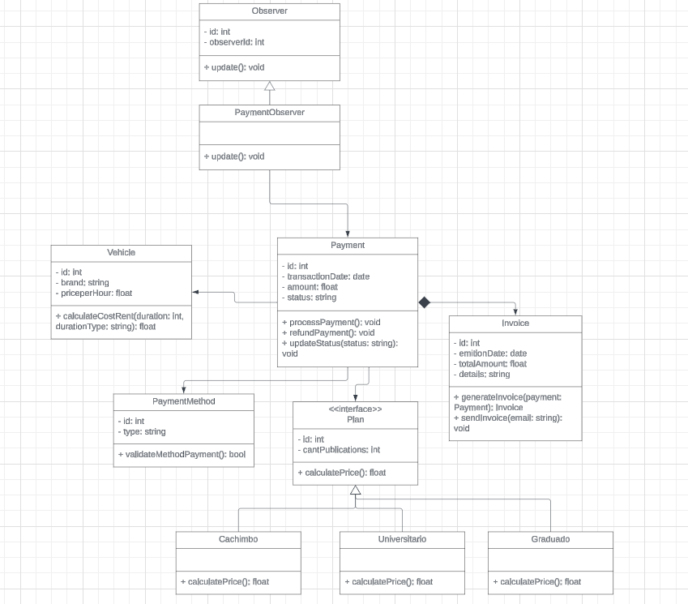
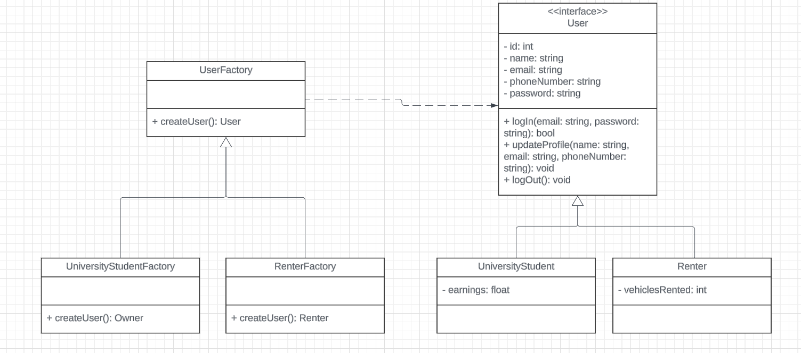

# Capítulo IV: Product Design

Este capítulo cubre todos los aspectos relacionados con el diseño de la solución, incluyendo el estilo visual, los diagramas C4, los diagramas de clases y los modelos de base de datos.

## 4.1. Style Guidelines

### 4.1.1. General Style Guidelines

Es un conjunto de normas y directrices que determinan cómo se deben redactar, diseñar o presentar documentos, contenido en línea, software u otros trabajos creativos. A continuación, se detallan los parámetros implementados en la estructura del proyecto.

**Branding:**

**Brand Overview:**

**EcoMovil** es una plataforma que ofrece una alternativa ágil y ecológica para la movilidad urbana, conectando a usuarios que desean alquilar o comprar vehículos sostenibles como bicicletas, scooters, skateboards y motos eléctricas con quienes los tienen disponibles. La aplicación facilita el proceso de alquiler o compra, apoyando también a estudiantes en la generación de ingresos flexibles. Entre sus características clave se incluyen un sistema de valoraciones y reseñas con estrellas, búsqueda avanzada con filtros, un historial de transacciones, un mapa interactivo de puntos de recepción y entrega, inclusión de IGV en las transacciones, elementos de gamificación con logros y recompensas, y la opción de adquirir un seguro temporal durante el alquiler. EcoMovil promueve una movilidad sostenible y un estilo de vida activo y responsable con el medio ambiente.

- **Misión:** Facilitar el acceso a una movilidad urbana sostenible, conectando a las personas con vehículos ecológicos a través de una plataforma digital eficiente, contribuyendo a la reducción de la contaminación, y brindando oportunidades de ingresos para estudiantes universitarios.

- **Visión:** Convertirnos en una plataforma líder en movilidad urbana sostenible, facilitando el acceso a vehículos ecológicos y promoviendo un estilo de vida más saludable y consciente con el medio ambiente.

  

**Brand Name:**

EcoMovil es una solución que surge de la combinación de "Eco", representando ecología y sostenibilidad, y "Movil", destacando la movilidad urbana. Esta aplicación está diseñada para fomentar el emprendimiento universitario y la sostenibilidad en Perú, brindando a los estudiantes la oportunidad de generar ingresos alquilando o vendiendo vehículos ecológicos. Al mismo tiempo, contribuye a reducir la contaminación y promueve un estilo de vida más activo.

**Colores:**

Los colores desempeñan un papel fundamental en la primera impresión que los usuarios tienen de la plataforma. Basándose en los principios de la psicología del color, se ha seleccionado el verde como el color principal de la paleta cromática. Este color simboliza crecimiento y creatividad, que son valores esenciales de la startup. Además, el verde está asociado con la ecología, que es el enfoque principal de la plataforma, y con la armonía, un concepto que buscamos reflejar en la interacción con el servicio. Las tonalidades secundarias elegidas abarcan distintos matices de verde claro, verde oscuro y verde pálido. Como colores secundarios, también se incluyen variantes de verde fosforescente, crema claro y anaranjado amarillo.

**Tipografia:**

La tipografía juega un papel crucial en establecer la jerarquía entre los diferentes grupos de contenido en la página, además de guiar al usuario a través de la interfaz. Para el proyecto, se ha elegido la fuente "Alata" en sus estilos Medium y Normal, para asegurar una mayor legibilidad. Además, la organización tipográfica se estructura en cuatro niveles para los elementos del diseño web (body y heading), lo que ayuda a mantener una disposición clara y coherente del contenido.

La estructura tipográfica del proyecto se organiza en cuatro niveles de jerarquía para los encabezados:

- Heading 01: Tamaño de 34px.
- Heading 02: Tamaño de 22px.
- Heading 03: Tamaño de 17px.
- Heading 04: Tamaño de 15px.

### 4.1.2. Web Style Guidelines

El enfoque de la aplicación web "EcoMovil" se basa en la eficiencia, la formación y la ecología en todos los procesos. Las diferentes etapas y formularios necesarios están organizados en secciones clave: Página principal, Acerca de nosotros, Inscríbase, Vehículos, Beneficios y Contacto, que ocupan la mayor parte de la pantalla para facilitar la navegación y ofrecer una experiencia de usuario fluida y coherente.

- **Imágenes:** 
En el diseño web de "EcoMovil", se utilizarán imágenes descriptivas de manera estratégica. Las imágenes de vehículos menores y de la empresa estarán en la página de inicio, con el logo de la empresa ubicado en la parte superior izquierda para facilitar su identificación. Además, cada sección principal contará con imágenes representativas de los vehículos menores, reforzando la visión ecológica para el usuario. Para optimizar la experiencia en aplicaciones de escritorio, se evitarán imágenes de fondo, optando en su lugar por imágenes laterales que guíen al usuario a través de la interfaz de manera funcional.

- **Botones:** 
Los botones en la aplicación web "EcoMovil" siguen las especificaciones establecidas en las General Style Guidelines. Generalmente, estos botones se encuentran en la parte inferior de la sección principal de la pantalla, permitiendo al usuario realizar acciones que se reflejan en la vista superior. Para acciones que inicien nuevos procesos o afecten el funcionamiento general de la página, se incluyen botones de confirmación. Todos los botones están diseñados con un estilo distintivo y un alto contraste en comparación con el resto de la aplicación, asegurando que sean fácilmente visibles. Además, se aplica la teoría del color en los botones, donde los colores específicos indican acciones que eliminan procesos o los concluyen.

- **Pantallas Emergentes:** 
Las pantallas emergentes en "EcoMovil" están diseñadas para confirmar acciones clave que son cruciales para el funcionamiento del negocio y tienen un impacto significativo en el mismo. Estas pantallas emergentes enfatizan la importancia de resolver el asunto en cuestión antes de que el usuario pueda continuar navegando por la aplicación, subrayando la necesidad de tomar decisiones informadas en momentos críticos.

## 4.2. Information Architecture

Dado que EcoMovil gestiona un flujo funcional esencial para el negocio, es fundamental que el usuario tenga claridad sobre las etapas y procesos involucrados. La información está estructurada de manera categórica y secuencial, permitiendo al usuario avanzar a través de un módulo que representa el proceso general, ya sea un ingreso o una ganancia. A medida que el usuario registra las diferentes fases del vehículo, estas se reflejan en varias pantallas de la web. Además, la vista del "Panel de Control" proporciona una visión general de las funcionalidades clave de la aplicación, facilitando la supervisión y gestión de los procesos.

### 4.2.1. Organization System

El sistema de organización de la página de "EcoMovil" está diseñado para estructurar visualmente el contenido y facilitar la navegación. La página principal se divide en secciones clave: Página principal, Acerca de nosotros, Inscríbase, Vehículos, Beneficios y Contacto.

- **Up-Section**: En la parte superior de la página principal, se encuentran las opciones de navegación a otras secciones, siguiendo un patrón de diseño F que subraya la importancia de que los usuarios conozcan la empresa y su oferta. Los botones de registro e inicio de sesión están situados en el extremo derecho. Además, hay un botón de modo oscuro para ajustar el tema visual según las preferencias del usuario y un botón para cambiar el idioma entre Español e Inglés, mejorando la accesibilidad.

### 4.2.2. Labeling System

En nuestra aplicación EcoMovil, el sistema de etiquetas estará bien organizado y claramente representado para que los usuarios puedan identificar y utilizar las diversas funciones de manera intuitiva y sencilla. El **Logo/Home** es un botón oculto dentro del logo de la plataforma que redirige a los usuarios a la página de inicio. La etiqueta **How it Works** dirige a una sección que explica cómo funciona la plataforma y sus principales características para que los usuarios las comprendan. **Who can use** describe los tipos de usuarios que pueden beneficiarse de la plataforma, mientras que **Plans** presenta las opciones de suscripción disponibles junto con sus precios. El botón **Start your journey** enlaza a la aplicación web para que los usuarios puedan explorar la plataforma. Finalmente, **Sign up** es un botón que lleva a la página para crear una cuenta nueva.

### 4.2.3. SEO Tags and Meta Tags

Las metaetiquetas proporcionan información codificada y definen los metadatos de una página web. Aunque no son visibles para los usuarios, son leídas por navegadores y rastreadores web, lo que permite un análisis más sencillo de los archivos HTML y facilita el mantenimiento del contenido. Además, estas etiquetas son fundamentales para mejorar el posicionamiento de nuestra página en los motores de búsqueda. 

Las metas etiquetas que utilizaremos son:

### Landing Page

| **Attribute** | **Value** |
|---------------|-----------|
| Charset       | UTF-8     |
| Viewport      | width=device-width, initial-scale=1.0 |
| CSS Link      | ./src/css/styles.css |
| Title         | EcoMovil - Urban Mobility Solution Landing Page |
| Description   | Explore our Landing page to redirect you to rent or buy eco-friendly vehicles like bicycles, scooters, and more. Start your journey towards a green city today. |
| Keywords      | urban mobility, eco-friendly vehicles, bike rental, scooter rental, sustainable transportation |
| Author        | EcoMovil Team |

### Aplicación Web

| **Attribute** | **Value** |
|---------------|-----------|
| Charset       | UTF-8     |
| Viewport      | width=device-width, initial-scale=1.0 |
| CSS Link      | ./src/css/styles.css |
| Title         | EcoMovil - Your Eco-Friendly Vehicle Rental Platform with interesting features to rent or buy eco-friendly vehicles |
| Description   | EcoMobility provides a user-friendly platform for renting or buying bicycles, scooters, and other eco-friendly vehicles. Explore, book, and manage your rentals with ease. |
| Keywords      | vehicle rental, bike rental, scooter rental, eco-friendly vehicles, urban mobility, sustainable travel, temporary insurance, badges, flexible income options |
| Author        | EcoMovil Team |

### 4.2.4. Searching Systems

En EcoMovil, el sistema de búsqueda facilitará a los usuarios encontrar rápidamente los vehículos que desean alquilar o comprar, adaptándose a sus necesidades. Sus principales funciones incluirán búsqueda por palabras clave para localizar vehículos específicos, filtros avanzados para refinar la búsqueda según diversos criterios, y un historial de búsquedas recientes para acceder rápidamente a búsquedas previas.

### 4.2.5. Navigation Systems

El sistema de navegación es esencial para permitir que los usuarios se muevan con facilidad por la aplicación, asegurando una experiencia de usuario agradable. La aplicación web tendrá una barra de navegación con diversas opciones para guiar al usuario a la sección que le interese. También contará con un pie de página (footer) que proporcionará enlaces adicionales a secciones como "Sobre Nosotros", donde los usuarios podrán conocer nuestra visión y al equipo detrás de la aplicación, y "Contacto", que incluirá un formulario para facilitar la comunicación con nosotros, entre otras secciones.

## 4.3. Landing Page UI Design

Esta interfaz fue diseñada con simplicidad en mente, empleando colores claros como el verde para subrayar nuestro compromiso con el medio ambiente. Está optimizada para garantizar que los usuarios puedan leer cómodamente en cualquier dispositivo, con un tamaño de letra adecuado. Además, la interfaz es completamente responsive, adaptándose a cualquier dispositivo para ofrecer una experiencia de usuario óptima.

### 4.3.1. Landing Page Wireframe

### 4.3.2. Landing Page Mock-up

El wireframe para la vista en navegador de escritorio de la landing page fue clave para planificar la disposición de los elementos. Con base en este esquema, se creó el mock-up de la landing page, que mantiene los mismos contenidos detallados anteriormente. La imagen siguiente muestra cómo se ha aplicado la paleta de colores primaria y secundaria, así como la tipografía previamente definida.

## 4.4. Web Applications UX/UI Design

### 4.4.1. Web Applications Wireframes

### 4.4.2. Web Applications Wireflow Diagrams

### 4.4.3. Web Applications Mock-ups

### 4.4.4. Web Applications User Flow Diagrams 

## 4.5. Web Applications Prototyping

## 4.6. Domain-Driven Software Arquitecture

El Domain Driven Design (DDD) busca lograr un entendimiento compartido del dominio que engloba el espacio del problema. Este enfoque facilita la colaboración entre desarrolladores y expertos del dominio. DDD no se limita a la utilización de un lenguaje ubicuo, sino que también incluye un conjunto de patrones, procedimientos y diagramas arquitectónicos. Estos artefactos tienen como objetivo alinear el software con el dominio y fortalecer el enfoque compartido del DDD.

### 4.6.1. Software Architecture Context Diagram 

El diagrama de contexto ofrece una visión general de alto nivel de las interacciones entre el sistema de software EcoMovil, los usuarios y, en su caso, otros sistemas externos.

### 4.6.2. Software Architecture Container Diagram

El diagrama de contenedores proporciona una vista general de alto nivel de las interacciones entre las aplicaciones y las fuentes de datos involucradas en la ejecución del sistema de software EcoMovil.

### 4.6.3. Software Architecture Component Diagram

Los diagramas de componentes muestran las relaciones entre los componentes principales del sistema de software, detallando la implementación de los módulos correspondientes en el programa.

- En esta sección inicial se presentan los requisitos no funcionales de la aplicación.
  

- Aquí se ilustran los componentes relacionados con el perfil de usuario.
  

- En esta sección se detallan los componentes asociados a los vehículos.
  

- Aquí se muestran los componentes dedicados a la autenticación de usuarios.
  

## 4.7. Software Object-Oriented Design
### 4.7.1. Class Diagrams

Payment Bounded Context

User Bounded Context

Rental Bounded Context

### 4.7.2. Class Dictionary

 

**Rental Bounded Context**

<table border="0" width="50%">
  <tr>
    <td colspan="2" valign="top">Observer</td>
    <tr>
    <td colspan="1" valign="top" width="40%">Atributo</td>
    <td colspan="2" valign="top">Descripción</td>
  </tr>
   <tr>
    <td colspan="1" valign="top">id</td>
    <td colspan="2" valign="top"> Identificador único del observador</td>
  </tr>
  <tr>
    <td colspan="1" valign="top">observadorId</td>
    <td colspan="2" valign="top">  Identificador adicional del suscriptor</td>
  </tr>
  <tr>
    <td colspan="1" valign="top" width="40%">Método</td>
    <td colspan="2" valign="top">Descripción</td>
  </tr>
   <tr>
    <td colspan="1" valign="top">update()</td>
    <td colspan="2" valign="top">Método que se llama cuando hay una actualización en el sujeto observado</td>
  </tr>
<table>

<table border="0" width="50%">
  <tr>
    <td colspan="2" valign="top">RentalObserver</td>

  <tr>
    <td colspan="1" valign="top" width="40%">Método</td>
    <td colspan="2" valign="top">Descripción</td>
  </tr>
   <tr>
    <td colspan="1" valign="top">update()</td>
    <td colspan="2" valign="top">Implementación del método update específico para gestionar actualizaciones relacionadas con alquileres</td>
  </tr>
<table>

<table border="0" width="50%">
  <tr>
    <td colspan="2" valign="top">Rental</td>
    <tr>
    <td colspan="1" valign="top" width="40%">Atributo</td>
    <td colspan="2" valign="top">Descripción</td>
  </tr>
  <tr>
    <td colspan="1" valign="top">Id</td>
    <td colspan="2" valign="top">Identificador único del alquiler</td>
  </tr>
  <tr>
    <td colspan="1" valign="top">startDate</td>
    <td colspan="2" valign="top">Fecha de inicio del alquiler</td>
  </tr>
  <tr>
    <td colspan="1" valign="top">endDate</td>
    <td colspan="2" valign="top">Fecha de fin del alquiler</td>
  </tr>
  <tr>
    <td colspan="1" valign="top">status</td>
    <td colspan="2" valign="top"> Estado del alquiler (activo, terminado, espera)</td>
  </tr>
  <tr>
    <td colspan="1" valign="top">totalCost </td>
    <td colspan="2" valign="top">Costo total del alquiler</td>
  </tr>
  <tr>
    <td colspan="1" valign="top" width="40%">Método</td>
    <td colspan="2" valign="top">Descripción</td>
  </tr>
   <tr>
    <td colspan="1" valign="top">startRental()</td>
    <td colspan="2" valign="top">Método para crear un nuevo alquiler.</td>
  </tr>
  <tr>
    <td colspan="1" valign="top">endRental()</td>
    <td colspan="2" valign="top"> Método para finalizar un alquiler.</td>
  </tr>
  <tr>
    <td colspan="1" valign="top">cancelRent()</td>
    <td colspan="2" valign="top"> Método para cancelar un alquiler.</td>
  </tr>
  <tr>
    <td colspan="1" valign="top">calculateCost()</td>
    <td colspan="2" valign="top">Método para calcular el coste final.</td>
  </tr>
<table>

<table border="0" width="50%">
  <tr>
    <td colspan="2" valign="top">Vehicle</td>
    <tr>
    <td colspan="1" valign="top" width="40%">Atributo</td>
    <td colspan="2" valign="top">Descripción</td>
  </tr>
<tr>
    <td colspan="1" valign="top">Id</td>
    <td colspan="2" valign="top">Identificador único del vehículo</td>
  </tr>
   <tr>
    <td colspan="1" valign="top">status</td>
    <td colspan="2" valign="top">Disponibilidad del vehículo</td>
  </tr>
<tr>
    <td colspan="1" valign="top">priceperHour</td>
    <td colspan="2" valign="top">Precio por hora del vehículo</td>
  </tr>

  <tr>
    <td colspan="1" valign="top" width="40%">Método</td>
    <td colspan="2" valign="top">Descripción</td>
  </tr>
   <tr>
    <td colspan="1" valign="top">isitAvailability()</td>
    <td colspan="2" valign="top"> Método para verificar la disponibilidad del vehículo.</td>
  </tr>
<tr>
    <td colspan="1" valign="top">changeStatus(status:String)</td>
    <td colspan="2" valign="top"> Método para cambiar el status del vehículo.</td>
  </tr>
<tr>
    <td colspan="1" valign="top">updatePrice()</td>
    <td colspan="2" valign="top"> Método para cambiar el precio del vehículo</td>
  </tr>
<table>

<table border="0" width="50%">
  <tr>
    <td colspan="2" valign="top">UniversityStudent</td>
    <tr>
    <td colspan="1" valign="top" width="40%">Atributo</td>
    <td colspan="2" valign="top">Descripción</td>
  </tr>
   <tr>
    <td colspan="1" valign="top">Id</td>
    <td colspan="2" valign="top"> Identificador único del universitario</td>
  </tr>
  <tr>
    <td colspan="1" valign="top">name</td>
    <td colspan="2" valign="top"> Nombre del universitario</td>
  </tr>
  <tr>
    <td colspan="1" valign="top">email</td>
    <td colspan="2" valign="top"> Información de contacto electrónico del universitario</td>
  </tr>
  <tr>
    <td colspan="1" valign="top" width="40%">Método</td>
    <td colspan="2" valign="top">Descripción</td>
  </tr>
   <tr>
    <td colspan="1" valign="top">updateOwnerInfo()</td>
    <td colspan="2" valign="top">Método para actualizar la información del universitario.</td>
  </tr>
<tr>
    <td colspan="1" valign="top">addVehicle()</td>
    <td colspan="2" valign="top">Método para agregar un vehículo del universitario.</td>
  </tr>
<tr>
    <td colspan="1" valign="top">removeVehicle(vehicleId: int)</td>
    <td colspan="2" valign="top">Método para eliminar un vehículo del universitario.</td>
  </tr>
<table>

<table border="0" width="50%">
  <tr>
    <td colspan="2" valign="top">RentalHistory</td>
    <tr>
    <td colspan="1" valign="top" width="40%">Atributo</td>
    <td colspan="2" valign="top">Descripción</td>
  </tr>
   <tr>
    <td colspan="1" valign="top">Id</td>
    <td colspan="2" valign="top">Identificador único del historial de alquileres.</td>
  </tr>
<tr>
    <td colspan="1" valign="top">rentals</td>
    <td colspan="2" valign="top">Lista de alquileres asociados al arrendatario.</td>
  </tr>
  <tr>
    <td colspan="1" valign="top" width="40%">Método</td>
    <td colspan="2" valign="top">Descripción</td>
  </tr>
   <tr>
    <td colspan="1" valign="top">showDetail()</td>
    <td colspan="2" valign="top">Método para obtener el historial de alquileres.</td>
  </tr>
<table>

<table border="0" width="50%">
  <tr>
    <td colspan="2" valign="top">Brand</td>
    <tr>
    <td colspan="1" valign="top" width="40%">Atributo</td>
    <td colspan="2" valign="top">Descripción</td>
  </tr>
   <tr>
    <td colspan="1" valign="top">Id</td>
    <td colspan="2" valign="top">Identificador único de la marca del vehículo</td>
  </tr>
<tr>
    <td colspan="1" valign="top">name</td>
    <td colspan="2" valign="top"> Nombre de la marca</td>
  </tr>
<table>

<table border="0" width="50%">
  <tr>
    <td colspan="2" valign="top">Model</td>
    <tr>
    <td colspan="1" valign="top" width="40%">Atributo</td>
    <td colspan="2" valign="top">Descripción</td>
  </tr>
   <tr>
    <td colspan="1" valign="top">Id</td>
    <td colspan="2" valign="top">Identificador único del modelo del vehículo.</td>
  </tr>
<tr>
    <td colspan="1" valign="top">name</td>
    <td colspan="2" valign="top">Nombre del modelo</td>
  </tr>
<tr>
    <td colspan="1" valign="top">type</td>
    <td colspan="2" valign="top">Versión del modelo</td>
  </tr>
  <tr>
    <td colspan="1" valign="top" width="40%">Método</td>
    <td colspan="2" valign="top">Descripción</td>
  </tr>
   <tr>
    <td colspan="1" valign="top">updateType()</td>
    <td colspan="2" valign="top">Método para actualizar el tipo del vehículo.</td>
  </tr>
<table>

<table border="0" width="50%">
  <tr>
    <td colspan="2" valign="top">Renter</td>
    <tr>
    <td colspan="1" valign="top" width="40%">Atributo</td>
    <td colspan="2" valign="top">Descripción</td>
  </tr>
   <tr>
    <td colspan="1" valign="top">Id</td>
    <td colspan="2" valign="top">Identificador único del arrendatario.</td>
  </tr>
<tr>
    <td colspan="1" valign="top">name</td>
    <td colspan="2" valign="top">Nombre del arrendatario.</td>
  </tr>
<tr>
    <td colspan="1" valign="top">email</td>
    <td colspan="2" valign="top">Información de correo electrónico del arrendatario.</td>
  </tr>
<tr>
    <td colspan="1" valign="top">phoneNumber</td>
    <td colspan="2" valign="top">Número telefónico del arrendatario del arrendatario.</td>
  </tr>

<table>

<table border="0" width="50%">
  <tr>
    <td colspan="2" valign="top">RentalHistory</td>
    <tr>
    <td colspan="1" valign="top" width="40%">Atributo</td>
    <td colspan="2" valign="top">Descripción</td>
  </tr>
   <tr>
    <td colspan="1" valign="top">Id</td>
    <td colspan="2" valign="top">Identificador único del historial de alquileres.</td>
  </tr>
<tr>
    <td colspan="1" valign="top">rentals</td>
    <td colspan="2" valign="top">Lista de alquileres asociados al arrendatario.</td>
  </tr>
  <tr>
    <td colspan="1" valign="top" width="40%">Método</td>
    <td colspan="2" valign="top">Descripción</td>
  </tr>
   <tr>
    <td colspan="1" valign="top">showDetail()</td>
    <td colspan="2" valign="top">Método para obtener el historial de alquileres.</td>
  </tr>
<table>

**User Bounded Context**

<table border="0" width="50%">
  <tr>
    <td colspan="2" valign="top">User</td>
    <tr>
    <td colspan="1" valign="top" width="40%">Atributo</td>
    <td colspan="2" valign="top">Descripción</td>
  </tr>
   <tr>
    <td colspan="1" valign="top">Id</td>
    <td colspan="2" valign="top">Identificador único del usuario.</td>
  </tr>
<tr>
    <td colspan="1" valign="top">name</td>
    <td colspan="2" valign="top">Nombre del usuario</td>
  </tr>
<tr>
    <td colspan="1" valign="top">email</td>
    <td colspan="2" valign="top">Información del correo electrónico del usuario</td>
  </tr>
<tr>
    <td colspan="1" valign="top">phoneNumber</td>
    <td colspan="2" valign="top">Número de contacto del usuario</td>
  </tr>
<tr>
    <td colspan="1" valign="top">password</td>
    <td colspan="2" valign="top">Contraseña del usuario</td>
  </tr>
  <tr>
    <td colspan="1" valign="top" width="40%">Método</td>
    <td colspan="2" valign="top">Descripción</td>
  </tr>
   <tr>
    <td colspan="1" valign="top">LogIn(email: string, password: string)</td>
    <td colspan="2" valign="top">Método para ingresar a la cuenta de un usuario.</td>
  </tr>
   <tr>
    <td colspan="1" valign="top">UpdateProfeil(name: string, email: string, phoneNumber: string)</td>
    <td colspan="2" valign="top">Método para actualizar la información de un usuario.</td>
  </tr>
   <tr>
    <td colspan="1" valign="top">LogOut()</td>
    <td colspan="2" valign="top">Método para salir de la cuenta de un usuario.</td>
  </tr>
<table>

<table border="0" width="50%">
  <tr>
    <td colspan="2" valign="top">UniversityStudent</td>
    <tr>
    <td colspan="1" valign="top" width="40%">Atributo</td>
    <td colspan="2" valign="top">Descripción</td>
  </tr>
   <tr>
    <td colspan="1" valign="top">earnings</td>
    <td colspan="2" valign="top">Indicador de la cantidad de dinero que posee en su cuenta.</td>
  </tr>
<table>

<table border="0" width="50%">
  <tr>
    <td colspan="2" valign="top">Renter</td>
    <tr>
    <td colspan="1" valign="top" width="40%">Atributo</td>
    <td colspan="2" valign="top">Descripción</td>
  </tr>
   <tr>
    <td colspan="1" valign="top">vehiclesRented</td>
    <td colspan="2" valign="top">Cantidad de vehiculos rentados</td>
  </tr>
<table>

<table border="0" width="50%">
  <tr>
    <td colspan="2" valign="top">UserFactory</td>
  <tr>
    <td colspan="1" valign="top" width="40%">Método</td>
    <td colspan="2" valign="top">Descripción</td>
  </tr>
   <tr>
    <td colspan="1" valign="top">createUser(): User</td>
    <td colspan="2" valign="top">Método abstracto que define la creación de nuevos tipos de usuarios.</td>
  </tr>
<table>

<table border="0" width="50%">
  <tr>
    <td colspan="2" valign="top">UniversityStudentFactory</td>

  <tr>
    <td colspan="1" valign="top" width="40%">Método</td>
    <td colspan="2" valign="top">Descripción</td>
  </tr>
   <tr>
    <td colspan="1" valign="top">createUser()</td>
    <td colspan="2" valign="top">Método para crear nuevos objetos de tipo Owner.</td>
  </tr>
<table>

<table border="0" width="50%">
  <tr>
    <td colspan="2" valign="top">RenterFactory</td>
  <tr>
    <td colspan="1" valign="top" width="40%">Método</td>
    <td colspan="2" valign="top">Descripción</td>
  </tr>
   <tr>
    <td colspan="1" valign="top">createUser()</td>
    <td colspan="2" valign="top">Método para crear nuevos objetos de tipo Renter. </td>
  </tr>
<table>

**Payment Bounded Context**

<table border="0" width="50%">
  <tr>
    <td colspan="2" valign="top">Payment</td>
    <tr>
    <td colspan="1" valign="top" width="40%">Atributo</td>
    <td colspan="2" valign="top">Descripción</td>
  </tr>
   <tr>
    <td colspan="1" valign="top">Id</td>
    <td colspan="2" valign="top">Identificador único del pago.</td>
  </tr>
<tr>
    <td colspan="1" valign="top">amount</td>
    <td colspan="2" valign="top">Monto del pago</td>
  </tr>
<tr>
    <td colspan="1" valign="top">TransactionDate</td>
    <td colspan="2" valign="top">Fecha en la que se realizó el pago</td>
  </tr>
<tr>
    <td colspan="1" valign="top">status</td>
    <td colspan="2" valign="top">Estado del pago (completado, pendiente, fallido)</td>
  </tr>
  <tr>
    <td colspan="1" valign="top" width="40%">Método</td>
    <td colspan="2" valign="top">Descripción</td>
  </tr>
   <tr>
    <td colspan="1" valign="top">processPayment()</td>
    <td colspan="2" valign="top">Método para procesar el pago.</td>
  </tr>
 <tr>
    <td colspan="1" valign="top">refundPayment()</td>
    <td colspan="2" valign="top">Método para reembolsar el pago.</td>
  </tr>
 <tr>
    <td colspan="1" valign="top">updatePaymentStatus(status: string)</td>
    <td colspan="2" valign="top">Método para actualizar el estado del pago.</td>
  </tr>
<table>

<table border="0" width="50%">
  <tr>
    <td colspan="2" valign="top">PaymentMethod</td>
    <tr>
    <td colspan="1" valign="top" width="40%">Atributo</td>
    <td colspan="2" valign="top">Descripción</td>
  </tr>
   <tr>
    <td colspan="1" valign="top">Id</td>
    <td colspan="2" valign="top">Identificador único del método del pago.</td>
  </tr>
<tr>
    <td colspan="1" valign="top">type</td>
    <td colspan="2" valign="top">Tipo de método de pago (crédito, débito)</td>
  </tr>
  <tr>
    <td colspan="1" valign="top" width="40%">Método</td>
    <td colspan="2" valign="top">Descripción</td>
  </tr>
   <tr>
    <td colspan="1" valign="top">validateMethod()</td>
    <td colspan="2" valign="top">Método para validar la información del método de pago.</td>
  </tr>
<table>

<table border="0" width="50%">
  <tr>
    <td colspan="2" valign="top">Invoice</td>
    <tr>
    <td colspan="1" valign="top" width="40%">Atributo</td>
    <td colspan="2" valign="top">Descripción</td>
  </tr>
   <tr>
    <td colspan="1" valign="top">Id</td>
    <td colspan="2" valign="top">Identificador único de la factura.</td>
  </tr>
<tr>
    <td colspan="1" valign="top">emitionDate</td>
    <td colspan="2" valign="top">Fecha de emisión de la factura</td>
  </tr>
<tr>
    <td colspan="1" valign="top">totalAmount</td>
    <td colspan="2" valign="top">Monto total a pagar en la factura</td>
  </tr>
<tr>
    <td colspan="1" valign="top">details</td>
    <td colspan="2" valign="top">Fecha de emisión de la factura</td>
  </tr>
  <tr>
    <td colspan="1" valign="top" width="40%">Método</td>
    <td colspan="2" valign="top">Descripción</td>
  </tr>
   <tr>
    <td colspan="1" valign="top">generateInvoice()</td>
    <td colspan="2" valign="top">Método para generar una nueva factura.</td>
  </tr>
   <tr>
    <td colspan="1" valign="top">sendInvoice()</td>
    <td colspan="2" valign="top">Método para enviar la factura al usuario.</td>
  </tr>
<table>

<table border="0" width="50%">
  <tr>
    <td colspan="2" valign="top">Observer</td>
    <tr>
    <td colspan="1" valign="top" width="40%">Atributo</td>
    <td colspan="2" valign="top">Descripción</td>
  </tr>
   <tr>
    <td colspan="1" valign="top">Id</td>
    <td colspan="2" valign="top"> Identificador único del observador</td>
  </tr>
<tr>
    <td colspan="1" valign="top">observerId</td>
    <td colspan="2" valign="top"> Identificador adicional del observador.</td>
  </tr>
  <tr>
    <td colspan="1" valign="top" width="40%">Método</td>
    <td colspan="2" valign="top">Descripción</td>
  </tr>
   <tr>
    <td colspan="1" valign="top">update()</td>
    <td colspan="2" valign="top">Método que se llama cuando hay una actualización en el sujeto observado.</td>
  </tr>
<table>

<table border="0" width="50%">
  <tr>
    <td colspan="2" valign="top">PaymentObserver</td>
  <tr>
    <td colspan="1" valign="top" width="40%">Método</td>
    <td colspan="2" valign="top">Descripción</td>
  </tr>
   <tr>
    <td colspan="1" valign="top">update()</td>
    <td colspan="2" valign="top"> Implementación del método update específico para gestionar notificaciones relacionadas con los pagos.</td>
  </tr>
<table>

<table border="0" width="50%">
  <tr>
    <td colspan="2" valign="top">Vehicle</td>
    <tr>
    <td colspan="1" valign="top" width="40%">Atributo</td>
    <td colspan="2" valign="top">Descripción</td>
  </tr>
   <tr>
    <td colspan="1" valign="top">Id</td>
    <td colspan="2" valign="top">Identificador único del vehículo.</td>
  </tr>
<tr>
    <td colspan="1" valign="top">brand</td>
    <td colspan="2" valign="top">Marca del vehículo.</td>
  </tr>
<tr>
    <td colspan="1" valign="top">priceperHour</td>
    <td colspan="2" valign="top">Precio del vehículo por hora</td>
  </tr>
  <tr>
    <td colspan="1" valign="top" width="40%">Método</td>
    <td colspan="2" valign="top">Descripción</td>
  </tr>
   <tr>
    <td colspan="1" valign="top">calculateCostRent(duration: int, durationType: string)</td>
    <td colspan="2" valign="top">Método para obtener la cantidad total del precio del servicio del vehículo.</td>
  </tr>
<table>

<table border="0" width="50%">
  <tr>
    <td colspan="2" valign="top">Plan</td>
    <tr>
    <td colspan="1" valign="top" width="40%">Atributo</td>
    <td colspan="2" valign="top">Descripción</td>
  </tr>
   <tr>
    <td colspan="1" valign="top">Id</td>
    <td colspan="2" valign="top">Identificador único del plan.</td>
  </tr>
<tr>
    <td colspan="1" valign="top">#publicaciones</td>
    <td colspan="2" valign="top">Cantidad de publicaciones permitidas</td>
  </tr>
  <tr>
    <td colspan="1" valign="top" width="40%">Método</td>
    <td colspan="2" valign="top">Descripción</td>
  </tr>
   <tr>
    <td colspan="1" valign="top">calculatePrice()</td>
    <td colspan="2" valign="top">Método para obtener el costo del plan</td>
  </tr>
<table>

<table border="0" width="50%">
  <tr>
    <td colspan="2" valign="top">Cachimbo</td>

  <tr>
    <td colspan="1" valign="top" width="40%">Método</td>
    <td colspan="2" valign="top">Descripción</td>
  </tr>
   <tr>
    <td colspan="1" valign="top">calculatePrice()</td>
    <td colspan="2" valign="top">Método para obtener el costo del plan cachimbo.</td>
  </tr>
<table>

<table border="0" width="50%">
  <tr>
    <td colspan="2" valign="top">Universitario</td>
    <tr>
    <td colspan="1" valign="top" width="40%">Método</td>
    <td colspan="2" valign="top">Descripción</td>
  </tr>
   <tr>
    <td colspan="1" valign="top">calculatePrice()</td>
    <td colspan="2" valign="top">Método para obtener el costo del plan universitario.</td>
  </tr>
<table>

<table border="0" width="50%">
  <tr>
    <td colspan="2" valign="top">Graduado</td>
    <tr>
    <td colspan="1" valign="top" width="40%">Método</td>
    <td colspan="2" valign="top">Descripción</td>
  </tr>
   <tr>
    <td colspan="1" valign="top">calculatePrice()</td>
    <td colspan="2" valign="top">Método para obtener el costo del plan graduado.</td>
  </tr>
<table>

## 4.8. Database Design

Para el presente proyecto, se ha elegido el motor de base de datos MySQL debido a su escalabilidad y a su interfaz intuitiva y accesible. Esta elección se basa en la familiaridad del equipo con el motor de Microsoft SQL Server. MySQL facilita la expansión de los recursos de la base de datos según las necesidades y requisitos del negocio.

### 4.8.1. Database Diagram

